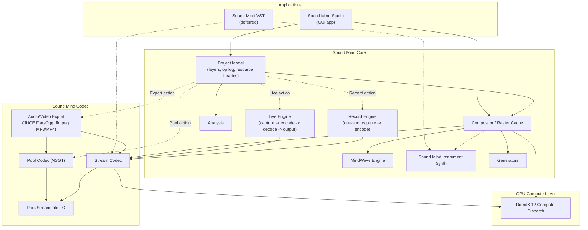
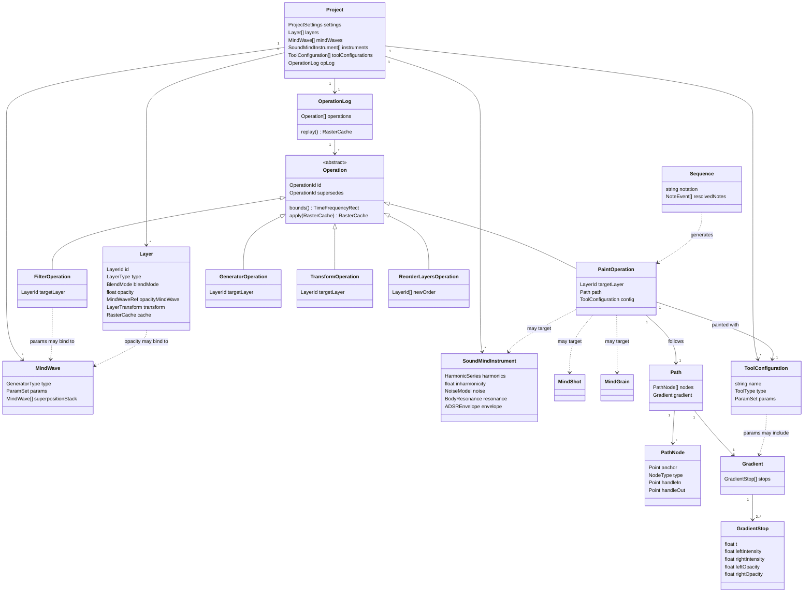
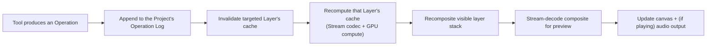

# Sound Mind - the Architecture Document

Status: **early draft — first pass.** This is the starting point for the software architecture activity that follows `sound-mind-design.md`: a sketch of the major modules, the core data model, and the threading model, plus the architectural decisions still open. It is not yet class diagrams — it's the layer beneath them, so those diagrams have a skeleton to hang on.

This document assumes familiarity with `sound-mind-design.md` (what the Studio does and why) and `tech-stack-decisions.md` (the technology choices). It does not repeat either; it only cites the decisions from both that constrain the architecture.

# Constraints Carried Over

From `CLAUDE.md` and `tech-stack-decisions.md`:

- C++20/23, built with JUCE for audio/DSP and DirectX 12 Compute for GPU work.
- Primary development on native Arm64 (Snapdragon X), with x64 validated via CI rather than assumed from cross-compilation alone.
- The real-time audio path must be allocation-free, lock-free where needed, and never touch anything GC'd or interpreted.

From `sound-mind-design.md`'s resolved decisions:

- A project is a project file plus a folder of media/sources/cached renders, single-user, with no versioned schema commitment yet.
- A project's real content is an operation log — closer to a scene graph referencing source data than a raster stack — with cached raster results persisted opportunistically, not authoritatively.
- Anything seeded (Generators, Chaos, noise MindWaves) must replay bit-for-bit on the same Studio version and architecture; only a perceptual match is required across architectures.
- Working latency targets: ~100 ms for graphical feedback, ~250 ms for audio feedback, from a Stream-mode edit.
- Sound Mind VST is deferred until the standalone Studio is operational — the architecture should not be shaped around it yet, only avoid closing the door on it (the Stream codec path already has to be real-time-safe on its own merits).

# System Overview

Two applications get built on top of two shared lower layers — the Studio now, Sound Mind VST later:



- **Sound Mind Codec** is the lowest layer and the one thing that must work standalone: Pool (NSGT, lossless, off-line) and Stream (fast, real-time-safe) transforms, plus the file formats each reads and writes. It has no knowledge of layers, MindWaves, or projects — it only converts between audio/image data and spectrogram data. **As of `v0.0.6.1`**, it also links JUCE (`juce_audio_formats`, for its real Flac/Ogg Vorbis writers) and ffmpeg (for MP3 and MP4 export - see *Decisions Made* below) - a real widening of Codec's dependency footprint beyond PocketFFT/libtiff, since JUCE was previously only a Core/Studio dependency (device I/O). Codec's *conceptual* role is unchanged (it still only converts between audio/image data and spectrogram/container data, with no knowledge of layers or projects); what changed is that "container data" now includes compressed audio and video containers, not just Pool/Stream's own formats.
- **Sound Mind Core** is everything about a *project* that isn't UI: the layer stack and operation log, the compositor that turns them into pixels, and the engines each operation type can call into (MindWaves, Sound Mind Instruments, Generators, Analysis). Core depends on Codec; Codec knows nothing about Core. **As of `v0.0.7.1`**, it also owns `LiveEngine` - Live Mode's continuous capture/encode/decode/output pipeline (see *Threading & Real-Time Model* and *Decisions Made* below) - built on Codec's Stream transforms, same as `PlaybackEngine`. **As of `v0.0.8.1`**, `RecordEngine` joins them: one-shot capture, deliberately simpler than `LiveEngine` (no incremental encoder, no output side, no background worker thread - see *Decisions Made*) since Record's result just needs to reach `sound_mind::codec::encode()` once, the same whole-buffer call any import already uses.
- **Sound Mind Studio** is the GUI application: interaction (tools, panels, canvas), consuming Core and, through it, Codec. It is a Qt application — JUCE is not used for its GUI. JUCE's role narrows to what `sound-mind-core` (and the real-time audio path specifically) needs from it: audio device I/O and DSP building blocks, driven programmatically rather than through any JUCE GUI component. Qt owns the application's event loop and windowing; JUCE's audio engine runs underneath it as a library, not a competing framework. This boundary needs to stay clean in practice — no JUCE GUI classes should appear above `sound-mind-core`, and no Qt classes should appear inside the real-time audio path.
- **GPU Compute** is a thin dispatch layer under Codec's Stream transforms and Core's compositor, isolating the DirectX 12 specifics so nothing above it has to know or care whether an operation actually ran on the GPU or fell back to the CPU.

# Core Data Model

This is conceptual — the entities the design doc implies, not a committed class design. It exists to give the eventual class diagrams a shared vocabulary.



A few things worth calling out about this sketch before it becomes real classes:

- **`Operation` belongs to the Project, not to a Layer.** The first version of this sketch had each `Layer` own its own slice of history, which cannot represent an operation like reordering the layer stack — that operation doesn't belong to any one layer, it changes the project's structure. The `OperationLog` is a single, project-wide, ordered sequence; layer-content operations (`PaintOperation`, `FilterOperation`, `GeneratorOperation`, `TransformOperation`) carry a `targetLayer` reference saying which layer's cache they affect, while structural operations like `ReorderLayersOperation` — and, by the same reasoning, adding/removing a layer or changing a layer's blend mode, opacity, or MindWave link — target the project's layer list itself rather than any one layer's raster content. Rebuilding a given layer's cache means replaying the project's log filtered to operations that target it, in log order, not replaying "that layer's log" as a separate thing.
- **`Operation` is the unit of history**, and every one of the design doc's tools (Paint, Filter, Generator, Transform, and by extension Import, Pool, Chord/Sequence stamping) is some kind of `Operation`. `Layer.cache` is a derived value, not state that operations mutate directly — an operation's `apply` conceptually produces the next cache from the previous one (or from scratch on replay), rather than editing pixels in place. Whether that's *literally* how it's implemented (versus an equivalent optimization) is an implementation choice, not an architectural one — the log stays the source of truth either way.
- **`MindWave` is self-referential** by design (superposition stack, and per the design doc's revamp, a generator's own parameters can themselves be `MindWave`-bound) — the data structure needs to support that recursion without becoming a special case.
- **`SoundMindInstrument`, `MindShot`, and `MindGrain` are peers**: anything a `PaintOperation` can target. A `Sequence` doesn't produce audio directly — it resolves to a list of `PaintOperation`s against one of these, which is what keeps a stamped chord or sequence non-destructively editable.
- **`Layer.cache` (sketched above as `RasterCache`) is concretely a `std::optional<codec::StreamImage>`, as of `v0.0.3.1`.** No new type was needed - per *Decisions Made*'s "raster cache persistence format" entry, a layer's cache already *is* a Stream file's in-memory representation, so `Layer::content()` just holds one directly rather than wrapping it in a separate `RasterCache` type. It's `std::optional` (absent until the layer is first imported into or painted on) and deliberately not part of `Layer`'s JSON serialization - `Project::save()`/`load()` read and write it as its own file under the project's `media/` folder instead, exactly as *File Formats & Portable Resources* describes. A first, single-layer, no-blending-yet `Compositor` (`sound_mind::core::renderLayer()`) now exists too, turning that cache into displayable pixels via `sound_mind::codec::toRgbImage()` - real multi-layer compositing (blend modes, opacity, MindWave-bound parameters) is still future work.
- **Pooling, as of `v0.0.5.1`, is a plain in-place mutation, not yet an `Operation`.** `Layer` gained a second, parallel cache - `poolContent()`, an `std::optional<codec::PoolImage>`, persisted the same way as `content()` but under the project's `pool/` folder - and `sound_mind::core::poolLayer()` replaces both a layer's Pool and Stream content directly (re-deriving the Stream copy from the pooled result, per the design doc's "resulting Pool file converted to a light-weight Stream copy"). This is deliberately simpler than the design doc's "hide-not-delete, recorded as an undoable operation" description: that needs the first concrete `Operation` subtype, which - per `OperationLog`'s own docs - doesn't exist until Basic Painting. Once it does, Pooling should be revisited to become a real, undoable `Operation` instead of a direct mutation.
- **`PaintOperation` gained a mandatory `Path` and a mandatory `ToolConfiguration`**, added to fit the design doc's Tool Configuration Wizard/Panel strategy and its "every stroke ends up as a Path, freehand or deliberate" clarification (both confirmed with the user). `Path` is mandatory, not optional, on every `PaintOperation` - a freehand stroke's raw input is curve-fit into one in real time (see the design doc's *Freehand Path Capture*), it isn't a Path-tool-only concept. `Path` doesn't carry its own `targetLayer`/timing - it's pure geometry (`PathNode[]` - anchor, handle-in, handle-out, smooth-vs-corner) plus the `Gradient` painted along it; a `Path` only becomes a `PaintOperation` (with a target layer and a moment in the log) once something is actually painted with it, matching the design doc's own "picking a paint object brings its nodes and handles back" framing - the geometry and the act of painting with it are the same object once painted, not two objects kept in sync.
- **`Gradient`/`GradientStop` are their own types, shared by `Path` and `ToolConfiguration`** (a tool's own default gradient, and/or a filled selection's, per the design doc's *Gradients* section - not sketched separately here since Selection & Fill isn't this pass's concern) rather than each owning a parallel copy of the same stop-list shape. `GradientStop`'s five fields (`t`, plus independent left/right intensity and opacity) match the design doc's *Stop Values* exactly; `Gradient "1" --> "2..*" GradientStop` encodes the "always at least two stops, at t=0 and t=1" rule directly in the multiplicity rather than leaving it as prose a caller could violate.
- **`ToolConfiguration` is a peer of `MindWave`/`SoundMindInstrument`**: project-scoped, named, saved, and independently exportable/importable, per the design doc's *Tool Configuration* section. Its `type` (`ToolType`) is the discriminator the design doc's dynamic Wizard/Panel keys off of (Procedural, Instrument, Mind Shot, Mind Grain, Smudge, Order/Chaos, Heal, Soften, Clone) - deliberately *not* modeled as a `ToolConfiguration` subclass hierarchy mirroring `Operation`'s: unlike `Operation`'s subtypes (each with a genuinely different `apply()`), every tool type's configuration is just a differently-shaped bag of parameters applied by the same `PaintOperation`, so a single class with a type tag and an opaque `ParamSet` (the same placeholder `MindWave.params` already uses for its own per-generator-type shape) fits without forcing a parallel type hierarchy that would have to be kept in lockstep with `ToolType`'s own list every time a tool type is added. Which concrete parameters live in that `ParamSet` per `ToolType` is intentionally left unspecified here - real, per-tool-type parameter structs are an implementation-time decision once each tool (starting with the plain procedural brush, `v0.Y.24.1`) actually gets built, not a data-modeling one to pre-commit to now.

# Composer Mode Fit

`sound-mind-design.md`'s Composer Mode — a DAW-style track view where each layer is a track and every paint operation renders as a labelled box — is a *view* over the model above, not a second data model. Checking it against that model surfaces two real gaps and confirms a third assumption:

- **Operations need a queryable extent, not just an `apply()`.** Composer Mode draws every operation on its layer's track as a box positioned and sized by that operation's time (and, implicitly, frequency) range. `apply()` doesn't expose that range, so `Operation` above now also carries a `bounds()` method every subtype implements, independent of what the operation actually does. This serves a second view too, not just Composer Mode: it's the same information the legacy Studio's "show op geometry" canvas overlay (dashed outlines per operation) needed, so it's one capability the model owes both views, not something invented just for the timeline.
- **Editing an existing operation (retime it, move it to another layer) needs to be a logged action, not a mutation.** Composer Mode explicitly wants to "re-order or retime" operations and "move them between layers." Given the append-only, replayable log this architecture already commits to, an in-place edit can't just change a past log entry — that would break replay determinism for anything computed after it. The resolution added above, consistent with how Pooling already works (hides the original, inserts the result "in its stead"): `Operation` now carries an optional `supersedes` reference to the operation it replaces. Editing appends a *new* operation pointing back at the old one; the old one becomes inactive (hidden, not deleted) rather than mutated. Replay honours only the non-superseded operation at each point in a layer's history.
- **Track backgrounds (Clean / Amplitude / Thumbnail) are derived views, not stored state.** All three are computable from a layer's existing `RasterCache` — a plain re-render, a per-column amplitude summary, or a squashed thumbnail — so none of them need a new persisted field. Which background a track is currently showing is Studio view-state, not project data.

Composer Mode needing the first two isn't a flaw specific to it — both would eventually surface from the plain canvas view too, and now do: the design doc's own **Pick** section (added alongside the Tool Configuration Wizard/Panel strategy) is exactly the legacy "Pick tool" equivalent this section used to flag as undescribed. `Operation::bounds()` is what a Pick click hit-tests against on the plain canvas, the same extent Composer Mode draws as a track box - one capability, two consumers, confirming the "any overlay or picking interaction needs *some* operation bounding box" prediction this section made before Pick existed. One real refinement Pick's design added beyond the legacy "show op geometry" idea (a single dashed-outline overlay): **bounding box** and **path geometry** are now two *separate* overlays, independently toggleable (see `sound-mind-design.md`'s *Tool Configuration*) - a `PaintOperation`'s `bounds()` rectangle is coarse and cheap (useful for hit-testing and a quick sense of where everything is), while its `Path`'s actual nodes/handles are the finer, editable geometry Pick reveals once an object is actually selected. Both are folded into the Core Data Model above rather than treated as Composer-Mode-only additions.

# File Formats & Portable Resources

Four things need concrete on-disk shape: the project file itself, the two codec file formats it builds on (Pool, Stream), and the standalone resource files that let a MindWave, a Sound Mind Instrument, a Mind Shot, or a Tool Configuration travel between projects. All of this is a first-cut sketch, consistent with the design doc's stance that a formal, versioned project schema is a near-beta concern — nothing here is meant to be locked in yet.

### Project File & Folder

A project is one JSON project file (`.smproj`, tentatively) plus a same-named folder holding everything binary:

```
MyPiece.smproj
MyPiece/
  sources/     — raw imported media, kept for re-encoding/provenance
  media/       — cached Stream-format layer renders, one per Layer
  pool/        — cached Pool-format renders, produced by Pooling
  mindshots/   — captured MindShot Stream-format files
```

The project file itself holds:

- **Project settings** — the codec defaults new layers inherit (sample rate, frequency scale and its parameters, timestep, canvas duration/dimensions), plus project-wide preferences (tuning reference, default tempo).
- **The layer list**, in composite order — each entry's id, name, type, blend mode, opacity, MindWave link, transform, and a reference to its cached render in `media/` (absent until the layer has been rendered at least once).
- **The operation log** — the single, project-wide, ordered sequence described above, each entry serialized with its own parameters, its `targetLayer` (or structural target), its seed where applicable, and its `supersedes` reference where it replaces an earlier one.
- **Resource libraries** — MindWave and Sound Mind Instrument definitions stored inline (they're small and purely parametric); Mind Shot entries stored as metadata plus a path into `mindshots/` (the spectrogram data itself is binary and doesn't belong in a JSON file); Mind Grain definitions stored inline too, since a Mind Grain is only ever a reference to a layer in the *same* project (see below) — there's no external asset for it to point to. Tool Configuration definitions stored inline too, the same reasoning as MindWave/Sound Mind Instrument - small, purely parametric (a `ToolType` tag plus its `ParamSet`), nothing binary to keep out of the JSON.
- **Sequences** — the notation string, inline, plus whatever resolved note events are cached from it.

A project is meant to be self-contained: once a resource is imported, it's copied in and becomes ordinary project data — nothing inside a project ever points at a file outside its own folder.

### Pool File Format

Carries forward the legacy Sound Mind TIFF's proven shape — `CODEC_DETAILS.md` and `SOUND_MIND_TIFF_SPEC.md` are the exact legacy bit-level spec this is informed by, not bound to:

- A TIFF container with four same-sized 16-bit grayscale pages — left amplitude, right amplitude, left phase, right phase — so any generic TIFF reader can still open it, even though only Sound Mind understands the pixel meaning.
- Height = the actual bin count of whichever frequency scale is configured (log by default; mel, octave-aligned, and variable-Q are the same kind of alternative the design doc's Frequency Scale concept already allows for); width = time columns at the project's timestep.
- Amplitude stored as dB mapped linearly onto the pixel range, with a perceptual (loudness-weighted) pre-emphasis applied before storage and removed on decode — cosmetic only, it makes visual brightness track perceived loudness without touching the reconstructed audio.
- Phase stored as its angle mapped linearly onto the pixel range.
- Fully self-describing: format version, sample rate, hop length, bin count, and frequency-scale parameters are embedded in the file itself, so nothing needed to decode it ever lives outside the file.
- Two storage layouts: a simple sequential one for short clips and instrument-sized assets, and a tiled one enabling random-access seeking for long compositions — both worth keeping, since they solve different, real problems.
- Long files split into sequential, independently-decodable snippets, normalized once against the whole file's peak (not per snippet) and given real neighbouring audio at each boundary rather than a synthetic reflection — both details exist specifically to avoid audible seams, and are worth keeping exactly.

What's explicitly *not* carried forward as-is: the legacy metadata key set and its backend-name strings (CUDA/OpenCL/PyTorch-specific) — the new codec's metadata schema and backend identifiers should be designed fresh for the new implementation and GPU stack (DirectX 12, not CUDA/OpenCL), even though the *principle* of "fall back to CPU gracefully when no compatible GPU is present" carries over directly. The exact bin-count formula and any variable-Q zone parameters also depend on whichever NSGT implementation is ultimately selected — final metadata fields wait on that.

**Implemented, as of `v0.0.5.1`:** the TIFF container (libtiff, LZW-compressed, one strip per page, standard 6.0 tags including `PageNumber`/`SubfileType`), a fresh `SoundMindPool:key=value` metadata block (not the legacy key set), and log-scale amplitude/phase quantization to 16-bit. **Deferred**, tracked in *Decisions Needed*: A-weighting (the legacy format's cosmetic pre-emphasis - amplitude is stored as plain dB for now) and the tiled storage layout / multi-snippet splitting (both about efficient partial decode for long compositions, which nothing yet needs - Playback pre-decodes a whole layer at once, and there's no scrubbing UI). See `sound-mind-codec/include/sound_mind/codec/pool_file.h` for the concrete metadata schema.

### Stream File Format

Built for speed, not archival fidelity — the opposite trade-off from Pool:

- Per the design doc's Pool vs Stream distinction, a Stream file carries left and right amplitude, but *not* independent left/right phase — it's the same three-channel model the design doc's Color Mapping concept already describes (two amplitude channels plus a third channel). **Settled in `v0.0.2.1`:** that third channel is an *approximate shared phase*, taken from the left/right mono downmix and reused for both channels on decode - not left empty or blended. This is what makes the current implementation's reconstruction effectively exact for mono-in-stereo content and only approximate for genuinely different left/right content, a deliberate trade for fitting the format's three-channel budget. See `sound-mind-codec/include/sound_mind/codec/stream_codec.h`'s `StreamImage` for the concrete shape.
- Self-describing the same way Pool files are, just a lighter payload — format version, sample rate, hop length, bin count, frequency range, frame count, and sample count, plus (not yet implemented) free-form provenance metadata (a display name, a creation timestamp) that a Mind Shot, in particular, will need.
- Used in three places: a persisted layer cache (see the raster-cache decision above), a captured Mind Shot, and general fast interchange — the same format serving all three rather than inventing a separate one per use. Only the third (general encode/decode) exists as of `v0.0.2.1`; the other two need the Project/Layer model and Mind Shot resource to exist first.
- **Settled in `v0.0.2.1`:** the container is a lightweight custom binary format, not TIFF-like (see *Decisions Made* above) - a fixed header followed by three raw `float[bin][frame]` planes, no compression, no generic-viewer compatibility, since Stream's entire reason to exist is encode/decode speed.

A Mind Shot, specifically, is *just* a Stream file with its provenance metadata filled in — no separate kernel/swatch/sidecar bundle the way the legacy version needed; the format's own metadata block is enough.

### Portable Resource Files

Three of the design doc's "shareable resources" get their own standalone file type; a fourth deliberately doesn't. Tool Configuration (added alongside the Tool Configuration Wizard/Panel strategy) is the same shape as MindWave/Sound Mind Instrument - a small, purely parametric definition - so it gets one too:

| Resource | Portable file | Contents |
|---|---|---|
| MindWave | `.smwave` (proposed) | Generator type, parameters (including any nested MindWave-bound sub-parameters), superposition stack, field-operator chain — the same JSON shape used inline in a project's resource library, just saved standalone. |
| Sound Mind Instrument | `.sminst` (proposed) | Harmonics, inharmonicity, noise model, body resonance, ADSR envelope — likewise, an extracted copy of the same inline shape. |
| Tool Configuration | `.smtool` (proposed) | `ToolType` tag, its `ParamSet`, and, where applicable, a default `Gradient` — the same inline shape a project's own `toolConfigurations` list holds, saved standalone. Deliberately excludes the `Path` any particular `PaintOperation` used it with - a tool configuration is reusable *across* strokes precisely because it isn't tied to any one Path. |
| Mind Shot | *(none needed)* | A Stream file, as above — already portable on its own. |
| Mind Grain | *(none — see below)* | — |

Importing any of the above means copying it into the target project and adding an entry to the relevant resource list (with a name-collision suffix, as the legacy version did) — never a live link back to the original file or project.

**Mind Grain is left off this list on purpose.** The design doc's own list of shareable resources — layers, Mind Shots, MindWaves, and Sound Mind Instruments — doesn't include Mind Grains, and that's consistent with what a Mind Grain actually is: a live reference to a selection on a layer *in the same project*, not a captured asset. Outside its own project, there's nothing for it to refer to. Since this round's task named Mind Grain definitions alongside the genuinely portable resources, this is flagged rather than quietly resolved either way: if Mind Grains are meant to be portable too, sharing one means deciding between converting it to a captured Mind Shot at export time (losing its live-reference behaviour) or bundling a copy of its source layer material alongside it — a real design choice, tracked in *Decisions Needed* rather than picked here.

# Threading & Real-Time Model

Four execution contexts, in increasing order of what they're allowed to do:

1. **Audio callback thread.** Stream codec decode and mixing only. No allocation, no unbounded locks, no operation-log traversal, no Pool codec. This is the one context CLAUDE.md's constraints are non-negotiable for. **Concrete instance, as of `v0.0.7.1`, redesigned in `v0.0.14.1`:** `sound_mind::core::LoopEngine::processBlock()` (Loop Mode's audio callback, renamed/reimplemented from `LiveEngine`) - copies captured input into a `juce::AbstractFifo`-backed ring buffer on the capture side; reads output sequentially from one of two pre-allocated, fixed-length playback buffers (no ring buffer on this side any more - see Decision #20), re-checking which one is active only once per loop it itself plays through. No allocation, no locking, no encode/decode logic on this thread at all, either way.
2. **GPU compute submission.** Dispatches Stream transforms and GPU-accelerated filters to DirectX 12 from a worker thread, not the audio thread; results cross back via a lock-free or double-buffered handoff, never a blocking wait on the audio thread. **`sound-mind-gpu` exists as of `v0.0.29.1`** (see Decision #69). **As of `v0.0.29.3`** (Decision #71), `sound_mind::core::applyFilter()`'s own `UniformBlur` case and `compositeProject()`'s own per-layer mixing both dispatch to it (falling back to their existing CPU implementations when no device is available) - the first real consumers, though `applyFilter()`/`compositeProject()` themselves still run on whichever thread calls them synchronously (the UI thread or a background recompute worker - see this section's own items 3/4), never the audio callback thread, so no lock-free/double-buffered handoff was needed to wire this in. Stream/Pool's own codec transforms are still CPU-only. The GPU/audio-thread handoff mechanism itself (lock-free ring vs. double buffer) remains unprototyped against a real workload - every GPU call so far (`v0.0.29.1`'s `multiplyByTwo()` and `v0.0.29.3`'s two wired-in kernels alike) runs synchronously on whatever thread calls it, with no handoff at all, by design (see Decision #69).
3. **Background workers.** Pool encode/decode, Generators, Import encoding, Analysis passes, and anything else that can legitimately take the tens-to-hundreds of milliseconds (or, for Pool, much longer) these operations need. **Concrete instance, as of `v0.0.7.1`, redesigned in `v0.0.14.1`:** `LoopEngine`'s own worker thread (`juce::Thread`, polling every 5 ms) - drains the capture ring, and for every whole loop's worth now accumulated, whole-buffer `sound_mind::codec::encode()`/`decode()`'s it (not `StreamIncrementalEncoder::pushSamples()`/an incremental re-decode any more - there's no continuously-growing history to maintain once each loop is its own bounded buffer) and publishes the result into the playback side's currently-inactive buffer. See *Decisions Made* below for why this validates (for a CPU-computed source, not yet a GPU one) the *GPU / Audio-Thread Handoff* section's "lock-free ring buffer" option for the audio-thread-facing (capture) side.
4. **UI/main thread.** Owns operation-log mutation and triggers cache invalidation/recompute on the affected layer(s); never blocks waiting on the audio thread, only ever hands it fresh Stream-decoded audio to consume. **Concrete instance, as of `v0.0.7.1`, redesigned in `v0.0.14.1`:** `sound-mind-studio`'s `MainWindow` polls `LoopEngine::currentImage()` on a 33 ms (~30 fps) `QTimer` while Loop Mode is running, refreshing the captured layer's content, repainting the canvas, and showing `LoopEngine::loopsBehind()` in the status bar - the UI thread never touches the ring/playback buffers directly, only the already-synchronized snapshot.

The ~100 ms / ~250 ms targets in the design doc are budgets across UI thread → background/GPU work → audio thread, not a single context's budget — which is also why they're marked aspirational rather than committed: the actual split between CPU and GPU work, and between the Arm64 and x64 targets, isn't known yet.

# Compositing Pipeline (sketch)

A paint or filter action flows roughly:



Only the affected layer (and any Filter layer or MindWave-linked layer above it in the composite order) needs recomputing — this is the main lever for hitting the latency targets on a project with many layers, and probably the first thing worth profiling once a real pipeline exists.

# Determinism & Replay

The operation log is what makes Pooling, Generators, and Remaster-style rebuilds possible at all: replaying the operations that target a given layer, in log order, must reproduce its cache. Concretely:

- Every `Operation` that consumes randomness owns its own seed, stored in the log entry itself — not drawn from a shared/global RNG stream, which would make replay order-dependent.
- Bit-for-bit reproducibility is scoped to *(Studio version, target architecture)* — an op log is not a portable, version-independent artifact, and cross-architecture replay is only held to sounding the same, not being byte-identical. This means the log format should record enough version/architecture context to know when a strict bit-for-bit check even applies.
- The raster cache is purely an optimization: correctness only ever depends on log replay, never on trusting a stale cache. This has a concrete implication for testing — a cache-invalidation bug should be *detectable* by forcing a full replay and diffing against the cached result, which is a natural strategy for regression tests once there's code to test.

# Build & Module Layout (proposal)

A first cut at the top-level module split:

- `sound-mind-codec` — Pool/Stream transforms, file I/O, and (`v0.0.6.1`) audio/video export. No GUI, no project model. Usable standalone. Links JUCE (`juce_audio_formats` only, not JUCE's audio-device or GUI modules) and ffmpeg (`avcodec`/`avformat`/`swresample`/`swscale`, plus `libmp3lame` for MP3 encoding - see *Decisions Made*), the latter dynamically (SHARED) as a deliberate exception to every other dependency here being statically linked.
- `sound-mind-core` — project model, operation log, compositor, MindWave/Instrument/Generator/Analysis engines, and (`v0.0.4.1`/`v0.0.7.1`/`v0.0.8.1`) the real-time `PlaybackEngine`/`LiveEngine`/`RecordEngine` trio. Depends on `sound-mind-codec` and, **as of `v0.0.29.3`** (Decision #71), `sound-mind-gpu` (privately - no public Core header exposes any `sound_mind::gpu` type).
- `sound-mind-gpu` — DirectX 12 compute wrapper, isolating the platform-specific API from both `sound-mind-codec` and `sound-mind-core`. **Real as of `v0.0.29.1`** (see Decision #69) - `ComputeDevice`, a device/queue/fence wrapper plus one trivial proof-of-pipeline operation; **`v0.0.29.2`** (Decision #70) added its first two real DSP kernels (a separable Gaussian blur, the compositor's own per-cell mixing math); **`v0.0.29.3`** (Decision #71) is the first thing to actually depend on it - `sound-mind-core`'s own `applyFilter()`/`compositeProject()`. Depends on nothing else in this project (`d3d12.lib`/`dxgi.lib`/`dxguid.lib` only, all Windows SDK components). The dependency arrow this section's own Mermaid diagram draws as `Compositor --> DX12` is real code as of `v0.0.29.3`; `Stream --> DX12` (Codec's own transforms) remains aspirational.
- `sound-mind-studio` — the Qt GUI application. Depends on `sound-mind-core`, and through it, indirectly on JUCE's audio engine — but never on JUCE's GUI module.
- `sound-mind-vst` — deferred; not started until the Studio is operational.
- A test target per module, following CLAUDE.md's test-first workflow once implementation begins.

CMake (per `tech-stack-decisions.md`'s "Professional CMake" reference) with vcpkg for dependencies, targeting native Arm64 locally and validating x64 via CI, matches this module split without needing anything unusual.

# Decisions Made

1. **GUI framework: Qt.** Settled in `tech-stack-decisions.md`. See the Studio's description in *System Overview* and *Build & Module Layout* above for how Qt (GUI) and JUCE (audio engine only) coexist.
2. **Operation log serialization: JSON**, for development ergonomics — human-readable, diffable, and trivial to hand-edit or inspect while the schema is still moving. If it turns out too big or too slow to parse once real projects exist, this is meant to be revisited, not defended; nothing else in the architecture depends on it being JSON specifically, only on the operation log being *some* serializable, replayable sequence.
3. **Raster cache persistence format: a Stream-format file.** Rather than invent a new on-disk format for a persisted layer cache, it's just an ordinary Stream-format file — after all, a layer's cache *is* exactly what a Stream file already represents. This also opens doors beyond simplicity: a cached layer becomes trivially exportable, importable into another project, or usable anywhere else a Stream file is accepted, without a special case.
4. **Testing strategy for real-time/GPU code: behavioral tests plus performance tests.** Behavioral tests check the GPU path and the CPU fallback path produce equivalent (or tolerantly-close) results; a separate set of performance tests specifically checks that the GPU path is actually *faster* than the CPU fallback on real hardware — a GPU path that's merely correct but not faster has failed the reason it exists, and that failure mode needs its own test, not just a correctness one.
5. **FFT backend: PocketFFT.** Settled during the Stream codec milestone (`v0.0.2.1`) — header-only C++, BSD-3-Clause, vcpkg-packaged, no build/link step. Sidesteps the FFTW3 GPL question entirely (see *NSGT Library Candidates* below), and is the backend both the Stream transform and, later, Pool's NSGT work build on. `KissFFT` (also vcpkg-packaged, also BSD-3-Clause) was the other real candidate — passed over only because it needs actual linking and has a narrower feature set, not for any license or portability reason.
6. **Stream file container: a lightweight custom binary format, not TIFF-like.** Settled alongside the FFT backend, for the same milestone. A small fixed header (format version, sample rate, hop length, bin count, frequency range, frame count, sample count) followed by three raw `float[bin][frame]` planes — no compression, no generic-viewer compatibility, because Stream's entire reason to exist is encode/decode speed, and TIFF's structure (and Pool's reason for choosing it) works against exactly that. See *Stream File Format* above and `sound-mind-codec/include/sound_mind/codec/stream_file.h` for the concrete layout.
7. **JUCE tier, for now: the free Starter license.** Settled during the Playback milestone (`v0.0.4.1`), when JUCE first needed linking in for real (device I/O). JUCE 8's Starter tier is free for up to $20,000 gross annual revenue across all uses of JUCE code ([juce.com/legal/juce-8-licence](https://juce.com/legal/juce-8-licence/), confirmed via [forum.juce.com](https://forum.juce.com/t/revenue-limits-for-juce-tiers/61058)) and doesn't require open-sourcing Sound Mind Studio — public releases (`release.yml`) continue as normal under it. This doesn't fully resolve *Sound Mind Studio's own distribution license* below, since Starter is explicitly a starting point, not a permanent commitment: the plan is to reassess once/if revenue exceeds that threshold, choosing then between upgrading to a paid Indie/Pro JUCE tier (staying closed-source) or going open-source under an AGPLv3-compatible license (matching JUCE's own free-tier terms). Tracked here rather than only in *Decisions Needed*, since the immediate, actionable choice - which tier to build against today - is settled; what happens after the revenue threshold is what's still open.
8. **NSGT: implemented from scratch, not ported from `libnsgt`.** Settled during the Pool codec milestone (`v0.0.5.1`). Checked `libnsgt`'s actual source directly first (per this doc's own instruction to validate before committing): ~710 lines, moderately tight FFTW coupling across a handful of call sites - realistic to port *in principle*, but only a summarized view of it was obtainable through available tooling, not the literal source needed for a faithful line-by-line port; re-deriving its logic from summaries would have been a worse correctness bet than implementing the well-documented technique directly. The implementation uses the standard frequency-domain-windowing approach (one global FFT per channel; each log-spaced bin's own native-rate coefficient sequence comes from a Hann-windowed spectral slice, inverse-FFT'd directly - the standard DFT filter-bank identity, needing no separate demodulation step) referenced against `grrrr/nsgt`'s documented behavior and `docs/legacy/CODEC_DETAILS.md`'s operational description of it, validated empirically via round-trip fidelity tests rather than a bit-exact comparison against either reference. Result: 0.999984 correlation on the first working implementation, for both mono and genuinely-stereo content (the latter being exactly where Stream's shared-phase approximation can't compete - see `sound-mind-codec/include/sound_mind/codec/pool_codec.h`). Confirms the "from-scratch, referenced against `grrrr/nsgt`" path this doc always named as the alternative was the right call, not just the fallback.
9. **Pool file TIFF library: libtiff.** Also settled in `v0.0.5.1` - the standard, complete reference TIFF library (permissive "libtiff" license, native LZW compression, full multi-page support), over `tinytiff` (LGPL-3.0, a real copyleft consideration for static linking, and unconfirmed multi-page/LZW completeness).
10. **Compressed audio export: JUCE for Flac/Ogg, ffmpeg for MP3.** Settled during the Export milestone (`v0.0.6.1`). Confirmed by reading JUCE's actual `juce_audio_formats` source directly (not assumed): `FlacAudioFormat` and `OggVorbisAudioFormat` ship real, working encoders, but `MP3AudioFormat::createWriterFor()` is an explicit unimplemented stub (`jassertfalse; // not yet implemented!`, returns `nullptr`) - JUCE can only *read* MP3 (via Windows Media Foundation), never write it. ffmpeg (already a dependency for video export, below) covers the gap via its `libmp3lame`-backed MP3 encoder rather than pulling in a second, MP3-only library.
11. **Video export: ffmpeg (MP4 muxing, MPEG-4 Part 2 video, AAC audio), linked dynamically.** Also settled in `v0.0.6.1`. ffmpeg is the only practical MP4-muxing option available via vcpkg (checked; no lighter alternative exists in the vcpkg registry) and is used for MP3 encoding too once it's a required dependency regardless. Video codec: MPEG-4 Part 2 ("mpeg4" in ffmpeg), not H.264 - H.264 needs the GPL-licensed `libx264`, which would obligate the whole distributed Sound Mind binary under GPL terms (the same reasoning as FFTW3's license note above), conflicting with the closed-source posture already committed to via the JUCE Starter tier; MJPEG was the other LGPL-safe option, passed over for producing much larger files on detailed spectrogram content than a real inter-frame codec. Audio codec: AAC, ffmpeg's own native encoder. Linking: ffmpeg's default build is LGPL, and LGPL compliance for a closed-source distribution requires dynamic linking (or a relink mechanism) - the one deliberate exception to every other dependency here being statically linked. `libmp3lame` (LGPL-2.0-only, same compatible license family) rides along as an ffmpeg feature for the MP3 path above, rather than being linked separately.
12. **Live Mode's real-time handoff: `juce::AbstractFifo`-backed lock-free ring buffers, one each way.** Settled in `v0.0.7.1` - the first real (if CPU-, not GPU-, computed) instance of the *GPU / Audio-Thread Handoff* section's "lock-free SPSC ring buffer" option, confirmed to work as expected: the audio callback (`LiveEngine::processBlock()`) only ever copies fixed-size blocks into/out of two rings (capture and playback), while a background `juce::Thread` does all the allocating work (`StreamIncrementalEncoder::pushSamples()`, then a full `decode()` of the accumulated image each pass). Two things scoped deliberately narrow for this first pass, both explicitly confirmed before implementing: **(a)** the output is the live input alone, round-tripped through the Stream codec - not composited with any other layer or project content, since real multi-layer audio mixing doesn't exist anywhere yet (not even for Playback); **(b)** decoding is *not* incremental - the worker re-decodes the entire accumulated history every pass and publishes only the newly-*stable* prefix (samples no longer subject to change as more frames arrive - see `LiveEngine`'s own docs for the exact boundary), a real, accepted cost-grows-with-session-length limitation, not a correctness issue for the durations this milestone's demo needs. `StreamIncrementalEncoder` (the growing/live counterpart to `encode()`) is a genuinely new Stream codec capability, sharing its per-frame STFT primitives with `encode()` via a private `stream_frame_codec.h` header rather than duplicating them.
13. **Record's capture drain: a UI-thread timer, no background thread.** Settled in `v0.0.8.1`. Unlike `LiveEngine`, `RecordEngine` has no per-block encoding or output-decoding work to do while capturing - draining its ring buffer just moves raw samples into a growing buffer, cheap enough to do straight from a UI-thread `QTimer` tick (100 ms, a comfortable margin under the ring's ~370 ms capacity at default settings) rather than needing `LiveEngine`'s dedicated `juce::Thread`. The captured audio is only ever encoded once, at `stop()`, via the same whole-buffer `sound_mind::codec::encode()` any import already uses - per `docs/sound-mind-design.md`'s Record section, "encoded into the layer exactly as any other imported audio would be" - not `StreamIncrementalEncoder`'s slightly different (never-zero-padded) framing.
14. **Playback, Live Mode, and Recording are mutually exclusive.** Also settled in `v0.0.8.1`, extending `v0.0.7.1`'s Playback/Live exclusivity to all three: each owns an independent `juce::AudioDeviceManager`, so any two running at once risk device contention with no guaranteed cross-platform behavior. Starting Live Mode or Recording stops Playback outright (a stale, no-longer-current playback position is harmless to lose); Live Mode and Recording instead *refuse* to start against each other (surprise-stopping an in-progress capture felt like the more harmful failure mode of the two). Real DAWs commonly allow simultaneous playback-while-recording (monitoring a backing track while capturing a new take) - deliberately out of scope for this first pass, tracked as follow-up work once it's worth the added device-sharing complexity.
15. **Recent-projects storage: an ini-format `QSettings`, under a fresh "SoundMind"/"SoundMindStudio" identity.** Settled in `v0.0.9.1` (Landing Page). Ini format (`QSettings::IniFormat`), not the platform-native registry format, specifically so `QStandardPaths::setTestModeEnabled(true)` (a builtin Qt test-isolation mechanism) can sandbox it during the automated test suite - the native Windows registry backend isn't affected by that call, so `RecentProjects`/`MainWindow`'s tests would otherwise read and write the same registry key a real installed Studio uses. A fresh organization/application identity, rather than reusing the legacy Python Studio's own `QSettings` scope, since the two have incompatible project file formats - nothing in the legacy list would resolve to anything openable here anyway.
16. **Visual identity: one fixed app-wide QSS string, plus a matching Doxygen `HTML_EXTRA_STYLESHEET` - not yet a light/dark toggle.** Settled in `v0.0.10.1` (Visual Identity). `sound_mind::studio::theme.h`'s `studioStyleSheet()`/`studioWindowIcon()` carry the legacy documentation's brand palette (`#DD4B00` to `#FEC100`, dark ground) into the Studio itself and, via `docs/doxygen/sound-mind-theme.css`, into the generated code documentation too - both deliberately dark-first and fixed, per this milestone's own scope, not the light/dark mode `docs/sound-mind-design.md`'s Export section already names as a future Studio-wide setting; building that toggle is separate, not-yet-scheduled work this fixed theme will need revisiting for once it exists. **A real, non-obvious gotcha hit and fixed here:** the embedded logo PNG (`assets/app.qrc`, read by both `theme.cpp` and `landing_page.cpp`) silently resolved to a null `QPixmap`/`QIcon` at runtime despite building and linking without error - `rcc`'s generated resource-registration object file, compiled into `sound-mind-studio-lib` (a static library), was being dropped by the linker because nothing in either final executable (`sound-mind-studio`/`sound-mind-studio-tests`) directly referenced it, a well-documented but easy-to-miss Qt static-library behavior. Fixed with an explicit `Q_INIT_RESOURCE(app)` call in both `main()` entry points, per Qt's own recommended pattern for this exact situation.
17. **Unsaved-changes tracking: a plain flag, not an operation-log diff - and a separate, non-modal refusal for Live Mode/Recording, not folded into the same prompt.** Settled in `v0.0.11.1` (Project Lifecycle). `MainWindow::hasUnsavedChanges_` is set directly at each of today's content-mutating call sites (import, Pool, Live Mode starting, Recording adding a layer) and cleared by a successful save or by `setProject()` - the operation log doesn't log any of these as real `Operation`s yet (that's Phase 3's job), so there's nothing to diff against yet; revisit once it does; a flag that could go stale relative to the log's own replay would be a worse bug than the flag itself. Kept deliberately separate from Live Mode/Recording's own guard: an active hardware capture isn't "unsaved changes" in the same sense a modified layer is (there's no meaningful "Discard" for a capture in progress the way there is for an edited layer) and this codebase already treats an in-progress capture as needing to *refuse*, not prompt-then-possibly-discard (`docs/sound-mind-architecture.md`'s own Decisions Made #14, Live Mode/Recording's mutual exclusion) - `newProject()`/`openProject()`/`openProjectAt()`/`closeEvent()` all check it first, before ever reaching the unsaved-changes prompt, consistently with that existing precedent rather than inventing a new interaction pattern for the same underlying concern.
18. **`ProjectSettings` now actually drives `StreamCodecConfig` - at the direct encode call sites, deliberately not yet through `LiveEngine`'s own construction-time config.** Settled in `v0.0.12.1` (Create Project Wizard), confirmed before starting - see that milestone's own roadmap entry for the two scope options weighed. A real, pre-existing gap surfaced while scoping the wizard: `ProjectSettings` and `sound_mind::codec::StreamCodecConfig` were completely disconnected structs - `importAudioFile()`, `importImageFile()`, and Recording's post-capture `encode()` all silently used `StreamCodecConfig{}` (a hardcoded default), regardless of what the open project's settings said. `sound_mind::core::streamCodecConfigFor(const ProjectSettings&)` (`project_settings.h`) is the bridge - deliberately living in Core, not Codec, since `StreamCodecConfig`'s own docs are explicit that Codec must stay independent of Core's project model. `hopLength` is derived from `timestepMs` at `sampleRateHz` (rounded to the nearest sample); `sampleRateHz`/`binCount`/`minFrequencyHz`/`maxFrequencyHz` carry over unchanged - though `encode()` itself always overrides `config.sampleRateHz` with the actual `AudioBuffer`'s own tagged rate (an existing, unrelated behavior, not something this milestone changed), so a project's chosen sample rate's real effect is on the `hopLength` computation, not a hard constraint on encoded content. **`LiveEngine`'s own capture/encode config is deliberately excluded from this wiring**: it's constructed once, as a `MainWindow` member, before any project exists, and has no way to be reconfigured after construction without a real lifecycle change (`config_` is set only in its constructor) - not worth building given Loop Mode's own reimplementation (`v0.Y.14.1` in the roadmap's `.5`-phase numbering, immediately next) is already expected to rework `LiveEngine`'s construction/lifecycle anyway. `poolLayer()` and `decode()` needed no changes - both already derive everything from a layer's existing, self-describing Stream content.
19. **Layer reordering/removal: dedicated `Project` methods, not direct mutation of the vector `layers()` already exposes.** Settled in `v0.0.13.1` (Layers Panel). `Project::layers()`'s own docs already drew this line ("mutable access, for in-place changes... that don't change the stack's membership or order") before this milestone needed to actually respect it - `removeLayer(LayerId)` and `reorderLayers(const std::vector<LayerId>&)` are the two new methods, `sound-mind-studio`'s `LayersPanel`/`MainWindow` never touch `layers()`'s ordering/membership directly. `reorderLayers()` validates its input is a genuine permutation of the current layers' ids (right size, no unknown id, no duplicate) before applying anything, rejecting (no-op, `false`) otherwise - a real bug caught while writing its own tests: an earlier version detected a missing id but not a *duplicated* one, which would have silently dropped a real layer (the duplicate standing in for whatever id it crowded out) instead of being rejected.
20. **Loop Mode: a fixed-length double-buffer swap, whole-buffer encode/decode per loop, and `MainWindow::loopEngine_` becomes a `std::unique_ptr` reconstructed per project.** Settled in `v0.0.14.1` (Loop Mode, renamed from Live Mode), resolving Decision #18's deferred construction-time-config gap. `LiveEngine` is renamed/reimplemented as `sound_mind::core::LoopEngine`: the capture side is unchanged (still a `juce::AbstractFifo`-backed ring, per Decision #12), but there's no continuously-growing history to re-decode any more - each `loopLengthSamples` worth of raw capture is sliced off, whole-buffer `encode()`/`decode()`'d (the same codec entry points Recording's own capture already uses, per Decision #13 - not `StreamIncrementalEncoder`), and published into one of two pre-allocated, fixed-length playback buffers; the audio thread only re-checks which buffer is "active" once per loop *it itself* plays through, never mid-loop, to avoid an audible splice. **A real, structural latency this design implies, confirmed acceptable rather than engineered away**: a loop's audio can't begin encoding until its own capture finishes, and the once-per-cycle re-check means the earliest a captured loop is actually heard is playback loop `N + 2`, not `N + 1`, even with the worker keeping up perfectly - see `LoopEngine`'s own docs for the full derivation. `loopsCaptured()`/`loopsBehind()` track something additive on top of that fixed baseline (whether the worker has *also* fallen further behind), surfaced in `MainWindow`'s status bar as the confirmed scope's "visible loop-delay indicator." `loopEngine_` itself is now a `std::unique_ptr<LoopEngine>`, `nullptr` until `setProject()` first runs, then (re)constructed there from the current project's `streamCodecConfigFor()` config and its duration in samples (`canvasWidth * hopLength`) - resolving Decision #18's note that reconfiguring the old fixed member "isn't worth building... given Loop Mode's own reimplementation is already expected to rework `LiveEngine`'s construction/lifecycle anyway." The new "Keep Looping" checkbox (`LoopEngine::setKeepLooping()`) works by simply not pushing newly-captured input into the ring at all while enabled, so the already-active playback buffer just keeps replaying, untouched, rather than needing any special-cased worker logic.
21. **Transport controls move fully into their own dock panels; device selection is `AudioDeviceSetup`-based and session-only.** Settled in `v0.0.15.1` (Transport Panels), two scope questions confirmed before implementing - see that milestone's own roadmap entry for the options weighed. `PlaybackPanel`/`RecordPanel`/`LoopPanel` (three new `QDockWidget`s) now own Play/Pause/Stop/Record/Loop's actual transport buttons, not just the newly-added device pickers/volume/Keep Looping - the transport toolbar's three actions for these are pure `QDockWidget::toggleViewAction()` show/hide toggles. Device selection uses JUCE's `AudioDeviceManager::AudioDeviceSetup` (`inputDeviceName`/`outputDeviceName`, empty string meaning system default) passed to `initialise()`'s `preferredSetupOptions` parameter - chosen over the single-string `preferredDefaultDeviceName` parameter specifically because `LoopEngine` needs independent input *and* output device choices, which only the `AudioDeviceSetup` struct actually supports. `PlaybackEngine`'s device switches immediately (`setAudioDeviceSetup()`, since its device is opened once, at construction, and stays open for its whole lifetime - see Decision-adjacent note in `playback_engine.h`); `LoopEngine`/`RecordEngine`'s device preferences only take effect on their own *next* `start()`, since both only ever open a device inside `start()` to begin with. Not persisted across app restarts - confirmed as this pass's scope, deferred to a later milestone if it turns out to matter; `QSettings` (the same store `RecentProjects` already uses) is the obvious mechanism whenever it does.
22. **Audio Import Snippets: analysis and import split into two separate `MainWindow` methods, snippet naming keeps its original split position.** Settled in `v0.0.16.1` (Audio Import Snippets). `audioSnippetsForFile()` (no dialog, no import - purely computes the split) and `importAudioSnippets()` (imports a caller-given set of indices) are deliberately separate, rather than one method that both analyzes and conditionally shows a picker - the latter would have broken `importAudioFile()`'s own established "never shows a dialog" contract (needed for headless testability - see its own docs) the moment splitting was involved. `importAudioFile()` itself becomes a thin wrapper requesting every index `audioSnippetsForFile()` reports, preserving its exact pre-existing behavior for the common (single-snippet) case. A snippet's layer name embeds its *original* position in the full split (`"<stem>_NNNN"`), not a renumbering of just the imported subset - confirmed while implementing, so a layer's name stays meaningful even when only some snippets were chosen. `AudioSnippetPickerDialog` (a modal `QDialog`) is shown by `importAudio()` only when there's more than one snippet - never for the common case, matching the "no dialog beyond the file picker itself" behavior this method already had.
23. **Image Import Scaling: resizing happens on the `QImage`, before `toRgbImage()`/`fromRgbImage()` - a pre-existing gap, not just a new choice.** Settled in `v0.0.17.1` (Image Import Scaling). Before this milestone, no image import ever resized anything - `fromRgbImage()`'s own docs already say the image's own pixel grid becomes the bin/frame grid directly, so "Keep Native Resolution" was silently the *only* behavior any import ever had. The new `scaleImageForImport()` helper (`main_window.cpp`, private) resizes the source `QImage` via `QImage::scaled()` before it's ever converted to an `RgbImage`, so `fromRgbImage()` itself needed no changes at all - it just reflects whatever dimensions the image it's handed happens to have, exactly as documented. `ScaleVerticalProportional`'s target width is computed by hand (`sourceWidth * canvasHeight / sourceHeight`, rounded) and applied via `Qt::IgnoreAspectRatio`, rather than relying on `Qt::KeepAspectRatio` - that mode fits *within* a bounding box rather than hitting an exact height, which wouldn't match this mode's own documented "height changes to match the project's bin count" guarantee.
24. **Drag & Drop Import: failures report via the status bar, not a modal - the one deliberate deviation from the File menu's own equivalent actions.** Settled in `v0.0.18.1` (Drag & Drop Import). `MainWindow::handleDroppedFiles()` (the testable core behind `dropEvent()`) never shows a blocking `QMessageBox` for a recognized-but-failed import/open, unlike `importAudio()`/`importImage()`/`openProject()` - two reasons, confirmed while implementing: a multi-file drop shouldn't stop and demand attention partway through over one bad file, and doing so would have broken this method's own headless testability (the same "never shows a dialog" contract Decision #22 already established for `importAudioFile()`, applied here for the first time to a method handling *three different* file types at once). `.smproj` still guards through `confirmDiscardUnsavedChanges()` first - the one real dialog this method can show, and only when there's genuinely something to lose, exactly matching every other caller of that method. **Extended, not reversed, by Decision #27 (`v0.0.21.1`)**: `handleDroppedFiles()` itself still never shows a dialog - the image/audio *choice* pickers Decision #27 adds moved into `dropEvent()` instead, which was always documented as untestable/interactive-only anyway; this entry's own "failures report via the status bar" claim is unchanged.
25. **Layer Time Alignment: `renderLayer()` gains a required `canvasWidth` parameter and always renders onto that fixed window, ahead of real multi-layer compositing.** Settled in `v0.0.19.1` (Layer Time Alignment), confirmed with the user before implementing (three options were on the table: keep `renderLayer(Layer)` and let translation pad/crop at the layer's own native width, add an optional `canvasWidth`, or make it required and always crop/pad to it - the third was chosen explicitly "considering which option is best for painting, compositing, etc. planned in the future"). Every layer's render now lines up column-for-column with the project's own time axis regardless of that layer's own content width or transform, so a future real composite loop can composite multiple layers' renders directly without each caller re-deriving this placement itself. Concretely: `layer.rescaleFactor()` resamples the layer's own `toRgbImage()` output horizontally (nearest-neighbor - no antialiasing concerns for a spectrogram's own per-column data), then `layer.translationColumns()` shifts the result, and the final placement is always cropped/padded (black) to exactly `canvasWidth` columns - both new anonymous-namespace helpers in `compositor.cpp` (`resampleHorizontally()`, `placeOnCanvas()`), framework-agnostic like the rest of Core (no `QImage`, since `sound-mind-core` doesn't link Qt). This is a real, if narrow, breaking signature change: every existing caller of `renderLayer()` (`CanvasWidget`) and `exportLayerVideo()` (which threads `canvasWidth` through to its own `renderLayer()` call) was updated to pass the project's `ProjectSettings::canvasWidth` - confirmed as no actual regression, since every layer's content was already produced at (or very near) `canvasWidth` by every existing import path, but flagged here since it does mean `exportTopmostLayerVideoNow()` now encodes at the full project canvas resolution rather than a layer's own (sometimes much smaller) native resolution, a real, deliberate cost increase for a correctness-and-future-readiness tradeoff. `Layer::translationColumns()`/`rescaleFactor()` are visual/spectrogram-only, per the roadmap entry's own narrower-scope note - `decodeLayerForExport()` and all real audio playback paths are untouched.
26. **Image Sequence Import: "Import as sequence" is a checkbox that disables the mode radios, not a 6th `Mode` value - and its cumulative placement wraps at `canvasWidth`, matching the legacy Studio exactly.** Settled in `v0.0.20.1` (Image Sequence Import), checked against the legacy Studio's own `import_wizard.py`/`app.py` (`../sound-mind/`) before implementing and confirmed with the user on every point where that reference and this codebase's own roadmap text diverged or left something open. `ImageScalePickerDialog` gained a constructor parameter (`allowSequential`, default `false` so every pre-existing call site is unaffected) and a `sequentialCheckBox`, shown only when `true`; checking it disables (not hides) the five mode radios via `QButtonGroup::buttons()`, communicating that they're overridden without the layout churn hiding them would cause. `MainWindow::importImageFiles()` is the new multi-file testable core `importImage()`'s now-multi-select file dialog delegates to - when `importAsSequence` is `false` it just loops `importImageFile()` per path (no translation, independent placement, same as calling it directly per file); when `true`, it sorts paths first (deterministic - the natural choice for numbered frame sequences, regardless of the file dialog's own selection order), forces `Mode::ScaleVerticalProportional` on every file, and tracks a running `translationColumns` - incremented by each just-imported layer's own `content()->frameCount` (its real, already-computed proportional width, read back rather than recomputed) - that **wraps back to `0`** once it reaches the project's own `canvasWidth`. That wrap was a genuine decision point, confirmed explicitly: the alternative (just letting the offset keep growing, relying on `renderLayer()`'s own Decision #25 cropping to hide anything past `canvasWidth`) was simpler and arguably more in this codebase's own idiom, but the legacy Studio's exact behavior was chosen instead, deliberately, over deviating from a working precedent without a concrete reason to. Like `importAudioSnippets()`/`handleDroppedFiles()`, `importImageFiles()` treats a partial batch failure as success (returns `true` if at least one file imported, `false` only if none did) - the same "don't let one bad file block everything" precedent, applied here for a third time.
27. **Drag & Drop Import gains full parity with the File menu, for both images and audio - and cancelling any one resulting picker cancels the whole drop.** Settled in `v0.0.21.1` (a UI polish pass across several already-shipped milestones, not itself a new roadmap entry), confirmed with the user, who explicitly asked for drag & drop to become "the same as File -> Import" rather than staying the deliberately reduced-choice path Decision #24 originally described. `MainWindow::dropEvent()` now partitions the dropped paths and, before ever calling `handleDroppedFiles()`, shows the same pickers the equivalent File menu action would: one `ImageScalePickerDialog` for the whole image batch (unchanged from Decision #26's own batch design), and - new - one `AudioSnippetPickerDialog` *per* `.wav` file with more than one computed snippet, mirroring `importAudio()`'s own per-file logic exactly rather than inventing a cross-file audio concept the way image sequencing is. `handleDroppedFiles()` itself stays non-prompting (preserving its own "never shows a dialog" testable-core contract, extended rather than broken): it now takes the already-decided `imageMode`/`importImagesAsSequence` plus a `std::map<path, indices>` of per-file audio selections, all defaulted so every pre-existing test (and any `.wav`/image path with no real choice to make) keeps working unchanged. Cancelling *any* dialog - image or a particular file's audio snippet picker - aborts the entire drop, including files unrelated to that dialog; confirmed with the user over the narrower alternative (skip only what that dialog was for) as the simpler, more predictable rule to explain and to rely on.
28. **Playback/Record/Loop default to hidden; Layers gets the same toolbar toggle but defaults to shown - and, unlike before, neither is ever force-reset by switching projects.** Settled in `v0.0.21.1`, confirmed with the user. Previously `setProject()` unconditionally called `->show()` on all three transport panels plus Layers, every single time - the new behavior removes that call entirely for Playback/Record/Loop (they simply stay however the user last left them, defaulting to the hidden state every dock already starts constructed in) and replaces it, for Layers only, with a one-time `layersPanelShownOnce_` flag: shown automatically the *first* time any project exists in a session, then left alone too. This is the same `QDockWidget::toggleViewAction()` mechanism Playback/Record/Loop's own toolbar buttons already used - genuinely no different in kind, just a fourth instance of it, with the opposite default.
   - **Two real bugs found via the user's own manual testing after `v0.0.21.1` shipped - both fixed in `v0.0.21.2`, corrected here since this decision's own first version wrongly called the whole thing an unreproducible headless-test artifact.** First: a direct `layersPanel_->show()` call (from `setProject()`, bypassing the action entirely) never updates `toggleViewAction()`'s own checked state - `QDockWidget` only pushes changes *from* the action *to* the dock (`toggled(bool)`/`triggered(bool)` → show()/hide()), never the reverse - so the action stayed at its constructed-while-hidden default of unchecked even once the panel became genuinely visible; `setProject()` now explicitly calls `layersPanel_->toggleViewAction()->setChecked(true)` right after that `show()` to keep them in agreement. Second, the actual reason the toolbar button did nothing even once checked-state was correct: `LayersPanel`'s constructor set `QDockWidget::DockWidgetMovable | QDockWidget::DockWidgetFloatable` as its features, leaving out `QDockWidget::DockWidgetClosable` - without that flag, `QDockWidget` lets `toggleViewAction()`'s checked state flip freely either way but never actually calls `hide()` in response. Playback/Record/Loop's own panels never call `setFeatures()` at all, keeping Qt's full default feature set (`Closable` included), which is exactly why their toolbar toggles worked correctly from the start while only Layers' did not. `LayersPanel`'s `setFeatures()` call now includes `DockWidgetClosable`. Diagnosing this took real, extensive trial and error (`QAction::trigger()` alone does *not* flip a checkable action's checked state - a real `QToolButton` click does that itself before calling `trigger()` - which is why an early attempt using bare `setChecked()` calls, without ever calling `trigger()`, never exercised the actual `triggered(bool)`-driven path `_q_toggleView()` listens to); `layersToggleActionShowsAndHidesTheLayersPanel` now verifies the full round trip (two `trigger()` calls, checking `isHidden()` after each) and passes headlessly with both fixes in place - the original "can't verify headlessly" framing was itself a misdiagnosis, not a real limitation.
29. **Playback position bar + a live playhead line over the canvas, matching video export's own exactly.** Settled in `v0.0.21.1`, confirmed with the user, who explicitly asked for *both* a conventional draggable DAW-style position bar and a moving vertical line over the spectrogram - not a choice between them. `PlaybackEngine` gained `positionSamples()`/`totalSamples()`/`sampleRateHz()` (plain atomic reads, already real-time-safe - `position_`/`audio_` already existed internally, just not exposed) and `seek()` (an atomic store, the same real-time-safety shape as the pre-existing `setVolume()`). `PlaybackPanel` gained a `positionSlider_` at a fixed `[0, kPositionSliderSteps]` resolution (decoupled from the loaded audio's own duration, converted to/from seconds via a stored `totalSeconds_`) plus an elapsed/total `positionLabel_` ("M:SS / M:SS") - connected to `QSlider::valueChanged` (not `sliderMoved`), with `QSignalBlocker` guarding every programmatic update, the exact pattern `volumeSlider_`/`setVolumePercent()` already established, reused rather than reinvented. `CanvasWidget` gained `setPlayheadFraction()`, drawing a 1px white vertical line at that fraction of its own width, deliberately independent of `project_`/layer state (drawn over the placeholder or an empty canvas too) so it always renders regardless of what else is on screen - the same pixel color and 1px width `sound_mind::codec::exportVideo()`'s own playhead uses, so live playback looks the same as the video it would export to. `MainWindow` ties these together with a `playbackUpdateTimer_` (33ms, matching `loopUpdateTimer_`'s own cadence) polling position while playing, `seekPlayback()` (called from the position bar's `seekRequested` signal) updating both UI surfaces immediately rather than waiting for the next tick, and `stopPlayback()` resetting both back to their empty state.
30. **The Background layer's row in the Layers panel has no opacity slider or transform controls at all - not just disabled ones.** Settled in `v0.0.21.2`, confirmed with the user via manual testing. `LayerRowWidget`'s constructor now skips constructing `opacitySlider`/`translationSpinBox`/`rescaleSpinBox` entirely (not merely `setEnabled(false)`) when `data.type == LayerType::Background` - neither concept applies to the always-opaque, always-first-in-time floor of the stack. Deliberately scoped to `Background` specifically, not `isLocked(type)` generally: `Equalizer` (the panel's other locked type) isn't constructible anywhere in the codebase yet, and its own eventual filter semantics may well want these controls once it exists - narrowing the exclusion now would be guessing at a design question that isn't this milestone's to answer. Model-level: `MainWindow::setLayerOpacity()`/`setLayerTranslation()`/`setLayerRescale()` remain callable against a Background layer's id and still work (existing test coverage - `setLayerOpacityChangesTheLayersOpacity()`, in particular - already exercises this against the Background layer directly) - this is a UI-presentation change only, matching the user's own "shall not have an opacity or transform *option*" wording, not a new model-level constraint on `Layer` itself.
31. **`v0.Y.23.1` (Refactor & Clean Up), part 1 of N: `PlaybackController` extracted out of `MainWindow`, plus the pure-function import/export helpers, into their own classes/files with their own test suites.** Settled in `v0.0.22.1`, confirmed with the user on both the extraction's depth (new classes get a real public surface and dedicated test files, not just thin private helpers `MainWindow` alone calls) and this pass's scope (these two extractions only - `MainWindow` still directly owns Loop Mode, Recording, Import/Export's actual layer-mutating logic, and project lifecycle; each is a candidate for a later installment of this same milestone, not this one). This is **not** the milestone's full completion - the roadmap heading stays unmarked until a later pass covers the rest.
    - **`PlaybackController`** (`sound-mind-studio/include/sound_mind/studio/playback_controller.h`) owns the `PlaybackEngine` and its ~30fps position-polling `QTimer`, previously three separate `MainWindow` members (`playbackEngine_`, `playbackLoaded_`, `playbackUpdateTimer_`) plus the logic spread across `startPlayback()`/`pausePlayback()`/`stopPlayback()`/`seekPlayback()`/`updatePlaybackPosition()`. Deliberately **project/layer-agnostic**: it plays whatever `load()` is given and knows nothing about `Project`/`Layer` - "which layer to play" (`topmostLayerWithContent()`) stays `MainWindow`'s own decision, the same separation `PlaybackEngine` itself already draws at the Core level. Deliberately **UI-agnostic** too, despite living in `sound-mind-studio`: it never reaches into `PlaybackPanel`/`CanvasWidget` directly, only ever emitting `durationChanged()`/`positionChanged()` signals - `MainWindow` is still the one wiring hub connecting every panel's signals to every other panel's slots (the same shape `LayersPanel`/`LoopPanel`/`RecordPanel`/`PlaybackPanel` already established: "purely presentational... every user action is a signal the owner connects to its own handlers"), which this deliberately doesn't disturb. `MainWindow`'s own `startPlayback()` etc. all still exist, with their exact pre-refactor signatures (confirmed with the user), now thin bodies delegating to `playbackController_`.
      - **A real design gap found while doing this extraction**: several call sites (`importAudioSnippets()`, `importImageFile()`, `toggleLayerVisibility()`, `deleteLayer()`, `toggleRecording()`, `poolTopmostLayerNow()`) used to just set `playbackLoaded_ = false` directly - marking the loaded audio stale (so the *next* `startPlayback()` reloads) **without stopping whatever's currently playing**, since the old, still-playing audio might not even be the thing that just changed. A plain `stop()` on the new controller doesn't preserve that - it also halts playback, a real behavior change these call sites never wanted. Added `PlaybackController::invalidate()` specifically to preserve the original semantics: clears `isLoaded()` only, leaves `isPlaying()`/the timer/the engine completely untouched.
      - `setProject()`'s own defensive-invariant block previously stopped the timer and the engine at two different points (a `playbackUpdateTimer_->stop()` near the top, a separate `playbackEngine_.stop(); playbackLoaded_ = false;` after `canvas_->setProject()`) - consolidated into one `playbackController_->stop()` call, since nothing observable ever depended on the relative order between those two halves.
    - **The pure-function import/export helpers** (`lowercasedExtension()`, `isImageExtension()`, `audioFormatFromExtension()`, `formatSnippetIndex()`, `scaleImageForImport()`) moved to `sound-mind-studio/include/sound_mind/studio/import_helpers.h` - no logic changes, just relocation plus real unit tests they never had in isolation before (previously only exercised indirectly, through whichever `MainWindow` method called them). The `QImage`/`codec::RgbImage` conversion pair (`toRgbImage()`, and a new `toQImageView()`) moved to `sound-mind-studio/include/sound_mind/studio/qt_image_conversion.h` - **a genuine cross-file duplication found and fixed**: `CanvasWidget::paintEvent()` had its own separate, near-identical `toQImage()` (deliberately *not* copying pixel data - the source stays alive for the whole synchronous paint call, so a copy would be wasted work), while `MainWindow`'s own version *did* copy (its results need to outlive the source). Rather than picking one behavior and losing the other, the shared function is the non-copying view (`toQImageView()`, named differently from the old `toQImage()` on purpose - see its own docs - so a copy-needing call site can't reach for it by mistake and get a dangling result once its source `RgbImage` is gone); `MainWindow` keeps a one-line local `toQImage()` wrapper that just calls `toQImageView(image).copy()`, preserving its own exact prior behavior with no call-site changes needed anywhere in `main_window.cpp`.
32. **`v0.Y.23.1` (Refactor & Clean Up), part 2 of N: the Import/Export cluster extracted out of `MainWindow` into `sound_mind::studio::import_export`, as free functions rather than a class.** Settled in `v0.0.23.1`, following the same depth/scope pattern Decision #31 confirmed with the user (its own public surface, own `test_import_export.cpp`; `MainWindow`'s own methods keep their exact pre-refactor signatures as thin delegating bodies). Unlike `PlaybackController`, there's no persistent engine or timer to own here - `audioSnippetsForFile()`/`importAudioSnippetsInto()`/`importImageFileInto()`/`importImageFilesInto()`/`exportLayerAudioNow()`/`exportLayerVideoNow()` are plain free functions in `sound-mind-studio/include/sound_mind/studio/import_export.h` operating on a `Project&`/`Layer` passed in each call, the same shape `sound-mind-core`'s own `layer_export.h` already uses one level down - a stateful "Controller" class would have had nothing to actually hold as state. Deliberately UI-free, same principle as `PlaybackController`'s signal-only contract: no status bar messages, no `canvas_->update()`, no `hasUnsavedChanges_` - `MainWindow`'s own wrapper methods own all of that, calling these functions in between and translating a `bool`/`int`-returning failure into whatever UI reaction is appropriate. `importAudioSnippetsInto()`/`importImageFilesInto()` return `int` (imported count) rather than `bool`, an internal signature choice `MainWindow`'s own equivalents already needed as a local (`importedCount`) - promoting it to the return value let `MainWindow`'s wrappers drop that intermediate variable entirely, and reads more informatively than a lone `bool` at a call site that used to build a status message from a separately-tracked count anyway.
    - **One deliberate, unstested-so-safe behavior simplification**: `MainWindow::importImageFiles()` previously looped over its own sibling `importImageFile()` member internally, so each file's success produced its own transient "Imported "X"." status bar message before the next file's began. Since `importImageFilesInto()`'s own internal loop now calls the *free* `importImageFileInto()` (no UI side effects at all) rather than the member, per-file status messages are gone; `importImageFiles()` instead shows one consolidated "Imported N file(s)." message once, after the whole batch. Confirmed no test asserted on the old per-file message text or count before making this simplification.
    - **A found-but-deferred duplication, flagged rather than fixed in this pass**: `MainWindow::topmostLayerWithContent()` (the "topmost visible layer with content" logic `exportTopmostLayerAudioNow()`/`exportTopmostLayerVideoNow()`/playback all depend on) stayed a `MainWindow` member rather than moving alongside `import_export`'s own functions - it's genuinely `MainWindow`-owned state traversal (`project_->layers()`), not an import/export-specific concept, and playback's own dependency on it (unrelated to this installment) would have made moving it here a scope-creeping change to a class this pass isn't touching. Left as-is; worth revisiting only if a later installment (playback's own further cleanup, or a `Project`-level "topmost visible layer with content" query) gives it a clearer home.
33. **`MainWindow`/`PlaybackController` gained an `AudioDeviceMode` constructor parameter, specifically so tests can skip real audio device I/O.** Settled in `v0.0.23.2`, in response to the user asking why `sound-mind-studio-tests` took over 12 minutes (the whole regression suite, ~13 minutes) and directing that `MainWindow` be fixed to avoid opening/closing real devices needlessly during tests before considering any test-tiering scheme on top. Root cause, found by isolating `MainWindowTest` (111 of the suite's 226 `QTest` methods) via a timed, single-class rebuild: `MainWindow`'s constructor unconditionally built `recordEngine_` and `playbackController_` (whose own `PlaybackEngine` member defaults to `AudioDeviceMode::Real`) with no way to say otherwise - so *every* `MainWindow` construction across the whole file opened two real system audio devices, regardless of whether that particular test had anything to do with playback or recording at all. `PlaybackEngine`/`RecordEngine`/`LoopEngine` already had exactly the right tool for this (`AudioDeviceMode::None`, added for their own hermetic Core-level tests) - `MainWindow` just never had a way to pass it through. Fixed by giving `MainWindow` and `PlaybackController` the same parameter (default `Real` on both, so `main.cpp`'s real app construction is unaffected by omission), threaded to `recordEngine_`, `playbackController_`, and the `loopEngine_` `setProject()` later constructs. `test_main_window.cpp` gained a small `TestMainWindow : public MainWindow` subclass (default constructor passes `None`) and every one of its ~115 `MainWindow` constructions was mechanically renamed to it, after confirming (by inspection) that none of this file's tests depend on real device enumeration or behavior - the handful exercising device-preference forwarding (`setLoopInputDevice()` and friends) only check that a caller-given name round-trips as a stored *preference* string, the same distinction `PlaybackEngine::setPreferredInputDevice()`'s own docs draw. `test_playback_controller.cpp` got the same treatment for 10 of its 11 tests; the one genuinely testing real-device query/rejection behavior (`outputDeviceMethodsAreCallableWithoutCrashing()`) was deliberately left on the real-device default. Result: the full regression suite's total time dropped from ~779 seconds to ~64 seconds (~12x) - confirming the real-device open/close cost, not raw test volume, was the actual bottleneck; the "move the slowest 90% out of scope, run only when recording/playback code changes" idea the user raised first turned out not to be the right fix once this was found, since the slowness wasn't concentrated in recording/playback-specific tests at all - it was structural, affecting nearly the entire `MainWindowTest` class uniformly regardless of subject.
    - **A real, unrelated test regression found and fixed along the way**: isolating `MainWindowTest` surfaced `changingARealRowsOpacitySliderDoesNotCrash()` actually failing - it assumed a fresh project's only layer (its Background one) has an `opacitySlider`, true before Decision #30's Background-controls fix but not after; nothing had run this specific test to completion since. Fixed by importing a real Normal layer first and asserting against its opacity instead of the Background layer's.
34. **`v0.Y.24.1` (Basic Painting), part 1 of N: `Gradient`/`GradientStop` and `Path`/`PathNode`/`fitPathToPoints()` implemented as real `sound_mind::core` classes, matching the Core Data Model sketch added earlier this session.** Settled in `v0.0.24.1`, confirmed with the user that this milestone builds the full Tool Configuration Wizard/Panel and Pick alongside the plain procedural brush, not a narrower first cut. Both classes' own docs (`gradient.h`/`path.h`) carry the detailed API contract; worth recording here is what the pre-implementation sketch left genuinely open and how each was resolved:
    - **`fitPathToPoints()`'s curve-fitting algorithm**: not specified by the design doc beyond "curve-fitted... in real time" - implemented as Ramer-Douglas-Peucker simplification (picking a sparse anchor subset within a caller-given tolerance) followed by Catmull-Rom-derived tangents converted to Bézier handles at each surviving interior anchor, a standard, well-understood pairing rather than a novel algorithm, and cheap enough to re-run on every new sample while a stroke is still being drawn (RDP is the expensive part, and it's only ever run over the *current* stroke's own point count, not anything session-length).
    - **A real cross-unit-scale gap found while designing the algorithm, resolved by pushing normalization to the caller**: `timeSeconds` and `frequencyHz` are wildly different-scaled units with no built-in common yardstick (unlike canvas pixels, where X and Y already share one) - simplification tolerance and tangent-length math both need *some* shared scale to be meaningful. Rather than guessing a hardcoded ratio, `fitPathToPoints()` takes an explicit `frequencyToTimeScale` parameter (how many Hz are "worth" one second) that a Studio caller derives from its own canvas geometry at call time (duration-in-seconds spanning canvas width vs. frequency-range-in-Hz spanning canvas height) - not yet built, since Studio-side canvas capture is a later installment of this same milestone.
    - **`Path::bounds()` is the bounding box of every node's anchor *and* handle points, not the curve's own tighter exact extent.** Confirmed as the right tradeoff by this session's own architecture-doc text (Composer Mode Fit's "coarse and cheap" framing, written before this class existed) - an exact per-segment Bézier extrema computation needs a derivative root-find nothing consuming `bounds()` (Pick hit-testing, Composer Mode's track boxes) actually needs that precision for.
    - **`Gradient`'s `linkChannels` is a plain, persisted `bool` with zero effect on `evaluate()`** - confirmed as a UI-editing-convenience flag only (per the design doc's own "editing the left channel's values mirrors them to the right" wording, describing an edit-time behavior, not a stored invariant), so `Gradient` itself doesn't need to enforce or even know that left/right happen to match; whatever UI eventually edits a `Gradient` is the only thing that reads this flag. Persisted (not Studio-only view-state) so reopening a saved gradient's editor remembers whether it was last edited in linked mode.
    - Not yet built: `ToolConfiguration`, `PaintOperation`, `OperationLog`'s real (non-stub) behavior, the procedural brush's own amplitude-writing logic, and every Studio-side piece (canvas capture, the Tool Configuration Panel, Pick, the bounding-box/path-geometry overlays) - later installments of this same milestone.
35. **`v0.Y.24.1` (Basic Painting), part 2 of N: `ToolConfiguration`, `PaintOperation` (the first real `Operation` subtype), and a real `OperationLog` (undo/redo, `supersedes`-aware replay filtering).** Settled in `v0.0.24.2`. `ToolConfiguration` is deliberately *not* the generic `ParamSet`-tagged-union the Core Data Model sketch's own `MindWave`-style placeholder implied - with only `Procedural` real, plain typed fields (`tipShape`/`falloff`/`size`/`defaultGradient`) are simpler and safer than an opaque bag would be; real rework (a tagged union, or per-type subclassing) is deferred until a second tool type's parameters actually need to coexist with these, not built speculatively now. `ToolType` itself does already list all nine tool kinds the design doc's Tool Configuration/Pick sections name (`Procedural`/`Instrument`/`MindShot`/`MindGrain`/`Smudge`/`OrderChaos`/`Heal`/`Soften`/`Clone`) - deliberate groundwork for the Panel/Wizard's dynamic per-type UI, not a claim any but the first is actually paintable yet.
    - **`Operation` gained a new virtual, `targetLayer()`** (defaulting to `std::nullopt`), so `OperationLog` can filter to one layer's own operations generically - without this, the log would need to know about `PaintOperation` specifically (or every future content-mutating subtype) just to answer "which operations affect layer X," defeating the point of `Operation` being an abstract base other code programs against.
    - **Undo/redo is a separate, simple linear high-water mark - not built on `supersedes()`.** A real design fork found while implementing: the roadmap's own `v0.Y.24.1` text ("undo/redo via the operation log... first real exercise of `supersedes`") could be read as implying undo/redo itself uses `supersedes()`, but `supersedes()` is documented (Composer Mode Fit) as a *deliberate re-edit* mechanism - appending a replacement that points back at what it replaces. Plain undo of a fresh stroke has no replacement to point at; forcing it through `supersedes()` would mean inventing a dummy "retraction" `Operation` subtype purely for bookkeeping. Resolved by keeping the two mechanisms genuinely separate, as `operation_log.h`'s own docs now explain: `undo()`/`redo()` move an `activeCount_` high-water mark (a fresh append past an undo() *does* discard the abandoned redo tail - ordinary, expected undo-stack behavior, not a violation of the log's own append-only replay-determinism guarantee, which is about never changing what a still-*reachable* active prefix replays to); `supersedes()` keeps its originally-designed job, and gets its own "first real exercise" once Pick (a later installment) actually re-edits a picked paint object in place.
    - **`OperationLog::activeOperationsTargeting()` resolves superseded-and-then-undone chains correctly by construction, not by special-casing.** It only ever treats an operation as "superseded" if something *currently active* points back at it via `supersedes()` - so undoing a superseding replacement (removing it from the active set) automatically makes the original it replaced visible again next call, with no extra bookkeeping needed for that case.
    - **JSON serialization dispatches on a `"kind"` string** (only `"paint"` exists yet) rather than C++ RTTI or a numeric tag, matching this codebase's existing `NLOHMANN_JSON_SERIALIZE_ENUM` string-based convention elsewhere (`LayerType`, `FrequencyScale`); a real per-subtype `toJson()`/factory dispatch table is deferred until a second `Operation` subtype actually exists, per the same "don't pre-build for a speculative need" reasoning as `ToolConfiguration`'s own fields. The pre-`v0.0.24.1` bare-empty-array shape every existing saved project's operation log actually has still parses (as an empty log) - no real project ever had non-empty operation-log data before this, since nothing could write one, so this isn't a breaking (`Y`-bump) change despite the on-disk shape changing for a *populated* log.
36. **`v0.Y.24.1` (Basic Painting), part 3 of N: the procedural brush's own amplitude-writing DSP - `applyPaintOperation()`/`rebuildPaintedContent()`.** Settled in `v0.0.24.3`. The design doc leaves the actual pixel math unspecified beyond "stamps... along its length" and "painting amplitude pixels brighter/darker" - the concrete choices made, each a real interpretation gap the design doc left open:
    - **A `GradientStop`'s `leftIntensity`/`rightIntensity` are interpreted as target dB values directly** - written straight into `StreamImage::leftMagnitudeDb`/`rightMagnitudeDb`, with no separate unit conversion or normalized-to-dB mapping. The design doc never pins down `Gradient`'s own units (`gradient.h`'s own docs call it only "the amplitude target that channel's paint reaches"); dB was chosen because it's the format actually stored, keeping the whole pipeline (Gradient -> paint -> stored pixel) unit-consistent with nothing lost or invented in between. Revisit if a future UI wants gradient stops authored in a more intuitive unit (linear amplitude, or a `[0, 1]` perceptual slider) - that would need a conversion layer here, not a `Gradient`-level change.
    - **Stamp-based rendering, not a distance-field.** The design doc's own "stamps... along its length" wording directly implies this: the brush tip is stamped repeatedly at closely-spaced points sampled along the `Path` (dense enough that consecutive stamps overlap into a continuous stroke), rather than computing each pixel's analytic distance to the curve itself - the standard approach every mainstream paint program uses, and avoids needing a real nearest-point-on-Bézier solve per pixel.
    - **Brush size shares `fitPathToPoints()`'s own `frequencyToTimeScale` normalization** (see Decision #34's own note on the cross-unit-scale gap) - `ToolConfiguration::size()` is in the same seconds-equivalent space, so a brush's footprint is a genuine circle/square/diamond in that normalized space regardless of a project's own canvas dimensions. Real pixel radii are re-derived at each stamp: the frame radius by the same linear `timeToFrameIndex()` scaling throughout, but the bin radius *locally*, at each stamp's own center frequency, since the frequency axis is log-scaled - equal-Hz spans cover different bin counts depending on where they sit on that axis, so one fixed bin-radius for the whole stroke would visibly distort a brush stamped across a wide pitch range.
    - **`frequencyToBinIndex()`/`timeToFrameIndex()` re-derive (rather than reuse) `sound-mind-codec`'s own internal Hz<->bin/time<->frame mapping** - that formula lives in `stream_frame_codec.h`, a private implementation header under Codec's own `src/`, not its public API, and Core is not meant to reach into it. Both copies must be kept in sync if the log-scale formula ever changes; flagged here rather than solved by exposing Codec's private header, which would widen Codec's public surface for a need only Core-internal painting math has so far.
    - **Not yet wired to anything**: nothing in `sound-mind-studio` calls `applyPaintOperation()`/`rebuildPaintedContent()` yet, and `Layer` has no "pre-paint base content" field for `rebuildPaintedContent()`'s own `base` parameter to come from on a real project - both are Studio-side wiring decisions for the next installment, deliberately not pre-committed to here (see that installment's own docs once it exists for how the base snapshot is actually stored/persisted).
37. **`v0.Y.24.1` (Basic Painting), part 4 of N: `sound_mind::studio::PaintController` - the session-level orchestration between an in-progress stroke and Core's paint/undo-redo machinery.** Settled in `v0.0.24.4`, resolving the previous installment's own "not yet wired" gap for the base-content question specifically:
    - **Each touched layer's pre-paint base content is session-only Studio state, owned by `PaintController` itself (an `unordered_map<LayerId, StreamImage>`), not persisted, and not a new `Layer` field.** A real design fork: persisting it would mean undo history survives a save/reload, which most creative software (and this codebase's own project file, still a near-beta "free to change" format per the design doc) doesn't promise either - and would need `Layer`'s own JSON shape to grow for a Core-level concept (the compositing/replay model) that's actually about *Studio's own session*, not project data. `PaintController::rebuildLayerContent()` captures a layer's *current* `content()` the first time painting ever targets it (lazily) and replays every later `undo()`/`redo()`/new stroke on top of that same captured base - reopening a saved project simply starts a fresh session with no paint-undo history, the same limitation Photoshop/Illustrator/etc. all share.
    - **A real bug found via this installment's own tests, worth recording for its own sake**: two of `test_paint_controller.cpp`'s tests initially asserted against `project.layers().front()`, forgetting that `Project::createNew()` always prepends a Background layer first - `.front()` is that Background layer (with no content, since nothing ever imports into or paints it in these tests), not the `Normal` layer the test itself had just added via `addLayer()` (which appends, landing at `.back()`). Dereferencing that Background layer's empty `std::optional<StreamImage>` `content()` is undefined behavior; under this environment's MSVC debug STL specifically, it manifested as an indefinitely-blocking native "Debug Assertion Failed" dialog - invisible under `QT_QPA_PLATFORM=offscreen` (which only suppresses *Qt's own* windowing, not the CRT's) and easy to mistake for a genuine infinite loop or deadlock in the new C++ logic being tested, which is exactly what a first pass at diagnosing this assumed, before a from-scratch Core-level Catch2 reproduction of the same paint parameters (which passed instantly) proved the DSP itself was never the problem. Fixed by asserting against `.back()` instead, matching every other test in the file that already got this right.
38. **`v0.Y.24.1` (Basic Painting), part 5 of N: `CanvasWidget`/`MainWindow` wiring - painting is now actually reachable from the real UI for the first time.** Settled in `v0.0.24.5`.
    - **`CanvasWidget` gained a `ToolMode` enum (`None`/`Paint`) rather than a plain `bool paintModeEnabled`.** Deliberately forward-extensible: Pick (a later installment of this same milestone) and Selection & Fill's own tools (`v0.Y.25.1`) will each want their own canvas mouse-interaction mode too, mutually exclusive with the others - a single enum with one active value at a time avoids the combinatorial mess a growing set of independent booleans would become, without speculatively adding `Pick`/`Selection` values before those installments actually need them (the same "don't pre-build for a speculative need" reasoning as `ToolConfiguration`'s own fields).
    - **Mouse-to-domain pixel conversion lives inside `CanvasWidget` itself, as a private implementation detail - `MainWindow` never sees widget pixels at all.** `CanvasWidget` already owns both halves of what the conversion needs (the current project's canvas geometry, and the widget's own on-screen `rect()`), and every mouse-derived signal it emits (`paintStrokeStarted()`/`paintStrokeContinued()`) already carries a real `TimeFrequencyPoint` - matching the same "purely presentational, only ever emits already-meaningful domain values" contract every dock panel and `PlaybackController` already established, now extended to the canvas itself for the first time.
    - **"Which layer does a stroke paint into" is simply the topmost layer in the stack (`MainWindow::paintTargetLayerId()`), not `topmostLayerWithContent()`.** A deliberate, documented placeholder: a real "layer selected for painting" concept doesn't exist anywhere in this codebase yet (`LayersPanel` has no selection state at all, only per-row controls) - building one now would be scope creep for a wiring-focused installment. `topmostLayerWithContent()` was rejected specifically because it requires existing content, which would make a fresh, still-empty new layer unpaintable - exactly backwards from what painting a *new* layer needs. Revisit once `LayersPanel` (or some other UI) gains real row selection; tracked here rather than in the roadmap, since no roadmap milestone currently commits to building layer selection specifically. **Revisited and resolved by Decision #40**, found via manual testing to be a real, user-visible bug (not just an acceptable placeholder) once painting actually had multiple layers to target.
    - **The live preview path is rendered via `QPainterPath::cubicTo()`, not manual point-sampling.** `Path`'s own segments are already literally cubic Bézier curves (anchor/handle-in/handle-out per node, with `handleOut.value_or(anchor)`/`handleIn.value_or(anchor)` collapsing a `Corner` node's missing handles to a straight line through it) - Qt's own painter path type models the identical curve exactly, so drawing it is a direct translation with no approximation error, unlike `applyPaintOperation()`'s own DSP-side stamp sampling (Decision #36), which has a real reason (per-pixel blending, not vector rendering) to work differently.
    - **A real, still-open limitation, stated plainly rather than glossed over**: this installment makes painting *operate* end to end (a stroke really does append a `PaintOperation`, really is undoable, really shows a live preview), but not yet *visibly paint anything*, since `PaintController`'s own tool configuration still defaults to a fully transparent gradient with no UI yet to change it - that's exactly what the Tool Configuration Panel (the next installment) exists to fix.

39. **`v0.Y.24.1` (Basic Painting), part 6 of N: `ToolConfigurationPanel` and canvas overlay rendering - painting is genuinely visible for the first time.** Settled in `v0.0.24.6`.
    - **The Wizard button and Tool Preset drop-down described in `sound-mind-design.md`'s "Tool Configuration" section are deliberately absent from this panel, not stubbed in as disabled placeholders.** Neither has anything to do yet: no Wizard view exists, and no project-level saved-preset list exists either (`Project` has no field for one). Matches this codebase's established precedent (e.g. `LayersPanel` shipping with no "+ Add Layer" button before painting existed to give a new layer content) of leaving out UI for a feature that doesn't work yet rather than showing a control that does nothing when clicked. Both belong to a later Basic Painting installment once there's a Wizard view and/or a real preset list to back them.
    - **`ToolConfigurationPanel` is Procedural-brush-only for now - no `ToolType`/tip-shape-family selector.** `ToolConfiguration`'s own fields (Decision #35) already only model the procedural brush's parameters; no other paintbrush type (instrument/mindshot/mindgrain) or non-brush tool (smudge, order/chaos, heal, soften, clone) has real parameters yet for the panel to switch between. Adding a selector now would either be dead (a one-item list) or imply those tools already function. The panel's own class docs spell this out explicitly so it isn't mistaken for an oversight.
    - **Intensity and Opacity are each a single spin box, not a two-stop gradient editor.** `Gradient` (Decision #34) already supports independent start/end stops for a real ramped-intensity stroke, but building a full multi-stop gradient editing UI is its own later feature. The panel's single spin boxes each write the *same* value to both of `config_`'s gradient stops (`t=0` and `t=1`), which is exactly `sound-mind-design.md`'s own "Uniform color" `Gradient` example - a real, valid `Gradient` value, just always a flat one until the dedicated editor exists.
    - **The panel overrides `ToolConfiguration`'s own default gradient to opaque (0 dB / 100%) in its constructor, rather than leaving `ToolConfiguration`'s base default (fully transparent) in place.** `ToolConfiguration`'s transparent default (Decision #35) exists so that a `ToolConfiguration` constructed directly in tests or DSP code never paints anything by accident. But a freshly-opened panel is a real user-facing control, and a brush that visibly does nothing until the user finds and raises two spin boxes is a poor first impression - so the panel, as the UI layer, chooses its own more useful opaque default and immediately syncs it to `PaintController` via `toolConfigurationChanged` at construction. The underlying class's own default is unchanged.
    - **`CanvasWidget::findTopmostLayerWithContent()` is a new helper, added alongside the pre-existing `findTopmostRender()`, rather than reusing or renaming either.** The overlay code (`drawOperationOverlays()`) needs to know which layer's `OperationLog` entries to query - the same "topmost visible layer that actually has content" the canvas already renders - so it re-derives that selection with its own small helper instead of threading extra return values through `findTopmostRender()`'s existing contract (which returns a renderable image, not a layer/id).
    - **A bounding-box overlay `QRectF` is always run through `.normalized()` before drawing.** At the time this was written, `CanvasWidget`'s pixel mapping put bin 0 (`minFrequencyHz`) at widget-pixel `y=0` (top) - since corrected by Decision #40 to match the rendered image's own top-is-highest-frequency convention, making `highFrequencyHz`'s corner the numerically *smaller* y, as its "top-left corner" naming always implied. `.normalized()` stays regardless: it was never load-bearing for correctness once #40 landed, only a safety net against exactly this kind of axis-direction mismatch, which is why it's left in rather than removed.
    - **Two real test bugs found and fixed in this installment, for their own sake (matching Decision #37's own precedent of recording these explicitly):**
      - `showBoundingBoxesDrawsNothingWhenOff` initially asserted the canvas painted an exact background color for "blank" (freshly created, no strokes) layer content; blank content is 0 dB / 0 dB, which is full-scale (white-ish), not silent (black), so the assertion was backwards. Fixed to assert the pixel is *not* the overlay's own cyan, rather than asserting a specific background color unrelated to what the test is actually checking.
      - `paintingWithTheDefaultToolConfigurationActuallyPaintsSomethingVisible` initially checked `leftMagnitudeDb` for a change after painting a 0 dB/opaque stroke onto an imported pure-red test image. A pure-red pixel already maps to 0 dB on the left channel on import (the established red=left-full-scale convention), so blending toward the same 0 dB target left that channel numerically unchanged - correct DSP behavior, not a bug. Fixed by checking `rightMagnitudeDb` instead, which starts near the -96 dB silent floor for red-only content and so does show a real change.

40. **`v0.Y.24.1` (Basic Painting), two real bugs found via manual testing of `v0.0.24.6`'s newly-visible painting: paint position was vertically mirrored, and painting always targeted the topmost layer regardless of any layer selection.** Settled in `v0.0.24.7`.
    - **The vertical mirror: `CanvasWidget::widgetPointToTimeFrequency()`/`timeFrequencyToWidgetPoint()` never accounted for the rendered image's own top-is-highest-frequency convention.** `color_mapping.cpp`'s `toRgbImage()` puts bin `binCount - 1` (the highest bin) at row 0 (screen top) - a deliberate, conventional "high frequency at the top" spectrogram layout. `CanvasWidget`'s own screen-pixel-to-bin conversion, however, treated widget `y=0` as bin `0` (the *lowest* bin) - the two disagreed, so a stroke's stored `frequencyHz` values ended up systematically wrong relative to what was actually on screen at the point clicked. The fix flips the bin axis in both conversions (`binIndex = binCount - y*binCount/height`, and its exact inverse) rather than touching `frequencyToBinIndex()`/`binIndexToFrequency()` themselves, which stay screen-agnostic and shared with `paint_application.cpp`'s own DSP math (Decision #36) - the bug was purely in the screen-to-domain boundary, not the domain math itself.
    - **Why the overlays looked "exactly right" while the paint itself looked wrong, diagnosed before realizing it was one bug**: the bounding-box/path overlays (`drawOperationOverlays()`) round-trip a `PaintOperation`'s *already-stored* (wrong) frequency values back through the same, consistently-wrong `timeFrequencyToWidgetPoint()` - landing exactly back where the cursor had been, self-consistently, regardless of whether that matched the real spectrogram underneath. `applyPaintOperation()` (Decision #36), by contrast, only ever sees `frequencyToBinIndex()`'s own faithful, screen-agnostic bin math - so it painted the bin that (wrong) frequency value actually implied, not the one under the cursor. The overlay drawing code (Decision #39) needed no changes at all once the underlying conversion was fixed; its own `.normalized()` safety net (Decision #39) still applies, just as a no-op now rather than doing real work.
    - **A `CanvasWidgetTest` regression found and fixed while updating tests for the flip: a diagonal line's own exact endpoint pixel is a rasterization rounding call, not a guaranteed hit.** `showPathGeometryDrawsAnActiveOperationsPath` originally asserted an exact endpoint pixel was the overlay's own magenta - true for the pre-fix geometry, empirically off by one pixel for the mirrored, post-fix geometry (confirmed by scanning a small neighborhood via a temporary `qWarning()` dump, the same file-based-diagnostic spirit as Decision #37's `.front()`/`.back()` investigation, just logged through QTest's own message capture instead of a file). The bounding box's own axis-aligned corner (Decision #39's test) is unaffected - an axis-aligned edge lands on an exact pixel reliably; a diagonal line's antialiased endpoint doesn't. Fixed by checking a 3x3 neighborhood around the expected pixel instead of the exact one.
    - **The layer-selection fix: `LayersPanel` gained real, minimal row selection - clicking a row's name (not the existing double-click-to-rename) selects it, via the list's own native highlight.** Deliberately *not* forwarded as a signal for `MainWindow` to apply to the `Project`, unlike every other row action (`visibilityToggled`, `opacityChanged`, etc.) - there's nothing in `Project`/`Layer` for a selection to mutate; it's purely local UI state a caller reads back via the new `selectedLayerId()`. `setLayers()` preserves the selection across a refresh as long as the same id is still present in the new rows, and drops it back to `std::nullopt` the moment it isn't (e.g. the selected layer was just deleted) - `MainWindow::paintTargetLayerId()` trusts this rather than re-validating the id itself.
    - **`MainWindow::setProject()` explicitly calls `layersPanel_->clearSelection()`, rather than trusting `setLayers()`'s own "drop it if absent" check to handle a project switch too.** Each `Project`'s own `LayerId`s start fresh from its own counter, so a new project's layer could coincidentally reuse an id the old project's selection was pointing at - `setLayers()`'s presence check alone can't tell that apart from the same layer surviving a refresh, so the explicit clear (alongside every other per-project reset `setProject()` already does - tool mode, preview path, playback state) closes that gap.
    - **`paintTargetLayerId()` prefers the selection, falling back to the topmost layer exactly as before when nothing is selected.** Keeps every existing test (and the natural "paint into a fresh project with nothing ever clicked yet" flow) working unchanged, while a real selection now overrides it - the same "fall back to a predictable placeholder" shape Decision #38 originally described, just no longer the *only* path.

41. **`v0.Y.24.1` (Basic Painting), "+ Add Layer" - the first of three requested follow-ups before starting Pick.** Settled in `v0.0.24.8`.
    - **Resolves the "+ Add Layer" button's own deliberate omission (Decision #39)** now that painting genuinely has somewhere useful to put a fresh layer's content. Lives above the layer list, inside `LayersPanel` itself, matching the legacy Studio's own add/delete pairing rather than a toolbar button (the toolbar already reserves that spot for project-wide actions - Pool Layer, Paint, and the various panel toggles - not per-list actions).
    - **A new layer's content is `LoopEngine::emptyImage()` - the exact same silent, project-dimensioned placeholder a fresh Loop Input layer already gets (`startLoopMode()`), reused rather than reimplemented.** `loopEngine_` is already guaranteed to exist for any open project (rebuilt fresh in `setProject()`), and its `emptyImage()` already knows the real encode config/dimensions - duplicating that math in `MainWindow::addEmptyLayer()` would be a second, easily-divergent source of truth for "what does an empty layer look like" with no benefit over reusing the one that already exists.
    - **The new layer is selected immediately, via a new `LayersPanel::selectLayer(LayerId)`.** Without this, "add a layer to paint onto" would still need a second, easy-to-forget click on its new row - selecting it automatically is what actually makes the button useful for its stated purpose, not just for existing on its own. `selectLayer()`'s own no-op-on-unknown-id guard (matching `setLayers()`'s own tolerance for a stale id) means a caller never has to check the id is valid first.
    - **`LayersPanel`'s former private `selectRow(LayerId)` (the row-click handler) was replaced outright by the new public `selectLayer(LayerId)`, rather than keeping both.** The two had become byte-for-byte the same operation once `selectLayer()` needed to exist anyway (`MainWindow` selecting a layer programmatically is exactly "as if that row had been clicked") - two names for one behavior would only invite them drifting apart later.

42. **`v0.Y.24.1` (Basic Painting), cursor position in the status bar - the second of the three requested follow-ups.** Settled in `v0.0.24.8`.
    - **`CanvasWidget` gained `cursorMoved()`/`cursorLeft()`, independent of `toolMode()` - they fire on every mouse move/exit regardless of whether Paint mode is even active.** A deliberate contrast with `paintStrokeContinued()` (Paint-mode-and-active-stroke-only): a status-bar position readout is useful in every tool mode (`None` included, and every future one - Pick, Selection), so tying it to Paint mode specifically would make it disappear exactly when a different tool is selected, for no real reason. `setMouseTracking(true)`, set once in the constructor, is what makes `mouseMoveEvent()` fire without a button held at all - without it, only paint-stroke drags (which already need a button down) would ever trigger a move event.
    - **The status label sits in `QStatusBar`'s normal (left) area via `addWidget()`, not the permanent (right) area via `addPermanentWidget()`.** The user asked for it in the status bar's bottom-*left* section specifically; `addWidget()` is what actually puts a widget there. The tradeoff, accepted rather than worked around: a temporary `statusBar()->showMessage()` call elsewhere in this class (import/export progress, warnings) briefly covers it, since Qt's own `QStatusBar` always shows a temporary message in front of normal-area widgets. Worth stating plainly since it could otherwise read as a bug.
    - **A real test gap closed along the way, not a design decision but worth recording**: `QTest::mouseMove()` on a widget with no button held, and with `show()` never called (this whole suite's own established headless convention), doesn't reach `mouseMoveEvent()` at all - it apparently depends on real window-under-cursor resolution that a never-shown widget has nothing to resolve to, unlike a mousePress-then-move (which works today, and already had test coverage) where the initial press implicitly grabs the mouse for that widget regardless of window state. Every new test exercising a bare hover-move sends a hand-built `QMouseEvent` directly via `QCoreApplication::sendEvent()` instead, bypassing that resolution entirely - `leaveEvent()` testing uses the same direct-`sendEvent()` approach, for the same reason.

43. **`v0.Y.24.1` (Basic Painting), brush "Color" (stereo balance) replacing the plain "Intensity" dB control - the third of the three requested follow-ups.** Settled in `v0.0.24.8`.
    - **A single RGB color swatch, not a separate "balance" slider alongside the existing dB spin box.** `sound-mind-design.md`'s own Concepts section already frames this exactly this way - "Color - stereo balance (left channel is one color, right channel another)" - and a plain "Intensity" value driving both channels identically (the old control) is just the special case where red equals green; a color picker subsumes it rather than sitting alongside it as a second, overlapping control. `ToolConfigurationPanel::setColor()`/`color()` map red to the left channel's intensity and green to the right's; blue is unused (painting doesn't touch phase yet - if/when it does, this is the natural place to route it).
    - **The dB<->byte conversion is re-derived locally (`dbToByteColor()`/`byteToDbColor()`, `-96..0` dB), not imported from `sound-mind-codec`'s `color_mapping.cpp`.** That file's own `dbToByte()`/`byteToDb()` use the identical range but live in an anonymous namespace - an implementation detail, not part of `color_mapping.h`'s public API - so re-deriving locally is the same "Codec's own formula is in a private header" precedent Decision #36 already established for `paint_application.cpp`'s frequency/time math, applied here for the same reason.
    - **`setColor(QColor)` is a public, directly-callable method - separate from `openColorDialog()`, the button's real `clicked()` handler that shows a modal `QColorDialog`.** The same "testable core, thin dialog-showing wrapper" shape `MainWindow`'s own Import/Export actions already use (e.g. `importImageFileInto()` vs. `importImageFile()`) - a real `QColorDialog::exec()` would block indefinitely in this headless test suite, so every test drives `setColor()` directly and never clicks the button itself.
    - **The swatch button shows the color's hex code as its own text, alongside the background fill.** Not strictly necessary for the color to be usable, but a plain color fill alone is inaccessible to anyone who can't distinguish the colors involved (colorblindness, a monochrome screenshot) - and incidentally gives tests a stable `text()` to check instead of parsing a stylesheet string.

44. **`v0.Y.24.1` (Basic Painting), the Background layer is a real, paintable canvas - a bug found via manual testing, not a requested follow-up.** Settled in `v0.0.24.9`.
    - **The fix lives in `PaintController::rebuildLayerContent()`'s lazy pre-paint-base capture, not in `Project::createNew()`.** Two shapes were possible: give the Background layer real (silent) content the moment a project is created, or synthesize it lazily, only once something is actually painted onto a content-less layer. The former would have changed a fresh project's default state everywhere at once - the canvas's own "no content yet" placeholder would never show again even before any import, and every one of this codebase's many existing tests asserting a fresh Background layer's `content()` is `std::nullopt` would need re-auditing. The latter (chosen) changes nothing about a project until painting actually happens, which is the only place this was ever actually broken - `topmostLayerWithContent()`/`findTopmostRender()`/playback/export/pooling all still correctly treat a never-painted Background as having nothing to show, exactly as before.
    - **New `sound_mind::core::silentContentFor(ProjectSettings)`, not a reused `LoopEngine::emptyImage()`.** The two do the identical thing (a real, all-zero `AudioBuffer`, `sound_mind::codec::encode()`d), but `LoopEngine` is a heavy, `juce::AudioIODeviceCallback`/`juce::Thread`-based, real-time-device-aware class - constructing one inside `PaintController` purely to reach one silence-synthesizing method would be a real architectural smell, not a convenience. `silentContentFor()` lives in Core alongside `streamCodecConfigFor()` (both derive codec-adjacent values from `ProjectSettings`) precisely so both `LoopEngine::emptyImage()`-needing call sites (Loop Input, `MainWindow::addEmptyLayer()` - Decision #41) and this one can eventually share it, though unifying those existing call sites onto it wasn't in scope for this fix and is noted here rather than done speculatively.
    - **Not fixed by this change, and deliberately left alone**: the Background layer's own restrictions in `LayersPanel` (no delete button, no reordering, no opacity/transform controls, always-on visibility) - none of those were ever about paintability, they're about the Background staying the fixed, always-visible floor of the stack, which is unrelated to (and unaffected by) it now being able to hold real painted content.

45. **`v0.Y.24.1` (Basic Painting), Pick - the last installment of this milestone, which it closes out.** Settled in `v0.0.24.10`, scoped by explicit user choice (select/move/modify-via-panel/delete now; full manual Path node/handle editing deferred to a dedicated future Path-tool installment, since "Placing and Editing" doesn't exist for deliberate Path placement yet either, and Pick needs the identical editing UI Decision the design doc itself points at).
    - **Every edit (move, modify, delete) is a new `PaintOperation` whose `supersedes()` points at the one Picked, never an in-place mutation - `PickController::commitReplacement()` is the single, shared path all three go through.** `Operation::supersedes()`/`OperationLog::activeOperationsTargeting()`'s superseding logic (Decision #35) was already fully built and tested, just never exercised end-to-end from real user interaction until now - Pick is its first real caller. This is also why no `OperationLog` API changes were needed at all: "editing" was already a first-class, already-implemented concept in this architecture, just unused until Pick gave it something to do.
    - **"Delete" is a new, empty-`Path` `PaintOperation` superseding the one Picked - a tombstone, not a removal.** An append-only log has no notion of actually removing an entry (see Decision #35's own "hidden, not deleted" framing for editing generally); an empty `Path` samples to nothing (`sampleStroke()`'s own zero-node early return, `applyPaintOperation()`'s docs), so replaying it has zero visual effect - the closest thing to "gone" this architecture can express without inventing a new `Operation` kind or a real deletion concept, and arguably the *more* consistent choice given everything else here is non-destructive by design.
    - **Hit-testing pads each candidate operation's raw `bounds()` by that operation's own brush size (`ToolConfiguration::size()`, via the newly-shared `frequencyToTimeScaleFor()`), not a fixed screen-pixel tolerance.** `Path::bounds()` is deliberately just the node/handle extent (Decision #34), not the painted footprint, which extends a brush-radius further in every direction - most visible for a single-tap stroke, whose raw bounds is a single, zero-area point, otherwise literally unclickable. A fixed-pixel screen-space tolerance was considered and rejected: it would need converting back through the canvas's own zoom/geometry to be meaningful, and would pick a huge, faintly-painted brush no more easily than a small, obvious one, backwards from what feels right when clicking near visible paint.
    - **`frequencyToTimeScale()` was promoted from a `PaintController`-private method to `sound_mind::core::frequencyToTimeScaleFor(ProjectSettings)`, alongside `streamCodecConfigFor()`/`silentContentFor()` (Decision #44).** `PickController` needs the exact same conversion for its own hit-test padding math - re-deriving it a second time risked the two ever so slightly diverging; sharing the one, already-tested Core implementation was a strictly better option than either duplicating it or having `PickController` reach into `PaintController`'s own private internals.
    - **`Path` gained `translated(deltaTimeSeconds, deltaFrequencyHz)`, as a Core-level `Path` method, not Studio-level free-function logic living only in `PickController`.** "Move an existing Path's geometry by a fixed offset, keeping its gradient and node types" is pure geometry with no Studio/Qt dependency at all, and is exactly the same operation a future deliberate Path tool's own "move the whole path" gesture will need - putting it on `Path` itself means that future feature reuses it for free instead of re-deriving the same node/handle-shifting loop a second time.
    - **Reopening Tool Configuration while something is Picked pre-fills it via a new `ToolConfigurationPanel::setToolConfiguration()` that deliberately does *not* emit `toolConfigurationChanged()`.** Loading an existing configuration is a sync *from* the picked object, not a user edit; emitting here would be indistinguishable from a real change to `MainWindow`'s own wiring, which would immediately re-apply the (unchanged) configuration right back onto the very object it came from - turning every single click-to-select into a spurious, content-log-polluting no-op edit. `QSignalBlocker` around each control's own `setValue()`/`setCurrentIndex()` call is what actually prevents that, since those controls' own change handlers are what call `emitConfigChanged()` normally.
    - **A real `MainWindow` bug found and fixed while wiring Pick's own toolbar toggle, not specific to Pick itself: mutual exclusivity between two tool-mode `QAction`s was originally attempted via a `QActionGroup` (`ExclusiveOptional` policy), then deliberately abandoned in favor of hand-written exclusivity in `setPaintModeEnabled()`/`setPickModeEnabled()`.** A `QActionGroup` click fires *two* `toggled()` calls (the newly-checked action's own, and the now-unchecked previous one's) in an order Qt doesn't document as stable, and each handler naively trusting only its own late-arriving boolean parameter could stomp on the other's `canvas_->setToolMode()` result depending on that order - a real, order-dependent bug, not a theoretical one, caught before it ever shipped. The hand-written version - each handler sets `canvas_`'s mode from its own parameter directly, then unconditionally (and signal-blocked) syncs *both* actions' checked state - sidesteps the ordering question entirely and, as a real bonus, keeps the toolbar buttons correctly in sync even when `setPaintModeEnabled()`/`setPickModeEnabled()` are called directly (every test in this codebase's own established style) rather than only through a real click.
    - **This closes the Phase 3 "Basic Painting" milestone (`docs/sound-mind-roadmap.md`'s `v0.Y.24.1`), marked ✅.** Its own roadmap demo ("paint a stroke, hear the difference on playback, undo it - then pool and export the result") was already reachable before Pick; Pick and this installment's own predecessors (Tool Configuration Panel, Color, Add Layer, the Background/coordinate-flip/layer-targeting fixes) go beyond that minimal demo, matching the fuller scope the user explicitly asked for at the milestone's outset. Still well short of `sound-mind-design.md`'s full "Painting" vision (other brush types, Smudge/Order-Chaos/Heal/Soften/Clone, the Tool Configuration Wizard, Mind Shot/Mind Grain, manual Path node/handle editing) - those remain open, tracked in the design doc itself rather than re-listed here.
    - **`v0.0.24.11` follow-up, found via manual testing: `pick()` originally always selected the single topmost candidate, so an object entirely occluded by a larger one on top of it could never be reached at all - no click, however placed, could ever hit anything but the occluder.** Fixed by building the *full*, most-recent-first candidate list under a click rather than stopping at the first hit, and - when the currently-selected object is itself among this click's own candidates - selecting the *next* one in that list instead of re-selecting the same topmost candidate again, wrapping back to the topmost after the occluded-most one. A plain click alone can't distinguish "select the top one" from "cycle to the one under it" (both are the exact same gesture, at the exact same point) - which specific candidate is currently selected is the only state available to tell them apart, so cycling is keyed off that rather than, say, a modifier key (matching how similar "select what's underneath" gestures work in other paint/vector tools this design already draws from) - clicking a *different*, non-overlapping object elsewhere still selects it directly, never cycling through an unrelated stack.

46. **`v0.Y.25.1` (Selection & Fill), Rectangle selection + Fill - the first installment of this milestone.** Settled in `v0.0.25.1`, scoped by explicit user choice (Rectangle + Fill + cut/copy/paste was the approved scope; this installment covers Rectangle + Fill only, cut/copy/paste deferred to a fast-follow installment within that same approved scope - not a re-scoping, a sequencing choice, the same "build the data model and one real path through it first" pattern `v0.Y.24.1`'s own first few installments already used). Lasso, Wand, and boolean combination between selections remain fully out of scope for now, tracked in the design doc itself.
    - **A selection is deliberately *not* itself a logged `Operation` - it's ephemeral, per-session UI state, the same shape `PickController`'s own current-pick state already established for Pick.** The design doc's own framing - "A selection scopes an operation... to a specific region of a layer" - casts a selection as scaffolding *for* other operations (Fill, future Cut/Copy/Paste), not an operation in its own right; nothing about "what's currently selected" needs to survive undo/redo or a save/reload the way a real edit does. `SelectionController` is pinned to whichever layer a selection was drawn on (captured once, at the drag that created it), not re-derived from whatever the "currently active" layer is later - the identical "pinned at creation time" precedent `PickController`'s own selected object already follows (Decision #45).
    - **`FillOperation` is a plain `TimeFrequencyRect` + `Gradient`, not a more general region/mask representation.** A Rectangle-only selection needs nothing more expressive than its own bounding rectangle to represent exactly; building a bitmap-mask or polygon representation now, before Lasso/Wand (which will actually need one) exist, would be speculative machinery for a problem this installment doesn't have. Revisit when Lasso/Wand's own installment arrives - `FillOperation`'s own `bounds()` contract (an axis-aligned rect) will need to either stay a conservative bounding box for a non-rectangular selection or the whole class will need a real shape parameter; not decided here, deliberately.
    - **`OperationLog`'s JSON `to_json`/`from_json` dispatch changed from a single `if` (implicitly "else, skip") to a real `if`/`else-if` chain, now that a second concrete `Operation` subtype exists to dispatch to.** This is exactly the moment Decision #35's own note ("a real dispatch... needed once a second one does, tracked alongside that subtype's own arrival rather than speculatively built now") anticipated. Still a plain chain, not a visitor or a subtype-registry - two kinds is nowhere near the point where that machinery pays for itself; revisit if/when a third arrives and the chain itself becomes the thing worth simplifying.
    - **A fill's own gradient runs left-to-right across the selection's own time axis - a reasonable default, not something `sound-mind-design.md` specifies.** "Fill... with a color or gradient" doesn't say which direction a spatially-varying fill gradient should run; left-to-right (matching reading order, and the same axis a Path's own `t=0..1` naturally runs along for a left-to-right stroke) was chosen as the least-surprising option. The *initial* Fill UI (Edit → Fill Selection's own color picker) only ever produces a uniform (both stops identical) gradient regardless - the same "simplest control that still works" shortcut `ToolConfigurationPanel`'s own Color/Opacity controls already use - but `applyFillOperation()`'s own DSP already supports a real two-stop gradient fully, so a future "pick two colors" Fill UI enhancement needs no DSP work at all, only a UI one.
    - **`ToolConfigurationPanel`'s own private `dbToByteColor()`/`byteToDbColor()` were promoted to a new, shared `sound_mind::studio::dbToDisplayByte()`/`displayByteToDb()` (`color_conversion.h`), once Fill Selection's own color picker needed the identical red=left/green=right dB<->byte conversion a second time.** The same "share once duplicated a second time" reasoning `frequencyToTimeScaleFor()` (Decision #45) already followed, applied here to a presentation-layer (Qt `QColor`-facing) conversion instead of a domain-math one - `sound-mind-core` has no reason to know about `QColor` at all, so this stays a `sound-mind-studio`-only utility, not a Core one.
    - **Paint/Pick/Select's toolbar exclusivity is now a single shared `MainWindow::setExclusiveToolMode()`, not three separate hand-written blocks.** The two-way (Paint/Pick) version of this logic was already duplicated once (Decision #45's own "mirror-image block" between `setPaintModeEnabled()`/`setPickModeEnabled()`); adding a third tool mode was the second duplication, the trigger point this codebase consistently treats as "now share it" rather than "wait for a fourth." The shared method still deliberately avoids `QActionGroup`, for the exact reason recorded in Decision #45.

47. **`v0.Y.25.1` (Selection & Fill), Cut/Copy/Paste - the second and, per the approved scope, final installment of this milestone.** Settled in `v0.0.25.2`. Prompted by an explicit user requirement stated before implementation began: "the selection as well as the paste result or 'deletion zone' are all objects that are referencing a layer - and perhaps not the same layer" - i.e. a selection's own source layer, what Cut clears, and where Paste writes must each be tracked independently, never assumed to coincide.
    - **`sound_mind::core::Clip` is a plain struct of raw `leftMagnitudeDb`/`rightMagnitudeDb`/`sharedPhaseRadians` vectors plus `frameCount`/`binCount`, not an embedded `sound_mind::codec::StreamImage`.** `StreamImage` has no JSON serialization of its own, and `sound-mind-codec`'s `CMakeLists.txt` deliberately carries no `nlohmann_json` dependency at all (confirmed via `grep` before committing to this design) - per the Build & Module Layout, Codec stays JSON-free. Embedding `StreamImage` directly in a `PasteOperation` would have meant either adding that dependency to Codec (crossing an established module boundary for one feature's convenience) or writing a parallel, Core-only serialization path for a type Codec already owns. A plain `Clip` needs no `StreamCodecConfig` of its own either - it's always captured from, and pasted back into, a layer using whatever the *current* project's own config is, the same assumption `applyFillOperation()` already makes about a selection's `bounds()`.
    - **`PasteOperation` is the third concrete `Operation` subtype; applying it (`applyPasteOperation()`) is a direct overwrite of each destination cell from the clip's own grid, not a gradient-blended edit like Paint/Fill.** A paste is meant to reproduce exactly what was captured - blending it toward some target intensity the way a brush or fill would doesn't make sense for "put this exact pixel data here." `rebuildPaintedContent()`'s dispatch and `OperationLog`'s JSON `to_json`/`from_json` both grew a third `if`/`else-if` branch for it, the real-dispatch-chain-if-a-third-arrives revisit Decision #46 flagged as a possibility, still not yet worth a visitor/registry at three kinds.
    - **Paste always lands at the clipboard's own originally-captured time/frequency bounds, onto whichever layer is currently active - not an interactive click-to-place gesture.** The user's own clarification was specifically about layer independence ("perhaps not the same layer"), not about repositioning where a paste lands spatially; scoping Paste to "same position, chosen layer" keeps this installment's own surface area matched to what was actually asked for, while still fully exercising the cross-layer requirement. A click-to-place Paste gesture is real, deferred future work, not ruled out - just out of scope here.
    - **Cut is Copy (`captureClip()`) followed by a same-bounds `FillOperation` at the "silence floor" (~-96dB, opaque, both channels) on the selection's own source layer - not a new, dedicated "delete"/"clear" `Operation` subtype.** The same reasoning Decision #45's own Pick-delete-as-empty-`PaintOperation` already established: reusing an existing, already-non-destructive mechanism for "make this region effectively blank" is strictly simpler than inventing a fourth `Operation` kind whose only job is clearing pixels. -96dB specifically because it's already this codebase's established silence-floor constant (`color_conversion.h`'s own display range, Codec's Pool file quantization range) - not a new arbitrary threshold.
    - **`sound_mind::core::Project::layerById()` (const and mutable overloads) is a new, shared lookup, promoted out of three independent linear-search implementations - `MainWindow::layerById()`, `PaintController`'s own private `findLayer()`, and what `SelectionController`'s new clipboard code would otherwise have needed as a fourth.** The same "share once duplicated a second time" trigger Decision #45 (`frequencyToTimeScaleFor()`) and Decision #46 (`color_conversion.h`) both already followed - a third independent occurrence of the identical few-line search made it unambiguous this belonged on `Project` itself rather than in any one caller.
    - **This closes the confirmed scope for the Phase 3 "Selection & Fill" milestone (Rectangle + Fill + Cut/Copy/Paste)**, marked ✅ in `docs/sound-mind-roadmap.md`. Lasso, Wand, boolean combination between selections, and Rectangle's own rotate handle remain fully out of scope, tracked in the design doc itself.

48. **`v0.Y.26.1` (Paths & Grids), the Path tool's own deliberate node-by-node placement - the first installment of this milestone.** Settled in `v0.0.26.1`, scoped by explicit user choice ("Path tool first" over Overlay Grids, self-sequenced afterward into "placement first" - see this entry - the same "build the data model and one real path through it first" pattern `v0.Y.24.1`'s and `v0.Y.25.1`'s own first installments already used). Node/handle editing (moving an existing node, dragging a handle to actually pull a curve out of a `Smooth` one, inserting/deleting a node, converting a node's type after the fact, and Pick's own "Edit Path" reuse of all of it) and Overlay Grids/Snap to Grid/pitch quantising remain fully out of scope, tracked in the design doc itself.
    - **No Core changes were needed at all.** `Path`'s own `addNode()`/`insertNode()`/`removeNode()`/`setNode()` API - built in `v0.0.24.1`, well before any Studio-level tool ever called it - already covers everything a deliberate placement session needs; this installment is Studio-only wiring on top of it. A genuinely rare case in this codebase's own history of confirming the Core data model was actually designed ahead of its first real consumer, not just in step with it.
    - **A new node is placed by a plain click, at the press position, with no click-and-drag gesture (unlike, say, Illustrator/Inkscape's own pen tool, where dragging while placing pulls a `Smooth` node's handles out live).** The design doc's own "standing default that can be flipped at any time" reads as a persistent toggle, not a per-click gesture choice - so that's what got built: a checkable "Smooth Nodes" toolbar action, read at each placement. A `Smooth` node placed this way starts with both handles collapsed onto its own anchor, per `PathNode`'s own docs ("even if collapsed onto anchor itself, for a freshly placed node with no curve pulled out of it yet") - which reads as written specifically for exactly this scenario, not a stretch to fit it. Dragging a handle to actually pull a curve out of a node is node/handle *editing*, explicitly deferred to this milestone's next installment (see above).
    - **Placement ends via explicit "Finish Path"/"Cancel Path" Edit menu actions, not a double-click or an Escape/Enter keypress.** Both are real, standard alternatives (and not ruled out for later) - explicit menu actions were chosen instead because they need no new gesture-disambiguation logic in `CanvasWidget` (a double-click would need distinguishing from two placement clicks in quick succession) and no new key-event handling, keeping this installment's own surface area to exactly what `PathController`'s own `finishPath()`/`cancelPath()` needed a caller for, and staying fully exercisable by the same `QTest::mousePress`/`triggered()`-driven testing style every other tool installment here already uses.
    - **`PathController::currentPreviewPath()`'s own live rubber-band segment out to the cursor is a transient node appended to a *copy* of the in-progress path, never written into the real one.** Reuses `CanvasWidget::setPaintPreviewPath()` - the exact same overlay `PaintController`'s freehand capture and `PickController`'s own move-preview already draw through - rather than a new, Path-tool-specific overlay: Paint/Pick/Path are mutually exclusive tool modes, so only one of them ever has a real preview to show at once, and the existing overlay already renders a `Path` (nodes + Bézier handles) exactly the way a placement-in-progress needs to look.
    - **A real, if minor, bug found and fixed *in this session's own test code*, not the implementation: `const auto& nodes = controller.currentPreviewPath().nodes();` binds a reference to a member of a temporary `Path` `currentPreviewPath()` returns by value - the temporary (and the vector inside it) is destroyed at the end of the full expression, since reference lifetime extension only applies to a reference bound directly to the temporary itself, not to a sub-object reached through a member function call on it.** Every occurrence in `test_path_controller.cpp` was fixed by binding the `Path` itself to a named local first, then taking `.nodes()` from that. Diagnosing it took real effort of its own: this dev environment's QTest text logger (`-o -,txt`) produces no PASS/FAIL output at all once redirected through a pipe or `>` file - true regardless of shell (PowerShell, `cmd.exe`, Git Bash all showed the same silence) - so isolating which of the 20 combined `sound-mind-studio-tests` QObject classes, let alone which specific assertion, was failing needed a different technique: QTest's own `-o file,xml` structured logger, pointed at a real file, run against a *temporarily* stripped-down `main.cpp` containing only the one suspect test class (restored immediately after, `touch`ed to guarantee the build system actually recompiles it back in - `mv`/`cp` alone can leave a restored file's mtime *older* than an already-built binary, silently skipping the recompile). Noted here since the underlying "no output once redirected" limitation is environmental, not fixed by this session, and will recur for any future hard-to-isolate failure in this same combined test binary.

49. **Cross-cutting fix (`v0.0.26.2`), reported via manual testing across both the Basic Painting and Selection & Fill milestones: append order and stack (z-)order were silently the same thing, and Pick only ever recognized `PaintOperation`.** Neither design doc ever actually decided a stacking model for paint objects within a layer - confirmed by a dedicated review of `docs/sound-mind-design.md`/`docs/sound-mind-architecture.md` before touching anything (per CLAUDE.md's own "stop and raise it" working principle for an undocumented gap this foundational): replay order was always just read straight off `OperationLog`'s own append-only history, and Pick's own hit-testing/move/modify silently inherited that same assumption. The legacy Python app never had this problem, because its own re-edit mutated the logged op entry *in place* (never restacking it) - a real behavioral divergence from this rewrite's deliberate "editing is a logged action, `supersedes()` not mutation" model (Decision #35), confirmed by reviewing the legacy implementation specifically to understand why the equivalent bug never surfaced there.
    - **`OperationLog` gained a second, independent ordering concept - `stackOrder_` - kept deliberately separate from `operations_`'s own append-only history.** `append()`'s own docs spell out the placement rule: a genuinely new (non-superseding) operation goes on top (`stackOrder_.push_back()`); a superseding one is inserted immediately next to its own superseded id's existing entry, preserving exactly where that id sat. `activeOperationsTargeting()` now sorts its own (unchanged) active/non-superseded filter result by `stackOrder_` instead of raw append order. Entries for ids that become inactive are never pruned, just silently skipped when read - `undo()`/`redo()` needed zero changes as a result, since they only ever move `activeCount_`, and eligibility is recomputed fresh from that on every call anyway. A pre-existing project file (no `"stackOrder"` key) loads with a synthesized default of plain append order - its own old, implicit behavior, preserved exactly.
    - **`Operation` gained a new pure-virtual `translatedCopy(newId, deltaTimeSeconds, deltaFrequencyHz)`, implemented by all three concrete subtypes, replacing `PickController`'s own hand-rolled, `PaintOperation`-only move logic.** A new free function `sound_mind::core::translated(TimeFrequencyRect, dt, df)` (the `TimeFrequencyRect` counterpart to `Path::translated()`, which already existed) is what `FillOperation`/`PasteOperation`'s own overrides shift their `bounds()`/`placement()` with. `PickController` now stores a raw `const Operation*` (not a copied `Path`/`ToolConfiguration` pair) - safe to hold across further `append()` calls, since a `std::vector<std::unique_ptr<Operation>>` growing never moves or destroys an already-owned `Operation`, only the smart-pointer *wrapper* slots.
    - **"Modify via Tool Configuration" stays `PaintOperation`-only, by construction rather than by a new guard.** `PickController::selectedConfiguration()` already returned `std::optional` and `MainWindow`'s own wiring already only reopens the panel `if (config.has_value())` - a `FillOperation`/`PasteOperation` pick simply returns `std::nullopt` (nothing to reopen), and the existing UI wiring handles that correctly with no changes at all. Found, not designed: this fell out for free from work already done for a different reason (Decision #46's own `selectedConfiguration()` contract), not a deliberate design choice made in this entry.
    - **Deleting a `FillOperation`/`PasteOperation` supersedes it with a fresh silence `FillOperation` over the same bounds, not a same-type "empty" tombstone the way `PaintOperation`'s own delete (an empty-`Path` copy) already works.** A zero-opacity `Gradient` would make a *`FillOperation`'s* own delete a true, literal no-op (matching `PaintOperation`'s own empty-Path precedent exactly) - but a `PasteOperation` always overwrites outright, with no opacity to zero out, so there is no way to construct a truly "zero-effect" `PasteOperation`. Rather than have delete behave differently per type in a way an artist would need to know about, both non-`PaintOperation` kinds are superseded by the identical silence-`FillOperation` mechanism - the same one Cut's own source-region clearing already established (Decision #47) - kept consistent rather than "more correct but inconsistent" for the one type (`FillOperation`) that could have had a literal no-op instead.
    - **`sound_mind::core::silenceGradient()` (in `gradient.h`) is a promoted, shared version of what was `SelectionController`'s own private helper.** The identical "opaque, uniform, -96dB on both channels" gradient was needed a second time, for the exact same reason (a non-destructive way to make a region silent) - the same "share once duplicated a second time" trigger this codebase has followed repeatedly (Decisions #45/#46/#47's own `frequencyToTimeScaleFor()`/`color_conversion.h`/`Project::layerById()`).

50. **User-requested follow-up (`v0.0.26.3`) to Decision #49: explicit "Bring to Front"/"Send to Back"/"Bring Forward"/"Send Backward" stack-reorder controls, built directly on `stackOrder_`.** Requested alongside the bug report Decision #49 fixed, deliberately sequenced after it rather than together - the underlying mechanism needed to exist and be proven correct first.
    - **`OperationLog` gained four small public methods, all funneling through one private `reorderActiveOperation(id, direction)`.** Each resolves `id`'s own target layer, asks `activeOperationsTargeting()` for that layer's own current stack order (reusing the existing, already-tested "active, non-superseded" filter rather than re-deriving it), permutes just that in-memory list (`std::rotate` for to-front/to-back, `std::swap` with a neighbor for forward/backward), then writes the permuted ids back into `stackOrder_` at exactly the absolute positions they already occupied - every other layer's own entries, interleaved throughout the same flat vector, are never touched, located, or even inspected beyond a single `unordered_set` membership check.
    - **Reordering is deliberately *not* a logged, `supersedes()`-based `Operation` of its own, unlike every other Pick gesture (move/modify/delete).** It doesn't change what any operation *does* - only where it renders relative to siblings on the same layer - so it doesn't fit the "editing is a logged action" model at all; the closest existing precedent is a `Layer`'s own opacity/visibility, plain mutable fields with no operation-log entry either. A real consequence, stated plainly rather than glossed over: reordering is *not* currently reachable via Ctrl+Z undo, unlike every other Pick action. Revisit if that gap turns out to matter in practice - nothing about the current design forecloses adding a lightweight, non-`supersedes()`-based undo mechanism for it later, but building one speculatively now, before anyone's actually felt the gap, would be exactly the kind of machinery this codebase otherwise consistently avoids building ahead of a real need.
    - **`PickController` gained matching `bringToFront()`/`sendToBack()`/`bringForward()`/`sendBackward()`, all funneling through one private `reorderSelection()` taking an `OperationLog` member-function pointer** - the same "one shared helper, thin public wrappers" shape `commitReplacement()` already established for move/modify/delete, applied here to avoid four near-identical five-line bodies. Each rebuilds the affected layer and emits `contentChanged()` only if the underlying `OperationLog` call actually reports a change - reordering an already-topmost (or already-bottommost) selection triggers no redundant repaint.
    - **Menu shortcuts (Ctrl+]/Ctrl+[/Ctrl+Shift+]/Ctrl+Shift+[) match the common Illustrator/Photoshop convention** for these same four actions, rather than inventing new ones - the legacy Python app had no equivalent feature at all to match instead (confirmed during Decision #49's own research pass: its Pick tool could cycle through occluded objects, but never actually restack them).

51. **`v0.Y.26.1` (Paths & Grids), Path node/handle editing - the second installment of this milestone, closing the gap Decision #48's own first installment deliberately left open.** Settled in `v0.0.26.4`. User-reported as "Path editing is not user-friendly" - true in the strongest possible sense at the time: there was no way to edit a placed path's own geometry at all once committed. Informed by a dedicated research pass over the legacy Python Studio's own Curve tool - its exact node-placement/editing gesture set, its Tools-panel layout, and its user-guide documentation - specifically requested and reviewed before implementing anything here.
    - **Editing happens through Pick, not through `PathController`.** The design doc's own words - "picking a paint object brings its nodes and handles back onto the canvas exactly as if it were still being drawn" - describe editing as something Pick does to an already-committed stroke, not a second phase `PathController`'s own placement flows into before ever committing (`v0.0.26.1`'s "Finish Path" already commits immediately, and changing that now would be a real behavioral break to already-shipped functionality for no clear win). `PickController::beginPathEdit()` copies the picked `PaintOperation`'s own Path into the existing `previewPath_`/live-preview machinery and transparently repurposes `pick()`/`continueMove()`/`endMove()` into node-hit-testing/dragging instead of whole-object picking/moving while active - `MainWindow`'s own mouse wiring needed zero changes as a result.
    - **Edits accumulate uncommitted in `previewPath_` until an explicit Apply, matching the legacy tool's own "the path is then adjusted until an apply is requested" - not committed incrementally, and not committed via the existing move/modify machinery either.** `commitPathEdit()` supersedes the original with a fresh `PaintOperation` carrying the edited geometry but the *original's own* gradient/tool configuration unchanged (editing geometry shouldn't silently reset color or opacity - unlike `applyToolConfiguration()`, which deliberately does re-seed the gradient, this is a genuinely different edit with a genuinely different "what stays constant" answer). `cancelPathEdit()` discards the session; `clearSelection()` also exits one, without committing, for the same "meaningless once the selection it refers to is gone" reasoning every other selection-scoped state here already follows.
    - **Hit-testing uses a fixed domain-space tolerance (`kNodeHitToleranceSeconds`), not the legacy tool's own screen-pixel radii (7px nodes, 6px handles/segments).** This codebase has no per-view zoom yet for a pixel radius to convert *from* meaningfully, and every other hit-test here (Pick's own whole-object padding, in particular) already works in the same normalized seconds-equivalent space `frequencyToTimeScaleFor()` establishes - a pixel-based tolerance would be the odd one out, not the more faithful choice. Revisit once real canvas zoom exists and a pixel-based tolerance becomes meaningful again.
    - **Deliberately deferred, matching the legacy tool's own gesture set but not (yet) copying all of it:** double-click a segment to insert a node, double-click a node to delete it (Delete key already covers deletion while a node is selected), and Alt+drag to detach a handle from its own mirrored pair (handles always mirror here - no detach-to-corner gesture). None of these are ruled out; each was left out specifically to keep this installment's own surface area to the single highest-value capability (node/handle editing existing *at all*), the same "ship the essential slice, flag the rest" discipline this codebase's own Decisions Made consistently follows elsewhere.
    - **The canvas overlay now draws a small dot at every node of whatever `previewPath_` currently holds** - freehand capture, `PathController`'s own placement, a whole-object move preview, and this installment's own path-edit session all share the identical rendering, via `CanvasWidget::setPreviewSelectedNodeIndex()`. A `Smooth` node's own handles are drawn only when that specific node is the *selected* one during an active edit, not for every node at once - keeping an in-progress edit legible rather than cluttering the whole path with every handle simultaneously, the same reasoning "Show path geometry"'s own existing design already applies at the whole-operation level.

52. **Three follow-up fixes from testing Decision #51's own Pick/Edit Path work, settled in `v0.0.26.5`.** All three were reported together, and all three turned out to share one root cause each - not one shared cause - so each got its own fix:
    - **A Cut region reported as "not Pickable" turned out to already be pickable at the data-model level** (it's a plain `FillOperation`, no different from an explicit Fill - Decision #49 already generalized Pick to every operation kind, and an automated reproduction of the exact reported scenario picked and moved it correctly on the first attempt). The real gap: `pick()`'s hit-testing gave `FillOperation`/`PasteOperation` *zero* padding (their own `bounds()` already exactly matches their real footprint - fine reasoning for a visibly-colored Fill or a visibly-different Paste, where a click naturally lands well inside the visible shape) but a Cut's own silence Fill renders nothing at all, leaving no visual margin to click confidently away from the exact edge with a real, imprecise mouse. Fixed with a small `kMinimumPickPaddingSeconds` floor applied to every candidate's own padding, not just Paint's brush-size one - in the same normalized space `kNodeHitToleranceSeconds` already established.
    - **The live path preview line/nodes were drawn in a single fixed color (`Qt::yellow`)**, invisible against a matching painted background - reported specifically as yellow-on-yellow, but the underlying problem is general: no single fixed color survives an arbitrary painted background or pattern. Fixed with a black-outlined halo instead of a flat color, for the preview line, every node dot, and the selected node's own handles: white/yellow/cyan drawn over a slightly larger solid black shape. This is resilient by construction, not by picking a "better" guess color - nothing is simultaneously black and white, so at least one of the pair always contrasts against any single background color underneath.
    - **Edit → Toggle Node Type visibly did nothing the first time it was used on a given node.** The underlying edit was never actually broken (already covered by an existing test) - a freshly-smoothed node's handles start collapsed exactly onto its own anchor, by design (Decision #51's own third bullet), but the overlay drew the anchor's own dot *last*, completely covering the identically-positioned, smaller handle dots underneath it. The only visible sign of a successful Corner-to-Smooth toggle was a Corner node's already-absent handles simply staying absent. Fixed by drawing the anchor first and its handles after (when selected and `Smooth`) - harmless when a handle has actually been dragged away from the anchor (they no longer overlap, so draw order stops mattering), and now visibly shows a Smooth node's handles peeking out from under the anchor even before either one is dragged anywhere.

53. **Three more follow-up fixes to Decision #51/#52's own Edit Path work, settled in `v0.0.26.6`.**
    - **Node/handle click tolerance doubled** (`kNodeHitToleranceSeconds`, `0.015` to `0.03`) - reported as "very difficult" to click precisely. `0.03` stays comfortably under the ~`0.051`-normalized-unit anchor-to-handle spacing the existing `PickControllerTest` fixtures already use, so no fixture needed widening to keep the anchor and its own handles individually distinguishable.
    - **Toggle Node Type's own Corner-to-Smooth conversion no longer leaves both handles collapsed onto the anchor** (Decision #52 fixed the anchor from visually *hiding* those collapsed handles; this fixes the collapse itself). Both problems compounded the same underlying complaint - a converted corner still needed a handle dragged out from directly on top of the anchor, with zero visual hint of which direction to drag, before it did anything visible at all. Now extends both handles `kSmoothHandleLengthFraction` (1/3) of the distance to the *nearer* neighboring node (floored at `kMinimumSmoothHandleLengthSeconds`, comfortably past the new click tolerance), along the tangent perpendicular to the corner's own bisector - the direction that rounds the corner symmetrically between its two neighbors, a standard technique (and, for two unit vectors, provably identical to simply pointing from one neighbor to the other - see `smoothedHandleTangent()`'s own docs in `pick_controller.cpp` for the identity). A node with only one neighbor (the path's own first or last node) points along that one direction instead; an isolated single-node path (no neighbor at all) still collapses onto the anchor, for lack of any better direction to extend toward - the one case Decision #51's original "no curve pulled out yet" precedent still genuinely applies to.
    - **The default brush size changed from `1.0` to `0.2`** - a full second-equivalent radius painted uncomfortably large on a typical project, and the unit itself (seconds-equivalent, not screen pixels - see `ToolConfiguration::size()`'s own docs) wasn't visible anywhere in the UI. Added a tooltip on the **Brush Size** field spelling it out, rather than only in code comments a user never sees.

54. **Two more fixes/additions from testing Decision #53's own work, settled in `v0.0.26.7`.**
    - **Pick's own white bounding-box highlight (`CanvasWidget::pickSelectionBounds_`) sat frozen at the picked object's *pre*-drag position throughout an entire whole-object move or path edit session, reported as its own top corners "not updated properly when moved."** Traced with a dedicated `PickControllerTest` checking the live move-preview outline's own exact corner coordinates - which turned out to already be correct on every axis, confirming the bug was purely a `CanvasWidget` rendering issue, not a `PickController`/Core translate-math one: `setPickSelectionBounds()` only ever updates on `selectionChanged()`, which neither `continueMove()` nor an in-progress path edit emits (only `pick()`/`endMove()`/`beginPathEdit()`'s own start do), so the rectangle simply never moved during the gesture itself while the live preview outline correctly tracked it in real time - two overlapping, visibly disagreeing rectangles for the whole-object move case (Fill/Paste) in particular. Fixed by hiding `pickSelectionBounds_` for as long as `setPaintPreviewPath()` itself has a live preview showing, rather than trying to keep two independently-updated overlays in sync - the live preview is always the more accurate indicator mid-gesture regardless.
    - **A freshly pasted region is now immediately Pickable.** `SelectionController::pasteInto()` now returns the new `PasteOperation`'s own id (`std::nullopt` if it was a no-op), and `PickController` gained `selectOperation(layer, id)` - selecting a *known* operation directly by identity, with no click point or hit-testing involved, unlike `pick()`. `MainWindow::paste()` switches to Pick and calls `selectOperation()` with that id on success, so the result is movable/modifiable/deletable/restackable right away regardless of whatever tool mode was active before pasting - matching the same "immediately usable" precedent `v0.0.26.4`'s own path editing already established for a newly-Smoothed node's handles. The pre-existing Select-mode selection rectangle (green) is left showing alongside Pick's own highlight (white) at the same bounds - not reconciled into one overlay, since a selection deliberately staying visible/usable after switching tools is itself an established precedent (`SelectionController::displayBounds()`'s own docs), not a bug this change should silently alter.

55. **A whole-object move (or a path node/handle drag) distorted the moved geometry's own vertical shape - not just a rendering staleness issue like Decision #54's own first fix, a real translate-math bug underneath it. Settled in `v0.0.26.8`.** Root-caused with a deliberately extreme test drag (moving a pasted block until its own bottom edge approached `minFrequencyHz`), which produced a visibly nonsensical *negative* Hz bound - impossible to dismiss as a rounding artifact, and the thread that led to the real cause: the frequency axis is log-scaled (`frequencyToBinIndex()`), but `Path::translated()`/`sound_mind::core::translated(TimeFrequencyRect, ...)`/`Operation::translatedCopy()`/`PickController::continuePathNodeDrag()` all shifted every point by the *same raw Hz amount*, regardless of that point's own starting frequency. A fixed Hz delta corresponds to a *different* number of bins (screen pixels) depending on where in the log-scaled range it's applied - so a dragged object's own top and bottom edges (or a path's own furthest-apart nodes) drifted apart from each other by different amounts, visibly stretching or shrinking the moved shape instead of just translating it, worst (an inverted bound) near `minFrequencyHz` where the log compression is steepest.
    - **Fix: translate in bin-space, not Hz-space.** Added `translateFrequencyByBins(frequencyHz, deltaBins, config)` to `paint_application.h` - converts to bin, shifts, converts back - and every translate path above now takes a bin delta (`deltaFrequencyBins`) plus a `sound_mind::codec::StreamCodecConfig` instead of a raw Hz delta, shifting each of its own points independently through this same conversion. `PickController` computes the bin delta once per drag (`frequencyBinDelta()`, from the drag's own start/current points) and threads the project's own config through to every translate call. This is the same reasoning `kNodeHitToleranceSeconds`'s own normalized-space yardstick already applies to *hit-testing* tolerance (treating the two wildly-different-scaled axes fairly) - now applied to the *geometry* itself, not just how close a click needs to land.
    - **`Operation::translatedCopy()`'s own virtual signature changed** (`deltaFrequencyHz` → `deltaFrequencyBins` + `config`) - the only caller anywhere in the codebase is `PickController`'s own move/drag, confirmed by grep before making the change, so this had no other call sites to reconcile and no file-format implications (Operations serialize their own final geometry, never a delta). Every concrete subtype's own override, and every Core test exercising `translatedCopy()`/`Path::translated()`/the free `translated(TimeFrequencyRect, ...)`, updated to compute expected values via the real conversion functions rather than hand-derived Hz arithmetic, matching this decision's own reasoning for why hand-derived Hz math isn't meaningful here anymore.

56. **`v0.Y.26.1` (Paths & Grids), Axis Labels - the first installment of this milestone's own second half (Overlay Grids/Snap to Grid, configurable stamp intervals along a Path, and this).** Settled in `v0.0.26.9`, sequenced first among the three per explicit user choice (self-contained; touches nothing Overlay Grids or stamp intervals will later depend on). User-requested directly as "Axis labels" - genuinely new scope, absent from both `docs/sound-mind-design.md` (added here, as a new "Axis Labels" subsection under "Overlay Grids") and `docs/sound-mind-roadmap.md`'s own one-line sketch for this milestone, confirmed by a dedicated doc search before starting rather than assumed already covered.
    - **A dedicated research pass over the legacy Python Studio's own axis-label code (`views/overlay.py`'s `AxisLabelsConfig`/`_draw_v_axis`/`_draw_h_axis`) informed the mode list and, critically, surfaced a real documentation bug worth fixing before building anything**: both the legacy user guide and `docs/sound-mind-design.md`'s own "Overlay Grids" section describe the Frequency Grid as "vertical" lines and the Timing Grid as "horizontal" ones - backwards from this canvas's own time-horizontal/frequency-vertical convention, and (confirmed by reading the legacy drawing code directly, not just its prose) backwards from what the legacy app's own code actually draws too. A frequency grid line (pinned to one frequency, spanning across time) is horizontal; a timing grid line (pinned to one moment, spanning across frequency) is vertical. Corrected in the design doc as part of this installment, ahead of Overlay Grids' own later implementation needing it to be right.
    - **No canvas zoom exists yet, so the legacy app's own pixel-based ("px") units were dropped** - a screen pixel isn't a stable unit without zoom (it'd change meaning on window resize), and domain units (Hz, seconds/ms/frame index) are what the modes actually need. `VerticalAxisLabelMode`/`HorizontalAxisLabelMode` accordingly ship as `{Off, Hertz, Notes, BinIndex}`/`{Off, Seconds, Milliseconds, FrameIndex}` - the legacy app's own additional `px`/`bands` vertical-axis modes are deferred, not silently dropped, since neither is essential to the first working pass.
    - **Tick generation (`sound_mind::studio::verticalAxisTicks()`/`horizontalAxisTicks()`) lives in Studio, not Core** - it's screen-legibility logic (how many ticks fit without crowding at the canvas's own current pixel size), not a stored-data concern, matching Overlay Grids' own "purely a display aid" framing. The frequency axis's own `Hertz`/`Notes` modes walk a fixed, musically-legible candidate list (round Hz numbers; every semitone) rather than computing an evenly bin-spaced set, since the frequency axis is log-scaled and an evenly-spaced set would land on arbitrary, unmemorable Hz values instead of the round numbers/note names an artist actually orients against - `BinIndex` is the one mode that *is* linear, and uses the same "nice round step" chooser the (fully linear) time axis's own three modes all share.
    - **`sound_mind::core::noteNameForFrequency()`** (Core, `music_theory.h`/`.cpp` - a new module, not folded into `paint_application.h`, since "which note names this Hz value" is music theory, not bin/frame conversion) - standard 12-TET math against `ProjectSettings::referenceHz` (already present, unused, since before this milestone existed - clearly pre-seeded for exactly this). Shared groundwork the Frequency Grid's own note grid will also need.
    - **A new `GridPanel` dock (toolbar-toggled, off by default)** houses Axis Labels' own two mode combos now, and will grow Overlay Grids' own controls and Snap to Grid in the next two installments - one panel for every canvas-overlay setting, per explicit user choice, rather than the legacy app's own split across a View menu, a Tools panel checkbox, and a separate Overlay dock.

57. **`v0.Y.26.1` (Paths & Grids), Stamp Intervals - the second installment, modeled on the legacy Python Studio's own "Curve" tool.** Settled in `v0.0.26.10`. Adds a `StampMode{Continuous, AlongCurve, TimeAxis, FrequencyAxis}` + `stampInterval` pair of fields to `ToolConfiguration` (JSON-persisted, backward-compatible via `json.value(..., default)` so older saved projects load with `Continuous`/`0.1` unchanged), plus a `stampModeCombo_`/`stampIntervalSpinBox_` pair in `ToolConfigurationPanel` right below Brush Size.
    - **Lives on `ToolConfiguration`, not a Path-tool-only setting** - the legacy Curve tool was its own dedicated tool, but this codebase's Path tool is just one way to *draw* a stroke that the Procedural brush then paints identically to a freehand one; stamp spacing is a property of how the brush lays down paint along whatever path it's given, freehand or deliberately placed, so it belongs on the same `ToolConfiguration` every other brush parameter (Falloff, Size, Color) already lives on, not bolted onto Path specifically.
    - **`px` units dropped, same reasoning as Decision #56's own Axis Labels** - no canvas zoom exists yet, so `AlongCurve`/`TimeAxis`/`FrequencyAxis` cover the legacy tool's "Interval + Unit + Axis" combination using only the units that are actually stable right now (seconds for arc-length and the time axis, Hz for the frequency axis); `Continuous` (dense, no gaps) is the new default and matches every brush's own painting behavior before this installment existed, so no existing project's rendered strokes change.
    - **`sampleStrokeDense()`** (renamed from the pre-existing `sampleStroke()`) - the same fine per-segment tessellation every stamp mode now works from as raw material; `Continuous` uses it directly, the other three modes interpolate or walk it. Its density constants (`kStepsPerRadius`, `kMinStepsPerSegment`) were tuned for "a brush's own blended footprint looks smooth," not for arc-length precision - a mismatch that caused a real bug (next bullet), not just a documentation gap.
    - **`AlongCurve`'s first implementation snapped to the nearest preceding dense sample instead of interpolating** - fine while the requested interval was coarser than one dense hop's own length, but a finer interval (or a hop stretched long by the dense tessellation's own non-uniform, ease-in-out `t`-parametrization even along a perfectly straight path) produced duplicate stamps at the same position. Fixed by walking a `segment` index and linearly interpolating (`lerpSample()`) between the bracketing dense-sample pair for every target arc-length, rather than ever rounding to one.
    - **`TimeAxis`/`FrequencyAxis` detect axis crossings, not arc-length**: `sampleStrokeAxisCrossings()` walks consecutive dense-sample pairs and, for each, finds every integer `k` where `start + k*interval` falls strictly inside that pair's own coordinate range - using a half-open `(lo, hi]` test specifically so a target landing exactly on a shared point between two consecutive pairs is counted once, not twice.
    - **A brush-size/log-scale-bin-radius gotcha, found via test debugging, not a code bug**: an early `FrequencyAxis` test (brush size `0.01`, stamping at 1200 Hz) painted nothing, traced all the way down to `applyPaintOperation()`'s own local bin-radius linearization correctly computing a radius (in bins) too small, at that high a frequency, to reach even the nearest integer bin - `frequencyToBinIndex()`'s log compression shrinks a fixed Hz radius's bin-count as frequency rises, so a brush size comfortable at low frequencies can paint nothing at all near the top of the range. Not a stamp-mode bug (the sample position itself was exactly right) - fixed by giving the test brush enough size margin (`0.03`) to stay meaningful across the whole frequency range it exercises, with a comment recording why, so the next person hitting a similarly-silent high-frequency test doesn't have to re-derive this.

58. **`v0.Y.26.1` (Paths & Grids), Overlay Grid panel + Snap to Grid - the third and final installment.** Settled in `v0.0.26.11`. Adds `FrequencyGridConfig`/`TimingGridConfig` (`grid_config.h`/`.cpp`, Studio) and their own free functions (`frequencyGridLinesHz()`/`timingGridLinesSeconds()` for drawing, `nearestFrequencyGridLineHz()`/`nearestTimingGridLineSeconds()`/`snapToGrid()` for Snap to Grid), a matching Frequency Grid/Timing Grid/Snap to Grid section of controls added to the same `GridPanel` Decision #56 created, `CanvasWidget::setFrequencyGridConfig()`/`setTimingGridConfig()` + `drawGrid()` to actually render the lines, and `PickController::setGridSnapping()`/`SelectionController::setGridSnapping()` to apply Snap to Grid to a live drag.
    - **Session-only Studio UI state, deliberately not persisted in the project file** - the same reasoning `VerticalAxisLabelMode`/`HorizontalAxisLabelMode` (Decision #56) and `ToolConfigurationPanel`'s own "Show bounding boxes"/"Show path geometry" checkboxes already established: nothing here affects encoding, decoding, or any stored pixel data - only what the canvas currently draws as a reference aid, and (for Snap to Grid) where a drag momentarily lands. A project reopened later starts with every grid off again, the same as axis labels already do.
    - **Frequency Grid's three sources (note grid, harmonic series, custom frequencies) are independently combinable checkboxes**, matching `docs/sound-mind-design.md`'s own "built from any combination of" wording; **Timing Grid's mode (Off/Fixed Interval/Tempo) is a single either/or selector**, matching that section's own "either... or" phrasing - confirmed with the user before building rather than guessing, since the doc's prose supports reading either section either way in isolation.
    - **Free-entry only, curated presets deferred** - the design doc mentions preset sets for both an alternate tuning reference (the note grid) and "commonly-cited reference-tone frequency" sets (Custom Frequencies), but names no specific values for either. Per explicit user choice, this installment ships Custom Frequencies as a plain, user-typed Hz list (`GridPanel`'s own `customFrequenciesLineEdit_`, parsed by `updateCustomFrequenciesFromText()`) and the note grid against the project's own existing, fixed `ProjectSettings::referenceHz` - no curated preset picker for either, and (confirmed while writing `USER_GUIDE.md`) no UI anywhere yet to actually retune `referenceHz` or change `defaultTempoBpm` away from their struct defaults (440 Hz/120 BPM) - both fields have sat unused-but-present on `ProjectSettings` since before this milestone, clearly pre-seeded for exactly this, same as Decision #56 already noted for `referenceHz` alone.
    - **Per-grid-type line style, not one shared style** - `FrequencyGridConfig`/`TimingGridConfig` each carry their own `lineColor`/`lineWidthPixels`/`lineStyle` (a `QColor` swatch button, a pixel-width spin box, and a Solid/Dash/Dot `Qt::PenStyle` combo), per explicit user choice, so the two grids stay visually distinguishable on screen when both are active at once - they routinely cross each other, unlike, say, two checkboxes that are never shown overlapping.
    - **Manual, user-controlled line style instead of the automatic dark-halo contrast technique** `docs/sound-mind-design.md`'s own path-preview/node-dot fix uses - a deliberate, explicit user choice for this installment specifically (offered as an alternative and picked over the automatic approach), unlike Decision #52's/#54's own halo fix, which had no such control to defer to. A grid line can still vanish against a similarly-colored background if the user picks poorly - accepted here as the cost of giving the user real control over how a *reference* overlay (not a piece of live editing feedback like a path preview) looks.
    - **Snap to Grid wires into exactly the drag interactions that already exist** - `PickController::continueMove()`/`continuePathNodeDrag()` (whole-object move and Path node drag) and `SelectionController::continueSelectionDrag()` - by snapping the incoming cursor `TimeFrequencyPoint` at the very top of each, before any of that method's own delta/bounds math runs; every existing computation downstream is unchanged; it just now sometimes receives a snapped point instead of the raw one. The design doc's other two listed snap targets (a pasted region, a layer transform handle) have no concept to hook into yet in this codebase, so neither is wired - confirmed with the user rather than assumed. Each axis snaps independently: a point's frequency only snaps if the Frequency Grid is active, and its time only snaps if the Timing Grid is active, so (per the design doc's own "with no grid active, snapping has nothing to snap to") an inactive grid on one axis never blocks snapping on the other.
    - **Snapping is computed analytically, not by enumerating grid lines and finding the closest one** - `nearestFrequencyGridLineHz()`/`nearestTimingGridLineSeconds()` round directly to the nearest semitone/harmonic-multiple/interval-multiple (custom frequencies are the one source still checked by linear scan, being a short, arbitrary list with no closed form) - exact, and independent of whatever range `frequencyGridLinesHz()`/`timingGridLinesSeconds()` happen to enumerate for *drawing*, which needs a bounded range (the project's own encoded frequency range / duration) that snapping itself has no reason to be limited by.

59. **`v0.Y.27.1` (Multi-layer Compositing) - Installment A: the Core compositing primitive.** Settled in `v0.0.27.1`. Adds `sound_mind::core::compositeProject(const Project&) -> std::optional<StreamImage>` (`compositor.h`/`.cpp`) alongside the existing single-layer `renderLayer()` - not yet wired into anything (`CanvasWidget`, Playback, Loop Mode, and Record all still call their own pre-existing "topmost layer with content" logic) - see `docs/sound-mind-roadmap.md`'s own two-installment split, confirmed with the user, for why: this installment is Core-only, fully tested in isolation, before touching any of Studio's several call sites at once.
    - **Normal compositing sums in the complex (amplitude+phase) domain, not image alpha-over** - per the extensive discussion this milestone's own roadmap entry records (and `docs/sound-mind-design.md`'s new "Compositing" subsection now states plainly): each layer's own stored dB amplitude converts to linear, scales by that layer's own `opacity()` as a linear gain, and becomes a complex value (`amplitude * (cos(phase) + i·sin(phase))`) using that layer's own `sharedPhaseRadians` - every visible, contentful layer's own complex value sums together per bin/column. The summed left/right values' own magnitudes become the composite's own left/right amplitude; the composite's own single shared phase is the *angle of the summed mono/mid signal* `(left + right) / 2` - deliberately mirroring `encode()`'s own "approximate shared phase from a mono downmix" contract (see `StreamImage`'s own docs) rather than inventing a different convention for the composite's own phase specifically.
    - **Reproduces a single full-opacity, untranslated layer's own content exactly** (a dedicated test asserts this) - summing one term is the identity, and dB→linear→dB round-trips exactly (aside from float precision) for any value that doesn't hit the `kMinLinearAmplitude` silence floor - so every existing single-layer project's own composite is numerically unchanged from what `renderLayer()` already showed for it, once Installment B wires this in.
    - **Placement geometry is a fresh, StreamImage-domain `sourceColumnFor()` lookup, not a reuse of `renderLayer()`'s own RGB-pixel-space `resampleHorizontally()`/`placeOnCanvas()`** - the same rescale-then-translate math, expressed as a single per-cell index lookup (no intermediate resampled/placed image copy) since `compositeProject()` needs it once per layer *per output cell*, not once per whole image. Left duplicated rather than refactoring `renderLayer()` to share it - consolidating logic the Phase 3 "Refactor & Clean Up" milestone (`docs/sound-mind-roadmap.md`'s `v0.Y.29.1`) is explicitly scoped to look for is deferred there, not done piecemeal mid-feature.
    - **`dbToLinearAmplitude()`/`linearAmplitudeToDb()` are Core's own copies of the one-line formulas `sound-mind-codec`'s private `stream_frame_codec.h` already has** - duplicated, not shared, because Core is only allowed to depend on Codec's public `include/` headers (per the architecture's own Build & Module Layout), never an internal `src/`-only implementation file; a two-line formula isn't worth promoting to a new shared public header over.
    - **CPU-only, allocates throughout, not real-time-safe** - the same characterization `encode()`/`decode()` already carry, and the confirmed scope for this whole milestone: a DirectX 12 Compute path (`docs/tech-stack-decisions.md`'s own designation for this kind of work) is deliberately deferred to a dedicated performance pass once profiling shows an actual need, not built speculatively alongside the first working version.

60. **`v0.Y.27.1` (Multi-layer Compositing) - Installment B: wiring `compositeProject()` into the app.** Settled in `v0.0.27.2`. `CanvasWidget`'s own display and `MainWindow::startPlayback()` both switch from the single-topmost-layer placeholder to `compositeProject()`'s own real composite - the milestone's own demo (stack two layers, hear them mixed) is reachable for the first time.
    - **Decision #59's own claim that Loop Mode and Record "still call their own pre-existing 'topmost layer with content' logic" doesn't hold up** - checked directly against the code while wiring this installment: neither actually has such a call site. `LoopEngine` only ever captures/echoes its own currently-recording loop content, and `RecordEngine` only ever captures new input - neither reads from, or plays back, other project layers at all, so there was nothing in either to redirect to the composite. Recording's result, Loop Mode, Pooling, and Audio/Video Export - the four operations `USER_GUIDE.md` now documents as still single-layer - are `MainWindow::topmostLayerWithContent()`'s own remaining callers (Pooling and Export specifically), not Loop Mode/Record.
    - **Export and Pooling stay on the single topmost layer, confirmed scope, not an oversight**: both are about capturing/processing *one specific layer's own data* (`decodeLayerForExport()` even prefers that layer's own Pool content over its Stream content when available) - a fundamentally different operation from "decode whatever's currently audible," and extending either to the composite is real, separate scope neither this installment's own confirmed plan (canvas display + Playback + Loop Mode + Record) nor the milestone's own roadmap entry named.
    - **Playback stays one-shot** (decodes once at Play, per the milestone's own confirmed scope) - `startPlayback()` calls `compositeProject()` once, inside its existing `!playbackController_->isLoaded()` guard, unchanged in every other respect.
    - **Two real bugs found via the existing test suite, not via new tests written for this installment** - exactly the value of running the full regression before calling a step done (`CLAUDE.md`'s own step 7): a mismatched-`binCount` out-of-bounds read (a layer's own cached content can validly declare a different `binCount` than the project's current settings - routine in a hand-built test fixture, possible in principle for a reconfigured real project) triggered an MSVC debug-runtime bounds-check abort that manifested as an apparent test-suite hang (a blocking, invisible-under-offscreen assertion dialog, not a real deadlock) - fixed by deriving the composite's own `binCount` from the tallest contributing layer's own content rather than trusting `streamCodecConfigFor(project.settings())` unconditionally, and treating a shorter layer's own out-of-range bins as silent. Separately, the general (2+ layer) summation path's real per-cell cost (complex multiply, `sin`/`cos`/`abs`/`log10`) was measurably slower than the single-layer render it replaced, and this function runs on every canvas repaint - added a dedicated single-contributing-layer fast path (summing one term is the identity, proven by Decision #59's own "reproduces a single layer's content exactly" test) that skips the transcendental calls entirely.
    - **Several `MainWindowTest` fixtures needed their own `ProjectSettings.canvasWidth` narrowed to match their imported test clip's own real length** - `compositeProject()`'s own `frameCount` always spans the full `canvasWidth` (silence-padded past real content, per Decision #59's own docs), so a short clip imported into `createFreshTestProject()`'s default (1024-wide, ~10.24s) project now decodes ~10 seconds of mostly silence instead of the clip's own real (often sub-second) length - correct, deliberate behavior (Playback plays the *project's* own duration, not just wherever content happens to be), but genuinely wasteful for tests that only needed a *short* real clip to exist. Fixed by giving `startPlaybackPlaysAnImportedLayer`/`pauseAndResumePlayback`/`stopPlaybackStopsIt`/`playbackPanelButtonsDriveRealPlayback` the existing `smallCanvasProjectSettings()` helper instead of the default-sized one, and `startPlaybackSetsThePlaybackPanelDuration` a canvasWidth matching its own asserted duration exactly (`imageScalingTestProjectSettings()`'s own 100 columns × the default 10 ms timestep = exactly 1 second) - not a design change, a fixture correction once the new, real duration semantics made the old assumption (implicitly "canvasWidth doesn't matter for a short-clip playback test") no longer hold.

61. **`v0.Y.28.1` (Filter Layers) - Installment A, Core half: the Filter layer data model, segmented-stack compositing, and the first real filter (Frequency-Axis Gradient).** Settled in `v0.0.28.1`. Core-only, matching the same "Core first, Studio wiring after" split Decisions #59/#60 already established for Multi-layer Compositing - the Filter Configuration panel and "add a Filter layer" UI are this same installment's own Studio half, tracked separately. Adds `FilterType`/`FilterConfiguration` (`filter_configuration.h`/`.cpp`), `Layer::filterConfiguration()` (unconditionally present, the same "always there, sometimes not applicable" shape `opacity()`/`translationColumns()` already establish, rather than wrapping one more field in `std::optional`), `applyFilter()` (`filter_application.h`/`.cpp`), and a rewritten `compositeProject()` that actually applies Filter layers instead of only summing Normal ones.
    - **Segmented-stack compositing, confirmed with the user over the simpler "whole stack beneath it" alternative** (`docs/sound-mind-design.md`'s own "by default: all the layers down to and including the next-lower filter layer"): implemented as a single sequential fold over the layer stack, bottom to top, with no separate segment-boundary bookkeeping at all - a Normal/Background layer mixes into a running composite (the exact same per-cell complex-sum math Decision #59 already established, just applied incrementally, one layer at a time, instead of as one N-way sum), and a Filter-type layer transforms the running composite in place via `applyFilter()`. This alone produces the segmented behavior the design doc describes: by the time a Filter layer is reached, the running composite already *is* "everything beneath it since the last Filter layer," because an earlier (lower) Filter layer already collapsed whatever was below *it* into one transformed contribution. The existing single-contributing-layer fast path stays intact and unaffected, but now only fires when *zero* Filter layers exist anywhere in the project - even a single Filter layer above one Normal layer needs the general (fold) path, to actually apply it.
    - **The Equalizer's own "frequency-axis gradient" is confirmed, by reading the legacy Python implementation directly (`panels/equalizer_panel.py`, `filters/core.py`'s own `apply_gradient_fill()`), to reuse the exact same blend-toward-target-by-opacity formula Fill/Paint already use for a `Gradient`** (`new = original·(1−opacity) + intensity·opacity` in the legacy pixel domain - exactly `lerp(existing, target.leftIntensity, target.leftOpacity)` in this codebase's own dB-space terms, per `paint_application.cpp`'s own Fill blend). The legacy Equalizer panel's own "Cut" UI is nothing more than this same general filter with a specialized editor: intensity always forced to the silence floor, only opacity (renamed "Cut", `0`=pass-through, `1`=full silence) exposed per stop - confirming Installment D's own planned Equalizer UI needs no new blend math, only a constrained way of editing the same `Gradient` `FrequencyAxisGradient` already uses generally.
    - **A gradient's own `t` maps directly to normalized bin index** (`t = bin / (binCount - 1)`, `t=0` the lowest encoded frequency, `t=1` the highest) - not a separate Hz computation, since `binIndexToFrequency()`'s own log-scaled bin-to-Hz mapping is already linear in bin index by construction, making a bin-index fraction *exactly* "normalized position across the encoded frequency range" with no conversion needed. Phase is left untouched by this filter - only amplitude is ever a Gradient's own target.
    - **`FilterConfiguration` is one flat struct covering all six filter types' own parameters, not a tagged union/`std::variant`** - revisiting Decision #34's own reasoning for `ToolConfiguration` (written when only one real tool type existed) now that six real, concrete filter types coexist here: still flat, because each type contributes only one or two scalar fields (or one `Gradient`), keeping the total field count small enough that a flat struct stays simpler than the alternative even with six real types instead of one.
    - **Five of the six filter types (`UniformBlur`/`EdgePreservingBlur`/`DirectionalBlur`/`Sharpen`/`ToneCurve`) are real, selectable, parameter-bearing `FilterType`s with no algorithm behind them yet** - `applyFilter()` returns its own input unchanged for all five, a harmless, explicit passthrough (not a silent wrong answer) until each lands in a later installment of this same milestone, per `docs/sound-mind-roadmap.md`'s own confirmed multi-installment scope for the filter set.

62. **`v0.Y.28.1` (Filter Layers) - Installment A, Studio half: a `FilterConfigurationPanel`, "+ Add Filter Layer", and wiring both into `LayersPanel`/`MainWindow`.** Settled in `v0.0.28.2`. Closes out Installment A - Decision #61's own Core half is now reachable from the app, satisfying `docs/sound-mind-roadmap.md`'s own "every milestone is a working Studio" sequencing principle.
    - **`LayersPanel` gains a real `selectionChanged(std::optional<LayerId>)` signal** - the class's own docs previously called row selection "purely local UI state... read back... not forwarded as a signal," on the grounds that nothing in `Project`/`Layer` existed for a selection to mutate. That's no longer true once selecting a row needs to *reactively* refresh a whole other panel's own displayed controls (`FilterConfigurationPanel`) rather than just being read on demand at paint time - a real, and now necessary, addition rather than a reversal of the original reasoning. Emitted from `selectLayer()`, `clearSelection()`, and `setLayers()`'s own "the selected layer is gone" branch, covering every place `selectedLayerId_` can change.
    - **`FilterConfigurationPanel` shows only `FrequencyAxisGradient`'s own controls, no `FilterType` selector** - the same "don't build a selector for types with nothing to select between yet" precedent `ToolConfigurationPanel`'s own docs already establish for `ToolType` (no selector shown there either, for the identical reason: only one type is real). A `FilterType` combo arrives alongside a second working filter algorithm, in a later installment.
    - **A basic, two-endpoint-stop spin-box editor, not a rich draggable one** - `Gradient` always has its two mandatory endpoint stops; this panel edits exactly those, directly, with plain `QDoubleSpinBox`es (dB-ranged `[-96, 0]` for intensity, `[0, 1]` for opacity). No gradient-editing widget exists anywhere in this codebase yet, for any gradient (Path Gradient's own UI is itself still unbuilt, per `USER_GUIDE.md`'s own "What's Not Here Yet") - building one now, well ahead of the Equalizer's own specialized "Cut" editor (which will need its own nicer widget regardless, once built in a later installment), was judged more speculative investment than this installment's own confirmed scope called for.

63. **`v0.Y.28.1` (Filter Layers) - Installment B, Core half: real algorithms for `UniformBlur`/`EdgePreservingBlur`/`DirectionalBlur`/`Sharpen`.** Settled in `v0.0.28.3`. Core-only, the same "Core first, Studio wiring after" split Decisions #59/#60/#61/#62 already established - `FilterConfigurationPanel` still shows only `FrequencyAxisGradient`'s own controls (Decision #62), so none of this is reachable from the app yet; that's this same installment's own following Studio half. Confirmed with the user ahead of implementation: all four operate directly in dB space (not converted to linear amplitude first - matching both `FrequencyAxisGradient`'s own precedent and the legacy Python reference implementation's own normalized-pixel-domain approach, which is itself just a linear rescale of dB), and none of them touch phase (matching `FrequencyAxisGradient`'s own amplitude-only precedent; legacy's optional per-filter `apply_to_phase` toggle isn't represented here).
    - **Ported from legacy's own algorithms** (`../sound-mind/packages/sound_mind_studio/src/sound_mind_studio/filters/core.py`, read directly rather than re-derived from scratch, per the same "check the legacy implementation" instruction that confirmed Decision #61's own gradient-blend formula): `UniformBlur` is a separable Gaussian blur (`gaussian_filter`'s own sigma, floored at `0.1`, kernel truncated at 4 standard deviations - `scipy`'s own default `truncate`); `EdgePreservingBlur` is a 2D median filter over a square window (`median_filter`'s own `size`, forced odd and at least `3` via `max(3, size | 1)`, identical to legacy); `DirectionalBlur` is legacy's own `motion_blur_filter` line-kernel algorithm ported directly - `length` unit steps taken each side of center along `(cos(angle), -sin(angle))`, snapped to the nearest integer cell, normalized to sum to 1 (`0`° blurs along the time axis/columns, `90`° along the frequency axis/bins, matching `FilterConfiguration::directionalBlurAngleDegrees()`'s own already-documented convention); `Sharpen` is an unsharp mask - `original + sharpenAmount() * (original - gaussianBlur(original, sigma=1.0))`, the same fixed internal sigma legacy's own `sharpen_filter` uses (only `amount` is exposed, matching `FilterConfiguration`'s own existing field).
    - **One boundary convention across all four - clamp-to-edge - not a port of legacy's own per-filter-inconsistent boundary modes.** Legacy's `gaussian_filter`/`median_filter` calls never override `scipy.ndimage`'s own default `mode="reflect"`, while its `motion_blur_filter`/`sobel_edge_filter`/`custom_convolve_filter` explicitly pass `mode="nearest"` - an inconsistency with no design rationale behind it in the legacy source itself, not a deliberate choice worth reproducing (`CLAUDE.md`'s own "kept only as a lessons-learned reference, not as code to port directly"). Every filter here uses the same clamp-to-edge rule instead, documented once on `applyFilter()` rather than varying silently per filter type.
    - **`DirectionalBlur`'s own kernel is a sparse list of `(rowOffset, colOffset, weight)` samples, not a dense `(2·length+1)²` grid** - legacy's own algorithm only ever sets at most `2·length+1` distinct cells (one per unit step; coarse angles can collide onto the same cell, which legacy's own `kernel[row, col] += weight`-then-normalize handles by summation), so building the dense zero-filled grid legacy does and then convolving against it would do `(2·length+1)²` work per output pixel for the same result an `O(length)`-sized sparse offset list gets exactly - same weights, faster.
    - **Median blur is `O(binCount · frameCount · size² log(size²))`, no incremental/streaming histogram optimization** - `std::nth_element` per output cell, re-collecting the whole window from scratch each time. Not real-time-audio-path code (this runs once, at Play-press composite time or on an explicit Filter Configuration edit, the same non-real-time characterization Decision #59 already gives `compositeProject()` as a whole) - a streaming median (e.g. a running histogram slid one column at a time) is a real, known optimization technique if a large `medianSize()` on a wide canvas is ever profiled as a genuine responsiveness problem, not built speculatively ahead of that evidence.
    - **Tests hardcode independently-computed reference values for the non-trivial cases** (the Gaussian/Sharpen impulse-response tests) rather than re-deriving the same formula inline - computed once, ahead of writing the test, the same way any numerical-kernel test needs an external source of truth; `Catch::Approx(...).margin(0.001)` absorbs float-vs-double rounding between that computation and the `float`-precision C++ implementation. The uniform-input and simple-integer-ratio cases (a 3-tap box average at `length=1`, a flat composite blurred against itself, a clean step under median blur) stay exact/hand-verifiable, and exist specifically to catch a wrong kernel shape or wrong axis a purely-approximate numeric test could miss.

64. **`v0.Y.28.1` (Filter Layers) - Installment B, Studio half: a `FilterType` selector and each new filter's own parameter controls in `FilterConfigurationPanel`.** Settled in `v0.0.28.4`. Closes out Installment B - Decision #63's own Core half is now reachable from the app.
    - **The selector lists only the five `FilterType`s with a real algorithm behind them** (`UniformBlur`, `EdgePreservingBlur`, `DirectionalBlur`, `Sharpen`, `FrequencyAxisGradient`), in `docs/sound-mind-design.md`'s own family order - `ToneCurve` stays off the list until Installment C gives it one, per this panel's own already-established "don't build a selector for types with nothing to select between yet" precedent (Decision #62), now applied per-item rather than only before the first real type existed. Selecting an out-of-list stored type (only reachable via hand-edited/legacy-imported project JSON, not through this panel) falls back to displaying index 0 without silently overwriting the stored `type()` - the same fallback `ToolConfigurationPanel`'s own `tipShapeCombo_`/`stampModeCombo_` already establish for the identical situation.
    - **One parameter group per selectable type, shown/hidden via plain `QWidget::setVisible()`, not a `QStackedWidget`** - every group's own controls stay constructed and alive regardless of the current selection (matching `FilterConfiguration`'s own flat-struct shape: every field always exists, "meaningless unless `type()` matches"), so switching types back and forth never loses a value entered into a group that's currently hidden. A `QStackedWidget` would have worked equally well here; plain visibility toggling was simpler to wire onto the existing single `QVBoxLayout` the panel's own Frequency-Axis Gradient section already used.
    - **Parameter ranges taken from the legacy registry's own `min`/`max`** (`FILTER_REGISTRY` in `../sound-mind/packages/sound_mind_studio/src/sound_mind_studio/filters/core.py`) where legacy has an equivalent control: Sigma `[0.1, 50.0]`, Size `[3, 31]`, Length `[1, 200]`, Angle `[0, 360]`, Amount `[0.1, 5.0]` - reused as-is rather than re-derived, since legacy's own values already reflect real usage experience with these same filters (even though the underlying algorithms and parameter *units* aren't a direct port in every case - see Decision #63's own boundary-mode note).
    - **`MainWindow::handleLayerSelectionChanged()` disables (not hides) `filterConfigurationPanel_` whenever the current selection isn't a Filter-type layer** - `QWidget::setEnabled(false)`, matching the same "greyed out, not gone" convention every other conditionally-relevant control in this codebase already uses (e.g. `stampIntervalSpinBox_` while `StampMode` is `Continuous`), rather than a bespoke show/hide toggle just for this one panel.
    - **A Filter layer never gets placeholder content** - unlike `addEmptyLayer()`'s own silent, project-dimensioned `StreamImage` (so a fresh Normal layer has something to paint over immediately), `addFilterLayer()` sets nothing: a Filter layer's own `content()` stays `std::nullopt` forever (it's never painted onto - see `Layer::filterConfiguration()`'s own docs), and `compositeProject()`'s own pre-pass already treats a contentless layer as a non-contributor regardless of type.

65. **`v0.Y.28.1` (Filter Layers) - Installment C, Core half: a real `ToneCurve` algorithm.** Settled in `v0.0.28.5`. Core-only, the same "Core first, Studio wiring after" split every prior installment of this milestone has established - `FilterConfigurationPanel` doesn't list `ToneCurve` yet (Decision #64), so this isn't reachable from the app until this same installment's own following Studio half. Confirmed with the user ahead of implementation, choosing the non-recommended (more thorough) option both times: the curve interpolates via a **monotone cubic Hermite spline** (matching legacy's own choice of a smooth, non-overshooting curve - `PchipInterpolator` - rather than the simpler piecewise-linear `Gradient::evaluate()` already uses elsewhere in this same milestone), and the Studio half (tracked separately) builds a **real add/drag-point curve editor**, not another two-endpoint-spin-box panel.
    - **`sound_mind::core::monotoneCubicTangents()`/`evaluateToneCurve()`** (new `tone_curve.h`/`.cpp`) implement the standard Fritsch-Carlson monotone cubic interpolation algorithm from its own well-specified reference form (initial tangents as the average of each point's own neighboring secants, raw secant at the two endpoints, zeroed across any flat/sign-reversing secant, then rescaled per segment so neither tangent's own ratio to that segment's secant exceeds the algorithm's own overshoot bound) - **not a port of legacy's own `scipy.interpolate.PchipInterpolator`** (a related but distinct tangent estimate, from de Boor & Swartz, with its own more involved weighted-harmonic-mean formula and one-sided endpoint treatment) - the same "kept only as a lessons-learned reference, not as code to port directly" boundary `CLAUDE.md` already draws, applied here because Fritsch-Carlson is precisely specifiable from a standard, citable reference in a way reproducing scipy's own exact internal behavior isn't. Both are legitimate monotone cubic Hermite splines; they simply won't agree bit-for-bit on more than two control points.
    - **Exposed as a public Core function, not kept private to `filter_application.cpp`** - unlike every other Installment B filter's own private per-channel-grid helpers, `tone_curve.h` is a real public header: the Studio half's own curve-editor widget (this same installment) needs to render an accurate live preview of the curve using the *exact* same math `applyFilter()` uses, not a second, potentially-drifting reimplementation. A small, deliberate exception to this milestone's own "keep filter algorithms private to Core's own `applyFilter()`" pattern, justified by a real second caller rather than spec'd speculatively.
    - **Control points are normalized `[0, 1]` (per `FilterConfiguration::toneCurvePoints()`'s own already-existing docs), not raw dB** - `applyFilter()`'s own `ToneCurve` case normalizes each cell's dB value against the same `-96..0` display range `color_mapping.cpp`'s own (private, Codec-internal) `dbToByte()`/`byteToDb()` establish, evaluates the curve, then converts back - Core's own duplicated copy of that same two-line normalization formula, the identical "duplicated, not shared" reasoning Decision #59 already gives for `dbToLinearAmplitude()`/`linearAmplitudeToDb()` (Core can't depend on Codec's private `src/`-only files). A plain float normalization, not an 8-bit round trip through `dbToByte()`/`byteToDb()` themselves - full precision, since nothing here needs to display or store a byte.
    - **Phase untouched, dB-space operation** - the same two confirmed answers this milestone's own Installment B already established for the other four filters, extended here without re-asking since `ToneCurve` is the same class of amplitude-only transform operating in the same domain.

66. **`v0.Y.28.1` (Filter Layers) - Installment C, Studio half: `ToneCurveEditor`, a real add/drag-point curve widget.** Settled in `v0.0.28.6`. Closes out Installment C - Decision #65's own Core half is now reachable from the app. `FilterConfigurationPanel`'s own `FilterType` selector now lists all six designed types, having grown one item at a time across this milestone's own installments as each type's own algorithm (and, for `FrequencyAxisGradient`/`ToneCurve`, its own dedicated editor) landed.
    - **A custom-painted `QWidget`, not built on any existing curve/node-editing precedent in this codebase** - `CanvasWidget`'s own Path node editing is the closest analog (drag an anchor/handle, double-click a node) but works in canvas/time-frequency space over a spectrogram, with hardcoded high-contrast overlay colors meant to stay visible against arbitrary image content underneath; `ToneCurveEditor` is a small, plain panel control on the app's own background, so it draws with `QPalette` (`palette().base()`/`mid()`/`highlight()`/`text()`) instead - it should look like a normal, themed Qt control, not a canvas overlay.
    - **Renders its own live curve preview using `sound_mind::core::evaluateToneCurve()` directly** (`tone_curve.h`, exposed as a public Core function specifically for this - see Decision #65) - sampling `applyFilter()`'s own exact math at 128 points across `[0,1]`, so the preview is never at risk of drifting from what the filter itself actually does.
    - **Interaction model**: a click within a small pixel radius of an existing point starts dragging it; a click anywhere else on the plot inserts a new point there (in sorted-by-`x` order) and starts dragging that instead - no separate "add" mode or button. A double-click on an existing *interior* point removes it; the first and last points can't be removed this way, matching `Gradient::removeStop()`'s own "refuses to drop either endpoint" precedent (`evaluateToneCurve()`'s own domain is exactly `[points.front()[0], points.back()[0]]`, so losing an endpoint would silently shrink it). The first point's own `x` stays pinned at `0` and the last point's own `x` stays pinned at `1` while dragging (only their own `y` moves); every interior point's own `x` is clamped strictly between its immediate neighbors so points can never cross or reorder.
    - **Tests compute expected widget-pixel positions by mirroring the implementation's own margin/flip formula**, not by calling any private helper - `ToneCurveEditorTest` (and `FilterConfigurationPanelTest`'s own new drag test) fix the widget at a known `240x160` size (matching `sizeHint()`) and reimplement `plotToWidget()`'s own two-line formula locally, documented as needing to stay in sync with `tone_curve_editor.cpp`'s own `kMargin`. A small duplicated formula in test code, accepted in exchange for driving the widget through its real public interface (`QTest::mousePress`/`mouseMove`/`mouseRelease`/`mouseDClick`) rather than adding a testing-only backdoor.

67. **`v0.Y.28.1` (Filter Layers) - Installment D, Core half: the Equalizer layer's own auto-creation and locked-at-the-top enforcement.** Settled in `v0.0.28.7`. Core-only - the Studio half (this same installment's own following piece) still owes the Equalizer a specialized "Cut" editor; until then, selecting it in the Studio surfaces the same generic `FrequencyAxisGradient` panel any other Filter layer gets (including its own `FilterType` combo, which shouldn't really be switchable for the Equalizer - a known, temporary gap closed by the Studio half). Confirmed with the user ahead of implementation on both open questions, picking the recommended option each time.
    - **`Project::createNew()` now creates an Equalizer layer, right after Background** - closing the gap `createNew()`'s own docs had explicitly flagged since before the Filter Layers milestone even began ("needs a working Filter mechanism, which doesn't exist yet"). Its own default `FrequencyAxisGradient` gradient has intensity pinned to `-96` dB (the silence floor) on both stops/both channels - the Equalizer's own "Cut" only ever cuts toward silence - with opacity left at `0` (no cut applied yet, the identical "nothing happens by accident" default every other fresh Filter layer's own gradient already establishes).
    - **`Project::addLayer()` now inserts a new layer just below an existing Equalizer, not unconditionally at the very top** - the actual mechanism behind "locked at the top" (`docs/sound-mind-design.md`'s own "Special Layers"): every other lock this milestone has built so far (no delete button, no drag past it) is a Studio/`LayersPanel`-level UI rule, per the identical reasoning `removeLayer()`'s own docs already give for Background/Equalizer - but staying literally on top as new layers keep getting added is a real stacking-order guarantee no UI-level rule alone could provide, since `addLayer()` is Core's own API and the Studio has no other hook into where a new layer lands.
    - **Existing projects don't retroactively gain an Equalizer on load** - confirmed with the user (the recommended option): `Project::load()` stays a plain, faithful deserialization; a project has whatever layers its own file says it has, matching every other field. Only a project created from this version forward gets one automatically.
    - **A real, if narrow, production bug found and fixed while updating the test suite for this change**: `MainWindow::paintTargetLayerId()`'s own "nothing selected" fallback used to return `project_->layers().back().id()` - correct when Background was the *only* possible occupant of that slot in a fresh project, now silently wrong (it would default every unselected paint action onto the locked, content-less Equalizer instead). Fixed to fall back to `.front()` (Background) instead - the same default a project with nothing selected has always actually meant to offer. Caught by `test_main_window.cpp`'s own `paintingTheBackgroundLayerActuallyPaintsSomethingVisible` test after updating its assumptions, not found by inspection first - exactly the value CLAUDE.md's own "run the full regression before declaring done" step exists for.
    - **A second real bug, in `importImageFilesInto()`'s own sequential-import placement**: it used `project.layers().back()` to find "the layer a file was just imported into," now silently wrong for the identical reason. Fixed by giving `importImageFileInto()` a new optional `outLayerId` out-parameter (`Project::addLayer()`'s own already-correct return value, threaded back out) rather than have the caller guess the new layer's own stack position at all.
    - **The test suite's own sweep was the majority of this change's size**: `Project::createNew()` producing a second layer, and `addLayer()` no longer appending strictly to `.back()`, invalidated a large number of existing tests' own implicit assumptions across `test_project.cpp` and seven Studio test files - `layers().back()` no longer meaning "the layer I just added," `layers().size()` literal counts off by one, and `layers()[layerCountBefore]`-style index arithmetic off by one once an Equalizer occupies the slot that arithmetic used to land on. A small `topmostNonEqualizerLayer()` test helper (`test_main_window.cpp`) replaced ~46 individual `.back()` call sites at once; every `layerCountBefore`-relative test (the majority - `QCOMPARE(size(), layerCountBefore + N)`) needed no change at all, since both sides of that comparison shift by the same fixed +1 baseline.

68. **`v0.Y.28.1` (Filter Layers) - Installment D, Studio half: a specialized "Cut" editor for the Equalizer layer.** Settled in `v0.0.28.8`. Closes out Installment D, and this whole milestone - every one of the six designed filter types now has both a real algorithm and a real, appropriate way to configure it from the app. Confirmed with the user ahead of Installment D's own implementation (Decision #67): hide the `FilterType` combo, show a new simplified Cut editor in its place.
    - **`FilterConfigurationPanel::setEqualizerMode(bool)`** - a new, small piece of state (`isEqualizerMode_`) on a panel whose own docs otherwise insist it's "purely presentational... no concept of layer selection or identity of its own." A deliberate, narrow exception: this one bit isn't about *which* layer is selected, only about *which kind* of editor to show for whatever configuration gets loaded next - `MainWindow::handleLayerSelectionChanged()` sets it from the newly selected layer's own `type()`, entirely separately from (and before) calling `setFilterConfiguration()` with that same layer's own data, keeping the two concerns (display mode vs. the data itself) apart even though they're now both driven by the same selection-changed event.
    - **The Cut group is a genuinely separate, new set of controls** (`startLeftCutSpinBox_`/`startRightCutSpinBox_`/`endLeftCutSpinBox_`/`endRightCutSpinBox_`), not the existing Frequency-Axis Gradient group's own eight spin boxes relabeled/reparented - matching this whole panel's own established precedent (Sharpen, Uniform Blur, and every other filter type each got their own fresh spin boxes rather than reusing another type's). Reuses `makeOpacitySpinBox()` unchanged for the Cut fields themselves (identical `[0,1]` range/step/decimals to opacity - Cut *is* opacity, just relabeled and paired with a hardcoded intensity), so no new spin-box factory was needed.
    - **Cut writes opacity and unconditionally overwrites intensity to `-96` dB on every edit** - not just at construction time (Decision #67's own default) - so a Cut edit can never accidentally leave a stale, non-floor intensity value behind (e.g. from hand-edited project JSON), matching the Equalizer's own "only ever cuts toward silence" contract exactly.
    - **The `FilterType` combo's own label, not just the combo itself, is hidden in Equalizer mode** - `QFormLayout::labelForField()` retrieves the label `addRow(QString, QWidget*)` creates internally (this panel never held a pointer to it before), so hiding only the combo and leaving an orphaned "Filter Type:" label with nothing beside it doesn't happen.

69. **`v0.Y.30.1` (GPU Compute Enablement) - `sound-mind-gpu`'s first real code: pure D3D12 plumbing, no real DSP kernel yet.** Settled in `v0.0.29.1`. `docs/sound-mind-roadmap.md`'s own new Phase 3.5 milestone - confirmed with the user ahead of implementation on three separate questions, each time picking the recommended option: this installment proves the device -> dispatch -> readback round trip via one trivial, DSP-meaningless compute shader (`ComputeDevice::multiplyByTwo()`), not a real Filter Layer/compositor operation yet; device selection tries a real hardware adapter first, then Microsoft's WARP software adapter, before giving up; the shader is compiled offline via `dxc` at build time, not at runtime.
    - **No new third-party dependency** - `d3d12.lib`/`dxgi.lib`/`dxguid.lib` are Windows SDK components (always available with the MSVC toolchain this project already requires), and `dxc.exe` (the DirectX Shader Compiler, invoked by `sound-mind-gpu/CMakeLists.txt` via `find_program`) ships with the same SDK - neither needed a new vcpkg port. A deliberate consequence: the `D3DX12` C++ helper header (`CD3DX12_HEAP_PROPERTIES` and friends, commonly used in D3D12 sample code) was *not* pulled in, since it isn't part of the core Windows SDK and would have meant a real new dependency (vcpkg's `directx-headers` port) without asking first - `compute_device.cpp` builds `D3D12_HEAP_PROPERTIES`/`D3D12_RESOURCE_DESC` structs by hand instead, more verbose but zero-new-dependency.
    - **The compiled shader is a loose `.cso` file in the build tree, not embedded into the binary** - `multiplyByTwo()` reads it from `SOUND_MIND_GPU_SHADER_DIR` (a compile-time constant baked in by CMake, pointing at `sound-mind-gpu`'s own binary directory). A deliberate, temporary simplification matching this installment's own "prove the plumbing" scope, not a production-shaped answer - a real, shipped GPU-accelerated feature will need this revisited (embedded bytecode, most likely, avoiding any runtime file-path/deployment question entirely), tracked as follow-up rather than built speculatively now.
    - **The shader's own root signature lives in the HLSL itself** (the `[RootSignature(...)]` attribute), not described a second time in C++ - `ID3D12Device::CreateRootSignature()` reads it directly out of the same compiled bytecode blob the pipeline state object uses, so there's exactly one definition to keep correct, not two that could silently drift apart. Every binding is a root constant/descriptor (`RootConstants`, `SRV`, `UAV` - no `DescriptorTable(...)`), so this installment needs no descriptor heap at all; a real 2D DSP kernel binding image data will likely need one, once it exists.
    - **Every GPU resource is rebuilt fresh per `multiplyByTwo()` call and torn down at the end of it** - correct but not remotely efficient, an explicit, documented simplification appropriate for "does the pipeline work at all," matching this codebase's own established pattern of shipping a correct-but-unoptimized first pass and revisiting performance once there's a real, measured reason to (`compositeProject()`'s own single-layer fast path, added only after profiling showed the general path was measurably slower, is the precedent). A real, repeatedly-dispatched kernel should cache its root signature/PSO and reuse a default-heap input buffer instead - explicitly out of this installment's own scope.
    - **`ComputeDevice::create()` never throws; a total failure (no hardware adapter, and WARP itself unavailable) returns `std::nullopt`** - the same "this class not being available at all is an expected, handled outcome" contract this codebase already established for optional/best-effort subsystems, so a caller can fall back to the existing CPU path unconditionally rather than needing to catch an exception to detect "no GPU." `multiplyByTwo()` itself, by contrast, *can* throw (`std::runtime_error`) - once `create()` has already proven a device works, a subsequent GPU-call failure (a lost/removed device) is a genuinely exceptional, not an expected, outcome.
    - **Validated on real hardware, not just WARP, on the first real run**: this laptop's own Adreno GPU created a working hardware device and correctly executed every test in the suite - `tech-stack-decisions.md`'s own "Adreno isn't representative of desktop performance" caveat is about performance specifically, not correctness, and this installment makes no performance claim yet (nothing to compare against - the CPU equivalent of "multiply by two" was never a real operation to begin with). Real desktop Nvidia/AMD validation, and an actual performance comparison against a real DSP kernel's own CPU path, both stay `v0.Y.44.1`'s/a later installment's own job, per this document's own Decision #4 testing strategy (behavioral *and* performance tests, separately).

70. **`v0.Y.30.1` (GPU Compute Enablement) - Installment B: `sound-mind-gpu`'s first two real DSP kernels.** Settled in `v0.0.29.2`. Given a choice between moving the compositor's per-cell mixing to GPU (helps every project, every time it recomposites) or the separable Gaussian/Uniform Blur filter (a heavier, more classically "GPU-shaped" 2D kernel), the user explicitly overrode the single-choice framing and asked for **both**, since each proves something the other doesn't - the mixing kernel proves a real, everyday hot path gets faster; the blur kernel proves the GPU DSP pattern on a genuinely 2D, multi-pass workload. Per the user's own confirmed scope, **neither kernel is wired into `sound_mind::core::applyFilter()`/`compositeProject()` yet** - this installment only builds and proves both on `sound-mind-gpu`'s own side, independent of `sound-mind-core`; wiring is explicitly deferred to a later installment.
    - **`ComputeDevice::gaussianBlur2D()` is a faithful, separable port of `sound_mind::core`'s own CPU `gaussianBlur2D()`/`gaussianKernel1D()`** (`filter_application.cpp`): same sigma floor (`0.1`), same kernel radius (`max(1, ceil(4*sigma))`), same sum-to-1 normalization, same clamp-to-edge boundary handling. Implemented as two real dispatches (a horizontal pass, then a vertical pass) ping-ponging between two default-heap UAV buffers, matching the CPU algorithm's own separable shape - a single O(radius²)-per-pixel 2D convolution would also have been correct, but wouldn't demonstrate how an efficient GPU blur is actually written, which is this kernel's whole point.
    - **`ComputeDevice::mixAmplitudePhaseSignal()` is a faithful port of `sound_mind::core`'s own CPU `mixLayerInto()`** (`compositor.cpp`) per-cell math only: each channel's dB converts to linear, the layer's own converted amplitude scales by its opacity (as a linear gain), each channel becomes a complex value (`float2` in HLSL: x=real, y=imaginary) via its own shared phase, the running and layer complex values sum, and the result converts back to dB/phase - phase as the angle of the summed *mid* signal, `(left + right) / 2`, exactly matching the CPU version. **`mixLayerInto()`'s own placement/rescale step (`sourceColumnFor()`'s timeline remapping) is deliberately excluded** - the GPU kernel's `layer` input must already be sized/aligned identically to `running`. This is a documented scope boundary, not an oversight: placement/rescale is a `sound-mind-core`-side timeline concern, and folding it into a kernel on a module that stays independent of `sound-mind-core` would blur (no pun intended) the module boundary `sound-mind-gpu`'s own docs already commit to.
    - **New `AmplitudePhaseSignal` struct** (three parallel `std::vector<float>`: `leftMagnitudeDb`, `rightMagnitudeDb`, `phaseRadians`) is deliberately named in domain-generic terms, not `Layer`/`Project`/`FilterConfiguration` vocabulary - `sound-mind-gpu` has no dependency on `sound-mind-core` and this installment doesn't introduce one.
    - **A real D3D12 resource-state bug was found (via manual review, not a failing test) and fixed before it shipped**: the blur's ping-pong buffer `bufferA` is created already in `D3D12_RESOURCE_STATE_UNORDERED_ACCESS`, but the initial `CopyBufferRegion()` into it needs `D3D12_RESOURCE_STATE_COPY_DEST` - a barrier was already being issued *claiming* that transition, but nothing had actually put the resource into `UNORDERED_ACCESS` first as the barrier's "before" state assumed. Undefined per the D3D12 spec even though it happened not to visibly misbehave on this hardware/driver - a reminder that "tests pass" isn't proof of D3D12 correctness without the debug layer explicitly enabled, which this installment still doesn't do (tracked as follow-up, not fixed here).
    - **Every GPU resource is still rebuilt fresh per call, same as Installment A** - both new kernels' root signature/PSO/buffers are created and torn down inside each public method call, an explicit, repeated simplification appropriate for "prove it's correct and fast," not a pattern a later, repeatedly-dispatched, wired-in kernel should copy (see Decision #69's own note on this).
    - **Tested against independent, test-only CPU reference implementations**, not against `sound-mind-core`'s own (private, anonymous-namespace) CPU code, since `sound-mind-gpu` cannot depend on `sound-mind-core` - `test_compute_device.cpp` implements its own from-scratch `referenceGaussianBlur2D`/`referenceMix` purely for comparison, matching Decision #4's behavioral-plus-performance testing strategy. Both kernels also gained dedicated performance tests (`std::chrono::steady_clock`, asserting the GPU path is measurably faster, not just correct).
    - **Real, measured performance on this laptop's own Adreno hardware** (not WARP): a 512x512 Gaussian blur, sigma 8.0 (kernel radius 32), ran in ~14.6 ms on GPU versus ~806 ms on the CPU reference - **~55x faster**. Mixing 500,000 cells ran in ~32 ms on GPU versus ~190 ms on the CPU reference - **~5.9x faster**. Both are real wins even on integrated/mobile-class hardware; a discrete desktop GPU should do better still, though that comparison (like Decision #69's own deferred one) isn't made here.
    - **The `NOMINMAX`/`WIN32_LEAN_AND_MEAN` `#define`s must precede every include in a translation unit, not just the file's own direct `<Windows.h>` include** - `compute_device.h`'s own `<wrl/client.h>` transitively pulls in `<Windows.h>` before those defines could take effect if placed after the header include, so `Windows.h`'s own `max`/`min` macros silently shadowed `std::max`/`std::min` throughout the rest of the file (a confusing `C2589`/`C2059` compile error at the call site, not at the macro itself). Hit and fixed identically in both `compute_device.cpp` and `test_compute_device.cpp` (the latter via Catch2's own transitive include) - both files now define these macros as their very first lines, before their own public header include.

71. **`v0.Y.30.1` (GPU Compute Enablement) - Installment C: wiring the two Installment B kernels into `sound-mind-core`.** Settled in `v0.0.29.3`. `applyFilter()`'s `UniformBlur` case and `compositeProject()`'s per-layer mixing now dispatch to `sound-mind-gpu` when a device is available, falling back to their existing CPU implementations otherwise - `sound-mind-core` now really depends on `sound-mind-gpu` (see this document's own Build & Module Layout, updated alongside this decision), fulfilling `v0.Y.30.1`'s own roadmap "Demo": the same operation, same result, measurably faster on this laptop's own GPU, still correct with the GPU forced off.
    - **One process-wide `ComputeDevice`, created lazily on first use and reused for the process's lifetime** (`sound_mind::core::detail::gpuComputeDeviceOrNull()`, a function-local `static std::optional<ComputeDevice>` - thread-safe "magic static" initialization) - not a fresh device per call. This is a different simplification than Installment A/B's own "every GPU *resource* rebuilt fresh per call" (still true here, for exactly the reasons already documented) - the device itself is expensive enough to create (adapter enumeration, `ID3D12Device`/queue/fence setup) that recreating it on every `applyFilter()`/`compositeProject()` call would have swamped any per-call speedup.
    - **A live GPU-call failure (after the shared device was already successfully created) is caught and degrades to the CPU path for that one call, not propagated** - confirmed with the user, a deliberate departure from `ComputeDevice`'s own "a post-`create()` failure is genuinely exceptional" stance (Decision #69): that stance is right for `sound-mind-gpu` itself, which has no CPU fallback of its own to degrade to, but `sound-mind-core`'s callers do, and a driver reset/removal mid-session throwing out of a UI-triggered repaint or recomposite was judged worse than a silently-degraded frame.
    - **A public, test-only override (`sound_mind::core::setGpuComputeForcedOffForTesting(bool)`) forces the CPU fallback path deterministically** - confirmed with the user. Without it, a machine where `ComputeDevice::create()` always succeeds (WARP, at minimum) would never actually exercise the CPU fallback branch at this integration point under test, leaving half of Decision #4's own testing strategy ("behavioral tests confirming the GPU path *and* the CPU fallback produce equivalent results") unverified at the wiring layer specifically (`sound-mind-gpu`'s own tests already cover the kernels themselves in isolation, against independent CPU references - this is additionally about the *dispatch point*, forced-off vs. GPU-preferred, agreeing with itself).
    - **`compositeProject()`'s single-layer fast path is untouched, and Sharpen's own internal blur call stays CPU-only** - both confirmed with the user as out of this installment's scope. The fast path already avoids `mixLayerInto()`'s general math entirely (see its own docs) and gains nothing from a GPU round trip; Sharpen always blurs at a small, fixed `sigma` of `1.0` (kernel radius 4), a workload an order of magnitude smaller than anything Installment B measured (512x512 at `sigma` 8.0) - routing it through the GPU risked a real regression from fixed per-call dispatch overhead, unmeasured, so left alone rather than assumed faster.
    - **`compositeProject()`'s own placement geometry (`sourceColumnFor()`) still runs on the CPU** - a new `placeLayerForGpuMix()` builds a `sound_mind::gpu::AmplitudePhaseSignal` already sized/aligned to the running composite (silence-filled outside the layer's own placed range) before handing it to `ComputeDevice::mixAmplitudePhaseSignal()`, satisfying that kernel's own documented precondition (Decision #70). One real, accepted consequence: unlike the CPU `mixLayerInto()`'s own `continue` (leaving an untouched cell numerically exact), the GPU kernel recomputes every cell's dB/phase through a linear round trip regardless of whether the layer actually contributes there - a source of the same small (sub-0.01 dB) floating-point drift Decision #70's own tests already tolerate, not a new correctness gap.
    - **Regression coverage came largely "for free"**: `Project::createNew()` always creates an Equalizer layer (a Filter-type layer), which alone forces `compositeProject()`'s general (mixing) path on every existing `test_compositor.cpp` test that uses it - almost the entire file was already exercising the newly-wired GPU mixing path (at whatever tolerance, generally `margin(0.01)`, those tests already used) the moment this installment landed, with zero test changes needed for that coverage. Two new tests per file (`test_filter_application.cpp`/`test_compositor.cpp`) were still added deliberately: one confirming the CPU-forced-off path reproduces an existing hand-derived expected result exactly as well as the GPU-preferred path already did, and one comparing a bigger, more varied scenario's own GPU-preferred output against its own forced-CPU output directly (not against a third, independently-derived reference) - together satisfying Decision #4's testing strategy at the wiring layer specifically. Full regression: 368/368 passing (up from 364/364 - 4 new test cases, no others changed).

72. **`v0.Y.29.1` (Refactor & Clean Up) - Installment A: the purely-mechanical dedup findings from a dedicated Phase 3 audit.** Settled in `v0.0.30.1`. Per this milestone's own roadmap entry ("worth specifically checking that the paint/selection/path/filter tool implementations share what they should... rather than each having independently reinvented it"), a dedicated read-only audit (covering Basic Painting, Selection & Fill, Paths & Grids, Multi-layer Compositing, and Filter Layers) turned up roughly twenty findings across five tiers of risk/effort - confirmed with the user to land as separate installments, mechanical-first, rather than one combined pass. This installment is the three lowest-risk ones: pure textual substitution, zero observable behavior change, no test changes needed beyond the existing regression suite passing unchanged (368/368, same count as before).
    - **A new shared `sound_mind::core::cellIndex(bin, frame, frameCount)`/`blendTowardStop(left, right, stop, weight)` pair** (`paint_application.h`) replaces four/three near-identical inline spellings of, respectively, the row-major flat-array index arithmetic and the Gradient-driven `newValue = oldValue + (targetValue - oldValue) * (opacity * weight)` blend formula, previously duplicated across `paint_application.cpp`, `fill_application.cpp`, `paste_application.cpp`, `filter_application.cpp`'s `applyFrequencyAxisGradient()`, and `compositor.cpp`'s three placement loops. `cellIndex()` is a small template (accepting either the `int` or `std::uint32_t` callers each already used) rather than fixing one integer type, to avoid forcing a cast-site change at every call.
    - **A new shared `sound_mind::core::FrameBinRange`/`rangeFor()` pair** (`paint_application.h`) replaces `applyFillOperation()`'s own inline round-then-clamp block and `paste_application.cpp`'s own private, near-identical copy (whose own comment already admitted the duplication: "the same round-then-clamp `applyFillOperation()` already uses, shared here so `captureClip()`'s own origin and `applyPasteOperation()`'s own destination origin agree"). Promoted to the shared header both files already include, rather than left as two independently-maintained copies.
    - **`sound_mind::core::isFilterLayerType(LayerType)`/`isLockedLayerType(LayerType)`** (`layer.h`, next to the enum itself) replace the same two predicates reimplemented inline at three separate `sound-mind-studio` call sites (`MainWindow::deleteLayer()`'s locked-layer guard, `handleLayerSelectionChanged()`/`applyFilterConfiguration()`'s Filter-layer checks) and `compositor.cpp`'s own private copy of `isFilterLayerType()`. `LayersPanel`'s own local `isLocked()` name is kept (every call site in that file already reads naturally as "isLocked") but now delegates to the shared function rather than duplicating its body - eliminating the specific class of bug where a future layer type gets added to one of these checks but not the others.
    - **Three findings from the same audit turned out more invasive than "pure substitution" on closer implementation, and were deliberately left for a later installment rather than folded in here**: removing the redundant double-`contentChanged` emission after `PickController`/`SelectionController`/`PathController` delegate to `PaintController::rebuildLayerContent()` (which already emits its own) would change each of those classes' own public Qt signal contract, not just internal plumbing - existing tests (`test_pick_controller.cpp`, `test_selection_controller.cpp`, `test_path_controller.cpp`) spy directly on each controller's own `contentChanged` signal, so removing the redundant emit needs those tests' own expectations reconsidered too, not just a mechanical text substitution. Consolidating `PickController`/`SelectionController`'s three duplicated grid-snapping members into one shared value type is a genuinely new structural addition (a `GridSnapping` struct), not a substitution of existing code. Factoring the six-times-repeated "append operation, rebuild content, emit contentChanged" sequence into a shared `PaintController` method is entangled with the same signal-contract question. All three remain real, valid findings - just correctly scoped to a separate, more deliberate installment.
    - **No new tests were needed for this installment specifically**: `cellIndex()`/`blendTowardStop()`/`rangeFor()`/`isFilterLayerType()`/`isLockedLayerType()` are all pure, previously-inline arithmetic/comparisons now given one shared name each - every one of them is already exercised end-to-end by the existing Paint/Fill/Paste/Filter/Compositor/LayersPanel/MainWindow test suites (which check computed dB/phase/index results, not the removed inline expressions themselves), so the full regression suite passing unchanged (368/368) *is* the test for this kind of change, matching `v0.Y.5.1`'s own "no new demo, since success means the codebase is easier to work in, not that anything new is visible."

75. **`v0.Y.29.1` (Refactor & Clean Up) - Installment C: the `MainWindow` split, `ToolPaletteController`.** Settled in `v0.0.30.4`. The Phase 3 audit's Tier 3, finding #10 (`main_window.cpp`/`.h` at 1959/1677 lines - by far the largest files in the project) - extracts the Paint/Pick/Select/Path cluster into a new `sound_mind::studio::ToolPaletteController`, the same "own presentation" treatment `PlaybackController` (`v0.Y.23.1`) already received. `LayerController` (finding #11) and `PickController`'s own path-edit split (finding #12) remain separate, not-yet-started installments of this same milestone - this one is scoped to the tool-palette cluster alone.
    - **Narrower ownership than the audit's own rough line-count estimate suggested, on closer design**: `ToolPaletteController` owns the four tool controllers (`PaintController`/`PickController`/`SelectionController`/`PathController`) and *all* of their wiring to `CanvasWidget`/`ToolConfigurationPanel` - but not the four toolbar `QAction`s (mutual exclusivity, `setExclusiveToolMode()`, stays a toolbar/menu concern `MainWindow` still owns) and not `paintTargetLayerId()`'s own resolution (a `LayersPanel`-selection concept the tool palette has no reason to know about). This mirrors `PlaybackController`'s own precedent exactly: a controller owns the *engine-side* object, never the dock widget, the toolbar action, or a decision that depends on a sibling panel's own state.
    - **Every `MainWindow` public method touching these tools kept its exact pre-extraction signature, now a thin forwarding body** - `undo()`, `deletePickedObject()`, `fillSelectionWith()`, `paste()`, and every other Edit-menu/toolbar slot - the same "unchanged public surface" precedent `v0.Y.23.1`'s own `PlaybackController`/import_export extractions set. Consequence: `test_main_window.cpp` (the single largest test file in the Studio suite) needed **zero changes** - every test still calls the exact same `MainWindow` methods it always did, and 369/369 passing (unchanged count) confirms nothing about the observable behavior moved.
    - **`ToolPaletteController`'s own constructor does almost all of the real work**: every one of `canvas_`'s "continued"/"ended" gesture signals (no target-layer resolution needed) connects directly to the right sub-controller from inside the new class's own constructor - `MainWindow` no longer has any lambda glue for those at all. Only the four "started"/"placed" signals (`paintStrokeStarted`, `pickStrokeStarted`, `selectStrokeStarted`, `pathNodePlaced`) still get a small `MainWindow`-side lambda each, since resolving `paintTargetLayerId()` first is genuinely `MainWindow`'s own job - each forwards to a new, explicit `beginPaintStroke()`/`beginPick()`/`beginSelectionDrag()`/`placePathNode()` taking the resolved layer id as a plain parameter.
    - **A new `contentChanged(LayerId)` signal on `ToolPaletteController` merges all four sub-controllers' own signal of the same name into one** - `MainWindow` now needs exactly one connection (to mark `hasUnsavedChanges()`/refresh the Layers Panel) instead of four, and `ToolPaletteController` itself calls `canvas_->update()` once per underlying signal before re-emitting. **This does not fix the still-separate, still-deferred "redundant double-`contentChanged` emission" finding (#4, noted in Installment A)** - `PickController`'s/`SelectionController`'s/`PathController`'s own methods that both call `rebuildLayerContent()` (triggering `PaintController`'s own signal) *and* re-emit their own signal for the same edit still do both, so `ToolPaletteController`'s own merged handler still runs twice per such edit; only *where* the redundant work happens moved (from `MainWindow` into `ToolPaletteController`), not whether it happens - worth being precise about, since it would be an easy thing to mistakenly claim fixed as a side effect of this extraction.
    - **New `ToolPaletteController`-level tests** (`test_tool_palette_controller.cpp`, matching `PlaybackController`'s own "new class gets its own test file" precedent) are deliberately a lighter-weight smoke suite, not a re-test of the full Paint/Pick/Select/Path behavioral matrix - that matrix already has comprehensive, dedicated coverage in each sub-controller's own test file (54/22/15/unspecified cases respectively, per the original audit) and, transitively, in `test_main_window.cpp`'s own integration tests. What's new and actually untested elsewhere is the *wiring itself* - construction, `setProject()`/`setGridSnapping()` forwarding, each `begin*()`/`cancel*()` pair not crashing, and (the one real behavioral check) a single-point paint stroke's `contentChanged` correctly propagating out through the new merge point.

76. **`v0.Y.29.1` (Refactor & Clean Up) - Installment D: the `MainWindow` split, `LayerController`.** Settled in `v0.0.30.5`. The Phase 3 audit's Tier 3, finding #11 - extracts layer-stack lookup (`layerById()`, `topmostLayerWithContent()`, `paintTargetLayerId()`), mutation (`toggleLayerVisibility()` through `reorderLayers()`), and `LayersPanel`/`FilterConfigurationPanel` refresh into a new `sound_mind::studio::LayerController`. `PickController`'s own path-edit split (finding #12) and the compositor loop dedup (finding #13) remain separate, not-yet-started installments.
    - **Scope grew past the audit's own original framing on closer implementation**: the audit categorized this as "layer mutation slots," but `layerById()`/`topmostLayerWithContent()`/`refreshLayersPanel()` turned out to be used far more broadly than just those slots - Loop Mode, Recording, import, export, and pooling all call at least one of them. Duplicating that lookup/refresh logic a second time (once for the mutation cluster, once for everything else) would have reintroduced exactly the kind of duplication this whole milestone exists to remove - so `LayerController` became the single, canonical place for all of it, and every one of those other call sites (`exportTopmostLayerAudioNow()`, `updateLoopLayer()`, `toggleRecording()`, `poolTopmostLayerNow()`, and others) now calls `layerController_->...` too, not just the mutation slots the audit originally named.
    - **Ownership mirrors `PlaybackController`'s/`ToolPaletteController`'s own precedent**: `LayerController` takes non-owning pointers to `CanvasWidget`, `PlaybackController`, `LayersPanel`, and `FilterConfigurationPanel` (all four stay `MainWindow`-owned) and calls into all four itself wherever a mutation needs a canvas repaint, a playback-cache invalidation, or a panel refresh - collapsing the audit's own observed "five-step repeated body" (`layerById()` → null check → mutate → mark unsaved → canvas/playback refresh → panel refresh) into each method doing its own version of that sequence in one place, rather than `MainWindow` repeating the pattern six times.
    - **Deliberately does not own `LayersPanel`'s/`FilterConfigurationPanel`'s own signal connections** - `MainWindow`'s existing `connect()` calls (to its own public slots, at their original, unmoved positions in the constructor) still route every panel gesture; this class's own public methods are what those slots now forward to. This sidestepped a real constructor-ordering problem: those `connect()` calls happen early (right after `layersPanel_` itself is constructed), but `LayerController` can only be constructed later (after `playbackController_` and `filterConfigurationPanel_` both exist) - keeping the connections themselves in `MainWindow`, unmoved, avoided needing to relocate them at all.
    - **A new `layersChanged()` signal replaces `hasUnsavedChanges_ = true` at each of `LayerController`'s own mutation sites** - `MainWindow` needs exactly one connection (setting the flag) instead of repeating that assignment inline at every call site, the same "merge signals, thin the caller" shape `ToolPaletteController::contentChanged()` already established in Installment C.
    - **`addEmptyLayer()` takes its own placeholder content as a parameter rather than deriving it itself** - `LayerController` deliberately knows nothing about `LoopEngine` (only `MainWindow` holds the current project's own instance, for Loop Mode's own reasons), so `MainWindow::addEmptyLayer()` still resolves `loopEngine_->emptyImage()` itself before calling in, keeping that one dependency from leaking into the new class.
    - **A minor, currently-invisible translation-context change**: `addEmptyLayer()`'s/`addFilterLayer()`'s own default names ("New Layer"/"New Filter") are still produced via `tr()`, but now under `LayerController`'s own translation context rather than `MainWindow`'s - functionally identical today (no `.ts`/`.qm` translation files exist yet - see `docs/tech-stack-decisions.md`'s English-only scope), but worth noting for whenever real i18n lands.
    - **New `test_layer_controller.cpp`** covers the lookup methods (including the no-project/`nullptr` case), each mutation method's real effect (not just "doesn't crash," unlike `ToolPaletteController`'s own lighter smoke suite - this class's own logic is real state mutation, not thin forwarding), the locked-layer delete refusal, and `layersChanged()` firing. `test_main_window.cpp` needed zero changes, same as Installment C.

77. **`v0.Y.29.1` (Refactor & Clean Up) - Installment E: the `PickController` path-edit split (finding #12) and the `compositor.cpp` placement-loop dedup (finding #13), landed together at the user's own request.** Settled in `v0.0.30.6`. These are the last two items from the original Phase 3 audit; `v0.Y.29.1` is now fully worked through.
    - **`compositor.cpp` (finding #13)**: three genuinely separate mechanical extractions. `rescaledWidthFor(sourceWidth, rescaleFactor)` replaces the identical rescaled-width computation `sourceColumnFor()` and `renderLayer()` each independently inlined. A new `forEachPlacedCell(layer, config, canvasWidth, onPlaced[, onUnplaced])` (two overloads - the second defaulting `onUnplaced` to a no-op, for a caller like `mixLayerInto()` that has nothing to do on an unplaced cell) replaces the identical nested bin/column placement loop `mixLayerInto()`, `placeLayerForGpuMix()`, and `compositeProject()`'s own single-layer fast path each independently implemented - the audit's own concrete tell that this loop needed to exist in exactly one place, not three that could (and, being independent, eventually would) drift apart. The fast path itself became its own named `compositeSingleLayer()`, matching the audit's own suggested "`compositeProject()` reads as pre-pass → fast path or fold" structure - and, as a side effect of no longer needing a `result` built once and shared by both branches, `compositeProject()` also lost a small pre-existing inefficiency (the general path used to `resize()` `result` to zero, then immediately `assign()` over it with the silence floor - now only the branch that actually uses `result` builds it, once, with the right values from the start). Full compositor test suite (26 cases, including the Installment C GPU-wiring equivalence tests, which exercise the general-path fold end to end) passes unchanged.
    - **`PickController` (finding #12)**: extracts the node/handle path-editing session - the preview Path being edited, which node/handle is selected, the in-progress node drag - into a new, plain (non-`QObject`) `PathEditSession` value class. `PickController` keeps every decision about *when* a path edit applies (the same `if (isActive()) { delegate; return; }` repurposing `pick()`/`continueMove()`/`endMove()`/`deleteSelection()` already had) and emits every signal itself; `PathEditSession` emits nothing and knows nothing about `Operation`/`OperationLog`/`Project` at all - `begin()` takes a plain `Path`, `continueDrag()`/`toggleSelectedNodeType()` take an already-resolved `StreamCodecConfig`/`ProjectSettings` rather than reaching for `Project` themselves.
    - **A real subtlety caught before it shipped**: the audit's own suggested design implied a session object could just be called unconditionally from `PickController`'s own wrapper methods, but the original `continuePathNodeDrag()` silently no-op'd (no `pathChanged()` emitted) when nothing was currently selected within an active session. Making `PathEditSession::continueDrag()` return `bool` (whether anything actually changed) and gating `PickController::continueMove()`'s own `emit pathChanged()` on that return value was necessary to keep this exact no-op-means-no-signal behavior - an early draft that unconditionally emitted after calling in would have been a real, if minor, behavior change (an extra spurious repaint) despite "moving code, not changing it" being the whole point of this installment.
    - **A different real subtlety, caught by tracing null-safety rather than testing it**: `toggleSelectedPathNodeType()`'s own guard (`if (!isActive() || !selectedNodeIndex().has_value()) { return; }`) has to stay in `PickController` itself, *before* touching `project_->settings()` - `project_` is only guaranteed non-null while a path edit is active (setting the project to `nullptr` always clears the session first), so passing `project_->settings()` as a plain argument to a `PathEditSession` call evaluated unconditionally would have introduced a null-dereference crash path that never existed before, for a caller (a menu action) with no guarantee a path edit is even active when it fires.
    - **`frequencyBinDelta()`, a small (2-statement) pure function, now exists in two places** - `pick_controller.cpp`'s own copy (still used by `continueMove()`'s whole-object drag) and a new one in `path_edit_session.cpp` (used by `continueDrag()`) - promoting it to a shared header for two call sites this small wasn't judged worth a new cross-file dependency, the same "duplicated, not shared" reasoning this document's own Decision #59 already established for `dbToLinearAmplitude()`/`linearAmplitudeToDb()`.
    - **New `test_path_edit_session.cpp`** tests `PathEditSession` directly and in isolation (construction/lifecycle, node/handle hit-testing including the "handles always win over a numerically closer anchor" priority rule, dragging an anchor vs. a handle, the delete-down-to-one-node refusal, and smoothing/unsmoothing a corner) - real behavioral coverage of logic that was previously only exercised indirectly through `PickController`'s own (unchanged, still-passing) test suite. `test_pick_controller.cpp` needed zero changes.
    - Full regression: 369/369 passing (unchanged count from Installment D, plus new `PathEditSessionTest` cases within the same `sound-mind-studio-tests` ctest entry).

78. **`v0.Y.31.1` (MindWaves v1) - Installment A: the `MindWave` resource, proven with one generator.** Settled in `v0.0.31.1`. A dedicated scoping pass preceded this (`docs/sound-mind-roadmap.md`'s own now-expanded `v0.Y.31.1` entry), confirmed with the user on three questions: a narrow single-generator proof before filling out the rest of the catalogue; a bare-bones functional configuration UI rather than waiting on Deferred Decision #7's own interaction-design pass; and - an explicit override of this project's own established "CPU-first, GPU later" pattern - designing per-cell opacity/filter evaluation GPU-aware starting with the layer-opacity-binding installment (`C`), since this milestone is specifically why Phase 3.5 (GPU Compute Enablement) was pulled forward. This installment is Core-only: no UI, no `Project` storage, no binding yet - just `sound_mind::core::MindWave` and its own `evaluate()`.
    - **Narrower than even the roadmap's own installment-plan parenthetical**: `MindWave` has no id, no name, and no `Project`-level storage yet, and no superposition-stack field either - both deferred to whichever later installment actually needs them (identity/storage once something binds to one by reference; the stack once superposition itself is implemented). This mirrors `ToolConfiguration`'s own current, still-incomplete shape (embedded wherever it's used, no id/name/`Project` storage of its own yet) rather than pre-building the architecture doc's own aspirational `Project "1" --> "*" MindWave`/self-referential sketch ahead of a real consumer needing it.
    - **`GeneratorType`/`PeriodicWaveform` are built up one value per installment, not declared upfront** - only `GeneratorType::Periodic` and `PeriodicWaveform::Sine` exist so far, the same shape `FilterType` grew in across Filter Layers' own four installments, rather than a `switch` with unimplemented branches waiting to be filled in.
    - **`evaluate(TimeFrequencyPoint, StreamCodecConfig) -> float [0,1]`** matches `Gradient::evaluate()`'s own shape. The frequency axis's own `period()` is in **bins, not Hz** - the frequency axis is log-scaled, so a period in raw Hz would pack a different number of visible cycles into the same on-screen space depending on where in the range it sits; bins are this axis's own already-established natural, evenly-spaced unit (the same reasoning `translateFrequencyByBins()`/`PickController`'s own frequency-axis drag math already settled on). The time axis's own `period()` is in real seconds, needing no such conversion.
    - **A real, audible-if-bound default, not a degenerate placeholder** - a fresh `MindWave` is a genuine 1-second sine at zero phase, matching `FilterConfiguration`'s own "nothing happens by accident" default philosophy turned the other way: a MindWave should visibly *do* something the moment it's bound, not silently no-op.
    - **`period()` at or below zero is floored defensively (`1e-6`), not treated as a musically meaningful minimum** - purely to avoid a literal divide-by-zero/NaN; `evaluate()`'s own test suite exercises this directly (`0.0`/negative periods, still finite, still in range).
    - New `test_mind_wave.cpp` (9 cases): defaults, setters, the sine's own known values at zero/quarter/three-quarter phase, exact-period repetition, a phase-offset equivalence check, the bins-not-Hz frequency-axis behavior (two frequencies one full bin-cycle apart evaluate identically despite being far apart in raw Hz), an unusual-period range/finiteness sweep, and a JSON round trip. Full regression: 378/378 passing (369 unchanged + 9 new). Doxygen: 0 warnings.

79. **`v0.Y.31.1` (MindWaves v1) - Installment B: the rest of the v1 generator catalogue, plus superposition.** Settled in `v0.0.31.2`. Fills out every generator type `docs/sound-mind-roadmap.md`'s own installment plan named for this step: `Periodic`'s remaining four waveforms (`Triangle`/`Square`/`Sawtooth`/`Pulse`), `Envelope` (`ExponentialDecay`/`DecayingOscillation`/`SCurve`), `SteppedNoise` (`Stepped`/`GaussianNoise`/`FractalNoise`), `Spatial` (`Ripples`/`Checkerboard`/`Cellular`/`DomainWarpedNoise`), `Fractal`, and superposition (`superpositionStack()`/`superpositionBlendMode()`). Still Core-only, per the roadmap's own scope - no UI, no binding. Confirmed with the user upfront as one combined installment rather than split into sub-installments, and two implementation approaches confirmed before writing any code: a hand-rolled (not third-party) deterministic value-noise primitive, and recursive midpoint displacement for `Fractal`.
    - **Deliberately flat fields for every generator type, following `FilterConfiguration`'s own precedent (Decision #34) exactly** - five real generator types (`Periodic` counted from Installment A) now coexist as plain typed members on `MindWave`, each documented "meaningless unless `type()`/`periodicWaveform()`/etc. is X," rather than a tagged union. Several fields are deliberately reused across generator types where the meaning genuinely transfers rather than given a second, redundantly-named field: `period()`/`phaseRadians()` serve `Periodic`, `Envelope::DecayingOscillation`'s own oscillation, `SteppedNoise::Stepped`'s own cycle, and `Spatial::Ripples`'s ring spacing/`Checkerboard`'s cell size (the last two sharing one scalar across both canvas axes' own mixed units - a deliberate v1 simplification, noted directly in `period()`'s own doc comment); `seed()`/`noiseScale()`/`noiseOctaves()`/`noisePersistence()` serve every noise-based shape (`GaussianNoise`, `FractalNoise`, `Cellular`, `DomainWarpedNoise`) uniformly.
    - **A hand-rolled, seeded value-noise primitive** (`mind_wave.cpp`'s own anonymous namespace: `hashUint32()`/`hashCoord()`/`hashCoord2D()`/`valueNoise1D()`/`valueNoise2D()`/`fractalBrownianMotion1D()`/`fractalBrownianMotion2D()`/`worleyF1Distance()`) rather than a new third-party dependency - confirmed with the user. Pure integer/double arithmetic throughout (no SIMD intrinsics), so it is identical on Arm64 and x64, satisfying this document's own "anything seeded must replay bit-for-bit on the same Studio version and architecture" rule without needing architecture-specific handling. `GaussianNoise` is one octave of `valueNoise1D`/`valueNoise2D`; `FractalNoise`/`DomainWarpedNoise` sum several octaves (fractal Brownian motion) via `noiseOctaves()`/`noisePersistence()`; `Cellular` is Worley/Voronoi "F1" noise (nearest hashed feature point across the surrounding 3x3 cell neighborhood).
    - **`GeneratorType::Fractal` uses recursive midpoint displacement, not the branching amplitude/phase grammar `docs/sound-mind-design.md` cross-references from `v0.Y.39.1`** (Generators, Phase 5 - which comes *after* this milestone, so nothing existed yet to build on, per this document's own Decision #78/the roadmap's own note) - confirmed with the user. `midpointDisplacement()` recurses purely on integer bookkeeping (a `level`/`nodeIndex` pair uniquely identifying each subdivision node) rather than a precomputed array or float-keyed hashing, so the same `(level, nodeIndex, seed)` always hashes to the same displacement regardless of how deep the recursion goes or in what order nodes are visited - real determinism, not merely "usually reproducible." The curve tiles seamlessly at `period()` boundaries because both fixed endpoints are pinned to the same value (`0.5`) before any displacement is applied.
    - **`Spatial` ignores `axis()` entirely and uses both of `evaluate()`'s own `point` components directly** - already anticipated in `MindWaveAxis`'s own Installment A doc comment ("a generator type that varies across both axes at once... won't use this enum at all"), so no design change was needed there, only the actual `Spatial` implementation. `Ripples` computes Euclidean distance from `spatialCenterX()`/`spatialCenterY()` in canvas-position/bin-index mixed units - a known, documented simplification (these are different physical units) rather than a claimed geometrically precise circle.
    - **Superposition folds pairwise, in stack order, not as a true N-way blend** - confirmed via the design doc's own wording ("determining how each one folds into the running result"). `SuperpositionBlendMode::Average` in particular does not compute a true statistical mean across more than one stack member (later members weigh more heavily than earlier ones under repeated pairwise averaging) - documented directly on the enum itself as a known v1 simplification, not silently shipped as if it were a real average. `evaluate()` recurses naturally into each stack member's own `evaluate()` (itself potentially superposing its own stack), so nested superposition works with no special-case code - `std::vector<MindWave>` as a `MindWave` member compiles because every major standard library (libstdc++, MSVC STL) has supported `std::vector`/`std::list`/`std::forward_list` holding an incomplete type since C++17.
    - **`evaluate()`'s own result is now unconditionally clamped to `[0, 1]` at its single return point**, not per-branch - simpler than adding a clamp to every one of the now-eighteen generator-shape branches individually, and it's the only branch-independent way to guarantee the postcondition once `SuperpositionBlendMode::Add` can genuinely exceed `1.0`. This is a strictly defensive addition; every individual generator shape's own math already stays in `[0, 1]` (or `[-1, 1]` rescaled to it) on its own.
    - **One test-writing bug caught by the tests themselves, not shipped**: an initial `Triangle` implementation peaked at the cycle's own midpoint (`p=0.5`) rather than its quarter-point, inconsistent with every other waveform's own phase convention (`0.5` at `p=0`, extremum at `p=0.25`/`p=0.75`). The failing test (which had assumed quarter-point alignment) caught the mismatch immediately; fixed by re-deriving `Triangle`'s own four-segment piecewise formula to match `Sine`'s phase convention exactly, documented directly in `evaluate()`'s own `Triangle` case.
    - New tests added to `test_mind_wave.cpp` (15 cases): each `Periodic` waveform's own known shape (plus `Pulse`-equals-`Square` at the default duty cycle), each `Envelope` shape's own plateau/decay/sigmoid behavior, `Stepped`'s own discrete-level quantization, `GaussianNoise`/`FractalNoise`/`Cellular`/`DomainWarpedNoise`'s own determinism-and-range checks, `Ripples`/`Checkerboard`'s own known values, `Fractal`'s own determinism/seed-sensitivity/period-tiling, an empty-stack no-op regression check, all five blend modes' own hand-computed fold results, a nested-superposition sanity check, and an expanded JSON round trip covering every new field plus a one-member stack. Full regression: sound-mind-core 52271/52271 assertions (339 cases) passing; sound-mind-studio all 25 QTest classes passing (unchanged - no Studio-side code touched this installment). Doxygen: 0 warnings.

80. **`v0.Y.31.1` (MindWaves v1) - Installment C1: layer opacity binding, Core+GPU only.** Settled in `v0.0.31.3`. A layer's own opacity can now bind to a MindWave, evaluated per cell during `compositeProject()`, on both the CPU and GPU paths - the first real consumer `docs/sound-mind-design.md`'s own "Layer opacity" section describes. **Deliberately split from the Studio UI half of this work** (confirmed with the user, unlike Installment B's own "one combined installment" choice) - this installment spans Core *and* an already-shipped GPU kernel, genuinely heterogeneous work compared to Installment B's repeated-shape generator additions; the bare-bones management panel and Layers Panel "bind" affordance are Installment C2, not started.
    - **`NamedMindWave`/`MindWaveId`** (`mind_wave.h`) give a MindWave real, `Project`-scoped identity for the first time - confirmed with the user as a separate wrapper struct (`{MindWaveId id; std::string name; MindWave wave;}`) rather than adding id/name fields to `MindWave` itself, since a `superpositionStack()` member must never carry meaningless identity of its own. `Project::addMindWave()`/`removeMindWave()`/`mindWaveById()`/`mindWaves()` mirror `addLayer()`/`removeLayer()`/`layerById()`/`layers()`'s own established shape exactly (fresh-unique-id-via-`max_element`, linear-search lookup, lenient-absent-if-missing JSON). This is the first of this document's own Core Data Model's "peer resource library" trio (`MindWave`/`SoundMindInstrument`/`ToolConfiguration`) to actually get this treatment - ahead of `ToolConfiguration` itself, which still has no id/name/`Project` storage of its own - simply because this is the first of the three with a real consumer forcing the question.
    - **A genuine include cycle, found and fixed before it shipped**: `layer.h` naturally wanted `#include "sound_mind/core/mind_wave.h"` for the new `MindWaveId` type, but `mind_wave.h` includes `path.h` (for `TimeFrequencyPoint`), which includes `operation.h` (for `TimeFrequencyRect`), which already includes `layer.h` (for `LayerId`) - a real cycle, not a hypothetical one, caught immediately by a build failure (`MindWaveId`/`LayerId` both "not a valid template type argument," deep in unrelated headers). Fixed by duplicating the one-line `using MindWaveId = std::uint64_t;` alias directly in `layer.h` instead of including `mind_wave.h` at all - matching this document's own Decision #59 "duplicated, not shared" precedent for something this small; a type alias (unlike a class) can be redeclared identically in multiple headers with no ODR concern, since it's never "defined," only aliased.
    - **`Layer::opacityMindWave()` is a reference (`std::optional<MindWaveId>`), not an embedded `MindWave`** - confirmed with the user, matching this document's own long-standing `MindWaveRef opacityMindWave` sketch in the Core Data Model. A dangling id (its `NamedMindWave` was removed from the project) resolves to `nullptr` wherever it's looked up (`compositor.cpp`'s own `resolveOpacityMindWave()`) and is treated exactly like "never bound" - not a crash, and not a cascading cleanup pass across every layer when a MindWave is removed (`Project::removeMindWave()`'s own docs are explicit about this).
    - **`ComputeDevice::mixAmplitudePhaseSignal()` gains a new per-cell `mindWaveField` parameter, additive alongside the existing scalar `layerGain`** (confirmed with the user, the actual "GPU-aware" design decision behind the user's own explicit override of this project's "CPU-first" pattern) - one new `StructuredBuffer<float>` (`t6`) in `mix_amplitude_phase_signal.hlsl`, one more root-signature SRV slot (shifting the three output UAVs from root indices 7-9 to 8-10), and one extra multiply (`Gain * MindWaveField[cell]`) in the shader. A caller with no MindWave binding passes a `cellCount`-sized all-`1.0` array (`sound_mind::core::buildMindWaveField()`, skipping every `MindWave::evaluate()` call entirely when unbound) - numerically identical to the pre-Installment-C1 scalar-only behavior, which every pre-existing `test_compute_device.cpp` case now proves explicitly via a new `uniformField()` test helper, rather than silently relying on the new parameter's default behavior matching the old signature.
    - **The CPU and GPU paths intentionally diverge in *how* they evaluate the field, not in the result**: `mixLayerInto()`'s own CPU loop calls `mindWaveGainAt()` inline, per cell, with no array at all (`forEachPlacedCell()`'s own loop already visits every cell once); `mixLayerIntoGpuOrCpu()`'s GPU path needs a real `std::vector<float>` to upload, so `buildMindWaveField()` exists specifically for that path. Both share the exact same per-cell math (`mindWaveGainAt()`), so this is a data-shape difference, not a behavioral one - proven by a dedicated CPU-fallback-vs-GPU-preferred test pair, the same pattern Decision #71's own wiring tests established.
    - **The single-layer fast path (`compositeSingleLayer()`) is bypassed when the sole contributor's own opacity is MindWave-bound** - its entire premise (one scalar gain, computed once, not per cell) stops holding once a per-cell field is involved. Caught a real, previously-untested gap while writing this installment's own tests: no existing `test_compositor.cpp` case had ever actually exercised `compositeSingleLayer()` at all (`Project::createNew()`'s own default Equalizer layer forces the general path in every one of them) - a dedicated new test removes the Equalizer via `removeLayer()` specifically to prove the bypass condition actually reaches the fast path's own decision point, not just that the general path handles binding correctly (which the other new tests already show).
    - **A pre-existing, unrelated structural issue noticed while adding this decision, not fixed here**: Decisions #73/#74 are physically misplaced later in this file, after a duplicated "NSGT Library Candidates" heading, rather than in their correct numeric sequence between #72 and #75 - flagged to the user rather than silently reordered, since fixing it is unrelated cleanup outside this installment's own scope.
    - New tests: `test_mind_wave.cpp` (`NamedMindWave` JSON round trip), `test_layer.cpp` (unbound-by-default, bind/unbind, JSON round trip, lenient-absent load), `test_project.cpp` (the full `addMindWave()`/`removeMindWave()`/`mindWaveById()`/library-JSON-round-trip suite, mirroring `test_project.cpp`'s own existing layer-management tests), `test_compositor.cpp` (per-cell binding effect, CPU/GPU agreement, dangling-id graceful handling, fast-path bypass - 4 cases), and `test_compute_device.cpp` (a real per-cell-field kernel test against an independent CPU reference, a wrong-size-throws test, plus every existing case updated to pass `uniformField()` explicitly - 2 new cases, 19 -> 21). Full regression: sound-mind-core 356/356 (up from 352); sound-mind-gpu 21/21 (up from 19, on real Adreno hardware); sound-mind-studio all 25 QTest classes passing (unchanged - confirms this installment's own claim of no Studio-side effect). Doxygen: 0 warnings.

81. **`v0.Y.31.1` (MindWaves v1) - Installment C2: layer opacity binding, the Studio UI half.** Settled in `v0.0.31.4`. Confirmed with the user as a separate installment from C1 (unlike Installment B's own "one combined installment" choice) - this work is genuinely different in kind (Studio UI, closely following `FilterConfigurationPanel`'s own precedent) from C1's Core+GPU work, not a repeated shape of the same change. **The first user-visible MindWaves feature** - `USER_GUIDE.md` gained a real "MindWaves" section.
    - **`MindWaveEditor` is a reusable plain `QWidget`, not a `QDockWidget`** - deliberately, since `MindWavesPanel` needs two independent instances of it (the selected library entry's own top-level generator, and whichever superposition-stack member is separately selected below it). Mirrors `FilterConfigurationPanel`'s own "one `QGroupBox` per type, show only the active one" pattern exactly, but shares a handful of fields (`period()`/`phaseRadians()`, `seed()`/`noiseScale()`/`noiseOctaves()`/`noisePersistence()`) once, above every group, rather than duplicating them per group - directly mirroring `MindWave`'s own field-sharing design (Decision #79) in the UI, at the cost of a few fields being visible-but-inert for some sub-shapes (e.g. `Seed` shown while editing a `Periodic` sine) - an accepted "bare-bones" simplification, the same shape `FilterConfigurationPanel`'s own always-visible `Pulse`-only duty-cycle field already established.
    - **Superposition gets a minimal, one-level-deep nested editor** - an explicit user override of the recommended "exclude it entirely from this bare-bones pass" option. `MindWavesPanel` keeps the selected entry's own `superpositionStack()`/`superpositionBlendMode()` as its own tracked state (`currentStack_`/`currentBlendMode_`), not read back from `MindWaveEditor` (which has no controls for either) - reconstructing the complete `MindWave` (top editor's own generator params + this tracked stack/blend state) and emitting exactly one `mindWaveChanged()` on *any* edit anywhere (the top editor, add/remove-member, the stack member editor, or the blend combo), the same "emit the whole thing, not a per-field delta" convention `FilterConfigurationPanel::filterConfigurationChanged()` already established. A stack member's own further-nested stack (if it somehow has one, e.g. from hand-edited JSON) isn't reachable through this UI - deliberately not deeper than one level.
    - **`MindWaveController` does not connect `MindWavesPanel`'s own signals to itself** - confirmed as a self-correction during implementation: an initial draft had the controller wire itself up directly, which would have broken the established `LayerController`/`ToolPaletteController` precedent of "`MainWindow` owns every panel signal connection, routing to its own public slots, which forward to the controller one call each." Fixed before it shipped - `MainWindow` connects `MindWavesPanel`'s `addRequested`/`deleteRequested`/`mindWaveChanged`/`renameRequested` to its own new slots, matching `LayersPanel`'s own wiring shape exactly (down to `renameRequested` needing an interactive prompt, split into `MainWindow::renameMindWave()` and the non-prompting `MindWaveController::renameMindWaveTo()`, the same split `renameLayer()`/`LayerController::renameLayerTo()` already use).
    - **`Layer::opacityMindWave()`'s own mutation stays `LayerController`'s job, not `MindWaveController`'s** - binding a *layer* to a MindWave is a layer mutation (`LayerController::setLayerOpacityMindWave()`, mirroring `setLayerOpacity()` exactly); `MindWaveController` only keeps `LayersPanel`'s own combo populated with *which* MindWaves exist via `LayersPanel::setAvailableMindWaves()`, a clean split matching the two controllers' own already-established scopes.
    - **A real Qt `deleteLater()` test-ordering gotcha, found and fixed while writing tests, not shipped**: `LayersPanel::rebuildRows()`'s per-row widgets are only scheduled for deletion (`deleteLater()`), not destroyed immediately - already documented for `setLayers()`'s own repeated-refresh case, but newly relevant here since `setAvailableMindWaves()` now also triggers a rebuild. A test calling `setLayers()` then immediately `setAvailableMindWaves()` (or `MindWaveController::refreshMindWavesPanel()`, which calls the latter) without spinning the event loop in between sees *two* copies of each row's own combo via `findChildren()` - the stale one, not yet actually deleted. Fixed by adding `QTest::qWait(0)` between such calls, matching this test file's own pre-existing precedent for the identical gotcha in `setLayersReplacesThePreviousRows()`.
    - **`addMindWave()`'s own default naming (`Project::addMindWave()`'s own id assignment reused for the name, not just the id) needed its own smallest-unused-N scheme**, not a running counter - a name has to stay unique (`NamedMindWave::name`'s own docs), and a plain "count + 1" would collide once a MindWave named "MindWave 2" is deleted and a new one is added while "MindWave 1" still exists.
    - New tests: `test_mind_wave_editor.cpp` (12 cases - defaults, per-type group visibility including Spatial's own hidden axis combo, every field group's own update-and-emit behavior, `setMindWave()`'s sync-without-emitting and its superposition-stack/blend-mode pass-through), `test_mind_waves_panel.cpp` (14 cases - list population/selection, add/rename/delete signals, the top editor's own emit, the full stack add/remove/edit/blend-mode cycle, selection preservation and dropping across refreshes), `test_mind_wave_controller.cpp` (8 cases - every mutation with and without a project set, sequential default-name uniqueness, and both-panels refresh), and 5 new `test_layers_panel.cpp` cases for the new combo (default "None," immediate `setAvailableMindWaves()` population, current-binding preselection, and both directions of `opacityMindWaveChanged()`). Full regression: sound-mind-studio all 28 QTest classes passing (25 unchanged + 3 new); sound-mind-core 356/356 and sound-mind-gpu 21/21 unchanged (no Core/GPU code touched). Doxygen: 0 warnings.

82. **`v0.Y.31.1` (MindWaves v1) - Installment D1: filter-parameter binding, real per-cell variation, Core-only.** Settled in `v0.0.31.5`. **The design doc's own "Filter parameters" section was wrong and got corrected as part of this installment's own scoping pass** - caught by the user, not self-identified: the original "shape parameter" description (approximate by running the filter once and blending filtered/unfiltered per cell via the field) is functionally identical to binding a MindWave to the *layer's own opacity* (Installment C) applied to a Filter layer instead - a real, unwanted redundancy, not a second mechanism. `docs/sound-mind-design.md`'s *Filter parameters*/*Brush parameters* sections now describe the corrected mechanism: a bound parameter genuinely varies per cell, with the MindWave evaluated at each cell's own position and the *result becoming that cell's own value of the parameter* - exact, not approximated, for every parameter regardless of cost. The old "direct vs. shape" distinction (implying shape parameters need a different, approximate mechanism) is replaced with "pixel-local vs. kernel-shape" (a distinction about cost only - a kernel-shape parameter's own filter needs a fresh, independently-shaped local computation per cell, which is genuinely expensive, but the *value itself* is exact either way). `docs/sound-mind-roadmap.md`'s own `v0.Y.31.1` entry and installment-D plan were updated to match.
    - **Scope: the five single-scalar parameters only** (`blurSigma`, `medianSize`, `directionalBlurLength`, `directionalBlurAngleDegrees`, `sharpenAmount`), confirmed with the user - `ToneCurve`'s control points and `FrequencyAxisGradient`'s stops are structured, not one number, so neither has anything for a MindWave's own scalar output to become the value *of*.
    - **Confirmed with the user: true per-cell varying kernels for all four kernel-shape parameters now, not a narrower first pass** - `blurSigma`/`medianSize`/`directionalBlurLength` each get a brute-force, non-separable per-cell implementation (`gaussianBlur2DVarying()`/`medianBlur2DVarying()`/`directionalBlur2DVarying()`), matching this codebase's own "correct first, optimize once measured" precedent. `sharpenAmount` is the one exception that varies for free - it only scales an already-fixed difference term (`sharpen2DVarying()`), needing no new per-cell kernel work at all.
    - **`gaussianBlur2DVarying()` cannot reuse the existing separable (horizontal-then-vertical) algorithm** - separability only holds for one shared sigma across the whole image; a per-cell sigma needs a genuine, non-separable 2D weighted sum computed directly at each output cell (`O(radius²)` per cell, radius derived from that cell's own sigma) - real new DSP work, not an extension of the existing fast path, which stays completely untouched for the unbound case (GPU dispatch included).
    - **Each kernel-shape parameter's own "no effect" baseline was chosen to make the identity case literally free, not just approximately small**: `blurSigma`/`directionalBlurLength` fall toward `0` (skipping their own per-cell kernel work entirely - `medianBlur2DVarying()`'s/`directionalBlur2DVarying()`'s own early-return for a per-cell value at or below their own floor); `medianSize` falls toward `1` (a literal 1-cell "window" - deliberately *not* the unbound path's own `3`-cell floor, which is not identity). `directionalBlurAngleDegrees` has no true "no effect" angle (every angle blurs *some* direction) - it falls toward `0`° as a natural default, documented as such rather than a claimed no-op.
    - **`FilterParameterMindWaves` (a plain 5-pointer struct, all defaulting to `nullptr`) keeps `applyFilter()` itself ignorant of `Project`/`NamedMindWave`**, mirroring `mixLayerInto()`'s own `const MindWave* opacityMindWave` parameter from Installment C1 exactly - `compositor.cpp`'s own new `resolveFilterParameterMindWaves()` resolves all five ids against the project immediately before calling `applyFilter()`, the same "resolve once at the compositor boundary" shape `resolveOpacityMindWave()` already established.
    - **GPU dispatch deferred to a follow-up installment (D2)**, confirmed with the user as an explicit, temporary exception to "GPU-aware from Installment C onward" - a genuine GPU kernel for the three expensive kernel-shape filters is planned once a sufficiently large single-dispatch shape is worked out (each GPU thread computing its own cell's own kernel independently is a natural fit - no cross-thread coordination needed - but the actual dispatch-batching design wasn't settled as part of this installment). The unbound path's own existing GPU dispatch (`gaussianBlur2DGpuOrCpu()`) is completely unaffected either way.
    - New tests: 4 new `test_filter_configuration.cpp` cases (unbound-by-default, bind/unbind all five, JSON round trip, lenient-absent load), 15 new `test_filter_application.cpp` cases (three per kernel-shape filter - ceiling matches the fixed-value result, baseline leaves the composite unchanged, an alternating field varies genuinely per cell - plus one confirming length/angle bind independently and one confirming phase stays untouched), and one new `test_compositor.cpp` end-to-end case (a real `Project`/`Layer`/`FilterConfiguration` binding, verified through `compositeProject()` itself). One test-writing bug caught by the tests themselves: an initial "varies per column" check for `DirectionalBlur` asserted on a *neighboring* cell of the bound one, incorrectly assuming a per-cell kernel's own effect "spreads" into adjacent output cells the way a single shared blur would - each output cell's own kernel is driven only by *that* cell's own field value, so a neighbor with a low (baseline, identity) field stays exactly unchanged regardless of what an adjacent cell's own kernel does. Fixed by asserting on the bound cell's own output instead. Full regression: sound-mind-core 375/375 (up from 356); sound-mind-gpu 21/21 and sound-mind-studio all 28 QTest classes unchanged (no GPU/Studio code touched this installment). Doxygen: 0 warnings.

83. **`v0.Y.31.1` (MindWaves v1) - Installment D2: real GPU kernels for the three expensive kernel-shape filter-parameter bindings.** Settled in `v0.0.31.6`. Completes the "GPU-aware from Installment C onward" commitment for filter-parameter binding, deferred at the end of D1 - confirmed with the user this time as genuinely warranted ("a dedicated GPU path... but only if that is possible with a sufficiently large dispatch to minimize overhead"), which it is: one `ComputeDevice` call per `applyFilter()` invocation, covering every cell in the composite in a single `Dispatch()`, comfortably clears that bar for any project-sized canvas.
    - **Each GPU thread computes its own cell's own kernel independently** - no cross-thread coordination needed despite every thread potentially using a different radius/window size/length/angle, the same reasoning `mixAmplitudePhaseSignal()`'s own per-cell independence already relies on. `gaussian_blur_varying.hlsl`/`median_blur_varying.hlsl`/`directional_blur_varying.hlsl` each mirror their own CPU counterpart's exact algorithm (`gaussianBlur2DVarying()`/`medianBlur2DVarying()`/`directionalBlur2DVarying()`, `filter_application.cpp`) - single dispatch, `numthreads(8,8,1)`, matching `gaussian_blur.hlsl`'s own established 2D-dispatch convention (not the flat 1D convention `mix_amplitude_phase_signal.hlsl` uses, since these kernels need real 2D neighbor addressing, that one doesn't).
    - **A real GPU/CPU numerical mismatch was found and fixed during testing, not shipped**: HLSL's own `round()` intrinsic uses round-half-to-even; this codebase's own CPU implementations (both the pre-existing, already-shipped `directionalBlurOffsets()` and this installment's own `medianBlur2DVarying()`) use `std::lround()` - round-half-away-from-zero. The two conventions only disagree exactly at a `.5` boundary, but that boundary turned out to be common in the failing test data: `sin(30°)` is exactly `0.5`, so any odd integer step at a 30/150-degree-family angle lands exactly on one, and the resulting off-by-one sample selection produced large (multi-dB), not small, discrepancies whenever a sharp edge sat near the affected cell. Fixed with a small `roundHalfAwayFromZero()` HLSL helper (`(x >= 0) ? floor(x+0.5) : ceil(x-0.5)`) in both affected shaders, matching the CPU convention exactly rather than changing the CPU side to match HLSL's own default (the CPU convention is the pre-existing, already-tested one).
    - **A second, related issue found in the test suite itself, not the kernel**: even after the rounding fix, `directionalBlur2DVarying`'s own test data still occasionally disagreed at the ULP level, because the synthetic angle test data used "nice" round-number angles (`0°, 30°, 60°, 90°...`) that are unusually prone to landing exactly on a rounding tie in the first place - a self-inflicted adversarial test-data choice, not a real-world concern (an actual MindWave-driven angle field - a sine, noise, or similar continuous function - essentially never produces an exact tie the way a hand-picked "nice" degree sequence does). Fixed by switching the test's own angle field to an irregular, non-multiple-of-15 sequence (`17°, 40°, 63°...`), which stays safely clear of every tie without weakening what the test actually checks.
    - **`medianBlur2DVarying()`'s own per-cell window size is now clamped to `31` (`961` samples) on *both* the CPU and GPU paths** - a new safety bound added specifically because the GPU shader needs a compile-time-sized local array to gather a window into (no `std::nth_element` equivalent exists in HLSL) and would otherwise risk a genuine out-of-bounds write for an unrealistically large bound value; matched on the CPU side too so an edge case (only reachable via a hand-edited project file - `medianSize()`'s own Studio UI never exceeds `31` anyway) behaves identically on both paths rather than silently diverging.
    - **`directionalBlur2DVarying()`'s own GPU kernel accumulates each of a cell's own `2n+1` unit steps directly into a running weighted sum, rather than first grouping steps landing on the same integer offset** the way the CPU version's own `directionalBlurOffsets()` does (no associative container exists in HLSL) - mathematically equivalent by associativity of summation (grouping-then-normalizing and summing-individually-weighted-contributions compute the identical total), confirmed to agree with the CPU path within ordinary floating-point tolerance once the rounding-convention and test-data issues above were both fixed.
    - **The D1 lambda-based `sigmaAt()`/`sizeAt()`/`lengthAt()`/`angleAt()` closures were refactored into a shared `buildParameterField()` array-builder**, needed regardless for the GPU path (a real buffer to upload, not a lazily-evaluated closure) - this incidentally fixed a real Installment D1 inefficiency: `applyPerChannelGridFilter()` calls its own filter function once per channel (left, then right), so each D1 closure was being evaluated **twice** per cell even though the per-cell parameter value never depends on which channel is being processed. `sharpenAmount` (D1's own "free" parameter, with no GPU kernel to feed) deliberately keeps its own lambda-based path unchanged - there's no array consumer to justify building one.
    - New GPU-side tests (`sound-mind-gpu`'s own `test_compute_device.cpp`, 12 cases): empty-input, throws-on-mismatched-array-sizes, matches-an-independent-CPU-reference, and measurably-faster-than-CPU-reference, for each of the three new kernels. New Core-side tests (`test_filter_application.cpp`, 3 cases): one CPU-fallback-vs-GPU-preferred agreement check per newly-GPU-dispatched parameter, mirroring `UniformBlur`'s own pre-existing Decision #71 precedent. Full regression: sound-mind-gpu 33/33 (up from 21); sound-mind-core 378/378 (up from 375); sound-mind-studio all 28 QTest classes unchanged (no Studio code touched this installment). Doxygen: 0 warnings.

84. **`v0.Y.31.1` (MindWaves v1) - Installment D3: filter-parameter binding, the Studio UI half.** Settled in `v0.0.31.7`. Completes the MindWaves v1 milestone's Installment D (D1 Core, D2 GPU, D3 this Studio UI affordance), mechanically following Installment C2's own `LayersPanel` precedent rather than inventing a new pattern: `FilterConfigurationPanel` gains one `QComboBox` per bindable scalar parameter (`blurSigmaMindWaveCombo`, `medianSizeMindWaveCombo`, `directionalBlurLengthMindWaveCombo`, `directionalBlurAngleDegreesMindWaveCombo`, `sharpenAmountMindWaveCombo`), each laid out beside its own spin box in a `QHBoxLayout` within the existing `QFormLayout` row, each offering **None** (unbind) plus every MindWave currently in the project's library.
    - **`MindWaveController` extended from two panels to three** (`MindWavesPanel`, `LayersPanel`, `FilterConfigurationPanel`) - `refreshMindWavesPanel()` now pushes the same `(MindWaveId, name)` list into all three, matching how it already kept `LayersPanel` in sync from Installment C2. `FilterConfigurationPanel::setAvailableMindWaves()` populates all five combos regardless of which `FilterType` is currently selected (the hidden groups' own combos still need to reflect the current library so switching `FilterType` doesn't show a stale list), mirroring how the panel already keeps every type's own hidden group's spin boxes in sync.
    - **No design-doc change needed** - D1/D2's own corrected design (Decision #82) already fully described the Studio-facing behavior this installment exposes; this was a pure "wire the existing mechanism up to a control" installment, the same shape as Installment C2 relative to C1.
    - New tests: `test_filter_configuration_panel.cpp` gained 5 cases (fresh combos offer only **None** until `setAvailableMindWaves()` is called, that call populates every combo, changing a bind combo emits `filterConfigurationChanged()` with the new binding written into the `FilterConfiguration`, selecting **None** unbinds and emits, and `setFilterConfiguration()` syncs all five combos without emitting) - matching Installment C2's own `LayersPanel` test shape. `test_mind_wave_controller.cpp`'s existing `refreshMindWavesPanelPushesTheLibraryIntoBothPanels()` (renamed in spirit, not literally, from C2) gained a third assertion confirming `FilterConfigurationPanel`'s own combo count updates too, and its `Fixture` now constructs `MindWaveController` with all three panels. Full regression: sound-mind-studio all 28 QTest classes (a new `FilterConfigurationPanelTest` case count, `MindWaveControllerTest` unchanged in case count but strengthened) pass; sound-mind-core 378/378 and sound-mind-gpu 33/33 unchanged (no Core/GPU code touched this installment). Doxygen: 0 warnings.

85. **`MindWavesPanel`/`LayersPanel` gain the same resizable-`QScrollArea` treatment every other multi-field dock panel already had.** Settled in `v0.0.31.8`, a direct user-reported bug fix ("The MindWave editor is too tall... make it possible for the user to resize any panel and for a vertical or horizontal scroll-bar to appear whenever any content falls outside the panel frame") rather than a planned installment. `FilterConfigurationPanel`/`ToolConfigurationPanel`/`GridPanel`/`PlaybackPanel`/`RecordPanel`/`LoopPanel` had all independently already established the same pattern - a `QScrollArea(this)` wrapping the panel's real content widget, `setWidgetResizable(true)`, `setWidget(scrollArea)` on the dock itself - without it ever being written down as its own decision; this is that retroactive write-up, plus closing the two panels that had drifted from it.
    - **`MindWavesPanel` was the actual reported bug**: its own `setWidget()` call passed a plain `QWidget` (locally named `scrollContainer`/`scrollLayout`, which read as a real scroll wrapper but wasn't one - no `QScrollArea` anywhere in it) holding, uncapped, two full `MindWaveEditor` instances (the top-level editor and the nested superposition-stack-member editor) plus the library list and the superposition controls. A `QVBoxLayout` with no scroll area forces the dock's own minimum height up to the sum of every child's own minimum height - with two uncapped editors in the stack, that minimum genuinely exceeds a typical dock's available height, and unlike a merely-tall-but-shrinkable panel, there was no way to resize it back down to fit.
    - **`LayersPanel` had no such bug in practice** - its own `list_` (a `QListWidget`) already scrolls internally for overflow rows, and a `QListWidget`'s `minimumSizeHint()` doesn't scale with item count the way a plain `QVBoxLayout` of stacked widgets does - but it was still the only other panel of the eight lacking the pattern, and the user's own report named "any panel," not just the one that had visibly broken. Fixed for consistency and to guard against a future change to this panel's own content silently reintroducing the same class of bug MindWavesPanel just had.
    - **New tests, one per panel** (`test_mind_waves_panel.cpp`/`test_layers_panel.cpp`, `contentIsInAResizableScrollAreaSoThePanelCanShrinkBelowItsFullHeight()`): both assert `qobject_cast<QScrollArea*>(panel.widget())` is non-null and `widgetResizable()` is true. `MindWavesPanelTest`'s own version goes further - after selecting a MindWave (enabling the top `MindWaveEditor`), it asserts `panel.minimumSizeHint().height() < 250`, a real regression guard: this assertion fails against the pre-fix plain-`QWidget` wrapper (confirmed before implementing - the whole point of the bug), and only holds once the `QScrollArea` is genuinely decoupling the dock's own minimum size from its content's real height. Full regression: sound-mind-studio all 28 QTest classes (2 new cases) passing; sound-mind-core 378/378 and sound-mind-gpu 33/33 unchanged (no Core/GPU code touched). Doxygen: 0 warnings.

86. **A new `sound_mind::studio::UndoStack`, deliberately independent from `sound_mind::core::OperationLog`, makes layer property changes undoable and unifies them with content-operation undo behind one Edit > Undo/Redo.** Settled in `v0.0.31.9`, fixing two user-reported bugs at once: (1) the Layers Panel's own opacity-MindWave combo reset to "None" on every refresh even though the binding really did apply - `LayerController::refreshLayersPanel()` built each row's `RowData` without ever reading `Layer::opacityMindWave()` back into it (fixed by adding that one line); (2) layer property changes (opacity, opacity-MindWave binding, visibility, translation, rescale) weren't undoable at all - `Edit > Undo/Redo` only ever drove `OperationLog`'s own high-water mark (paint strokes, Pick's move/modify/delete, Fill, Paste).
    - **Why not just log a property change as another `Operation`, reusing the existing mechanism** (the first design explored): `OperationLog::activeOperationsTargeting()` - and every consumer of it - treats *every* `Operation` targeting a layer as pickable canvas content. `PickController`'s own hit-testing docs are explicit: "any concrete Operation kind is a candidate, not just PaintOperation." A property mutation has no real canvas geometry - giving it a `bounds()` covering the whole canvas (the only sensible answer, since opacity/translation/etc. affect the entire layer) would have made every opacity change a giant, permanently-present, invisible pickable object intercepting clicks meant for real paint objects underneath it - a serious regression to `OperationLog`'s own long-standing, load-bearing contract, not a cheap extension of it. Ruled out on inspection, before writing any code that would have exercised it.
    - **The chosen design instead mirrors `OperationLog`'s own content commits onto a separate, purely additive stack**: `UndoStack` (`sound-mind-studio`, plain C++, not a `QObject` - nothing here needs signals) holds a linear list of `UndoCommand`s (`std::function<void()> undo, redo`), with its own high-water-mark `index_` - the same shape as `OperationLog::activeCount_`. `push()` never invokes its own command (the change it describes has always already happened by the time it's pushed - a setter already applied the new value, an `Operation` is already appended); only `undo()`/`redo()` ever invoke a stored callback. Pushing past a prior `undo()` discards the redo tail, the same "fresh edit abandons the old future" rule `OperationLog::append()` already follows independently.
    - **`LayerController`'s five property setters** (`toggleLayerVisibility`/`setLayerOpacity`/`setLayerOpacityMindWave`/`setLayerTranslation`/`setLayerRescale`) each got refactored into a private `apply*()` helper (the actual mutation + side effects, unchanged from before) plus the public setter, which now also captures the old value, calls `apply*()`, and - only if the value actually changed - pushes an `UndoCommand` whose own `undo`/`redo` callbacks each call `apply*()` with the old/new value respectively. The "only if changed" guard keeps a no-op call (e.g. a slider re-emitting its own current value) from cluttering the history with an entry that would do nothing. `applyFilterConfiguration()`/rename/delete/add/reorder are deliberately **not** undoable yet - a narrower scope than "every layer mutation," confirmed with the user alongside this fix, not silently assumed.
    - **Content-operation commits (`PaintController`/`PathController`/`PickController`/`SelectionController`) get mirrored onto the same stack via one new method, `PaintController::notifyOperationCommitted()`** - pushes an `UndoCommand` whose `undo`/`redo` simply call back into `PaintController::undo()`/`redo()`, which already correctly drive `OperationLog`'s own high-water mark (that mark is shared project-wide, so this stays correct regardless of which controller actually appended the entry - the same reasoning `rebuildLayerContent()`'s own docs already established for `PickController` sharing it). Called right after each of the five actual `OperationLog::append()` call sites in this codebase (`PaintController::endStroke()`; `PathController::finishPath()`; `PickController::commitReplacement()` - the single choke point behind move/modify/delete/path-edit; `SelectionController::fill()`/`cutSelection()`/`pasteInto()`) - deliberately **not** called from within `undo()`/`redo()` themselves (which also call `rebuildLayerContent()`), since only a *fresh* append should ever record a new command.
    - **`PaintController`'s own `UndoStack*` is nullable, unlike most other controllers' required collaborators** - `test_paint_controller.cpp` has 14 call sites constructing a bare `PaintController` with none of its own collaborators at all, and this class's own `undo()`/`redo()` (driving `OperationLog` directly) already work correctly with no `UndoStack` present; only the *unified* Edit menu needs one wired in. `ToolPaletteController`'s own new parameter is nullable for the same reason, forwarding straight through to the `PaintController` it constructs internally. `LayerController`'s own new parameter, by contrast, is required (no default) - consistent with every one of its own existing collaborators, and with the reality that a real `MainWindow` always has one to give it.
    - **`MainWindow` owns the single `UndoStack` by value** (not `new`'d like the controllers, since nothing else needs to own it and it has no Qt parent-ownership of its own to participate in) - passed by pointer to both `LayerController` and `ToolPaletteController` at construction, `clear()`ed in `setProject()` (a previous project's own ids mean nothing once it's gone, the same reasoning `LayersPanel::clearSelection()`'s own call there already established). `MainWindow::undo()`/`redo()` now call `undoStack_.undo()`/`redo()` directly instead of forwarding through `ToolPaletteController` - correct, since undo now spans strictly more than that controller's own four tools.
    - **New tests**: `test_undo_stack.cpp` (11 cases) covers the stack in isolation - push/undo/redo ordering, the no-op-when-empty cases, the discarded-redo-tail case, `clear()`. `test_layer_controller.cpp` gained 8 cases: one confirming the `RowData` fix end-to-end through a real `Project`+`LayersPanel` (a genuine test gap closed here too - `setLayerOpacityMindWave()` had no dedicated test at all before this fix, which is exactly how the original bug went unnoticed), five confirming each property setter is undoable/redoable, and one confirming a same-value call pushes nothing. `test_main_window.cpp` gained one true interleaving test - paint a stroke, then change a layer's opacity, then undo twice/redo twice - confirming the two mechanisms interleave in correct chronological order through the single Edit menu, not just independently. Full regression: sound-mind-studio all 29 QTest classes (a new `UndoStackTest`) passing; sound-mind-core 378/378 and sound-mind-gpu 33/33 unchanged (no Core/GPU code touched). Doxygen: 0 warnings.

87. **Canvas Navigation: `CanvasWidget` gains a real, independent Zoom level (`ZoomMode::FitToWindow`/`Manual`), a `QScrollArea` to pan it once zoomed in, and a `]`/`[`-plus-modifier keybinding scheme.** Settled in `v0.0.31.10`, per `docs/sound-mind-design.md`'s new "Canvas Navigation" section (added first, in its own pushed commit, per this project's design/planning-phase policy). User-requested, not a scheduled roadmap milestone - `Z` (`31`) stays the same as the two preceding ad-hoc fixes, `W` increments again, the same precedent those two established.
    - **The pre-existing architecture had no zoom concept at all**: `CanvasWidget::widgetPointToTimeFrequency()`/`timeFrequencyToWidgetPoint()`/`paintEvent()` all divided/multiplied by `rect().width()`/`rect().height()` directly - the widget's own current size, always exactly whatever its enclosing `QStackedWidget` gave it (stretch-to-fill, unconditionally). This turned out to need almost no change at the conversion-math level: those three already do "whatever `rect()` currently is," so making `rect()` reflect a *real* zoom level - rather than always exactly the visible area - was the entire fix; not one of them was touched.
    - **`ZoomMode::FitToWindow` (default) vs. `Manual`, mapped onto `QScrollArea::setWidgetResizable()`**: `MainWindow` now wraps `canvas_` in a `QScrollArea` (`canvasScrollArea_`), replacing its own direct place in `stack_`. `setWidgetResizable(true)` (Fit to Window) makes Qt itself keep `canvas_` exactly matching the viewport, with no scrollbars - the pre-existing stretch-to-fill behavior, now reproduced as one specific, named mode rather than the only possible one. `setWidgetResizable(false)` (Manual) leaves `canvas_`'s own size entirely under its own control (via explicit `resize()` calls in `enterManualZoom()`), scrolling instead of stretching once that size exceeds the viewport. `CanvasWidget` itself never reaches into its own parent scroll area directly (consistent with every other "purely presentational" widget in this codebase) - it emits `zoomModeChanged()`, and `MainWindow` reacts by flipping `setWidgetResizable()` in lockstep. Ordering matters here: `enterManualZoom()` emits that signal *before* its own `resize()` call, since a stale `setWidgetResizable(true)` would otherwise have Qt immediately resize `canvas_` straight back to the viewport, undoing the very `resize()` about to run.
    - **Two independent scale factors** (`zoomTime_`/`zoomFrequency_`, pixels-per-column/pixels-per-bin, `1.0` = Actual Size), not one - the whole point of the milestone's own axis-restricted zoom requirement. `effectiveZoomTime()`/`effectiveZoomFrequency()` return the *live* value regardless of mode (the stored `Manual` value, or `rect()` divided by the canvas dimension while `FitToWindow`) - every zoom action multiplies from this live baseline rather than some possibly-stale stored one, so zooming in from a `FitToWindow` view starts from what's actually on screen, not an arbitrary leftover number.
    - **Continuous multiplicative steps** (confirmed with the user over a discrete preset-percentage list): `kZoomStepFactor = 1.25`, `kZoomCoarseStepFactor = 2.0`, clamped to `[0.05, 16.0]` - simple, matches GIMP/Krita's own `+`/`-` behavior; `Fit to Window`/`Actual Size` still exist as exact jump-to targets alongside the incremental controls.
    - **A real keyboard-shortcut conflict, found and resolved before writing any zoom code**: `Ctrl+]`/`Ctrl+[`/`Ctrl+Shift+]`/`Ctrl+Shift+[` were already Pick's own restacking shortcuts (Bring Forward/Send Backward/Bring to Front/Send to Back - Photoshop's own convention). Confirmed with the user: restacking moved to `Ctrl+Up`/`Ctrl+Down`/`Ctrl+Shift+Up`/`Ctrl+Shift+Down` instead, freeing the bracket keys for Zoom, which the user's own request named explicitly ("Keybindings for zooming can be `[ ]`, as is common"). No test referenced the old shortcut values directly (`test_main_window.cpp`'s own restacking tests call `bringPickedObjectForward()` etc. directly, not through `QAction`/shortcut triggering), so this was a zero-risk reassignment.
    - **Ctrl's usual "proportional" meaning is redundant for Zoom specifically** (plain `]`/`[` is already proportional by default) - confirmed with the user as the one place this milestone's own modifier mnemonic (Alt=frequency, Shift=time, Ctrl=proportional) bends: `Ctrl+]`/`Ctrl+[` mean a *coarser* proportional step instead, both via keyboard and via `Ctrl`+wheel.
    - **Mouse wheel zoom**: `CanvasWidget::wheelEvent()` checks for `Ctrl`/`Alt`/`Shift` (matching the bracket-key scheme exactly, coarse/frequency-only/time-only respectively) and only consumes the event when one is held - a plain wheel falls through to `QWidget::wheelEvent()`, left to the enclosing `QScrollArea`'s own default scrolling once there's something to scroll. Only the wheel delta's own *sign* is used (one step per event) - its magnitude varies too inconsistently across devices/OSes to map onto a specific zoom multiplier meaningfully.
    - **Zoom resets to `FitToWindow` whenever the project changes** (`CanvasWidget::setProject()`) - the same "session-only UI state resets on project switch" precedent `UndoStack::clear()`/`LayersPanel::clearSelection()` already established; a previous project's own zoom level (or coincidentally-matching canvas size) means nothing for a different one.
    - **Deliberately narrower than the design doc's own full "Keyboard Modifiers" scope**: the Alt/Shift/Ctrl mnemonic is documented there as applying to *any* canvas operation that could affect both axes (a Pick move/resize drag, a Selection resize handle, a Layer's translation/rescale), but this installment only *implements* it for Zoom - `USER_GUIDE.md`'s own "What's Not Here Yet" now says so explicitly. No scope creep into Pick/Selection/Layer Time Alignment's own drag handling, which don't yet have any axis-restriction behavior to bend.
    - **New tests**: `test_canvas_widget.cpp` gained 14 cases (a new `zoomTestSettings()` helper - 100x40, chosen so every zoom-step arithmetic below produces a whole-pixel integer, avoiding rounding-tolerance noise in the assertions) - `zoomMode()` defaults, each of the 8 zoom-in/out/axis/coarse/actual-size/fit methods' own resulting size, `zoomModeChanged()` firing only on a real mode transition (not on a same-mode zoom-level change), zoom resetting on `setProject()`, and 5 wheel-event cases (`QWheelEvent` constructed directly and dispatched via `QCoreApplication::sendEvent()`, the standard way to exercise a protected event handler in a Qt unit test) covering no-modifier/Ctrl/Alt/Shift and the down-scroll direction. Full regression: sound-mind-studio all 29 QTest classes (60 cases in `CanvasWidgetTest`, up from 46) passing; sound-mind-core 378/378 and sound-mind-gpu 33/33 unchanged (no Core/GPU code touched). Doxygen: 0 warnings.

88. **Fixed, immediately after `v0.0.31.10` shipped: Alt+mousewheel didn't zoom - it scrolled vertically instead, exactly as if unmodified.** Settled in `v0.0.31.11`, a real user-reported bug from manual testing, not caught by Decision #87's own wheel tests (all four of which happened to construct their `QWheelEvent`s with a nonzero *vertical* `angleDelta`, `Alt` included - a real gap in that test's own coverage, not a false pass).
    - **Root cause**: on Windows, a held-`Alt` wheel scroll's own delta arrives on the *horizontal* axis (`angleDelta().x()`), not the vertical one every other modifier (`Ctrl`, `Shift`, none) uses - the same native "Alt+wheel = horizontal scroll" convention other apps honor. `CanvasWidget::wheelEvent()` only ever read `angleDelta().y()`, so an `Alt`-held scroll always looked like a zero-delta, no-op wheel event to it, hitting the `delta == 0` early-out and falling through (via `event->ignore()`) to the enclosing `QScrollArea`'s own plain vertical scrolling - exactly the reported symptom.
    - **A second theory was explored and deliberately abandoned before committing to a fix**: that `QWheelEvent::modifiers()` itself might be missing `Alt` for wheel events on Windows specifically (a real, separately-documented Qt quirk, distinct from this one), and that `QGuiApplication::keyboardModifiers()` (the live global state) should be read instead. This was implemented, then found to break every modifier-holding wheel test - not because the fix was wrong in principle, but because `QTest::keyPress()`/`keyRelease()` don't reliably update that live global state without an event-loop spin in this test harness, and manufacturing one for every wheel test raised real doubt about how faithfully it would represent genuine host behavior anyway. Reverted in favor of the simpler, directly testable fix above (which is what actually explains the reported symptom's own vertical-scroll fallback in the first place) rather than stacking a second, weakly-verified fix on top of a well-evidenced one.
    - **The fix**: `wheelEvent()` now prefers `angleDelta().y()`, falling back to `angleDelta().x()` only when `.y()` is exactly zero - `Ctrl`/`Shift`/unmodified scrolls are untouched (their own delta was always in `.y()` already); only `Alt`'s own now-covered case actually changes behavior.
    - **New test**: `wheelWithAltAndAHorizontalOnlyDeltaStillZoomsFrequencyOnly` - constructs a `QWheelEvent` with `Alt` held and a *horizontal-only* `angleDelta` (`QPoint(120, 0)`), reproducing the exact event shape Windows actually sends; fails against the pre-fix code (confirmed before implementing), passes after. Full regression: sound-mind-studio all 29 QTest classes (`CanvasWidgetTest` gained 1 case, up to 61) passing; sound-mind-core 378/378 and sound-mind-gpu 33/33 unchanged (no Core/GPU code touched). Doxygen: 0 warnings.

89. **MindWave Preview: a live grayscale overlay on the canvas, showing the currently selected MindWave's own field, updating as its settings change.** Settled in `v0.0.31.12`, per `docs/sound-mind-design.md`'s new "Low Frequency Oscillations" > "Preview" (added alongside this installment, not pushed separately first - unlike Canvas Navigation's own design-doc-first treatment, this note doesn't introduce a new design concept beyond what "a MindWave produces a `[0, 1]` scalar field" already implies, the same "minor, derivative addition" category `docs/sound-mind-design.md`'s own "Show bounding boxes"/"Show path geometry" bullets already established for a small Studio affordance).
    - **One toggle, not one per `MindWaveEditor` instance** (confirmed with the user over the alternative): lives in `MindWavesPanel` itself, previewing the selected library entry's own *complete* field - top-level generator plus its full superposition stack, never a lone stack member in isolation. A stack-member-only preview would need its own, separately-tracked "what am I even evaluating" state with no obviously more useful payoff, for a feature whose whole point is "see the wave you're actually about to bind."
    - **Blending, not replacement** (confirmed with the user): the grayscale field is drawn at 50% opacity over whatever the canvas otherwise shows (the real composite, or the placeholder when nothing has content yet) - the same overlay-ordering slot `drawGrid()` (Overlay Grids) already occupies, drawn immediately after it. Chosen over a fully-opaque replacement so the wave can be judged *against* real canvas content, not in isolation from it.
    - **New Core utility, `sound_mind::core::evaluateMindWaveField(wave, config, canvasWidth)`** (`mind_wave.h`/`.cpp`) - evaluates a MindWave at every `[bin][frame]` cell, row-major/bin-major (the same layout `StreamImage`'s own `leftMagnitudeDb` and every other per-cell field in this codebase already uses). Deliberately independent from `compositor.cpp`'s own private, structurally-identical `buildMindWaveField()`/`mindWaveGainAt()` (used for layer-opacity/filter-parameter binding) - reusing those would mean exporting them from an anonymous namespace for a caller with a different purpose (a raw display field, not a per-cell gain multiplier), and the loop itself is short enough that a second, small, independently-documented copy (mirroring this codebase's own precedented "duplicated, not shared, for something small" stance) was judged the lower-risk choice over touching `compositor.cpp`'s already-shipped, well-tested internals for this.
    - **New Codec function, `sound_mind::codec::toGrayscaleImage(field, frameCount, binCount)`** (`color_mapping.h`/`.cpp`) - an overload of the existing `toGrayscaleImage(const StreamImage&)`, sharing its name but *not* its dB-to-brightness mapping: a MindWave's own `evaluate()` already returns a plain `[0, 1]` value, so this overload maps it to a pixel byte linearly (clamped, not rejected, for defensiveness) rather than running it through the `-96..0` dB curve the `StreamImage` overload uses. Same row-0-is-highest-frequency orientation and row-major/bin-major input layout as everywhere else in Codec - `cellIndex()` itself isn't reused (Codec doesn't depend on Core, the opposite direction from how this whole codebase is layered), so the row-flip index arithmetic is inlined directly, mirroring the existing `StreamImage` overload's own equivalent code exactly.
    - **`CanvasWidget::setMindWavePreview(std::optional<MindWave>)` takes its argument by value**, not a pointer into `Project`'s own MindWave vector - `MindWaveController` looks the entry up via `project_->mindWaveById(id)`, a reference that could dangle if a later `addMindWave()`/`removeMindWave()` reallocates the underlying vector before the next preview update; a plain value copy (a MindWave is a handful of scalars plus a small optional stack, cheap to copy) sidesteps that lifetime question entirely rather than requiring the caller to reason about when it's safe to hold onto the pointer.
    - **The grayscale image is cached, not recomputed every `paintEvent()`** - `setMindWavePreview()` evaluates the field and builds the `QImage` once, storing it in `mindWavePreviewImage_`; `paintEvent()` just `drawImage(rect(), ...)`s it, scaled to fit like the main composite already is, however many times a repaint happens to fire (playback, an unrelated overlay change, a resize) for free.
    - **A real Qt gotcha, caught before it could ship**: `toQImageView()` (this codebase's own `RgbImage` → `QImage` bridge) returns a *view* into the `RgbImage`'s own pixel buffer, not a copy - correct and cheap for the main composite's own render path, where the source `RgbImage` stays alive for the whole `paintEvent()` call that consumes it, but wrong for a *cached* image: without an explicit `.copy()`, `mindWavePreviewImage_` would have pointed at a already-destroyed local `RgbImage`'s buffer the moment `setMindWavePreview()` returned. Fixed by calling `.copy()` before storing it.
    - **A same-signal-ordering hazard, reasoned through rather than relied on**: `MindWaveController`'s own `handleMindWaveEditedWhilePreviewing()` is connected to `MindWavesPanel::mindWaveChanged()` *in this controller's own constructor* - earlier than `MainWindow`'s separate connection to the same signal (which is what actually writes the edited value back into `project_`, via `MindWaveController::updateMindWave()`). Since Qt fires multiple connections to one signal in connection order, this controller's own handler runs *before* the project has the fresh value - so it uses the signal's own `wave` parameter directly instead of re-reading `project_->mindWaveById(id)`, which would otherwise preview one edit behind. `updateMindWavePreview()` (the toggle/selection-change handler) has no such hazard - `project_` is already authoritative by the time either of those fires - and still reads from `project_`, since it has no fresh signal payload to prefer instead.
    - **New tests**: `test_mind_wave.cpp` (Core, 2 cases) - `evaluateMindWaveField()` matches `evaluate()` at every cell, and stays within `[0, 1]`. `test_color_mapping.cpp` (Codec, 3 cases) - the new overload's linear (not dB) mapping, its clamping, and its R==G==B grayscale property. `test_canvas_widget.cpp` (Studio, 3 cases) - the overlay visibly changes the rendered image, `std::nullopt` clears it, and a project switch clears it. `test_mind_waves_panel.cpp` (3 cases) - the toggle's default, its emitted signal (both directions), and `setPreviewEnabled()`'s own no-emit contract. `test_mind_wave_controller.cpp` (5 cases) - the full reactive chain: toggling on/off, a selection change updating the overlay, a real edit (through the actual top editor widget, not a direct `updateMindWave()` call - see the signal-ordering note above for why that distinction mattered enough to test deliberately) updating it live, and a project switch turning Preview off. Full regression: sound-mind-studio all 29 QTest classes (`CanvasWidgetTest`/`MindWavesPanelTest`/`MindWaveControllerTest` each gained cases as above) passing; sound-mind-core 380/380 (up from 378), sound-mind-codec 37/37, sound-mind-gpu 33/33 unchanged. Doxygen: 0 warnings.

90. **`ToolConfiguration` becomes a polymorphic hierarchy; Sound Mind Instruments Installment A (harmonic series + inharmonicity) built on it.** Settled in `v0.0.32.1`, per `docs/sound-mind-design.md`'s "Sound Mind Instruments" and `docs/sound-mind-roadmap.md`'s `v0.Y.32.1`. Scoped with the user before any code: (1) split `ToolConfiguration` into a real polymorphic hierarchy now, rather than the flat-class-with-more-fields alternative its own prior doc had left open, and (2) start with harmonic series + inharmonicity only - noise, body resonance, ADSR, and the canvas-space-vs-operation-relative MindWave binding-coordinate-frame choice are each their own later installment, not touched here.
    - **Why polymorphism over a bigger flat class or a tagged union**: `ToolConfiguration`'s own pre-existing docs had already flagged this exact fork ("plain typed fields are simpler... at the cost of needing real rework... once a second tool type's parameters actually need to coexist with these") - the user resolved it toward subclassing specifically, over the recommended (flatter, lower-ceremony) alternative of adding Instrument's fields alongside Procedural's in one class. Subclassing was chosen for the same reason `Operation` itself is already a class hierarchy (`PaintOperation`/`FillOperation`/`PasteOperation`) rather than one tagged struct - a tool type's own fields only ever make sense together, and every real call site already needs to know a configuration's own concrete kind to do anything type-specific with it (the panel's own dynamic UI, `applyPaintOperation()`'s own dispatch) - a `dynamic_cast` dispatch on a class hierarchy is the same idiom this codebase already uses for that, not a novel one introduced here.
    - **Field placement - shared base vs. subtype-only**: `name()`/`falloff()`/`size()`/`stampMode()`/`stampInterval()`/`defaultGradient()` stay on the abstract base, reused as-is by `InstrumentConfiguration` - in particular, `size()`/`falloff()` bound and soften an Instrument's own per-harmonic spike along the *time* axis exactly the way they already bound/soften a Procedural stamp's 2D footprint, matching the scoping conversation's own framing ("stamped with the existing radius/falloff footprint model"). `tipShape()` moved to `ProceduralConfiguration` alone - a 2D geometric footprint concept with no equivalent for a harmonic-spike-based instrument, whose own "shape" in frequency *is* the harmonic series itself (each partial a single exact bin, never blended across frequency).
    - **The synthesis algorithm**: `applyPaintOperation()` now dispatches on `config.type()` to one of two private helpers (`applyProceduralPaintOperation()` - the pre-existing 2D footprint-blend algorithm, unchanged; `applyInstrumentPaintOperation()` - new). For each stroke sample, and each harmonic `n` (1-indexed) with a positive `harmonicStrengths()[n-1]`: `harmonicHz = n × fundamentalHz × √(1 + inharmonicity × n²)` (the same stretched-partial formula real string/bar physics uses, e.g. piano-string inharmonicity - chosen for being simple, well-understood, and audibly plausible rather than derived from a first-principles model of any specific instrument), converted to the nearest single bin (`std::round`, no frequency-axis blending), blended toward the stroke's own gradient target only across the *time* axis (the existing `frameRadius`/`falloffWeight()` math, using `std::abs(normalizedDt)` as the 1D distance in place of `footprintDistance()`'s 2D one), scaled by that harmonic's own strength. A harmonic whose stretched frequency exceeds `min(config.maxFrequencyHz, sampleRateHz / 2)` is skipped entirely rather than clamped to the top bin - clamping would silently stack every high, out-of-range harmonic onto the same pixel instead of fading them out as the design intends.
    - **JSON serialization - a factory function replaces the old ADL `from_json`**: a plain ADL `from_json(const json&, ToolConfiguration&)` can't construct a fresh object of a runtime-determined concrete type into an abstract-typed reference - `to_json(json&, const ToolConfiguration&)` still works (a `dynamic_cast` dispatch, mirroring `operation_log.cpp`'s own established `Operation`-subtype precedent, including a `writeCommonToolConfigurationFields()`/`readCommonToolConfigurationFields()` helper pair mirroring that file's own `writeCommonOperationFields()`/`readCommonOperationFields()`), but deserialization is now `std::unique_ptr<ToolConfiguration> toolConfigurationFromJson(const nlohmann::json&)`, a factory reading a `"type"` discriminator and returning ownership. That discriminator reuses the pre-existing `"type"` field every saved `ToolConfiguration` already carried (`ToolType`, defaulting to `Procedural` before `Instrument` existed) rather than introducing a second, redundant field - a pre-`v0.0.32.1` project file's own Procedural-only strokes load unchanged.
    - **`PaintOperation::config_` becomes `std::unique_ptr<ToolConfiguration>`** (was a by-value `ToolConfiguration`), since the base class is now abstract and non-copyable-by-value; `clone()` (the "virtual copy constructor" every concrete subtype implements) is what every owner now uses in place of the copy construction/assignment a value type would have gotten for free - `translatedCopy()`, `PickController`'s own move/modify/delete/path-edit commit paths, and `PaintController`/`PathController`'s own `endStroke()`/`finishPath()` (which must `clone()` their own standing `toolConfig_` rather than move it, since it has to survive for the *next* stroke too) all needed this same one-line change at their own construction site. `PickController::selectedConfiguration()`'s return type became a plain `std::unique_ptr<ToolConfiguration>` (null = no value) rather than `std::optional<std::unique_ptr<...>>`, which would only wrap an already-nullable type in a second, redundant "no value" state.
    - **The Tool Configuration Panel's own dynamic per-type UI is genuinely new construction, not an adaptation** - despite the panel's own prior docs describing this as deferred groundwork, it had zero actual per-type dispatch logic before this installment (confirmed by inspection, not just by the doc's own wording). Built the same "one group per type, hide the rest" pattern `MindWaveEditor`/`FilterConfigurationPanel` already establish: a new `ToolType` selector combo, `proceduralGroup_` (the existing tip-shape control) and a new `instrumentGroup_` (harmonic count, one strength spin box per harmonic, inharmonicity), toggled via `updateVisibleToolTypeGroup()`. Switching tool type constructs a fresh configuration of the newly-selected concrete subtype, explicitly carrying over every shared base field from the one just displayed first - falloff/size/stamp settings/color survive a type switch; only the outgoing type's own subtype-specific fields reset to the incoming type's defaults.
    - **New tests**: `test_tool_configuration.cpp` (Core) rewritten for `ProceduralConfiguration`/`InstrumentConfiguration`/the factory function, plus new `clone()`, JSON round-trip, and defaults/mutation cases for each subtype. `test_paint_application.cpp` (Core) gained 5 new cases for `applyInstrumentPaintOperation()`: one-bin-exact-spike-per-harmonic, time-axis-only falloff blending, skipping a harmonic stretched past the configured frequency range, the inharmonicity stretch formula itself, and skipping a non-positive-strength harmonic. `test_tool_configuration_panel.cpp` (Studio) gained 8 new cases for the Instrument UI (default group visibility, switching both directions, shared-field preservation across a switch, harmonic-count resizing, a harmonic-strength edit, an inharmonicity edit, and loading an `InstrumentConfiguration` syncing every new control). Every other file touching `ToolConfiguration`/`PaintOperation` construction across both modules' production and test code updated for the `unique_ptr`/`clone()` API change. Full regression: sound-mind-core 392/392 (up from 380), sound-mind-codec 37/37 and sound-mind-gpu 33/33 unchanged, sound-mind-studio all 33 QTest classes passing. Doxygen: 0 warnings.

91. **Packaging fix: an installed/packaged build was missing its non-Qt runtime DLLs (FFmpeg, libtiff, zlib, ...) - both the `.zip` and the `.msi`.** Settled in `v0.0.32.2`, a real, user-reported bug found the first time `v0.0.32.1`'s actual installer was run (rather than only ever launching straight from the build tree, as every local dev/test session and CI test run always had) - `tiff.dll`/`avcodec-63.dll`/`avformat-63.dll`/`swresample-7.dll` missing, the app failing to start.
    - **Root cause**: `sound-mind-studio/CMakeLists.txt`'s `install(TARGETS sound-mind-studio RUNTIME DESTINATION .)` only ever installs the target's own primary artifact (the `.exe`), never the non-Qt shared-library dependencies (`vcpkg.json`'s `tiff`/`ffmpeg` features, built dynamically under the `arm64-windows`/`x64-windows` triplets) it actually needs at runtime. Those DLLs *do* get copied next to the built `.exe` in the build tree - by vcpkg's own `VCPKG_APPLOCAL_DEPS` mechanism (`VCPKG_APPLOCAL_DEPS: BOOL=ON` in both presets), a post-build step, not an `install()`-time one - which is exactly why nothing had ever caught this: every local dev/test run, and every CI test run, launches the executable straight out of that same build-tree directory, where those DLLs already legitimately sit. Only a genuinely *installed/packaged* build - the `.zip`'s extracted contents, or wherever the `.msi` actually installs to - ever exercised the gap, and nothing in this project's own test suite (unit/GUI tests, not end-to-end installer smoke tests) could have caught it.
    - **The `.zip` packaging step had also quietly drifted from `install()` entirely** - `release.yml`'s own "Package" step never went through CMake's `install()`/CPack machinery at all; it hand-rolled its own `Copy-Item` (the `.exe` only) + a separately-invoked `windeployqt`, duplicating logic `sound-mind-studio/CMakeLists.txt`'s own "Packaging" comment already says is meant to live in exactly one place ("`cmake --install` ... always produces a fully self-contained folder without each packaging path needing its own copy of the deployment logic") - a real, un-caught violation of that stated intent, not merely a missing DLL.
    - **The fix**: a new `install(CODE ...)` block in `sound-mind-studio/CMakeLists.txt`, right after `install(TARGETS ...)`, globs `*.dll` out of the build directory containing the just-built executable (`$<TARGET_FILE_DIR:sound-mind-studio>` - evaluated at install time via `file(GLOB ...)` inside the code string, since these DLLs don't exist until `VCPKG_APPLOCAL_DEPS`'s own post-build step has already run, well after configure time) and installs every one of them - excluding `Qt6*.dll` (vcpkg's applocal deployment sweeps some of those up too, alongside the real third-party ones, since it walks the whole PE import tree regardless of origin), deliberately left to windeployqt's own separate, already-existing `install(CODE ...)` block below it, the authoritative source for Qt's own runtime (which also deploys plugin subdirectories a plain DLL copy wouldn't). `release.yml`'s own "Package" step was rewritten to call `cmake --install build/release --prefix dist/sound-mind-studio` instead of its own hand-rolled copy - removing the drifted duplicate logic entirely (and the now-dead `qt_deploy_qtpaths` matrix field it alone needed) rather than patching it to also copy the missing DLLs, so the `.zip` and the `.msi` (via CPack, which already runs the same `install()` rules internally) now provably go through the identical, single deployment path the CMakeLists.txt comment always said they should.
    - **Verified locally, not just by inspection**: `cmake --install build/release --prefix <scratch>` into a throwaway directory, confirming all four previously-missing DLLs (plus every other vcpkg-app-local one) are now present, and the installed `.exe` launches successfully standalone from that directory - the same failure mode the user's own real MSI install had hit, reproduced and fixed locally before re-cutting the release.
    - **No C++ application code touched** - packaging/build-system only; the existing Core/Codec/GPU/Studio test suites are unaffected and were not expected to (and didn't) change.

92. **`StampMode::Continuous` renamed to `StampMode::Stroke`.** Settled in `v0.0.32.3`, a real user correction to the name's own implication: "Continuous" reads as an even, fixed spacing - the same category as `AlongCurve`/`TimeAxis`/`FrequencyAxis`'s own chosen intervals - but it never was one. It stamps exactly as densely as the stroke's own raw input was actually sampled: a slowly-drawn stroke naturally produces more, closer-together raw samples (and therefore stamps) over a given physical distance than a quickly-drawn one covering the same distance, and - unlike every other mode - that spacing has nothing to do with `size()` (brush/tip size) at all. `Stroke` names what the mode actually *is* (the raw, unmodified drawing of the stroke itself) rather than a property (an even density) it never had.
    - **Enum value renamed everywhere it's used** (`tool_configuration.h`'s own `StampMode` enum and doc comments, `paint_application.cpp`'s/`.h`'s `sampleStroke()` dispatch and docs, `tool_configuration_panel.cpp`'s/`.h`'s combo-box label ("Stroke", was "Continuous") and `updateStampIntervalAppearance()`'s tooltip) - a pure rename, zero behavior change; `sampleStrokeDense()`'s own dense-sampling algorithm (the actual mechanism `Stroke` mode uses) is completely untouched.
    - **JSON stays backward-compatible via a read-only legacy alias, not a breaking rename** - `NLOHMANN_JSON_SERIALIZE_ENUM`'s own first-match semantics (both directions look up the first pair whose enum-or-string side matches) mean a second `{StampMode::Stroke, "continuous"}` pair, listed *after* the canonical `{StampMode::Stroke, "stroke"}` one, is read by `from_json()` (matches on the JSON string, "continuous" still resolves to `Stroke`) but never written by `to_json()` (matches on the enum value first, finds the earlier "stroke" pair first) - so a project file saved before this rename still loads unchanged, and every newly-saved file uses the new spelling. No Y bump - the file format's own accepted vocabulary only grew, nothing already-valid stopped working.
    - **New tests**: `test_tool_configuration.cpp` gained a case confirming the legacy `"continuous"` JSON string still deserializes to `Stroke`, and a case confirming `to_json()` always writes `"stroke"`, never `"continuous"`, going forward - both existing "fresh config"/"falls back to" test names and assertions updated from `Continuous` to `Stroke`. `test_tool_configuration_panel.cpp`'s equivalent test and its own declared slot name (`freshPanelHasStampMode...`) renamed to match. Full regression: sound-mind-core/studio suites otherwise unaffected (pure rename plus one new backward-compatibility guarantee, no other behavior changed). Doxygen: 0 warnings.

93. **Mind Shots, Installment A: capture-and-restamp only, per `docs/sound-mind-design.md`'s "Mind Shots".** Settled in `v0.0.33.1`, scoped in a dedicated pass confirmed with the user before any code (the same pattern Sound Mind Instruments' own Installment A got): split into **A** (this one - static capture, a new `MindShotConfiguration` tool type, a hard-overwrite stamp) and **B** (Mind Grains - a live-referenced version, deferred) rather than building both together, since Mind Grains' own live re-rendering and "only paintable on layers above the source" ordering rule are real, separate complexity Mind Shots doesn't share.
    - **Reuses the existing `Clip` struct as the captured-content representation, confirmed with the user over inventing a Mind-Shot-specific format**: a Mind Shot capture is architecturally identical to what Copy/Cut already do (`captureClip()` from a committed Selection) - the only real difference is *where* the result is stored (permanently, named, in a new `Project`-scoped library) and *how long* it's kept, not the representation itself. New `sound_mind::core::NamedMindShot{id, name, Clip}`/`MindShotId` (`mind_shot.h`/`.cpp`, a new file) and `Project::mindShots()`/`addMindShot()`/`removeMindShot()`/`mindShotById()`, mirroring `NamedMindWave`'s own precedent field-for-field and method-for-method.
    - **A third `ToolConfiguration` subtype, `MindShotConfiguration`, snapshots the `Clip` directly rather than only holding a `MindShotId` reference** - confirmed with the user (over a live-reference design, which is what Mind Grains will actually need instead): the same "a config is a snapshot, not a live reference into a shared, mutable list" reasoning `ToolConfiguration`'s own class docs already establish for every tool type, chosen here specifically because it also solves a real correctness question for free - an already-painted stroke keeps rendering identically even if its source Mind Shot is later renamed or removed from the project's library, exactly matching the design doc's own "paints back exactly as it was when captured, independent of later changes to its source." `sourceMindShotId()` (an `std::optional<MindShotId>`) is kept alongside the snapshot purely as UI metadata (so the Tool Configuration Panel's own picker can highlight which library entry a loaded configuration came from) - never consulted by painting itself.
    - **Stamps as a hard, Normal-only overwrite at the clip's own native captured size, centered on each stamp position - confirmed with the user, deferring blend-mode selection to `v0.Y.37.1`'s own future scoping pass** (alongside layer compositing and Paste, per that milestone's own updated entry): "paints back exactly as it was when captured" taken literally, no falloff/gradient blend and no scaling by `size()`, unlike Procedural/Instrument. `applyPaintOperation()` (`paint_application.cpp`) gained a third dispatch branch, `applyMindShotPaintOperation()`, reusing `applyPasteOperation()`'s own exact blit loop (`cellIndex()`-based direct-write with silent edge-clipping) via a small shared `blitClipCentered()` helper - centered on a stamp position instead of an explicit placement rectangle, the only real difference from Paste's own placement. Stamp *placement itself* (`Stroke`/`AlongCurve`/`TimeAxis`/`FrequencyAxis`) is entirely unchanged, reused as-is - only what happens *at* each stamp differs by tool type, the same separation Sound Mind Instruments' own dispatch already established.
    - **Captured via a new "Capture as Mind Shot" Edit menu action, confirmed with the user over other capture gestures** (e.g. from the Tool Configuration panel itself) - sits alongside the existing Copy/Cut/Paste actions, matching the design doc's own "captures a selection from any layer" wording exactly. `SelectionController::captureMindShot(name)` mirrors `copySelection()`'s own `captureClip()`-from-selection plumbing precisely, but writes to `Project::addMindShot()` instead of the controller's own transient clipboard - never touches the clipboard, and (unlike Cut) never disturbs the source pixels. Auto-named `"Mind Shot <N>"` (`MainWindow::captureMindShot()`, `N` one more than the library's own current size) - no naming dialog, matching Copy/Cut's own "quick action" precedent rather than the richer, deliberate flow a name-choosing dialog would imply.
    - **The Tool Configuration Panel needs a live `Project*` for the first time** - every other control on that panel is purely presentational, with no `Project` knowledge at all; the new Mind Shot picker (a `QComboBox` listing `Project::mindShots()` by name) is the first exception, since "which Mind Shots exist to choose from" is real project state, not something a caller hands the panel per-edit the way `setToolConfiguration()` already does for everything else. New `ToolConfigurationPanel::setProject()`/`refreshMindShots()` (the latter also called whenever `SelectionController::mindShotCaptured()` fires, via `ToolPaletteController`'s own wiring, so a fresh capture appears in the picker immediately without needing a project switch to notice it) - `refreshMindShots()` is a pure display refresh (preserves the current selection by id if it still exists, never touches `config_`), the same "loading is a sync, not an edit" contract `setToolConfiguration()` already established.
    - **New tests**: `test_mind_shot.cpp` (Core, new file - `NamedMindShot` JSON round-trip), `test_project.cpp` (Core, 8 new cases mirroring its own MindWave-library coverage exactly), `test_tool_configuration.cpp` (Core, 5 new `MindShotConfiguration` cases - defaults, `setClip()`, `clone()`, JSON round-trip with/without a source id), `test_paint_application.cpp` (Core, 3 new cases - centered verbatim blit, no-op with no Mind Shot configured, silent edge-clipping). `test_selection_controller.cpp` (Studio, 4 new `captureMindShot()` cases), `test_tool_configuration_panel.cpp` (Studio, 6 new cases covering the picker's own population/refresh/selection/loading), `test_main_window.cpp` (Studio, 2 new end-to-end capture cases). Full regression: sound-mind-core 412/412 (up from 394), sound-mind-codec 37/37 and sound-mind-gpu 33/33 unchanged, sound-mind-studio all 33 QTest classes passing. Doxygen: 0 warnings.

94. **Mind Grains, Installment B: a live reference, per `docs/sound-mind-design.md`'s "Mind Grains" - closes `v0.Y.33.1`.** Settled in `v0.0.33.2`, scoped in a dedicated pass confirmed with the user before any code, the same pattern Installment A got. The deliberate *opposite* of Mind Shot in every respect Decision #93 above settled the other way: no pixel content is ever captured, only a reference; content is resolved live, not snapshotted; and a real ordering constraint applies that Mind Shot has none of.
    - **`NamedMindGrain{id, name, sourceLayerId, TimeFrequencyRect bounds}`/`MindGrainId`** (`mind_grain.h`/`.cpp`, a new file) and `Project::mindGrains()`/`addMindGrain()`/`removeMindGrain()`/`mindGrainById()`, mirroring `NamedMindShot`'s own precedent field-for-field except for the one deliberate difference: a `{sourceLayerId, bounds}` reference instead of a captured `Clip`. `SelectionController::captureMindGrain(name)` mirrors `captureMindShot()`'s own shape but skips `captureClip()` entirely - confirmed with the user: "native captured size... delegate blend options" from Installment A's own scoping doesn't apply here since there's no captured content to blend in the first place.
    - **A fourth `ToolConfiguration` subtype, `MindGrainConfiguration`, holds `sourceLayerId_`/`bounds_` (plus UI-only `sourceMindGrainId_`, same role as `MindShotConfiguration`'s own) instead of a `Clip`** - the content itself is resolved fresh at paint-*application* time, not at configure time, via a new `LayerContentResolver` (`std::function<const StreamImage*(LayerId)>`, `paint_application.h`) threaded through as an optional parameter on `applyPaintOperation()`/`rebuildPaintedContent()` (default: an empty resolver, a no-op for any Mind Grain stroke - every pre-existing call site is unaffected). This is the first time anything in this codebase's paint-application path has ever needed visibility into another layer's own content - every other tool type, by original design, only ever sees the one `StreamImage` it's painting into, kept deliberately that way for testability/purity; extending the signature with an injectable resolver (rather than threading a full `Project&` through) was chosen specifically to keep every *other* caller's existing pure/testable contract completely unchanged. `applyMindGrainPaintOperation()` resolves `resolveLayerContent(sourceLayerId())`, re-extracts a fresh `Clip` via the existing `captureClip()` on every call (no caching of any kind), then reuses the same `blitClipCentered()` helper Mind Shot's own stamp already established - a hard, Normal-only overwrite, identical in every way except where its pixels come from.
    - **"Live" means "re-read on the target layer's own next rebuild," confirmed with the user - explicitly not an instant, reactive cross-layer update.** `PaintController::rebuildLayerContent()` supplies the real resolver (a lambda reading straight off the live `Project`), so a Mind Grain stroke's own content is only ever as stale as its *own* layer's last rebuild (a fresh stroke there, Undo/Redo, or a project reload) - repainting the *source* layer elsewhere does not retroactively touch anything already rendered on a dependent layer until that dependent layer itself rebuilds. Described to the user, and here, as "this codebase's first cross-layer reactive dependency graph, if ever built" - deliberately out of scope for this installment.
    - **The "only paintable on a layer above its own source" ordering rule is enforced in five independent layers, per the user's own detailed, verbatim scoping answer - not just one.** A shared `isLayerAbove(project, layer, other)` (Core) backs all five: (1) `PaintController::beginStroke()` refuses silently - the backstop that makes an invalid stroke actually impossible, not just discouraged; (2) the Tool Configuration Panel's Mind Grain group turns red (a soft wash, not full-saturation) with an explanatory tooltip whenever the active layer isn't allowed (`ToolConfigurationPanel::setActiveLayer()`); (3) the Layers Panel marks every currently-disallowed layer with a red "✕" and its own tooltip (`LayersPanel::setDisallowedLayers()`); (4) the Paint toolbar action is disabled, with an explanatory tooltip, and force-deactivated if it was already on, whenever the configured tool is a Mind Grain not usable on the active layer (`MainWindow::updateMindGrainGuardrails()`, recomputed on every active-layer-selection change and every tool-configuration change); (5) `mindGrainOperationsBrokenByRemovingLayer()`/`mindGrainOperationsBrokenByReorder()` (Core) are checked *before* `LayerController::deleteLayer()`/`reorderLayers()` ever call into `Project`, showing a modal and cancelling the action outright - not merely warning - when an *already-painted* stroke's own ordering would break.
    - **The reorder/delete-blocking modal is real and blocking (`QMessageBox::warning`), and is deliberately not unit-tested** - the same reason no other `QMessageBox`-showing branch in this codebase is (see `test_main_window.cpp`'s own `handleDroppedFilesSmprojRefusesWhileLoopModeIsRunning()` comment on a genuine 300s-timeout bug this exact risk once caused): triggering the real condition inside a headless test run would hang it. The two Core query functions underneath it are fully unit-tested instead; the modal itself is a manual-test item (see the `v0.0.33.2` summary report).
    - **New tests**: `test_mind_grain.cpp` (Core, new file - `NamedMindGrain` JSON round-trip, `isLayerAbove()`, both break-detection queries), `test_project.cpp` (Core, 8 new cases mirroring Mind Shot's own library coverage), `test_tool_configuration.cpp` (Core, 5 new `MindGrainConfiguration` cases), `test_paint_application.cpp` (Core, 5 new cases - live-resolver blit, a freshness check proving no caching, and three no-op cases: empty resolver, resolver finds no layer, resolved layer has no content yet). `test_selection_controller.cpp` (Studio, 4 new `captureMindGrain()` cases), `test_paint_controller.cpp` (Studio, 4 new cases - the stroke-start guard both ways, a live-resolver paint, and a re-read-on-next-rebuild case), `test_tool_configuration_panel.cpp` (Studio, 8 new cases - picker population/refresh/selection/loading plus the red-highlight both ways), `test_layers_panel.cpp` (Studio, 3 new `setDisallowedLayers()` cases). Full regression: sound-mind-core 440/440 (up from 412), sound-mind-codec/sound-mind-gpu unchanged, sound-mind-studio all 33 QTest classes passing. Doxygen: 0 warnings.

95. **Mind Grains: corrected to cascade an immediate cross-layer rebuild, reversing Decision #94's own "next rebuild only" scoping.** Settled in `v0.0.33.3`, from the user's own manual testing of `v0.0.33.2`: repainting a Mind Grain's source layer only reached a dependent layer once *that* layer separately rebuilt for an unrelated reason, not the moment the source itself changed - a real, user-reported gap between what shipped and `docs/sound-mind-design.md`'s own "Mind Grains" wording, which always said "editing the source layer... changes the stamp on every layer that uses it" (present tense, no "next repaint" qualifier the previous installment quietly added). The instruction was unambiguous ("fix that now"), so this proceeded directly rather than re-opening a scoping question already settled by the design doc's own existing text.
    - **A new Core query, `layersWithMindGrainOperationsSourcedFrom(project, sourceLayer)`** (`mind_grain.h`/`.cpp`) - every layer with at least one active `PaintOperation` whose `MindGrainConfiguration` reads from `sourceLayer`, direct dependents only (mirrors `mindGrainOperationsBrokenByRemovingLayer()`'s own single-hop shape, deliberately not transitive itself).
    - **`PaintController::rebuildLayerContent()` now cascades**, via a new private `rebuildLayerContentAndCascade(layer, visited)`: after rebuilding and emitting `contentChanged()` for `layer`, it calls itself again for every layer `layersWithMindGrainOperationsSourcedFrom()` names, and so on transitively - a `std::unordered_set<LayerId>` threaded through the whole recursion (one set per outer call, not per-instance state) guarantees a layer reachable through more than one dependency chain (a diamond: two different layers both feeding a third) is still only ever rebuilt once. Since every single call path that mutates a layer's content in this codebase (`endStroke()`, Pick's move/modify/delete, Fill, Paste, undo, redo) already funnels through this one method (see its own pre-existing docs), adding the cascade here covers all of them at once - no other call site needed to change.
    - **Provably acyclic, not merely assumed safe**: a Mind Grain's own source is always strictly below wherever it's painted (`isLayerAbove()`'s own enforced invariant, Decision #94) - so this cascade can only ever walk *upward* through a finite stack, never back down to an already-visited layer, regardless of how tangled the dependency graph gets. The `visited` set is defense in depth (and what keeps a diamond from doing redundant work), not what prevents an infinite loop - the ordering invariant already does that structurally.
    - **New tests**: `test_mind_grain.cpp` (Core, 4 new `layersWithMindGrainOperationsSourcedFrom()` cases - finds a direct dependent, dedupes a layer with more than one qualifying stroke, empty with nothing sourced, ignores an unrelated source). `test_paint_controller.cpp` (Studio, 2 new cases - painting the source cascades into a dependent Mind Grain layer with no direct `rebuildLayerContent()` call of the caller's own, and a three-layer diamond proving `contentChanged()` fires exactly once per layer via `QSignalSpy`). Full regression: sound-mind-core 444/444 (up from 440), sound-mind-studio all 33 QTest classes passing. Doxygen: 0 warnings.
    - **Delegated to a future phase, not resolved here** (added to `docs/sound-mind-design.md`'s Deferred Decisions as item 8, alongside this fix, per the user's own explicit request): a Mind Grain currently samples its source layer's own raw, isolated content, not the full composite (every layer up through and including it, blended together) as it actually renders at that point in the stack - a real, separate feature (composite-at-a-layer sampling), out of scope for this correction.

96. **Deferred Paint Tools, Installment A: Heal + Soften, per `docs/sound-mind-design.md`'s "Heal"/"Soften".** Settled in `v0.0.34.1`, scoped in a dedicated pass confirmed with the user before any code, the same pattern every prior multi-installment tool milestone got. Chosen to go first of the milestone's five remaining tool types (Order/Chaos, Smudge, Heal, Soften, Clone) specifically because both are blur-family effects with an existing precedent to build on - `filter_application.cpp`'s own whole-layer `UniformBlur`/`DirectionalBlur` kernels - making this the lowest-risk first pass, the same "simplest members first" reasoning MindWaves'/Sound Mind Instruments' own first installments used. The Tool Configuration Wizard/Tool Preset library were confirmed deferred again, unchanged from every prior tool-type milestone's own scoping.
    - **`HealConfiguration`/`SoftenConfiguration` add no fields of their own at all, confirmed with the user over a separate blur-radius parameter**: `size()` doubles as both the stamp's own footprint radius (as for every tool type) and the temporal (Heal)/isotropic (Soften) blur window's own half-width; `falloff()` still softens the footprint edge exactly as always; and the stroke's own gradient stop *opacity* (evaluated along the path, same as every other tool type) sets blend strength - how much of the locally-averaged value replaces the original - while the stop's *intensity* (the Color swatch) goes unused, since there's no fixed target for a blur to paint toward, only how much of a per-pixel-computed local average to keep. The same "some shared controls are visible but inert for this tool type" precedent `MindShotConfiguration`/`MindGrainConfiguration` already established, applied here for the opposite reason (an unused *target*, not an unused *shape/scale* control).
    - **`applyPaintOperation()` gained two new dispatch branches, `applyHealPaintOperation()`/`applySoftenPaintOperation()`, sharing a `blurredNeighborhoodStop()` helper** - within the same 2D falloff-weighted footprint `applyProceduralPaintOperation()` already uses, each footprint pixel's own "target" (handed straight to the existing `blendTowardStop()`) is a plain box average of its own neighboring cells: frames only, same bin, for Heal (`binWindow == 0`); both axes, for Soften. Never touches `sharedPhaseRadians` - the same "blur only ever touches amplitude, never phase" precedent every existing Filter blur (`UniformBlur`/`DirectionalBlur`/`EdgePreservingBlur`) already established.
    - **Each stamp's own blur reads from a fresh per-stamp snapshot (`LocalMagnitudeSnapshot`/`captureLocalSnapshot()`), never the live `content` buffer being written into** - the same "read from a separate buffer, never the one being written" correctness precedent `filter_application.cpp`'s own `gaussianBlur2D()`/`medianBlur2D()` already establish for a whole-layer blur; a naive in-place box blur would otherwise bias toward whichever direction its own scanline happens to iterate in, since later pixels in the same stamp would read earlier pixels' own already-blurred values instead of the canvas as it stood before this stamp began. Snapshotting is per-*stamp*, not per-stroke or per-operation - overlapping stamps (a slow-moving stroke, a stroke replayed again) still compound normally on top of each other, exactly like every other gradient-blended tool type; only a single stamp's own internal blend is order-independent.
    - **No new Tool Configuration Panel group at all** - `HealConfiguration`/`SoftenConfiguration`'s own zero-new-fields design means the existing shared Falloff/Brush Size/Stamp Mode/Color/Opacity controls are already everything either tool needs; `kToolTypes` (the Tool Type drop-down's own entries) simply grew by two, and `updateVisibleToolTypeGroup()` needed no new branch (Heal/Soften match none of the four existing per-type groups, so all four stay hidden, which is exactly correct).
    - **New tests**: `test_tool_configuration.cpp` (Core, 6 new cases - defaults, `clone()`, JSON round-trip for each of `HealConfiguration`/`SoftenConfiguration`). `test_paint_application.cpp` (Core, 7 new cases - Heal's exact center-pixel blend value against a hand-computed box average, confirms Heal ignores a spike in a neighboring bin, confirms Soften's own isotropic average *does* pull a neighboring bin's value in, opacity scaling blend strength, phase left untouched, plus Soften's own center-value case). `test_tool_configuration_panel.cpp` (Studio, 5 new cases - switching to either type hides every other group, shared fields survive the switch, loading a `HealConfiguration`/`SoftenConfiguration` syncs the Tool Type combo). Full regression: sound-mind-core 456/456 (up from 444), sound-mind-studio all 33 QTest classes passing. Doxygen: 0 warnings.

97. **Deferred Paint Tools, Installment B: Smudge + Order/Chaos, per `docs/sound-mind-design.md`'s "Smudge"/"Order/Chaos".** Settled in `v0.0.34.2`, scoped in a dedicated pass confirmed with the user before any code. Both tool types needed genuine design decisions the design doc's own terse wording didn't settle by itself - unlike Installment A's Heal/Soften, which had an obvious existing Filter-blur precedent to lean on - so this installment's own scoping pass covered concrete mechanics, not just installment ordering.
    - **Smudge: the simpler of two candidate designs, confirmed with the user over a classic, stateful "brush load" carried across the whole stroke.** The rejected alternative would have been the first execution pattern in this codebase's paint-application path to need state threaded between sequential stamps (every other tool type computes each stamp independently); the chosen design instead keeps that same independent-per-stamp shape - each stamp's own direction/length comes from its own neighboring stroke sample (the previous one, or the next one for the very first sample, which has none behind it), and every footprint pixel blends toward `lineAverageStop()`'s own average sampled along a line through it, oriented and sized by that same per-sample vector. `SmudgeConfiguration` adds no fields of its own, for the same reasons `HealConfiguration` does not. A single-point stroke (no neighboring sample at all) is a no-op.
    - **Order/Chaos: concrete swap/reorder mechanics, confirmed with the user over a formal entropy metric (Lyapunov exponent, recurrence quantification analysis, permutation entropy)** - the legacy Python Studio's own version was recalled as "doing something interesting" but its exact mechanism wasn't remembered, so this design was worked out fresh rather than ported. **Chaos** (`amount() < 0`): within the footprint, randomly permutes a fraction of the pixels' own intensities among themselves - a pure permutation, so at full opacity the affected subset's own total/average/histogram are preserved exactly (nothing is created or destroyed, only repositioned). **Order** (`amount() > 0`): builds horizontal (per-frame) and vertical (per-bin) energy profiles over the footprint, finds each one's own peak, and reassigns a fraction of pixels so the loudest end up closest to those two peak lines and the quietest end up farthest - concentrating energy into an emergent cross (audibly: noise toward a tone, a transient sharpened, a wavering pitch steadied). `OrderChaosConfiguration` is this milestone's first tool type needing a field of its own, `amount()` (`[-1, 1]`, `0` = no effect, a single continuum matching `ToolType::OrderChaos`'s own single enum value rather than two separate tools) - the stroke's own gradient stop opacity is *still* reused, for a second, orthogonal purpose (blend strength of each participating pixel's own new value, independent of `amount()`'s own "how many pixels participate" role).
    - **Both new dispatch branches reuse the exact per-stamp-snapshot pattern Installment A established** (`captureLocalSnapshot()`/`LocalMagnitudeSnapshot`) - neither ever reads from the live `content` buffer mid-stamp, the same scanline-bias-avoidance precedent `filter_application.cpp`'s own whole-layer blur set. Order/Chaos additionally uses a `thread_local std::mt19937` (reseeded once per session, not per call) for its own randomness - real heap allocation and randomness are both fine here, since painting only ever runs on the UI/main thread from a user stroke, never inside a real-time audio callback.
    - **Order's own randomness only decides *which* fraction of the footprint participates - the reassignment itself is a pure sort, fully deterministic whenever `amount() == ±1`** (the entire footprint participates, so there's no subset to draw at random) - a genuinely useful testability property confirmed while designing the tests below, not planned upfront.
    - **No new Tool Configuration Panel group for Smudge**, the same zero-new-fields reasoning as Heal/Soften; **Order/Chaos gets the milestone's first new group** (`orderChaosGroup_`, a single "Amount" spin box, `[-1, 1]`) - the first per-type group added since Mind Grain's own.
    - **New tests**: `test_tool_configuration.cpp` (Core, 10 new cases - defaults/`clone()`/JSON round-trip for `SmudgeConfiguration`, plus the same for `OrderChaosConfiguration` including its own `amount()` accessor). `test_paint_application.cpp` (Core, 7 new cases - Smudge's own no-op-for-a-single-point-stroke and a directional-drag property test; Order/Chaos's own no-op at `amount() == 0`, Chaos's exact sum/multiset preservation with a confirmed change, and Order's own exact-permutation-plus-directional-movement test, discovered only after an initial, more specific exact-tier-membership test attempt failed - not from an implementation bug, but from the footprint's own genuinely elliptical (aspect-ratio-dependent) shape not matching that test's own unstated assumption of a uniform square pool, corrected by switching to a shape-agnostic invariant instead of trying to hand-predict the footprint's own exact extent). `test_tool_configuration_panel.cpp` (Studio, 5 new cases). Full regression: sound-mind-core 470/470 (up from 456), sound-mind-studio all 33 QTest classes passing, confirmed stable across repeated runs despite the real randomness involved. Doxygen: 0 warnings.

98. **Deferred Paint Tools, Installment C: shared control visibility + forced stamp placement for Heal/Soften/Smudge/Order-Chaos - and Clone/the Tool Configuration Wizard permanently deferred, until further notice.** Settled in `v0.0.34.3`, prompted directly by the user's own manual testing of Installment B ("The order tool has some surprising results, but it is interesting and good for this iteration. Change of plans..."). Two changes of direction bundled into one installment: first, Clone and the Tool Configuration Wizard/Tool Preset library - both carried forward as "a later installment/piece of this milestone" since `v0.Y.24.1` - are now out of scope indefinitely rather than merely not-yet-scheduled, closing out this milestone's remaining work. Second, a genuine usability finding from actually painting with Heal/Soften/Smudge/Order-Chaos: leaving Stamp Mode/Stamp Interval as ordinary user-configurable fields (as Installments A/B shipped them) let a user pick a sparse or non-curve-following placement that made these four tools look inconsistent or broken, when dense curve-following stamping is what makes each of them actually work as intended.
    - **`FixedStampPlacementConfiguration`, a new intermediate abstract base class between `ToolConfiguration` and `HealConfiguration`/`SoftenConfiguration`/`SmudgeConfiguration`/`OrderChaosConfiguration`**, overrides `stampMode()`/`stampInterval()` as `final` to always report `StampMode::AlongCurve`/`size() * 0.66`, regardless of what `setStampMode()`/`setStampInterval()` were ever called with. Enforced at the Core data-model level, not just the Tool Configuration Panel - chosen because the user's own phrasing ("that way, you always get predictable, good-looking results") reads as a hard invariant the tool itself should guarantee, not a bypassable UI default that a hand-edited project JSON or a future second UI surface could still defeat. `stampMode()`/`stampInterval()` on the base `ToolConfiguration` became `virtual` to support the override; the setters stay non-virtual and still harmlessly write the literal value into storage even on a forced type - the override simply never reads it back out.
    - **A real bug found and fixed via the test written for exactly this scenario, not by inspection**: `ToolConfigurationPanel::changeToolType()`'s existing "carry every shared field over from the outgoing configuration" step called the now-virtual `stampMode()`/`stampInterval()` getters, which - for an outgoing `FixedStampPlacementConfiguration` subtype - report the forced value, not the user's real prior choice still sitting unread in that object's own stored fields. Left as first written, switching from (say) `TimeAxis` into Heal and back to Procedural would have silently reset Stamp Mode to `AlongCurve` instead of restoring `TimeAxis`. **First fix attempt was itself wrong**: skipping the carry-over entirely for a forced outgoing type doesn't restore the old value either - it just leaves the replacement configuration at its own fresh-constructed default (`StampMode::Stroke`), still discarding the user's real choice. Caught by `switchingFromHealBackToProceduralPreservesTheOriginalStampMode()` (written proactively, before either fix attempt, anticipating this exact interaction) failing with "expected TimeAxis, got Stroke". **Correct fix**: new non-virtual `storedStampMode()`/`storedStampInterval()` accessors on `ToolConfiguration` that always return the literal stored members regardless of any subclass override; `changeToolType()` now calls these unconditionally for the carry-over, which is correct whether or not the outgoing type is forced (a non-forced type's stored and reported values are always identical anyway).
    - **`ToolConfigurationPanel::updateSharedControlVisibility()`, a new method hiding whichever of the six shared controls (Falloff, Brush Size, Stamp Mode, Stamp Interval, Color, Opacity) a selected tool type doesn't actually consult**, using Qt 6's `QFormLayout::setRowVisible()` (hides both the label and the field together, avoiding an orphaned label) on `sharedControlsForm_` (the panel's own shared-controls form layout, promoted from a constructor-local variable to a stored member for this purpose). Re-derived from reading each `apply*PaintOperation()` body directly rather than assumed: Mind Shot/Mind Grain's `blitClipCentered()` path never reads `size()`/`falloff()`/the gradient at all, so Falloff/Size/Color/Opacity are dead controls for those two, hidden here for the first time (previously visible-but-inert, the same precedent Decision #96 named for Heal/Soften's own Color swatch); Heal/Soften/Smudge/Order-Chaos already had Color as visible-but-inert (Decision #96/#97 - their own per-pixel target always overwrites gradient intensity), now also hidden outright, and - per the forcing above - Stamp Mode/Stamp Interval are hidden for these four too, since they're no longer settable. Called from `updateVisibleToolTypeGroup()`, already invoked from the constructor, `changeToolType()`, and `setToolConfiguration()`, so no new call sites were needed.
    - **New tests**: `test_tool_configuration.cpp` (Core, 5 new cases - one per `FixedStampPlacementConfiguration` subtype confirming `stampMode()`/`stampInterval()` ignore their setters and that `stampInterval()` stays live-proportional to `size()`, plus a JSON-serialization case confirming a `HealConfiguration` always writes `"stampMode": "alongCurve"`). `test_tool_configuration_panel.cpp` (Studio, 8 new cases - one per tool type confirming the correct subset of shared controls is hidden, plus the Heal-then-back-to-Procedural Stamp Mode preservation case that caught the carry-over bug above). Full regression: sound-mind-core 475/475 (up from 470), sound-mind-studio all 33 QTest classes passing. Doxygen: 0 warnings.
    - **An unrelated `LNK1163: invalid selection for COMDAT section` linker error recurred on `sound-mind-core-tests.exe` while rebuilding for this installment** - the same MSVC/ARM64 incremental-link issue already recorded in Decision #73's own note, on a different target this time. Same fix: delete that target's own stale build output (`.exe`/`.ilk`/`.pdb`) and relink from a clean state, not a source change.

99. **Deferred Selection, Installment A: a real region/mask foundation, plus Lasso, per `docs/sound-mind-design.md`'s "Selection".** Settled in `v0.0.35.1`, scoped in a dedicated pass confirmed with the user before any code (two confirming questions: which of the milestone's five remaining features to build first and in what grouping, and the actual Core-level data-model shape) - the same pattern every prior multi-installment milestone's own planning phase followed. Chosen to go first specifically because `SelectionController`/`FillOperation`/`Clip`'s own existing "Rectangle-only, for now" design (flagged in `SelectionController`'s own docs since `v0.Y.25.1`) is a genuine prerequisite Wand and boolean combination both need too - building it once, generally, here rather than bespoke per later installment.
    - **No new region/mask type at all - a Lasso's own boundary is a plain `sound_mind::core::Path`, reused wholesale**, confirmed with the user over a purpose-built polygon or bitmap-mask class: a Lasso's own freehand capture is *exactly* `PaintController::continueStroke()`'s own "gather raw points, refit via `fitPathToPoints()` on every sample" pattern, so reusing `Path` outright means Lasso needed zero new capture/curve-fitting code, and gets `Path::translated()`/JSON (de)serialization for free - both of which a bespoke type would have had to reimplement from scratch. The one new piece: `sound_mind::core::containsPoint(const Path&, TimeFrequencyPoint)`, treating a `Path` as implicitly *closed* (its own last node connects straight back to its first, even though nothing in `Path` itself stores that edge) and testing membership via the standard even-odd ray-casting rule against a fixed, generous tessellation of each edge (`evaluateCubicBezier()`, newly exposed from `paint_application.cpp`'s own anonymous namespace rather than duplicated, since `path.cpp` already depends on that header for `translateFrequencyByBins()`) - deliberately *not* the adaptive, `frequencyToTimeScale`-aware sampling `fitPathToPoints()`/`sampleStrokeDense()` use for simplification, since a hit-test only needs a close-enough polygon, not a perceptually-tuned one, and ray-casting's own crossing-count logic is unaffected by `timeSeconds`/`frequencyHz` being wildly different-scaled units in the first place (unlike a distance- or angle-based test, which would need normalizing).
    - **`FillOperation`/`PasteOperation` each gained one new optional field, `boundary()` (a `std::optional<Path>`), confirmed with the user as the chosen generalization over a rewritten `bounds()`**: `bounds()` stays exactly what it always was - the plain bounding-box `TimeFrequencyRect` - so every existing bounding-box consumer (`PickController`'s hit-testing, Show Bounding Boxes, the Mind Grain layer-ordering guardrails) needed zero changes and works identically whether or not a fill/paste is Lasso-shaped. `boundary()`, when present, *narrows* which cells within that same bounding box `applyFillOperation()`/`applyPasteOperation()` actually touch (via `containsPoint()`) - absent, both functions are byte-for-byte what they always were. `PasteOperation`'s own `Clip` is unchanged either way - a Lasso Copy still captures its own full bounding box's worth of raw pixels, exactly like a Rectangle Copy; only which of those captured cells get *written back* on Paste is narrowed, leaving the destination's own prior content standing everywhere else.
    - **A real bug found by a test written for exactly this scenario, not by inspection**: `SelectionController`'s existing `beginSelectionDrag()`/`continueSelectionDrag()`/`endSelectionDrag()`/`cancelSelectionDrag()` quartet stayed the *same* four methods for both shapes (no separate `beginLassoDrag()` etc.) - which shape a given drag produces is decided internally by a new `setSelectionShape()`, the same "one begin/continue/end trio, stored config decides the actual behavior" shape `PaintController`'s own Mind Grain-aware `beginStroke()` already established. `setSelectionShape()` itself cancels any in-progress drag first, since switching shape mid-drag would otherwise leave a drag started under one shape's own bookkeeping (`dragAnchor_`/`dragPreviewBounds_` vs. `lassoRawPoints_`/`lassoPreviewPath_`) half-finished under the other's - caught by `setSelectionShapeCancelsAnInProgressDrag()`, written proactively anticipating exactly this interaction, which passed on the first implementation (unlike Decision #98's own analogous carry-over bug, this one was designed correctly up front).
    - **New Studio panel, `SelectionConfigurationPanel`, confirmed with the user over folding a Selection Type dropdown into `ToolConfigurationPanel` itself**: Select is its own `CanvasWidget::ToolMode`, independent of Paint's own Tool Type, so a shared panel would have shown Paint-only controls (Falloff, Size, Color, Opacity, Stamp Mode/Interval) while Select mode was active, none of which apply. The new panel mirrors `ToolConfigurationPanel`'s own "one dropdown selects behavior" shape at a much smaller current scale (a single Selection Type combo, Rectangle/Lasso) - a future Wand installment grows it with its own per-type group (a tolerance slider, a harmonics-aware checkbox) the same way `ToolConfigurationPanel` grew per-type groups for Instrument/Mind Shot/Mind Grain/Order-Chaos. Off (hidden) by default, added to the transport toolbar via its own `toggleViewAction()`, identical wiring to every other dockable panel.
    - **`CanvasWidget` draws a committed/live Lasso's own actual curve instead of a bounding rectangle**, reusing the existing `toPainterPath()` helper ("Show path geometry"'s own conversion) plus `QPainterPath::closeSubpath()` to draw the same implicit straight closing edge `containsPoint()` itself treats the boundary as having - `toPainterPath()` alone is deliberately left unchanged (every other caller needs it to stay an *open* curve, for an in-progress or already-painted brush stroke).
    - **A known, deliberate gap**: Mind Shot/Mind Grain capture (`captureMindShot()`/`captureMindGrain()`) still always captures/references a selection's own full bounding box regardless of a Lasso boundary - `docs/sound-mind-design.md`'s "Mind Shots"/"Mind Grains" predate Lasso and don't describe a non-rectangular capture; out of this installment's own scope, not silently forgotten (recorded in `SelectionController`'s own class docs).
    - **New tests**: `test_path.cpp` (Core, 7 new cases for `containsPoint()` - inside/outside a simple shape, the implicit closing edge, a concave shape's own notch vs. its bounding box, a `Smooth` node's own curved segment vs. a naive straight-line approximation, and the `< 3` nodes degenerate case). `test_fill_operation.cpp`/`test_paste_operation.cpp` (Core, 3 new cases each - boundary presence/absence, `translatedCopy()` shifting the boundary the same way it shifts `bounds()`). `test_fill_application.cpp`/`test_paste_application.cpp` (Core, 1 new case each - a boundary narrows the edit to cells actually inside it, leaving the rest of the bounding box's own prior content untouched). `test_operation_log.cpp` (Core, 3 new cases - a Lasso-shaped Fill/Paste's own boundary round-trips through JSON; a plain Rectangle-shaped Fill still round-trips with no `"boundary"` key at all). `test_selection_controller.cpp` (Studio, 10 new cases covering the Lasso drag lifecycle, shape-switch cancellation, and Fill/Copy/Paste all carrying the boundary through). `test_selection_configuration_panel.cpp` (Studio, 2 new cases - the new test file). Full regression: sound-mind-core 492/492 (up from 475), sound-mind-studio all 34 QTest classes passing (a new one, `SelectionConfigurationPanelTest`). Doxygen: 0 warnings.

# NSGT Library Candidates
    - **Versioning note**: this milestone's own actually-shipped version bumped `Z` (`0.0.29.3` -> `0.0.30.1`) rather than continuing `W` under the prior `Z`, matching the more literal reading of the roadmap's own "`Z` increments for a feature release... `W`... including point releases with no new feature between them" (a refactor pass isn't a new feature) and this session's own recent precedent (Filter Layers' and GPU Compute Enablement's own multi-installment milestones each kept one `Z`, incrementing `W` per installment). This is a genuine inconsistency against the *earlier* Phase 2.5 "Refactor & Clean Up" milestone, whose own two installments (`v0.0.22.1`/`v0.0.23.1`) each bumped `Z` instead - flagged here rather than silently resolved, since both conventions have now actually been used in this project's own shipped history.

73. **`v0.Y.29.1` (Refactor & Clean Up) - Installment B: the Operation/JSON dedup findings, plus doc-vs-code reconciliation.** Settled in `v0.0.30.2`. Continues Installment A's own audit-driven, installment-by-installment plan - this covers findings #7/#8 (Operation subtype and JSON serialization duplication) plus six documented-behavior-vs-code mismatches the same audit's Tier 5 turned up. Zero observable behavior change; the regression suite gained one new test (fill's own clamping behavior, newly documented) but otherwise passes unchanged.
    - **New intermediate `sound_mind::core::LayerContentOperation` base class** (`operation.h`, between `Operation` and `PaintOperation`/`FillOperation`/`PasteOperation`) carries the `targetLayer_` member and `targetLayer()` override all three concrete subtypes previously declared independently. A protected, non-`optional` `targetLayer_` member (rather than only exposing the public `optional`-returning `targetLayer()`) so each subtype's own `translatedCopy()` can keep passing it straight through to its own constructor unchanged. `dynamic_cast<const PaintOperation*>` and friends (`rebuildPaintedContent()`, `operation_log.cpp`'s own JSON dispatch) are unaffected by the new intermediate base - `dynamic_cast` doesn't care how many base classes sit between the cast-from and cast-to types.
    - **New shared `writeCommonOperationFields()`/`readCommonOperationFields()`/`CommonOperationFields`** (an anonymous-namespace trio in `operation_log.cpp`) replace the `id`/`supersedes`/`targetLayer` boilerplate each of `to_json()`'s three `dynamic_cast` branches and each of `from_json()`'s three `kind`-string branches repeated independently - the in-code comment already anticipating this ("revisit if a fourth subtype makes the chain unwieldy") judged, on inspection, to already apply at three.
    - **Six doc-vs-code mismatches fixed, code left untouched in every case** (matching CLAUDE.md's own "cross-check tests against the Doxygen documentation" policy - a mismatch gets reconciled, not silently left, and here the code's own behavior was correct in every instance): `OperationLog::from_json()`'s `@throws` doc named the wrong exception type and the wrong top-level JSON shape; `applyPasteOperation()`'s doc claimed parity with `applyFillOperation()`'s own out-of-range handling that doesn't actually hold (paste drops out-of-range cells entirely, fill clamps to the nearest edge and still paints it) - fixed by describing each operation's own actual, and reasoned-about, behavior instead of a false equivalence, and by adding the test `applyFillOperation()`'s own clamping behavior never had; `MainWindow::startPlayback()`'s doc still described pre-`v0.Y.27.1` single-layer playback; `handleLayerSelectionChanged()`/`applyFilterConfiguration()`'s docs mentioned only `Filter`-type layers, omitting the Equalizer path both methods actually handle (already correctly tested - only the doc was behind); `hasUnsavedChanges()`'s own "revisit once real Operation subtypes exist" note pointed at a milestone that had, by this point, already shipped - updated to explain why the plain-flag approach remains the right one rather than pointing at a stale trigger condition; `MainWindow`'s own class-level docblock (a per-milestone paragraph for every phase through `v0.Y.17.1`) had no entry at all for Phase 3's five milestones - added a summary paragraph noting the cluster is a known extraction candidate (this milestone's own upcoming Installment C) rather than backfilling per-milestone detail only to delete it again shortly.
    - **A real, unrelated MSVC/ARM64 linker issue hit mid-installment, not a code defect**: `LNK1163: invalid selection for COMDAT section` on `sound-mind-studio.exe`'s link step, after many hours of incremental rebuilds this session - resolved by deleting `build/debug/sound-mind-studio`'s own build output and relinking from a clean state, not by any source change. Recorded here since it cost real debugging time before being ruled out as a code issue; if it recurs, a clean relink of the affected target is the fix, not a code change.

74. **`MainWindow::setLayerOpacity()` didn't refresh the canvas - a real, user-visible bug, fixed as its own labeled commit rather than folded into the Refactor & Clean Up pass.** Settled in `v0.0.30.3`. Surfaced by the same Phase 3 audit (finding #15) that produced Installments A/B, but confirmed with the user as a genuine behavior change - the roadmap's own "unchanged in behavior" bar for `v0.Y.29.1` doesn't cover it, so it isn't part of that milestone's own numbered installments.
    - **The bug**: `setLayerOpacity()`'s own doc already claimed "refreshes both the canvas and the Layers Panel" - true once `v0.Y.27.1` (Multi-layer Compositing) made opacity actually affect `compositeProject()`'s own output, but the code itself never called `canvas_->update()`, only `refreshLayersPanel()`. `setLayerTranslation()`'s own doc explicitly (and, by the time of this fix, incorrectly) pointed at this gap as a deliberate distinction ("unlike `setLayerOpacity()`, this one's canvas refresh is not a no-op... where opacity currently has no visible effect at all") - stale from before multi-layer compositing existed, not a design decision anyone had revisited since.
    - **The fix**: one added line, `canvas_->update()`, matching the exact pattern `setLayerTranslation()`/`setLayerRescale()` already use. `setLayerTranslation()`'s/`setLayerRescale()`'s own docs updated to drop the now-false "unlike setLayerOpacity()" comparison, rather than describing a distinction that no longer exists.
    - **No new test added**: Qt's `update()` schedules a repaint asynchronously and isn't meaningfully assertable from a headless test the way a model-value change is (`test_main_window.cpp`'s existing `setLayerOpacityChangesTheLayersOpacity()` only ever checked the model, matching every other layer-mutation test in that file) - the full regression suite passing unchanged (369/369) confirms no regression, but this specific fix's own correctness rests on the doc/code now agreeing and matching `setLayerTranslation()`'s/`setLayerRescale()`'s own already-established pattern exactly, not on a new automated assertion.

# NSGT Library Candidates

The Pool codec's Non-Static Gabor Transform doesn't need to be written from scratch — two existing implementations are worth evaluating before deciding to adapt one, bind to one, or reimplement against one as a reference:

| | [grrrr/nsgt](https://github.com/grrrr/nsgt) | [mrgreywater/libnsgt](https://github.com/mrgreywater/libnsgt) |
|---|---|---|
| Language | Python | C |
| License | Artistic License 2.0 | MIT (but its FFT dependency, FFTW3, is GPLv2/commercial dual-licensed) |
| Transform | Forward + inverse NSGT; variable-Q is inherent to the algorithm | Forward + backward "Inversible Constant Q Transform"; supports both whole-signal and streamed ("sliCQ") operation |
| Dependencies | NumPy (required); PyFFTW3, pysndfile (optional) | FFTW3, libsndfile (examples only) |
| Build | Python package | CMake, plus a VS2015 solution |
| Maintenance | Commits span 2011–2022; mature but not actively maintained | Very few commits; minimal activity |
| Relationship | The library the **legacy Python product actually uses** for its Pool codec | An independent C port of the same algorithm, referencing the same University of Vienna (NUHAG) academic source |
| Performance notes | Accelerated by PyFFTW3 when available; no real-time claims | ~393 ms one-time init for a full transform, ~132 ms for streaming init; ~5–6 ms per chunk once running; reconstruction error ≈ −152 dB (very high fidelity) |

Neither is a drop-in answer yet:

- **`libnsgt` is the more direct structural fit** (C, CMake, already has a streaming mode, and its per-chunk timing is compatible with the Stream-mode latency targets) but its **FFTW3 dependency is GPLv2-or-later, commercially licensed otherwise**. Linking against the free GPL build would obligate the *entire* distributed Sound Mind binary — not just the codec — to ship under a GPL-compatible license (see the licensing discussion below); a commercial FFTW3 license avoids that but costs money. **The recommended path is neither**: swap `libnsgt`'s FFT backend for a permissively-licensed FFT (PocketFFT, KissFFT, or muFFT are all BSD/MIT-style), reusing its NSGT logic and streaming-mode structure without inheriting its dependency's license. This sidesteps the GPL question entirely, regardless of what Sound Mind's own license ends up being.
- **`grrrr/nsgt` is the algorithmic reference** the legacy product's Pool format was actually built against — useful as a correctness oracle (compare a new C++ implementation's output against it) even if no code from it is reused directly, given it's Python and not something to embed in a real-time-adjacent C++ codec.
- Neither has been checked yet for building cleanly on Arm64 (the primary dev platform) — that's a prerequisite for either becoming more than a reference.

**Update, `v0.0.2.1`:** the FFT backend half of this decision is settled - PocketFFT (see *Decisions Made* above). What's still open is the `libnsgt`-specific half: whether its NSGT/streaming logic actually ports cleanly onto PocketFFT and builds on Arm64, which the Stream codec milestone deliberately didn't need to answer (Stream mode uses a plain STFT, not NSGT - see `docs/sound-mind-roadmap.md`'s sequencing principle #2). That validation is Pool's job, in `v0.Y.6.1`.

#### A note on FFTW3's license

FFTW3 is dual-licensed: free under GPLv2-or-later, or available as a paid commercial license. GPL's copyleft isn't scoped to just the library you link — under its terms, *the whole distributed work* that includes GPL-licensed code must itself be distributed under a GPL-compatible license, source included. Concretely, using the free FFTW3 build would mean the entire shipped Sound Mind Studio (and any Sound Mind VST plugin later) would need to be GPL-compatible too, not just `sound-mind-codec` in isolation — and since FFTW3 is "GPLv2-or-later," it can be used under GPLv3 terms specifically, which is compatible with JUCE's free AGPLv3 tier, but not with GPLv2 alone.

This only becomes an actual constraint once Sound Mind's own distribution license is decided — a question that isn't settled anywhere in the docs yet and matters beyond just this one dependency (every other third-party library's license, and the JUCE tier, hinge on it too). It's tracked in *Decisions Needed* below, but isn't blocking: using a permissively-licensed FFT library instead of FFTW3 keeps every option open regardless of how that question is eventually answered.

# GPU / Audio-Thread Handoff: Options

The compositor and Stream codec dispatch work to DirectX 12 compute from a worker thread (see *Threading & Real-Time Model*); the result then has to reach two different consumers with two different tolerances — the **audio callback thread** (must not glitch; a stale-by-one-frame result is fine, a torn or half-written one is not) and the **UI thread** (wants the freshest available frame for the canvas, but dropping an intermediate one is harmless). That difference matters more than any single mechanism below — the two consumers likely don't need the same answer.

| Mechanism | How it works | Benefits | Drawbacks |
|---|---|---|---|
| **DX12 fence** | The GPU signals a fence value on completion; a (non-audio) thread waits on it before touching the result. | The standard, correct way to know GPU work is actually done; avoids reading a partially-written result. | Solves *when data is ready*, not *how it reaches another thread* — needed underneath one of the other mechanisms, not a replacement for one. |
| **Double/triple buffering** | A fixed small number of result buffers; the writer fills the next one and an atomic index/pointer swap publishes it; readers always read the current published buffer. | Simple; wait-free for readers; bounded memory; matches the "latest frame wins" tolerance of the UI thread well. | Introduces roughly one buffer's worth of latency by construction; needs the swap itself to be atomic to avoid a reader seeing a half-updated buffer. |
| **Lock-free SPSC ring buffer** | A fixed-capacity ring buffer with one writer and one reader, synchronized with atomics only — the standard real-time-audio pattern (JUCE itself ships a ready-made version of this). | Battle-tested for exactly this kind of real-time handoff; bounded latency; no allocation or locking on the audio thread. | Single-producer/single-consumer only — the UI thread and audio thread both wanting the data means either two separate rings or a different structure; still needs overrun/underrun handling. |
| **Immutable snapshot + lock-free handle queue** | Each completed result becomes an immutable, reference-counted object; a lock-free queue carries handles to it rather than raw samples/pixels. | Works cleanly for multiple, differently-paced consumers (UI and audio) off one producer; avoids coupling producer and consumer buffer sizes. | Needs a real-time-safe reclamation scheme (an audio thread can't just `delete`/free) — more moving parts than a plain ring or double buffer. |

A plausible direction, not yet a decision: a DX12 fence to know a result is ready, feeding a **lock-free ring buffer** on the audio-thread-facing path specifically (where dropouts are unacceptable and bounded latency is well understood), and a much simpler **double-buffered "latest result" pointer** on the UI-thread-facing path (where a stale-by-one-frame canvas is imperceptible and a full ring is unnecessary machinery). This isn't committed — it needs a real Stream pipeline to prototype against before it's more than a reasonable guess.

**Partial validation, `v0.0.7.1`:** Live Mode needed exactly this audio-thread-facing handoff for a real (if CPU-, not GPU-, computed) continuous source, and confirmed the **lock-free ring buffer** choice works as expected in practice - see `LiveEngine`'s docs and *Decisions Made* below. This validates the audio-thread-facing half of the plausible direction above for a CPU producer; the GPU-specific half (a DX12 fence feeding the same kind of ring) is still unbuilt and unprototyped, since `sound-mind-gpu` doesn't exist yet.

# Decisions Needed

What's left unresolved after the above:

1. **GPU/audio-thread handoff mechanism.** Prototype against the options above now that real (CPU-only) Stream *and* Pool pipelines exist to measure against — the two-consumer split (ring buffer for audio, double buffer for UI) is a reasonable starting hypothesis, not a final answer.
2. **Sound Mind Studio's own long-term distribution license.** Per *Decisions Made* above, JUCE's free Starter tier settles this in practice up to $20,000 gross annual revenue - what happens after that threshold (upgrade to a paid JUCE tier and stay closed-source, or go open-source under an AGPLv3-compatible license) is the part still genuinely open, and gates every other third-party dependency's license once it's decided.
3. **Mind Grain portability.** Confirm whether Mind Grains are meant to be a portable/shareable resource like Mind Shots, MindWaves, and Sound Mind Instruments, or are correctly scoped to their own project only, as the design doc's current wording implies. If portable, decide whether sharing one converts it to a captured Mind Shot (losing its live-reference behaviour) or bundles a copy of its source layer material alongside it.
4. **A-weighting for Pool file amplitude storage.** The legacy TIFF format applies a cosmetic (decode-reversible) A-weighting curve before quantizing amplitude to 16-bit, for perceptually-truer visual brightness; the current Pool file implementation stores plain (non-A-weighted) dB instead, deferred as out of scope for `v0.0.5.1`'s "confirm a lossless round trip" demo. Worth adding once the Pool file is actually being *viewed* by something (Import & Display's Color Mapping work extended to Pool, or a dedicated Pool viewer).
