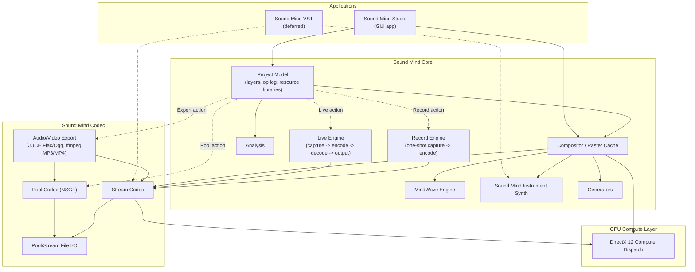
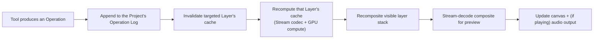

# Sound Mind - the Architecture Document

Status: **early draft — first pass.** This is the starting point for the software architecture activity that follows `sound-mind-design.md`: a sketch of the major modules, the core data model, and the threading model, plus the architectural decisions still open. It is not yet class diagrams — it's the layer beneath them, so those diagrams have a skeleton to hang on.

This document assumes familiarity with `sound-mind-design.md` (what the Studio does and why) and `tech-stack-decisions.md` (the technology choices). It does not repeat either; it only cites the decisions from both that constrain the architecture.

# Constraints Carried Over

From `CLAUDE.md` and `tech-stack-decisions.md`:

- C++20/23, built with JUCE for audio/DSP and DirectX 12 Compute for GPU work.
- Primary development on native Arm64 (Snapdragon X), with x64 validated via CI rather than assumed from cross-compilation alone.
- The real-time audio path must be allocation-free, lock-free where needed, and never touch anything GC'd or interpreted.

From `sound-mind-design.md`'s resolved decisions:

- A project is a project file plus a folder of media/sources/cached renders, single-user, with no versioned schema commitment yet.
- A project's real content is an operation log — closer to a scene graph referencing source data than a raster stack — with cached raster results persisted opportunistically, not authoritatively.
- Anything seeded (Generators, Chaos, noise MindWaves) must replay bit-for-bit on the same Studio version and architecture; only a perceptual match is required across architectures.
- Working latency targets: ~100 ms for graphical feedback, ~250 ms for audio feedback, from a Stream-mode edit.
- Sound Mind VST is deferred until the standalone Studio is operational — the architecture should not be shaped around it yet, only avoid closing the door on it (the Stream codec path already has to be real-time-safe on its own merits).

# System Overview

Two applications get built on top of two shared lower layers — the Studio now, Sound Mind VST later:



- **Sound Mind Codec** is the lowest layer and the one thing that must work standalone: Pool (NSGT, lossless, off-line) and Stream (fast, real-time-safe) transforms, plus the file formats each reads and writes. It has no knowledge of layers, MindWaves, or projects — it only converts between audio/image data and spectrogram data. **As of `v0.0.6.1`**, it also links JUCE (`juce_audio_formats`, for its real Flac/Ogg Vorbis writers) and ffmpeg (for MP3 and MP4 export - see *Decisions Made* below) - a real widening of Codec's dependency footprint beyond PocketFFT/libtiff, since JUCE was previously only a Core/Studio dependency (device I/O). Codec's *conceptual* role is unchanged (it still only converts between audio/image data and spectrogram/container data, with no knowledge of layers or projects); what changed is that "container data" now includes compressed audio and video containers, not just Pool/Stream's own formats.
- **Sound Mind Core** is everything about a *project* that isn't UI: the layer stack and operation log, the compositor that turns them into pixels, and the engines each operation type can call into (MindWaves, Sound Mind Instruments, Generators, Analysis). Core depends on Codec; Codec knows nothing about Core. **As of `v0.0.7.1`**, it also owns `LiveEngine` - Live Mode's continuous capture/encode/decode/output pipeline (see *Threading & Real-Time Model* and *Decisions Made* below) - built on Codec's Stream transforms, same as `PlaybackEngine`. **As of `v0.0.8.1`**, `RecordEngine` joins them: one-shot capture, deliberately simpler than `LiveEngine` (no incremental encoder, no output side, no background worker thread - see *Decisions Made*) since Record's result just needs to reach `sound_mind::codec::encode()` once, the same whole-buffer call any import already uses.
- **Sound Mind Studio** is the GUI application: interaction (tools, panels, canvas), consuming Core and, through it, Codec. It is a Qt application — JUCE is not used for its GUI. JUCE's role narrows to what `sound-mind-core` (and the real-time audio path specifically) needs from it: audio device I/O and DSP building blocks, driven programmatically rather than through any JUCE GUI component. Qt owns the application's event loop and windowing; JUCE's audio engine runs underneath it as a library, not a competing framework. This boundary needs to stay clean in practice — no JUCE GUI classes should appear above `sound-mind-core`, and no Qt classes should appear inside the real-time audio path.
- **GPU Compute** is a thin dispatch layer under Codec's Stream transforms and Core's compositor, isolating the DirectX 12 specifics so nothing above it has to know or care whether an operation actually ran on the GPU or fell back to the CPU.

# Core Data Model

This is conceptual — the entities the design doc implies, not a committed class design. It exists to give the eventual class diagrams a shared vocabulary.


A few things worth calling out about this sketch before it becomes real classes:

- **`Operation` belongs to the Project, not to a Layer.** The first version of this sketch had each `Layer` own its own slice of history, which cannot represent an operation like reordering the layer stack — that operation doesn't belong to any one layer, it changes the project's structure. The `OperationLog` is a single, project-wide, ordered sequence; layer-content operations (`PaintOperation`, `FilterOperation`, `GeneratorOperation`, `TransformOperation`) carry a `targetLayer` reference saying which layer's cache they affect, while structural operations like `ReorderLayersOperation` — and, by the same reasoning, adding/removing a layer or changing a layer's blend mode, opacity, or MindWave link — target the project's layer list itself rather than any one layer's raster content. Rebuilding a given layer's cache means replaying the project's log filtered to operations that target it, in log order, not replaying "that layer's log" as a separate thing.
- **`Operation` is the unit of history**, and every one of the design doc's tools (Paint, Filter, Generator, Transform, and by extension Import, Pool, Chord/Sequence stamping) is some kind of `Operation`. `Layer.cache` is a derived value, not state that operations mutate directly — an operation's `apply` conceptually produces the next cache from the previous one (or from scratch on replay), rather than editing pixels in place. Whether that's *literally* how it's implemented (versus an equivalent optimization) is an implementation choice, not an architectural one — the log stays the source of truth either way.
- **`MindWave` is self-referential** by design (superposition stack, and per the design doc's revamp, a generator's own parameters can themselves be `MindWave`-bound) — the data structure needs to support that recursion without becoming a special case.
- **`SoundMindInstrument`, `MindShot`, and `MindGrain` are peers**: anything a `PaintOperation` can target. A `Sequence` doesn't produce audio directly — it resolves to a list of `PaintOperation`s against one of these, which is what keeps a stamped chord or sequence non-destructively editable.
- **`Layer.cache` (sketched above as `RasterCache`) is concretely a `std::optional<codec::StreamImage>`, as of `v0.0.3.1`.** No new type was needed - per *Decisions Made*'s "raster cache persistence format" entry, a layer's cache already *is* a Stream file's in-memory representation, so `Layer::content()` just holds one directly rather than wrapping it in a separate `RasterCache` type. It's `std::optional` (absent until the layer is first imported into or painted on) and deliberately not part of `Layer`'s JSON serialization - `Project::save()`/`load()` read and write it as its own file under the project's `media/` folder instead, exactly as *File Formats & Portable Resources* describes. A first, single-layer, no-blending-yet `Compositor` (`sound_mind::core::renderLayer()`) now exists too, turning that cache into displayable pixels via `sound_mind::codec::toRgbImage()` - real multi-layer compositing (blend modes, opacity, MindWave-bound parameters) is still future work.
- **Pooling, as of `v0.0.5.1`, is a plain in-place mutation, not yet an `Operation`.** `Layer` gained a second, parallel cache - `poolContent()`, an `std::optional<codec::PoolImage>`, persisted the same way as `content()` but under the project's `pool/` folder - and `sound_mind::core::poolLayer()` replaces both a layer's Pool and Stream content directly (re-deriving the Stream copy from the pooled result, per the design doc's "resulting Pool file converted to a light-weight Stream copy"). This is deliberately simpler than the design doc's "hide-not-delete, recorded as an undoable operation" description: that needs the first concrete `Operation` subtype, which - per `OperationLog`'s own docs - doesn't exist until Basic Painting. Once it does, Pooling should be revisited to become a real, undoable `Operation` instead of a direct mutation.
- **`PaintOperation` gained a mandatory `Path` and a mandatory `ToolConfiguration`**, added to fit the design doc's Tool Configuration Wizard/Panel strategy and its "every stroke ends up as a Path, freehand or deliberate" clarification (both confirmed with the user). `Path` is mandatory, not optional, on every `PaintOperation` - a freehand stroke's raw input is curve-fit into one in real time (see the design doc's *Freehand Path Capture*), it isn't a Path-tool-only concept. `Path` doesn't carry its own `targetLayer`/timing - it's pure geometry (`PathNode[]` - anchor, handle-in, handle-out, smooth-vs-corner) plus the `Gradient` painted along it; a `Path` only becomes a `PaintOperation` (with a target layer and a moment in the log) once something is actually painted with it, matching the design doc's own "picking a paint object brings its nodes and handles back" framing - the geometry and the act of painting with it are the same object once painted, not two objects kept in sync.
- **`Gradient`/`GradientStop` are their own types, shared by `Path` and `ToolConfiguration`** (a tool's own default gradient, and/or a filled selection's, per the design doc's *Gradients* section - not sketched separately here since Selection & Fill isn't this pass's concern) rather than each owning a parallel copy of the same stop-list shape. `GradientStop`'s five fields (`t`, plus independent left/right intensity and opacity) match the design doc's *Stop Values* exactly; `Gradient "1" --> "2..*" GradientStop` encodes the "always at least two stops, at t=0 and t=1" rule directly in the multiplicity rather than leaving it as prose a caller could violate.
- **`ToolConfiguration` is a peer of `MindWave`/`SoundMindInstrument`**: project-scoped, named, saved, and independently exportable/importable, per the design doc's *Tool Configuration* section. Its `type` (`ToolType`) is the discriminator the design doc's dynamic Wizard/Panel keys off of (Procedural, Instrument, Mind Shot, Mind Grain, Smudge, Order/Chaos, Heal, Soften, Clone) - deliberately *not* modeled as a `ToolConfiguration` subclass hierarchy mirroring `Operation`'s: unlike `Operation`'s subtypes (each with a genuinely different `apply()`), every tool type's configuration is just a differently-shaped bag of parameters applied by the same `PaintOperation`, so a single class with a type tag and an opaque `ParamSet` (the same placeholder `MindWave.params` already uses for its own per-generator-type shape) fits without forcing a parallel type hierarchy that would have to be kept in lockstep with `ToolType`'s own list every time a tool type is added. Which concrete parameters live in that `ParamSet` per `ToolType` is intentionally left unspecified here - real, per-tool-type parameter structs are an implementation-time decision once each tool (starting with the plain procedural brush, `v0.Y.24.1`) actually gets built, not a data-modeling one to pre-commit to now.

# Composer Mode Fit

`sound-mind-design.md`'s Composer Mode — a DAW-style track view where each layer is a track and every paint operation renders as a labelled box — is a *view* over the model above, not a second data model. Checking it against that model surfaces two real gaps and confirms a third assumption:

- **Operations need a queryable extent, not just an `apply()`.** Composer Mode draws every operation on its layer's track as a box positioned and sized by that operation's time (and, implicitly, frequency) range. `apply()` doesn't expose that range, so `Operation` above now also carries a `bounds()` method every subtype implements, independent of what the operation actually does. This serves a second view too, not just Composer Mode: it's the same information the legacy Studio's "show op geometry" canvas overlay (dashed outlines per operation) needed, so it's one capability the model owes both views, not something invented just for the timeline.
- **Editing an existing operation (retime it, move it to another layer) needs to be a logged action, not a mutation.** Composer Mode explicitly wants to "re-order or retime" operations and "move them between layers." Given the append-only, replayable log this architecture already commits to, an in-place edit can't just change a past log entry — that would break replay determinism for anything computed after it. The resolution added above, consistent with how Pooling already works (hides the original, inserts the result "in its stead"): `Operation` now carries an optional `supersedes` reference to the operation it replaces. Editing appends a *new* operation pointing back at the old one; the old one becomes inactive (hidden, not deleted) rather than mutated. Replay honours only the non-superseded operation at each point in a layer's history.
- **Track backgrounds (Clean / Amplitude / Thumbnail) are derived views, not stored state.** All three are computable from a layer's existing `RasterCache` — a plain re-render, a per-column amplitude summary, or a squashed thumbnail — so none of them need a new persisted field. Which background a track is currently showing is Studio view-state, not project data.

Composer Mode needing the first two isn't a flaw specific to it — both would eventually surface from the plain canvas view too, and now do: the design doc's own **Pick** section (added alongside the Tool Configuration Wizard/Panel strategy) is exactly the legacy "Pick tool" equivalent this section used to flag as undescribed. `Operation::bounds()` is what a Pick click hit-tests against on the plain canvas, the same extent Composer Mode draws as a track box - one capability, two consumers, confirming the "any overlay or picking interaction needs *some* operation bounding box" prediction this section made before Pick existed. One real refinement Pick's design added beyond the legacy "show op geometry" idea (a single dashed-outline overlay): **bounding box** and **path geometry** are now two *separate* overlays, independently toggleable (see `sound-mind-design.md`'s *Tool Configuration*) - a `PaintOperation`'s `bounds()` rectangle is coarse and cheap (useful for hit-testing and a quick sense of where everything is), while its `Path`'s actual nodes/handles are the finer, editable geometry Pick reveals once an object is actually selected. Both are folded into the Core Data Model above rather than treated as Composer-Mode-only additions.

# File Formats & Portable Resources

Four things need concrete on-disk shape: the project file itself, the two codec file formats it builds on (Pool, Stream), and the standalone resource files that let a MindWave, a Sound Mind Instrument, a Mind Shot, or a Tool Configuration travel between projects. All of this is a first-cut sketch, consistent with the design doc's stance that a formal, versioned project schema is a near-beta concern — nothing here is meant to be locked in yet.

### Project File & Folder

A project is one JSON project file (`.smproj`, tentatively) plus a same-named folder holding everything binary:

```
MyPiece.smproj
MyPiece/
  sources/     — raw imported media, kept for re-encoding/provenance
  media/       — cached Stream-format layer renders, one per Layer
  pool/        — cached Pool-format renders, produced by Pooling
  mindshots/   — captured MindShot Stream-format files
```

The project file itself holds:

- **Project settings** — the codec defaults new layers inherit (sample rate, frequency scale and its parameters, timestep, canvas duration/dimensions), plus project-wide preferences (tuning reference, default tempo).
- **The layer list**, in composite order — each entry's id, name, type, blend mode, opacity, MindWave link, transform, and a reference to its cached render in `media/` (absent until the layer has been rendered at least once).
- **The operation log** — the single, project-wide, ordered sequence described above, each entry serialized with its own parameters, its `targetLayer` (or structural target), its seed where applicable, and its `supersedes` reference where it replaces an earlier one.
- **Resource libraries** — MindWave and Sound Mind Instrument definitions stored inline (they're small and purely parametric); Mind Shot entries stored as metadata plus a path into `mindshots/` (the spectrogram data itself is binary and doesn't belong in a JSON file); Mind Grain definitions stored inline too, since a Mind Grain is only ever a reference to a layer in the *same* project (see below) — there's no external asset for it to point to. Tool Configuration definitions stored inline too, the same reasoning as MindWave/Sound Mind Instrument - small, purely parametric (a `ToolType` tag plus its `ParamSet`), nothing binary to keep out of the JSON.
- **Sequences** — the notation string, inline, plus whatever resolved note events are cached from it.

A project is meant to be self-contained: once a resource is imported, it's copied in and becomes ordinary project data — nothing inside a project ever points at a file outside its own folder.

### Pool File Format

Carries forward the legacy Sound Mind TIFF's proven shape — `CODEC_DETAILS.md` and `SOUND_MIND_TIFF_SPEC.md` are the exact legacy bit-level spec this is informed by, not bound to:

- A TIFF container with four same-sized 16-bit grayscale pages — left amplitude, right amplitude, left phase, right phase — so any generic TIFF reader can still open it, even though only Sound Mind understands the pixel meaning.
- Height = the actual bin count of whichever frequency scale is configured (log by default; mel, octave-aligned, and variable-Q are the same kind of alternative the design doc's Frequency Scale concept already allows for); width = time columns at the project's timestep.
- Amplitude stored as dB mapped linearly onto the pixel range, with a perceptual (loudness-weighted) pre-emphasis applied before storage and removed on decode — cosmetic only, it makes visual brightness track perceived loudness without touching the reconstructed audio.
- Phase stored as its angle mapped linearly onto the pixel range.
- Fully self-describing: format version, sample rate, hop length, bin count, and frequency-scale parameters are embedded in the file itself, so nothing needed to decode it ever lives outside the file.
- Two storage layouts: a simple sequential one for short clips and instrument-sized assets, and a tiled one enabling random-access seeking for long compositions — both worth keeping, since they solve different, real problems.
- Long files split into sequential, independently-decodable snippets, normalized once against the whole file's peak (not per snippet) and given real neighbouring audio at each boundary rather than a synthetic reflection — both details exist specifically to avoid audible seams, and are worth keeping exactly.

What's explicitly *not* carried forward as-is: the legacy metadata key set and its backend-name strings (CUDA/OpenCL/PyTorch-specific) — the new codec's metadata schema and backend identifiers should be designed fresh for the new implementation and GPU stack (DirectX 12, not CUDA/OpenCL), even though the *principle* of "fall back to CPU gracefully when no compatible GPU is present" carries over directly. The exact bin-count formula and any variable-Q zone parameters also depend on whichever NSGT implementation is ultimately selected — final metadata fields wait on that.

**Implemented, as of `v0.0.5.1`:** the TIFF container (libtiff, LZW-compressed, one strip per page, standard 6.0 tags including `PageNumber`/`SubfileType`), a fresh `SoundMindPool:key=value` metadata block (not the legacy key set), and log-scale amplitude/phase quantization to 16-bit. **Deferred**, tracked in *Decisions Needed*: A-weighting (the legacy format's cosmetic pre-emphasis - amplitude is stored as plain dB for now) and the tiled storage layout / multi-snippet splitting (both about efficient partial decode for long compositions, which nothing yet needs - Playback pre-decodes a whole layer at once, and there's no scrubbing UI). See `sound-mind-codec/include/sound_mind/codec/pool_file.h` for the concrete metadata schema.

### Stream File Format

Built for speed, not archival fidelity — the opposite trade-off from Pool:

- Per the design doc's Pool vs Stream distinction, a Stream file carries left and right amplitude, but *not* independent left/right phase — it's the same three-channel model the design doc's Color Mapping concept already describes (two amplitude channels plus a third channel). **Settled in `v0.0.2.1`:** that third channel is an *approximate shared phase*, taken from the left/right mono downmix and reused for both channels on decode - not left empty or blended. This is what makes the current implementation's reconstruction effectively exact for mono-in-stereo content and only approximate for genuinely different left/right content, a deliberate trade for fitting the format's three-channel budget. See `sound-mind-codec/include/sound_mind/codec/stream_codec.h`'s `StreamImage` for the concrete shape.
- Self-describing the same way Pool files are, just a lighter payload — format version, sample rate, hop length, bin count, frequency range, frame count, and sample count, plus (not yet implemented) free-form provenance metadata (a display name, a creation timestamp) that a Mind Shot, in particular, will need.
- Used in three places: a persisted layer cache (see the raster-cache decision above), a captured Mind Shot, and general fast interchange — the same format serving all three rather than inventing a separate one per use. Only the third (general encode/decode) exists as of `v0.0.2.1`; the other two need the Project/Layer model and Mind Shot resource to exist first.
- **Settled in `v0.0.2.1`:** the container is a lightweight custom binary format, not TIFF-like (see *Decisions Made* above) - a fixed header followed by three raw `float[bin][frame]` planes, no compression, no generic-viewer compatibility, since Stream's entire reason to exist is encode/decode speed.

A Mind Shot, specifically, is *just* a Stream file with its provenance metadata filled in — no separate kernel/swatch/sidecar bundle the way the legacy version needed; the format's own metadata block is enough.

### Portable Resource Files

Three of the design doc's "shareable resources" get their own standalone file type; a fourth deliberately doesn't. Tool Configuration (added alongside the Tool Configuration Wizard/Panel strategy) is the same shape as MindWave/Sound Mind Instrument - a small, purely parametric definition - so it gets one too:

| Resource | Portable file | Contents |
|---|---|---|
| MindWave | `.smwave` (proposed) | Generator type, parameters (including any nested MindWave-bound sub-parameters), superposition stack, field-operator chain — the same JSON shape used inline in a project's resource library, just saved standalone. |
| Sound Mind Instrument | `.sminst` (proposed) | Harmonics, inharmonicity, noise model, body resonance, ADSR envelope — likewise, an extracted copy of the same inline shape. |
| Tool Configuration | `.smtool` (proposed) | `ToolType` tag, its `ParamSet`, and, where applicable, a default `Gradient` — the same inline shape a project's own `toolConfigurations` list holds, saved standalone. Deliberately excludes the `Path` any particular `PaintOperation` used it with - a tool configuration is reusable *across* strokes precisely because it isn't tied to any one Path. |
| Mind Shot | *(none needed)* | A Stream file, as above — already portable on its own. |
| Mind Grain | *(none — see below)* | — |

Importing any of the above means copying it into the target project and adding an entry to the relevant resource list (with a name-collision suffix, as the legacy version did) — never a live link back to the original file or project.

**Mind Grain is left off this list on purpose.** The design doc's own list of shareable resources — layers, Mind Shots, MindWaves, and Sound Mind Instruments — doesn't include Mind Grains, and that's consistent with what a Mind Grain actually is: a live reference to a selection on a layer *in the same project*, not a captured asset. Outside its own project, there's nothing for it to refer to. Since this round's task named Mind Grain definitions alongside the genuinely portable resources, this is flagged rather than quietly resolved either way: if Mind Grains are meant to be portable too, sharing one means deciding between converting it to a captured Mind Shot at export time (losing its live-reference behaviour) or bundling a copy of its source layer material alongside it — a real design choice, tracked in *Decisions Needed* rather than picked here.

# Threading & Real-Time Model

Four execution contexts, in increasing order of what they're allowed to do:

1. **Audio callback thread.** Stream codec decode and mixing only. No allocation, no unbounded locks, no operation-log traversal, no Pool codec. This is the one context CLAUDE.md's constraints are non-negotiable for. **Concrete instance, as of `v0.0.7.1`, redesigned in `v0.0.14.1`:** `sound_mind::core::LoopEngine::processBlock()` (Loop Mode's audio callback, renamed/reimplemented from `LiveEngine`) - copies captured input into a `juce::AbstractFifo`-backed ring buffer on the capture side; reads output sequentially from one of two pre-allocated, fixed-length playback buffers (no ring buffer on this side any more - see Decision #20), re-checking which one is active only once per loop it itself plays through. No allocation, no locking, no encode/decode logic on this thread at all, either way.
2. **GPU compute submission.** Dispatches Stream transforms and GPU-accelerated filters to DirectX 12 from a worker thread, not the audio thread; results cross back via a lock-free or double-buffered handoff, never a blocking wait on the audio thread. Still entirely unbuilt (`sound-mind-gpu` doesn't exist yet) - Loop Mode's encode/decode work (below) is CPU-only, same as Stream/Pool's own transforms.
3. **Background workers.** Pool encode/decode, Generators, Import encoding, Analysis passes, and anything else that can legitimately take the tens-to-hundreds of milliseconds (or, for Pool, much longer) these operations need. **Concrete instance, as of `v0.0.7.1`, redesigned in `v0.0.14.1`:** `LoopEngine`'s own worker thread (`juce::Thread`, polling every 5 ms) - drains the capture ring, and for every whole loop's worth now accumulated, whole-buffer `sound_mind::codec::encode()`/`decode()`'s it (not `StreamIncrementalEncoder::pushSamples()`/an incremental re-decode any more - there's no continuously-growing history to maintain once each loop is its own bounded buffer) and publishes the result into the playback side's currently-inactive buffer. See *Decisions Made* below for why this validates (for a CPU-computed source, not yet a GPU one) the *GPU / Audio-Thread Handoff* section's "lock-free ring buffer" option for the audio-thread-facing (capture) side.
4. **UI/main thread.** Owns operation-log mutation and triggers cache invalidation/recompute on the affected layer(s); never blocks waiting on the audio thread, only ever hands it fresh Stream-decoded audio to consume. **Concrete instance, as of `v0.0.7.1`, redesigned in `v0.0.14.1`:** `sound-mind-studio`'s `MainWindow` polls `LoopEngine::currentImage()` on a 33 ms (~30 fps) `QTimer` while Loop Mode is running, refreshing the captured layer's content, repainting the canvas, and showing `LoopEngine::loopsBehind()` in the status bar - the UI thread never touches the ring/playback buffers directly, only the already-synchronized snapshot.

The ~100 ms / ~250 ms targets in the design doc are budgets across UI thread → background/GPU work → audio thread, not a single context's budget — which is also why they're marked aspirational rather than committed: the actual split between CPU and GPU work, and between the Arm64 and x64 targets, isn't known yet.

# Compositing Pipeline (sketch)

A paint or filter action flows roughly:



Only the affected layer (and any Filter layer or MindWave-linked layer above it in the composite order) needs recomputing — this is the main lever for hitting the latency targets on a project with many layers, and probably the first thing worth profiling once a real pipeline exists.

# Determinism & Replay

The operation log is what makes Pooling, Generators, and Remaster-style rebuilds possible at all: replaying the operations that target a given layer, in log order, must reproduce its cache. Concretely:

- Every `Operation` that consumes randomness owns its own seed, stored in the log entry itself — not drawn from a shared/global RNG stream, which would make replay order-dependent.
- Bit-for-bit reproducibility is scoped to *(Studio version, target architecture)* — an op log is not a portable, version-independent artifact, and cross-architecture replay is only held to sounding the same, not being byte-identical. This means the log format should record enough version/architecture context to know when a strict bit-for-bit check even applies.
- The raster cache is purely an optimization: correctness only ever depends on log replay, never on trusting a stale cache. This has a concrete implication for testing — a cache-invalidation bug should be *detectable* by forcing a full replay and diffing against the cached result, which is a natural strategy for regression tests once there's code to test.

# Build & Module Layout (proposal)

A first cut at the top-level module split:

- `sound-mind-codec` — Pool/Stream transforms, file I/O, and (`v0.0.6.1`) audio/video export. No GUI, no project model. Usable standalone. Links JUCE (`juce_audio_formats` only, not JUCE's audio-device or GUI modules) and ffmpeg (`avcodec`/`avformat`/`swresample`/`swscale`, plus `libmp3lame` for MP3 encoding - see *Decisions Made*), the latter dynamically (SHARED) as a deliberate exception to every other dependency here being statically linked.
- `sound-mind-core` — project model, operation log, compositor, MindWave/Instrument/Generator/Analysis engines, and (`v0.0.4.1`/`v0.0.7.1`/`v0.0.8.1`) the real-time `PlaybackEngine`/`LiveEngine`/`RecordEngine` trio. Depends on `sound-mind-codec`.
- `sound-mind-gpu` — DirectX 12 compute wrapper, isolating the platform-specific API from both `sound-mind-codec` and `sound-mind-core`.
- `sound-mind-studio` — the Qt GUI application. Depends on `sound-mind-core`, and through it, indirectly on JUCE's audio engine — but never on JUCE's GUI module.
- `sound-mind-vst` — deferred; not started until the Studio is operational.
- A test target per module, following CLAUDE.md's test-first workflow once implementation begins.

CMake (per `tech-stack-decisions.md`'s "Professional CMake" reference) with vcpkg for dependencies, targeting native Arm64 locally and validating x64 via CI, matches this module split without needing anything unusual.

# Decisions Made

1. **GUI framework: Qt.** Settled in `tech-stack-decisions.md`. See the Studio's description in *System Overview* and *Build & Module Layout* above for how Qt (GUI) and JUCE (audio engine only) coexist.
2. **Operation log serialization: JSON**, for development ergonomics — human-readable, diffable, and trivial to hand-edit or inspect while the schema is still moving. If it turns out too big or too slow to parse once real projects exist, this is meant to be revisited, not defended; nothing else in the architecture depends on it being JSON specifically, only on the operation log being *some* serializable, replayable sequence.
3. **Raster cache persistence format: a Stream-format file.** Rather than invent a new on-disk format for a persisted layer cache, it's just an ordinary Stream-format file — after all, a layer's cache *is* exactly what a Stream file already represents. This also opens doors beyond simplicity: a cached layer becomes trivially exportable, importable into another project, or usable anywhere else a Stream file is accepted, without a special case.
4. **Testing strategy for real-time/GPU code: behavioral tests plus performance tests.** Behavioral tests check the GPU path and the CPU fallback path produce equivalent (or tolerantly-close) results; a separate set of performance tests specifically checks that the GPU path is actually *faster* than the CPU fallback on real hardware — a GPU path that's merely correct but not faster has failed the reason it exists, and that failure mode needs its own test, not just a correctness one.
5. **FFT backend: PocketFFT.** Settled during the Stream codec milestone (`v0.0.2.1`) — header-only C++, BSD-3-Clause, vcpkg-packaged, no build/link step. Sidesteps the FFTW3 GPL question entirely (see *NSGT Library Candidates* below), and is the backend both the Stream transform and, later, Pool's NSGT work build on. `KissFFT` (also vcpkg-packaged, also BSD-3-Clause) was the other real candidate — passed over only because it needs actual linking and has a narrower feature set, not for any license or portability reason.
6. **Stream file container: a lightweight custom binary format, not TIFF-like.** Settled alongside the FFT backend, for the same milestone. A small fixed header (format version, sample rate, hop length, bin count, frequency range, frame count, sample count) followed by three raw `float[bin][frame]` planes — no compression, no generic-viewer compatibility, because Stream's entire reason to exist is encode/decode speed, and TIFF's structure (and Pool's reason for choosing it) works against exactly that. See *Stream File Format* above and `sound-mind-codec/include/sound_mind/codec/stream_file.h` for the concrete layout.
7. **JUCE tier, for now: the free Starter license.** Settled during the Playback milestone (`v0.0.4.1`), when JUCE first needed linking in for real (device I/O). JUCE 8's Starter tier is free for up to $20,000 gross annual revenue across all uses of JUCE code ([juce.com/legal/juce-8-licence](https://juce.com/legal/juce-8-licence/), confirmed via [forum.juce.com](https://forum.juce.com/t/revenue-limits-for-juce-tiers/61058)) and doesn't require open-sourcing Sound Mind Studio — public releases (`release.yml`) continue as normal under it. This doesn't fully resolve *Sound Mind Studio's own distribution license* below, since Starter is explicitly a starting point, not a permanent commitment: the plan is to reassess once/if revenue exceeds that threshold, choosing then between upgrading to a paid Indie/Pro JUCE tier (staying closed-source) or going open-source under an AGPLv3-compatible license (matching JUCE's own free-tier terms). Tracked here rather than only in *Decisions Needed*, since the immediate, actionable choice - which tier to build against today - is settled; what happens after the revenue threshold is what's still open.
8. **NSGT: implemented from scratch, not ported from `libnsgt`.** Settled during the Pool codec milestone (`v0.0.5.1`). Checked `libnsgt`'s actual source directly first (per this doc's own instruction to validate before committing): ~710 lines, moderately tight FFTW coupling across a handful of call sites - realistic to port *in principle*, but only a summarized view of it was obtainable through available tooling, not the literal source needed for a faithful line-by-line port; re-deriving its logic from summaries would have been a worse correctness bet than implementing the well-documented technique directly. The implementation uses the standard frequency-domain-windowing approach (one global FFT per channel; each log-spaced bin's own native-rate coefficient sequence comes from a Hann-windowed spectral slice, inverse-FFT'd directly - the standard DFT filter-bank identity, needing no separate demodulation step) referenced against `grrrr/nsgt`'s documented behavior and `docs/legacy/CODEC_DETAILS.md`'s operational description of it, validated empirically via round-trip fidelity tests rather than a bit-exact comparison against either reference. Result: 0.999984 correlation on the first working implementation, for both mono and genuinely-stereo content (the latter being exactly where Stream's shared-phase approximation can't compete - see `sound-mind-codec/include/sound_mind/codec/pool_codec.h`). Confirms the "from-scratch, referenced against `grrrr/nsgt`" path this doc always named as the alternative was the right call, not just the fallback.
9. **Pool file TIFF library: libtiff.** Also settled in `v0.0.5.1` - the standard, complete reference TIFF library (permissive "libtiff" license, native LZW compression, full multi-page support), over `tinytiff` (LGPL-3.0, a real copyleft consideration for static linking, and unconfirmed multi-page/LZW completeness).
10. **Compressed audio export: JUCE for Flac/Ogg, ffmpeg for MP3.** Settled during the Export milestone (`v0.0.6.1`). Confirmed by reading JUCE's actual `juce_audio_formats` source directly (not assumed): `FlacAudioFormat` and `OggVorbisAudioFormat` ship real, working encoders, but `MP3AudioFormat::createWriterFor()` is an explicit unimplemented stub (`jassertfalse; // not yet implemented!`, returns `nullptr`) - JUCE can only *read* MP3 (via Windows Media Foundation), never write it. ffmpeg (already a dependency for video export, below) covers the gap via its `libmp3lame`-backed MP3 encoder rather than pulling in a second, MP3-only library.
11. **Video export: ffmpeg (MP4 muxing, MPEG-4 Part 2 video, AAC audio), linked dynamically.** Also settled in `v0.0.6.1`. ffmpeg is the only practical MP4-muxing option available via vcpkg (checked; no lighter alternative exists in the vcpkg registry) and is used for MP3 encoding too once it's a required dependency regardless. Video codec: MPEG-4 Part 2 ("mpeg4" in ffmpeg), not H.264 - H.264 needs the GPL-licensed `libx264`, which would obligate the whole distributed Sound Mind binary under GPL terms (the same reasoning as FFTW3's license note above), conflicting with the closed-source posture already committed to via the JUCE Starter tier; MJPEG was the other LGPL-safe option, passed over for producing much larger files on detailed spectrogram content than a real inter-frame codec. Audio codec: AAC, ffmpeg's own native encoder. Linking: ffmpeg's default build is LGPL, and LGPL compliance for a closed-source distribution requires dynamic linking (or a relink mechanism) - the one deliberate exception to every other dependency here being statically linked. `libmp3lame` (LGPL-2.0-only, same compatible license family) rides along as an ffmpeg feature for the MP3 path above, rather than being linked separately.
12. **Live Mode's real-time handoff: `juce::AbstractFifo`-backed lock-free ring buffers, one each way.** Settled in `v0.0.7.1` - the first real (if CPU-, not GPU-, computed) instance of the *GPU / Audio-Thread Handoff* section's "lock-free SPSC ring buffer" option, confirmed to work as expected: the audio callback (`LiveEngine::processBlock()`) only ever copies fixed-size blocks into/out of two rings (capture and playback), while a background `juce::Thread` does all the allocating work (`StreamIncrementalEncoder::pushSamples()`, then a full `decode()` of the accumulated image each pass). Two things scoped deliberately narrow for this first pass, both explicitly confirmed before implementing: **(a)** the output is the live input alone, round-tripped through the Stream codec - not composited with any other layer or project content, since real multi-layer audio mixing doesn't exist anywhere yet (not even for Playback); **(b)** decoding is *not* incremental - the worker re-decodes the entire accumulated history every pass and publishes only the newly-*stable* prefix (samples no longer subject to change as more frames arrive - see `LiveEngine`'s own docs for the exact boundary), a real, accepted cost-grows-with-session-length limitation, not a correctness issue for the durations this milestone's demo needs. `StreamIncrementalEncoder` (the growing/live counterpart to `encode()`) is a genuinely new Stream codec capability, sharing its per-frame STFT primitives with `encode()` via a private `stream_frame_codec.h` header rather than duplicating them.
13. **Record's capture drain: a UI-thread timer, no background thread.** Settled in `v0.0.8.1`. Unlike `LiveEngine`, `RecordEngine` has no per-block encoding or output-decoding work to do while capturing - draining its ring buffer just moves raw samples into a growing buffer, cheap enough to do straight from a UI-thread `QTimer` tick (100 ms, a comfortable margin under the ring's ~370 ms capacity at default settings) rather than needing `LiveEngine`'s dedicated `juce::Thread`. The captured audio is only ever encoded once, at `stop()`, via the same whole-buffer `sound_mind::codec::encode()` any import already uses - per `docs/sound-mind-design.md`'s Record section, "encoded into the layer exactly as any other imported audio would be" - not `StreamIncrementalEncoder`'s slightly different (never-zero-padded) framing.
14. **Playback, Live Mode, and Recording are mutually exclusive.** Also settled in `v0.0.8.1`, extending `v0.0.7.1`'s Playback/Live exclusivity to all three: each owns an independent `juce::AudioDeviceManager`, so any two running at once risk device contention with no guaranteed cross-platform behavior. Starting Live Mode or Recording stops Playback outright (a stale, no-longer-current playback position is harmless to lose); Live Mode and Recording instead *refuse* to start against each other (surprise-stopping an in-progress capture felt like the more harmful failure mode of the two). Real DAWs commonly allow simultaneous playback-while-recording (monitoring a backing track while capturing a new take) - deliberately out of scope for this first pass, tracked as follow-up work once it's worth the added device-sharing complexity.
15. **Recent-projects storage: an ini-format `QSettings`, under a fresh "SoundMind"/"SoundMindStudio" identity.** Settled in `v0.0.9.1` (Landing Page). Ini format (`QSettings::IniFormat`), not the platform-native registry format, specifically so `QStandardPaths::setTestModeEnabled(true)` (a builtin Qt test-isolation mechanism) can sandbox it during the automated test suite - the native Windows registry backend isn't affected by that call, so `RecentProjects`/`MainWindow`'s tests would otherwise read and write the same registry key a real installed Studio uses. A fresh organization/application identity, rather than reusing the legacy Python Studio's own `QSettings` scope, since the two have incompatible project file formats - nothing in the legacy list would resolve to anything openable here anyway.
16. **Visual identity: one fixed app-wide QSS string, plus a matching Doxygen `HTML_EXTRA_STYLESHEET` - not yet a light/dark toggle.** Settled in `v0.0.10.1` (Visual Identity). `sound_mind::studio::theme.h`'s `studioStyleSheet()`/`studioWindowIcon()` carry the legacy documentation's brand palette (`#DD4B00` to `#FEC100`, dark ground) into the Studio itself and, via `docs/doxygen/sound-mind-theme.css`, into the generated code documentation too - both deliberately dark-first and fixed, per this milestone's own scope, not the light/dark mode `docs/sound-mind-design.md`'s Export section already names as a future Studio-wide setting; building that toggle is separate, not-yet-scheduled work this fixed theme will need revisiting for once it exists. **A real, non-obvious gotcha hit and fixed here:** the embedded logo PNG (`assets/app.qrc`, read by both `theme.cpp` and `landing_page.cpp`) silently resolved to a null `QPixmap`/`QIcon` at runtime despite building and linking without error - `rcc`'s generated resource-registration object file, compiled into `sound-mind-studio-lib` (a static library), was being dropped by the linker because nothing in either final executable (`sound-mind-studio`/`sound-mind-studio-tests`) directly referenced it, a well-documented but easy-to-miss Qt static-library behavior. Fixed with an explicit `Q_INIT_RESOURCE(app)` call in both `main()` entry points, per Qt's own recommended pattern for this exact situation.
17. **Unsaved-changes tracking: a plain flag, not an operation-log diff - and a separate, non-modal refusal for Live Mode/Recording, not folded into the same prompt.** Settled in `v0.0.11.1` (Project Lifecycle). `MainWindow::hasUnsavedChanges_` is set directly at each of today's content-mutating call sites (import, Pool, Live Mode starting, Recording adding a layer) and cleared by a successful save or by `setProject()` - the operation log doesn't log any of these as real `Operation`s yet (that's Phase 3's job), so there's nothing to diff against yet; revisit once it does; a flag that could go stale relative to the log's own replay would be a worse bug than the flag itself. Kept deliberately separate from Live Mode/Recording's own guard: an active hardware capture isn't "unsaved changes" in the same sense a modified layer is (there's no meaningful "Discard" for a capture in progress the way there is for an edited layer) and this codebase already treats an in-progress capture as needing to *refuse*, not prompt-then-possibly-discard (`docs/sound-mind-architecture.md`'s own Decisions Made #14, Live Mode/Recording's mutual exclusion) - `newProject()`/`openProject()`/`openProjectAt()`/`closeEvent()` all check it first, before ever reaching the unsaved-changes prompt, consistently with that existing precedent rather than inventing a new interaction pattern for the same underlying concern.
18. **`ProjectSettings` now actually drives `StreamCodecConfig` - at the direct encode call sites, deliberately not yet through `LiveEngine`'s own construction-time config.** Settled in `v0.0.12.1` (Create Project Wizard), confirmed before starting - see that milestone's own roadmap entry for the two scope options weighed. A real, pre-existing gap surfaced while scoping the wizard: `ProjectSettings` and `sound_mind::codec::StreamCodecConfig` were completely disconnected structs - `importAudioFile()`, `importImageFile()`, and Recording's post-capture `encode()` all silently used `StreamCodecConfig{}` (a hardcoded default), regardless of what the open project's settings said. `sound_mind::core::streamCodecConfigFor(const ProjectSettings&)` (`project_settings.h`) is the bridge - deliberately living in Core, not Codec, since `StreamCodecConfig`'s own docs are explicit that Codec must stay independent of Core's project model. `hopLength` is derived from `timestepMs` at `sampleRateHz` (rounded to the nearest sample); `sampleRateHz`/`binCount`/`minFrequencyHz`/`maxFrequencyHz` carry over unchanged - though `encode()` itself always overrides `config.sampleRateHz` with the actual `AudioBuffer`'s own tagged rate (an existing, unrelated behavior, not something this milestone changed), so a project's chosen sample rate's real effect is on the `hopLength` computation, not a hard constraint on encoded content. **`LiveEngine`'s own capture/encode config is deliberately excluded from this wiring**: it's constructed once, as a `MainWindow` member, before any project exists, and has no way to be reconfigured after construction without a real lifecycle change (`config_` is set only in its constructor) - not worth building given Loop Mode's own reimplementation (`v0.Y.14.1` in the roadmap's `.5`-phase numbering, immediately next) is already expected to rework `LiveEngine`'s construction/lifecycle anyway. `poolLayer()` and `decode()` needed no changes - both already derive everything from a layer's existing, self-describing Stream content.
19. **Layer reordering/removal: dedicated `Project` methods, not direct mutation of the vector `layers()` already exposes.** Settled in `v0.0.13.1` (Layers Panel). `Project::layers()`'s own docs already drew this line ("mutable access, for in-place changes... that don't change the stack's membership or order") before this milestone needed to actually respect it - `removeLayer(LayerId)` and `reorderLayers(const std::vector<LayerId>&)` are the two new methods, `sound-mind-studio`'s `LayersPanel`/`MainWindow` never touch `layers()`'s ordering/membership directly. `reorderLayers()` validates its input is a genuine permutation of the current layers' ids (right size, no unknown id, no duplicate) before applying anything, rejecting (no-op, `false`) otherwise - a real bug caught while writing its own tests: an earlier version detected a missing id but not a *duplicated* one, which would have silently dropped a real layer (the duplicate standing in for whatever id it crowded out) instead of being rejected.
20. **Loop Mode: a fixed-length double-buffer swap, whole-buffer encode/decode per loop, and `MainWindow::loopEngine_` becomes a `std::unique_ptr` reconstructed per project.** Settled in `v0.0.14.1` (Loop Mode, renamed from Live Mode), resolving Decision #18's deferred construction-time-config gap. `LiveEngine` is renamed/reimplemented as `sound_mind::core::LoopEngine`: the capture side is unchanged (still a `juce::AbstractFifo`-backed ring, per Decision #12), but there's no continuously-growing history to re-decode any more - each `loopLengthSamples` worth of raw capture is sliced off, whole-buffer `encode()`/`decode()`'d (the same codec entry points Recording's own capture already uses, per Decision #13 - not `StreamIncrementalEncoder`), and published into one of two pre-allocated, fixed-length playback buffers; the audio thread only re-checks which buffer is "active" once per loop *it itself* plays through, never mid-loop, to avoid an audible splice. **A real, structural latency this design implies, confirmed acceptable rather than engineered away**: a loop's audio can't begin encoding until its own capture finishes, and the once-per-cycle re-check means the earliest a captured loop is actually heard is playback loop `N + 2`, not `N + 1`, even with the worker keeping up perfectly - see `LoopEngine`'s own docs for the full derivation. `loopsCaptured()`/`loopsBehind()` track something additive on top of that fixed baseline (whether the worker has *also* fallen further behind), surfaced in `MainWindow`'s status bar as the confirmed scope's "visible loop-delay indicator." `loopEngine_` itself is now a `std::unique_ptr<LoopEngine>`, `nullptr` until `setProject()` first runs, then (re)constructed there from the current project's `streamCodecConfigFor()` config and its duration in samples (`canvasWidth * hopLength`) - resolving Decision #18's note that reconfiguring the old fixed member "isn't worth building... given Loop Mode's own reimplementation is already expected to rework `LiveEngine`'s construction/lifecycle anyway." The new "Keep Looping" checkbox (`LoopEngine::setKeepLooping()`) works by simply not pushing newly-captured input into the ring at all while enabled, so the already-active playback buffer just keeps replaying, untouched, rather than needing any special-cased worker logic.
21. **Transport controls move fully into their own dock panels; device selection is `AudioDeviceSetup`-based and session-only.** Settled in `v0.0.15.1` (Transport Panels), two scope questions confirmed before implementing - see that milestone's own roadmap entry for the options weighed. `PlaybackPanel`/`RecordPanel`/`LoopPanel` (three new `QDockWidget`s) now own Play/Pause/Stop/Record/Loop's actual transport buttons, not just the newly-added device pickers/volume/Keep Looping - the transport toolbar's three actions for these are pure `QDockWidget::toggleViewAction()` show/hide toggles. Device selection uses JUCE's `AudioDeviceManager::AudioDeviceSetup` (`inputDeviceName`/`outputDeviceName`, empty string meaning system default) passed to `initialise()`'s `preferredSetupOptions` parameter - chosen over the single-string `preferredDefaultDeviceName` parameter specifically because `LoopEngine` needs independent input *and* output device choices, which only the `AudioDeviceSetup` struct actually supports. `PlaybackEngine`'s device switches immediately (`setAudioDeviceSetup()`, since its device is opened once, at construction, and stays open for its whole lifetime - see Decision-adjacent note in `playback_engine.h`); `LoopEngine`/`RecordEngine`'s device preferences only take effect on their own *next* `start()`, since both only ever open a device inside `start()` to begin with. Not persisted across app restarts - confirmed as this pass's scope, deferred to a later milestone if it turns out to matter; `QSettings` (the same store `RecentProjects` already uses) is the obvious mechanism whenever it does.
22. **Audio Import Snippets: analysis and import split into two separate `MainWindow` methods, snippet naming keeps its original split position.** Settled in `v0.0.16.1` (Audio Import Snippets). `audioSnippetsForFile()` (no dialog, no import - purely computes the split) and `importAudioSnippets()` (imports a caller-given set of indices) are deliberately separate, rather than one method that both analyzes and conditionally shows a picker - the latter would have broken `importAudioFile()`'s own established "never shows a dialog" contract (needed for headless testability - see its own docs) the moment splitting was involved. `importAudioFile()` itself becomes a thin wrapper requesting every index `audioSnippetsForFile()` reports, preserving its exact pre-existing behavior for the common (single-snippet) case. A snippet's layer name embeds its *original* position in the full split (`"<stem>_NNNN"`), not a renumbering of just the imported subset - confirmed while implementing, so a layer's name stays meaningful even when only some snippets were chosen. `AudioSnippetPickerDialog` (a modal `QDialog`) is shown by `importAudio()` only when there's more than one snippet - never for the common case, matching the "no dialog beyond the file picker itself" behavior this method already had.
23. **Image Import Scaling: resizing happens on the `QImage`, before `toRgbImage()`/`fromRgbImage()` - a pre-existing gap, not just a new choice.** Settled in `v0.0.17.1` (Image Import Scaling). Before this milestone, no image import ever resized anything - `fromRgbImage()`'s own docs already say the image's own pixel grid becomes the bin/frame grid directly, so "Keep Native Resolution" was silently the *only* behavior any import ever had. The new `scaleImageForImport()` helper (`main_window.cpp`, private) resizes the source `QImage` via `QImage::scaled()` before it's ever converted to an `RgbImage`, so `fromRgbImage()` itself needed no changes at all - it just reflects whatever dimensions the image it's handed happens to have, exactly as documented. `ScaleVerticalProportional`'s target width is computed by hand (`sourceWidth * canvasHeight / sourceHeight`, rounded) and applied via `Qt::IgnoreAspectRatio`, rather than relying on `Qt::KeepAspectRatio` - that mode fits *within* a bounding box rather than hitting an exact height, which wouldn't match this mode's own documented "height changes to match the project's bin count" guarantee.
24. **Drag & Drop Import: failures report via the status bar, not a modal - the one deliberate deviation from the File menu's own equivalent actions.** Settled in `v0.0.18.1` (Drag & Drop Import). `MainWindow::handleDroppedFiles()` (the testable core behind `dropEvent()`) never shows a blocking `QMessageBox` for a recognized-but-failed import/open, unlike `importAudio()`/`importImage()`/`openProject()` - two reasons, confirmed while implementing: a multi-file drop shouldn't stop and demand attention partway through over one bad file, and doing so would have broken this method's own headless testability (the same "never shows a dialog" contract Decision #22 already established for `importAudioFile()`, applied here for the first time to a method handling *three different* file types at once). `.smproj` still guards through `confirmDiscardUnsavedChanges()` first - the one real dialog this method can show, and only when there's genuinely something to lose, exactly matching every other caller of that method. **Extended, not reversed, by Decision #27 (`v0.0.21.1`)**: `handleDroppedFiles()` itself still never shows a dialog - the image/audio *choice* pickers Decision #27 adds moved into `dropEvent()` instead, which was always documented as untestable/interactive-only anyway; this entry's own "failures report via the status bar" claim is unchanged.
25. **Layer Time Alignment: `renderLayer()` gains a required `canvasWidth` parameter and always renders onto that fixed window, ahead of real multi-layer compositing.** Settled in `v0.0.19.1` (Layer Time Alignment), confirmed with the user before implementing (three options were on the table: keep `renderLayer(Layer)` and let translation pad/crop at the layer's own native width, add an optional `canvasWidth`, or make it required and always crop/pad to it - the third was chosen explicitly "considering which option is best for painting, compositing, etc. planned in the future"). Every layer's render now lines up column-for-column with the project's own time axis regardless of that layer's own content width or transform, so a future real composite loop can composite multiple layers' renders directly without each caller re-deriving this placement itself. Concretely: `layer.rescaleFactor()` resamples the layer's own `toRgbImage()` output horizontally (nearest-neighbor - no antialiasing concerns for a spectrogram's own per-column data), then `layer.translationColumns()` shifts the result, and the final placement is always cropped/padded (black) to exactly `canvasWidth` columns - both new anonymous-namespace helpers in `compositor.cpp` (`resampleHorizontally()`, `placeOnCanvas()`), framework-agnostic like the rest of Core (no `QImage`, since `sound-mind-core` doesn't link Qt). This is a real, if narrow, breaking signature change: every existing caller of `renderLayer()` (`CanvasWidget`) and `exportLayerVideo()` (which threads `canvasWidth` through to its own `renderLayer()` call) was updated to pass the project's `ProjectSettings::canvasWidth` - confirmed as no actual regression, since every layer's content was already produced at (or very near) `canvasWidth` by every existing import path, but flagged here since it does mean `exportTopmostLayerVideoNow()` now encodes at the full project canvas resolution rather than a layer's own (sometimes much smaller) native resolution, a real, deliberate cost increase for a correctness-and-future-readiness tradeoff. `Layer::translationColumns()`/`rescaleFactor()` are visual/spectrogram-only, per the roadmap entry's own narrower-scope note - `decodeLayerForExport()` and all real audio playback paths are untouched.
26. **Image Sequence Import: "Import as sequence" is a checkbox that disables the mode radios, not a 6th `Mode` value - and its cumulative placement wraps at `canvasWidth`, matching the legacy Studio exactly.** Settled in `v0.0.20.1` (Image Sequence Import), checked against the legacy Studio's own `import_wizard.py`/`app.py` (`../sound-mind/`) before implementing and confirmed with the user on every point where that reference and this codebase's own roadmap text diverged or left something open. `ImageScalePickerDialog` gained a constructor parameter (`allowSequential`, default `false` so every pre-existing call site is unaffected) and a `sequentialCheckBox`, shown only when `true`; checking it disables (not hides) the five mode radios via `QButtonGroup::buttons()`, communicating that they're overridden without the layout churn hiding them would cause. `MainWindow::importImageFiles()` is the new multi-file testable core `importImage()`'s now-multi-select file dialog delegates to - when `importAsSequence` is `false` it just loops `importImageFile()` per path (no translation, independent placement, same as calling it directly per file); when `true`, it sorts paths first (deterministic - the natural choice for numbered frame sequences, regardless of the file dialog's own selection order), forces `Mode::ScaleVerticalProportional` on every file, and tracks a running `translationColumns` - incremented by each just-imported layer's own `content()->frameCount` (its real, already-computed proportional width, read back rather than recomputed) - that **wraps back to `0`** once it reaches the project's own `canvasWidth`. That wrap was a genuine decision point, confirmed explicitly: the alternative (just letting the offset keep growing, relying on `renderLayer()`'s own Decision #25 cropping to hide anything past `canvasWidth`) was simpler and arguably more in this codebase's own idiom, but the legacy Studio's exact behavior was chosen instead, deliberately, over deviating from a working precedent without a concrete reason to. Like `importAudioSnippets()`/`handleDroppedFiles()`, `importImageFiles()` treats a partial batch failure as success (returns `true` if at least one file imported, `false` only if none did) - the same "don't let one bad file block everything" precedent, applied here for a third time.
27. **Drag & Drop Import gains full parity with the File menu, for both images and audio - and cancelling any one resulting picker cancels the whole drop.** Settled in `v0.0.21.1` (a UI polish pass across several already-shipped milestones, not itself a new roadmap entry), confirmed with the user, who explicitly asked for drag & drop to become "the same as File -> Import" rather than staying the deliberately reduced-choice path Decision #24 originally described. `MainWindow::dropEvent()` now partitions the dropped paths and, before ever calling `handleDroppedFiles()`, shows the same pickers the equivalent File menu action would: one `ImageScalePickerDialog` for the whole image batch (unchanged from Decision #26's own batch design), and - new - one `AudioSnippetPickerDialog` *per* `.wav` file with more than one computed snippet, mirroring `importAudio()`'s own per-file logic exactly rather than inventing a cross-file audio concept the way image sequencing is. `handleDroppedFiles()` itself stays non-prompting (preserving its own "never shows a dialog" testable-core contract, extended rather than broken): it now takes the already-decided `imageMode`/`importImagesAsSequence` plus a `std::map<path, indices>` of per-file audio selections, all defaulted so every pre-existing test (and any `.wav`/image path with no real choice to make) keeps working unchanged. Cancelling *any* dialog - image or a particular file's audio snippet picker - aborts the entire drop, including files unrelated to that dialog; confirmed with the user over the narrower alternative (skip only what that dialog was for) as the simpler, more predictable rule to explain and to rely on.
28. **Playback/Record/Loop default to hidden; Layers gets the same toolbar toggle but defaults to shown - and, unlike before, neither is ever force-reset by switching projects.** Settled in `v0.0.21.1`, confirmed with the user. Previously `setProject()` unconditionally called `->show()` on all three transport panels plus Layers, every single time - the new behavior removes that call entirely for Playback/Record/Loop (they simply stay however the user last left them, defaulting to the hidden state every dock already starts constructed in) and replaces it, for Layers only, with a one-time `layersPanelShownOnce_` flag: shown automatically the *first* time any project exists in a session, then left alone too. This is the same `QDockWidget::toggleViewAction()` mechanism Playback/Record/Loop's own toolbar buttons already used - genuinely no different in kind, just a fourth instance of it, with the opposite default.
   - **Two real bugs found via the user's own manual testing after `v0.0.21.1` shipped - both fixed in `v0.0.21.2`, corrected here since this decision's own first version wrongly called the whole thing an unreproducible headless-test artifact.** First: a direct `layersPanel_->show()` call (from `setProject()`, bypassing the action entirely) never updates `toggleViewAction()`'s own checked state - `QDockWidget` only pushes changes *from* the action *to* the dock (`toggled(bool)`/`triggered(bool)` → show()/hide()), never the reverse - so the action stayed at its constructed-while-hidden default of unchecked even once the panel became genuinely visible; `setProject()` now explicitly calls `layersPanel_->toggleViewAction()->setChecked(true)` right after that `show()` to keep them in agreement. Second, the actual reason the toolbar button did nothing even once checked-state was correct: `LayersPanel`'s constructor set `QDockWidget::DockWidgetMovable | QDockWidget::DockWidgetFloatable` as its features, leaving out `QDockWidget::DockWidgetClosable` - without that flag, `QDockWidget` lets `toggleViewAction()`'s checked state flip freely either way but never actually calls `hide()` in response. Playback/Record/Loop's own panels never call `setFeatures()` at all, keeping Qt's full default feature set (`Closable` included), which is exactly why their toolbar toggles worked correctly from the start while only Layers' did not. `LayersPanel`'s `setFeatures()` call now includes `DockWidgetClosable`. Diagnosing this took real, extensive trial and error (`QAction::trigger()` alone does *not* flip a checkable action's checked state - a real `QToolButton` click does that itself before calling `trigger()` - which is why an early attempt using bare `setChecked()` calls, without ever calling `trigger()`, never exercised the actual `triggered(bool)`-driven path `_q_toggleView()` listens to); `layersToggleActionShowsAndHidesTheLayersPanel` now verifies the full round trip (two `trigger()` calls, checking `isHidden()` after each) and passes headlessly with both fixes in place - the original "can't verify headlessly" framing was itself a misdiagnosis, not a real limitation.
29. **Playback position bar + a live playhead line over the canvas, matching video export's own exactly.** Settled in `v0.0.21.1`, confirmed with the user, who explicitly asked for *both* a conventional draggable DAW-style position bar and a moving vertical line over the spectrogram - not a choice between them. `PlaybackEngine` gained `positionSamples()`/`totalSamples()`/`sampleRateHz()` (plain atomic reads, already real-time-safe - `position_`/`audio_` already existed internally, just not exposed) and `seek()` (an atomic store, the same real-time-safety shape as the pre-existing `setVolume()`). `PlaybackPanel` gained a `positionSlider_` at a fixed `[0, kPositionSliderSteps]` resolution (decoupled from the loaded audio's own duration, converted to/from seconds via a stored `totalSeconds_`) plus an elapsed/total `positionLabel_` ("M:SS / M:SS") - connected to `QSlider::valueChanged` (not `sliderMoved`), with `QSignalBlocker` guarding every programmatic update, the exact pattern `volumeSlider_`/`setVolumePercent()` already established, reused rather than reinvented. `CanvasWidget` gained `setPlayheadFraction()`, drawing a 1px white vertical line at that fraction of its own width, deliberately independent of `project_`/layer state (drawn over the placeholder or an empty canvas too) so it always renders regardless of what else is on screen - the same pixel color and 1px width `sound_mind::codec::exportVideo()`'s own playhead uses, so live playback looks the same as the video it would export to. `MainWindow` ties these together with a `playbackUpdateTimer_` (33ms, matching `loopUpdateTimer_`'s own cadence) polling position while playing, `seekPlayback()` (called from the position bar's `seekRequested` signal) updating both UI surfaces immediately rather than waiting for the next tick, and `stopPlayback()` resetting both back to their empty state.
30. **The Background layer's row in the Layers panel has no opacity slider or transform controls at all - not just disabled ones.** Settled in `v0.0.21.2`, confirmed with the user via manual testing. `LayerRowWidget`'s constructor now skips constructing `opacitySlider`/`translationSpinBox`/`rescaleSpinBox` entirely (not merely `setEnabled(false)`) when `data.type == LayerType::Background` - neither concept applies to the always-opaque, always-first-in-time floor of the stack. Deliberately scoped to `Background` specifically, not `isLocked(type)` generally: `Equalizer` (the panel's other locked type) isn't constructible anywhere in the codebase yet, and its own eventual filter semantics may well want these controls once it exists - narrowing the exclusion now would be guessing at a design question that isn't this milestone's to answer. Model-level: `MainWindow::setLayerOpacity()`/`setLayerTranslation()`/`setLayerRescale()` remain callable against a Background layer's id and still work (existing test coverage - `setLayerOpacityChangesTheLayersOpacity()`, in particular - already exercises this against the Background layer directly) - this is a UI-presentation change only, matching the user's own "shall not have an opacity or transform *option*" wording, not a new model-level constraint on `Layer` itself.
31. **`v0.Y.23.1` (Refactor & Clean Up), part 1 of N: `PlaybackController` extracted out of `MainWindow`, plus the pure-function import/export helpers, into their own classes/files with their own test suites.** Settled in `v0.0.22.1`, confirmed with the user on both the extraction's depth (new classes get a real public surface and dedicated test files, not just thin private helpers `MainWindow` alone calls) and this pass's scope (these two extractions only - `MainWindow` still directly owns Loop Mode, Recording, Import/Export's actual layer-mutating logic, and project lifecycle; each is a candidate for a later installment of this same milestone, not this one). This is **not** the milestone's full completion - the roadmap heading stays unmarked until a later pass covers the rest.
    - **`PlaybackController`** (`sound-mind-studio/include/sound_mind/studio/playback_controller.h`) owns the `PlaybackEngine` and its ~30fps position-polling `QTimer`, previously three separate `MainWindow` members (`playbackEngine_`, `playbackLoaded_`, `playbackUpdateTimer_`) plus the logic spread across `startPlayback()`/`pausePlayback()`/`stopPlayback()`/`seekPlayback()`/`updatePlaybackPosition()`. Deliberately **project/layer-agnostic**: it plays whatever `load()` is given and knows nothing about `Project`/`Layer` - "which layer to play" (`topmostLayerWithContent()`) stays `MainWindow`'s own decision, the same separation `PlaybackEngine` itself already draws at the Core level. Deliberately **UI-agnostic** too, despite living in `sound-mind-studio`: it never reaches into `PlaybackPanel`/`CanvasWidget` directly, only ever emitting `durationChanged()`/`positionChanged()` signals - `MainWindow` is still the one wiring hub connecting every panel's signals to every other panel's slots (the same shape `LayersPanel`/`LoopPanel`/`RecordPanel`/`PlaybackPanel` already established: "purely presentational... every user action is a signal the owner connects to its own handlers"), which this deliberately doesn't disturb. `MainWindow`'s own `startPlayback()` etc. all still exist, with their exact pre-refactor signatures (confirmed with the user), now thin bodies delegating to `playbackController_`.
      - **A real design gap found while doing this extraction**: several call sites (`importAudioSnippets()`, `importImageFile()`, `toggleLayerVisibility()`, `deleteLayer()`, `toggleRecording()`, `poolTopmostLayerNow()`) used to just set `playbackLoaded_ = false` directly - marking the loaded audio stale (so the *next* `startPlayback()` reloads) **without stopping whatever's currently playing**, since the old, still-playing audio might not even be the thing that just changed. A plain `stop()` on the new controller doesn't preserve that - it also halts playback, a real behavior change these call sites never wanted. Added `PlaybackController::invalidate()` specifically to preserve the original semantics: clears `isLoaded()` only, leaves `isPlaying()`/the timer/the engine completely untouched.
      - `setProject()`'s own defensive-invariant block previously stopped the timer and the engine at two different points (a `playbackUpdateTimer_->stop()` near the top, a separate `playbackEngine_.stop(); playbackLoaded_ = false;` after `canvas_->setProject()`) - consolidated into one `playbackController_->stop()` call, since nothing observable ever depended on the relative order between those two halves.
    - **The pure-function import/export helpers** (`lowercasedExtension()`, `isImageExtension()`, `audioFormatFromExtension()`, `formatSnippetIndex()`, `scaleImageForImport()`) moved to `sound-mind-studio/include/sound_mind/studio/import_helpers.h` - no logic changes, just relocation plus real unit tests they never had in isolation before (previously only exercised indirectly, through whichever `MainWindow` method called them). The `QImage`/`codec::RgbImage` conversion pair (`toRgbImage()`, and a new `toQImageView()`) moved to `sound-mind-studio/include/sound_mind/studio/qt_image_conversion.h` - **a genuine cross-file duplication found and fixed**: `CanvasWidget::paintEvent()` had its own separate, near-identical `toQImage()` (deliberately *not* copying pixel data - the source stays alive for the whole synchronous paint call, so a copy would be wasted work), while `MainWindow`'s own version *did* copy (its results need to outlive the source). Rather than picking one behavior and losing the other, the shared function is the non-copying view (`toQImageView()`, named differently from the old `toQImage()` on purpose - see its own docs - so a copy-needing call site can't reach for it by mistake and get a dangling result once its source `RgbImage` is gone); `MainWindow` keeps a one-line local `toQImage()` wrapper that just calls `toQImageView(image).copy()`, preserving its own exact prior behavior with no call-site changes needed anywhere in `main_window.cpp`.
32. **`v0.Y.23.1` (Refactor & Clean Up), part 2 of N: the Import/Export cluster extracted out of `MainWindow` into `sound_mind::studio::import_export`, as free functions rather than a class.** Settled in `v0.0.23.1`, following the same depth/scope pattern Decision #31 confirmed with the user (its own public surface, own `test_import_export.cpp`; `MainWindow`'s own methods keep their exact pre-refactor signatures as thin delegating bodies). Unlike `PlaybackController`, there's no persistent engine or timer to own here - `audioSnippetsForFile()`/`importAudioSnippetsInto()`/`importImageFileInto()`/`importImageFilesInto()`/`exportLayerAudioNow()`/`exportLayerVideoNow()` are plain free functions in `sound-mind-studio/include/sound_mind/studio/import_export.h` operating on a `Project&`/`Layer` passed in each call, the same shape `sound-mind-core`'s own `layer_export.h` already uses one level down - a stateful "Controller" class would have had nothing to actually hold as state. Deliberately UI-free, same principle as `PlaybackController`'s signal-only contract: no status bar messages, no `canvas_->update()`, no `hasUnsavedChanges_` - `MainWindow`'s own wrapper methods own all of that, calling these functions in between and translating a `bool`/`int`-returning failure into whatever UI reaction is appropriate. `importAudioSnippetsInto()`/`importImageFilesInto()` return `int` (imported count) rather than `bool`, an internal signature choice `MainWindow`'s own equivalents already needed as a local (`importedCount`) - promoting it to the return value let `MainWindow`'s wrappers drop that intermediate variable entirely, and reads more informatively than a lone `bool` at a call site that used to build a status message from a separately-tracked count anyway.
    - **One deliberate, unstested-so-safe behavior simplification**: `MainWindow::importImageFiles()` previously looped over its own sibling `importImageFile()` member internally, so each file's success produced its own transient "Imported "X"." status bar message before the next file's began. Since `importImageFilesInto()`'s own internal loop now calls the *free* `importImageFileInto()` (no UI side effects at all) rather than the member, per-file status messages are gone; `importImageFiles()` instead shows one consolidated "Imported N file(s)." message once, after the whole batch. Confirmed no test asserted on the old per-file message text or count before making this simplification.
    - **A found-but-deferred duplication, flagged rather than fixed in this pass**: `MainWindow::topmostLayerWithContent()` (the "topmost visible layer with content" logic `exportTopmostLayerAudioNow()`/`exportTopmostLayerVideoNow()`/playback all depend on) stayed a `MainWindow` member rather than moving alongside `import_export`'s own functions - it's genuinely `MainWindow`-owned state traversal (`project_->layers()`), not an import/export-specific concept, and playback's own dependency on it (unrelated to this installment) would have made moving it here a scope-creeping change to a class this pass isn't touching. Left as-is; worth revisiting only if a later installment (playback's own further cleanup, or a `Project`-level "topmost visible layer with content" query) gives it a clearer home.
33. **`MainWindow`/`PlaybackController` gained an `AudioDeviceMode` constructor parameter, specifically so tests can skip real audio device I/O.** Settled in `v0.0.23.2`, in response to the user asking why `sound-mind-studio-tests` took over 12 minutes (the whole regression suite, ~13 minutes) and directing that `MainWindow` be fixed to avoid opening/closing real devices needlessly during tests before considering any test-tiering scheme on top. Root cause, found by isolating `MainWindowTest` (111 of the suite's 226 `QTest` methods) via a timed, single-class rebuild: `MainWindow`'s constructor unconditionally built `recordEngine_` and `playbackController_` (whose own `PlaybackEngine` member defaults to `AudioDeviceMode::Real`) with no way to say otherwise - so *every* `MainWindow` construction across the whole file opened two real system audio devices, regardless of whether that particular test had anything to do with playback or recording at all. `PlaybackEngine`/`RecordEngine`/`LoopEngine` already had exactly the right tool for this (`AudioDeviceMode::None`, added for their own hermetic Core-level tests) - `MainWindow` just never had a way to pass it through. Fixed by giving `MainWindow` and `PlaybackController` the same parameter (default `Real` on both, so `main.cpp`'s real app construction is unaffected by omission), threaded to `recordEngine_`, `playbackController_`, and the `loopEngine_` `setProject()` later constructs. `test_main_window.cpp` gained a small `TestMainWindow : public MainWindow` subclass (default constructor passes `None`) and every one of its ~115 `MainWindow` constructions was mechanically renamed to it, after confirming (by inspection) that none of this file's tests depend on real device enumeration or behavior - the handful exercising device-preference forwarding (`setLoopInputDevice()` and friends) only check that a caller-given name round-trips as a stored *preference* string, the same distinction `PlaybackEngine::setPreferredInputDevice()`'s own docs draw. `test_playback_controller.cpp` got the same treatment for 10 of its 11 tests; the one genuinely testing real-device query/rejection behavior (`outputDeviceMethodsAreCallableWithoutCrashing()`) was deliberately left on the real-device default. Result: the full regression suite's total time dropped from ~779 seconds to ~64 seconds (~12x) - confirming the real-device open/close cost, not raw test volume, was the actual bottleneck; the "move the slowest 90% out of scope, run only when recording/playback code changes" idea the user raised first turned out not to be the right fix once this was found, since the slowness wasn't concentrated in recording/playback-specific tests at all - it was structural, affecting nearly the entire `MainWindowTest` class uniformly regardless of subject.
    - **A real, unrelated test regression found and fixed along the way**: isolating `MainWindowTest` surfaced `changingARealRowsOpacitySliderDoesNotCrash()` actually failing - it assumed a fresh project's only layer (its Background one) has an `opacitySlider`, true before Decision #30's Background-controls fix but not after; nothing had run this specific test to completion since. Fixed by importing a real Normal layer first and asserting against its opacity instead of the Background layer's.
34. **`v0.Y.24.1` (Basic Painting), part 1 of N: `Gradient`/`GradientStop` and `Path`/`PathNode`/`fitPathToPoints()` implemented as real `sound_mind::core` classes, matching the Core Data Model sketch added earlier this session.** Settled in `v0.0.24.1`, confirmed with the user that this milestone builds the full Tool Configuration Wizard/Panel and Pick alongside the plain procedural brush, not a narrower first cut. Both classes' own docs (`gradient.h`/`path.h`) carry the detailed API contract; worth recording here is what the pre-implementation sketch left genuinely open and how each was resolved:
    - **`fitPathToPoints()`'s curve-fitting algorithm**: not specified by the design doc beyond "curve-fitted... in real time" - implemented as Ramer-Douglas-Peucker simplification (picking a sparse anchor subset within a caller-given tolerance) followed by Catmull-Rom-derived tangents converted to Bézier handles at each surviving interior anchor, a standard, well-understood pairing rather than a novel algorithm, and cheap enough to re-run on every new sample while a stroke is still being drawn (RDP is the expensive part, and it's only ever run over the *current* stroke's own point count, not anything session-length).
    - **A real cross-unit-scale gap found while designing the algorithm, resolved by pushing normalization to the caller**: `timeSeconds` and `frequencyHz` are wildly different-scaled units with no built-in common yardstick (unlike canvas pixels, where X and Y already share one) - simplification tolerance and tangent-length math both need *some* shared scale to be meaningful. Rather than guessing a hardcoded ratio, `fitPathToPoints()` takes an explicit `frequencyToTimeScale` parameter (how many Hz are "worth" one second) that a Studio caller derives from its own canvas geometry at call time (duration-in-seconds spanning canvas width vs. frequency-range-in-Hz spanning canvas height) - not yet built, since Studio-side canvas capture is a later installment of this same milestone.
    - **`Path::bounds()` is the bounding box of every node's anchor *and* handle points, not the curve's own tighter exact extent.** Confirmed as the right tradeoff by this session's own architecture-doc text (Composer Mode Fit's "coarse and cheap" framing, written before this class existed) - an exact per-segment Bézier extrema computation needs a derivative root-find nothing consuming `bounds()` (Pick hit-testing, Composer Mode's track boxes) actually needs that precision for.
    - **`Gradient`'s `linkChannels` is a plain, persisted `bool` with zero effect on `evaluate()`** - confirmed as a UI-editing-convenience flag only (per the design doc's own "editing the left channel's values mirrors them to the right" wording, describing an edit-time behavior, not a stored invariant), so `Gradient` itself doesn't need to enforce or even know that left/right happen to match; whatever UI eventually edits a `Gradient` is the only thing that reads this flag. Persisted (not Studio-only view-state) so reopening a saved gradient's editor remembers whether it was last edited in linked mode.
    - Not yet built: `ToolConfiguration`, `PaintOperation`, `OperationLog`'s real (non-stub) behavior, the procedural brush's own amplitude-writing logic, and every Studio-side piece (canvas capture, the Tool Configuration Panel, Pick, the bounding-box/path-geometry overlays) - later installments of this same milestone.
35. **`v0.Y.24.1` (Basic Painting), part 2 of N: `ToolConfiguration`, `PaintOperation` (the first real `Operation` subtype), and a real `OperationLog` (undo/redo, `supersedes`-aware replay filtering).** Settled in `v0.0.24.2`. `ToolConfiguration` is deliberately *not* the generic `ParamSet`-tagged-union the Core Data Model sketch's own `MindWave`-style placeholder implied - with only `Procedural` real, plain typed fields (`tipShape`/`falloff`/`size`/`defaultGradient`) are simpler and safer than an opaque bag would be; real rework (a tagged union, or per-type subclassing) is deferred until a second tool type's parameters actually need to coexist with these, not built speculatively now. `ToolType` itself does already list all nine tool kinds the design doc's Tool Configuration/Pick sections name (`Procedural`/`Instrument`/`MindShot`/`MindGrain`/`Smudge`/`OrderChaos`/`Heal`/`Soften`/`Clone`) - deliberate groundwork for the Panel/Wizard's dynamic per-type UI, not a claim any but the first is actually paintable yet.
    - **`Operation` gained a new virtual, `targetLayer()`** (defaulting to `std::nullopt`), so `OperationLog` can filter to one layer's own operations generically - without this, the log would need to know about `PaintOperation` specifically (or every future content-mutating subtype) just to answer "which operations affect layer X," defeating the point of `Operation` being an abstract base other code programs against.
    - **Undo/redo is a separate, simple linear high-water mark - not built on `supersedes()`.** A real design fork found while implementing: the roadmap's own `v0.Y.24.1` text ("undo/redo via the operation log... first real exercise of `supersedes`") could be read as implying undo/redo itself uses `supersedes()`, but `supersedes()` is documented (Composer Mode Fit) as a *deliberate re-edit* mechanism - appending a replacement that points back at what it replaces. Plain undo of a fresh stroke has no replacement to point at; forcing it through `supersedes()` would mean inventing a dummy "retraction" `Operation` subtype purely for bookkeeping. Resolved by keeping the two mechanisms genuinely separate, as `operation_log.h`'s own docs now explain: `undo()`/`redo()` move an `activeCount_` high-water mark (a fresh append past an undo() *does* discard the abandoned redo tail - ordinary, expected undo-stack behavior, not a violation of the log's own append-only replay-determinism guarantee, which is about never changing what a still-*reachable* active prefix replays to); `supersedes()` keeps its originally-designed job, and gets its own "first real exercise" once Pick (a later installment) actually re-edits a picked paint object in place.
    - **`OperationLog::activeOperationsTargeting()` resolves superseded-and-then-undone chains correctly by construction, not by special-casing.** It only ever treats an operation as "superseded" if something *currently active* points back at it via `supersedes()` - so undoing a superseding replacement (removing it from the active set) automatically makes the original it replaced visible again next call, with no extra bookkeeping needed for that case.
    - **JSON serialization dispatches on a `"kind"` string** (only `"paint"` exists yet) rather than C++ RTTI or a numeric tag, matching this codebase's existing `NLOHMANN_JSON_SERIALIZE_ENUM` string-based convention elsewhere (`LayerType`, `FrequencyScale`); a real per-subtype `toJson()`/factory dispatch table is deferred until a second `Operation` subtype actually exists, per the same "don't pre-build for a speculative need" reasoning as `ToolConfiguration`'s own fields. The pre-`v0.0.24.1` bare-empty-array shape every existing saved project's operation log actually has still parses (as an empty log) - no real project ever had non-empty operation-log data before this, since nothing could write one, so this isn't a breaking (`Y`-bump) change despite the on-disk shape changing for a *populated* log.
36. **`v0.Y.24.1` (Basic Painting), part 3 of N: the procedural brush's own amplitude-writing DSP - `applyPaintOperation()`/`rebuildPaintedContent()`.** Settled in `v0.0.24.3`. The design doc leaves the actual pixel math unspecified beyond "stamps... along its length" and "painting amplitude pixels brighter/darker" - the concrete choices made, each a real interpretation gap the design doc left open:
    - **A `GradientStop`'s `leftIntensity`/`rightIntensity` are interpreted as target dB values directly** - written straight into `StreamImage::leftMagnitudeDb`/`rightMagnitudeDb`, with no separate unit conversion or normalized-to-dB mapping. The design doc never pins down `Gradient`'s own units (`gradient.h`'s own docs call it only "the amplitude target that channel's paint reaches"); dB was chosen because it's the format actually stored, keeping the whole pipeline (Gradient -> paint -> stored pixel) unit-consistent with nothing lost or invented in between. Revisit if a future UI wants gradient stops authored in a more intuitive unit (linear amplitude, or a `[0, 1]` perceptual slider) - that would need a conversion layer here, not a `Gradient`-level change.
    - **Stamp-based rendering, not a distance-field.** The design doc's own "stamps... along its length" wording directly implies this: the brush tip is stamped repeatedly at closely-spaced points sampled along the `Path` (dense enough that consecutive stamps overlap into a continuous stroke), rather than computing each pixel's analytic distance to the curve itself - the standard approach every mainstream paint program uses, and avoids needing a real nearest-point-on-Bézier solve per pixel.
    - **Brush size shares `fitPathToPoints()`'s own `frequencyToTimeScale` normalization** (see Decision #34's own note on the cross-unit-scale gap) - `ToolConfiguration::size()` is in the same seconds-equivalent space, so a brush's footprint is a genuine circle/square/diamond in that normalized space regardless of a project's own canvas dimensions. Real pixel radii are re-derived at each stamp: the frame radius by the same linear `timeToFrameIndex()` scaling throughout, but the bin radius *locally*, at each stamp's own center frequency, since the frequency axis is log-scaled - equal-Hz spans cover different bin counts depending on where they sit on that axis, so one fixed bin-radius for the whole stroke would visibly distort a brush stamped across a wide pitch range.
    - **`frequencyToBinIndex()`/`timeToFrameIndex()` re-derive (rather than reuse) `sound-mind-codec`'s own internal Hz<->bin/time<->frame mapping** - that formula lives in `stream_frame_codec.h`, a private implementation header under Codec's own `src/`, not its public API, and Core is not meant to reach into it. Both copies must be kept in sync if the log-scale formula ever changes; flagged here rather than solved by exposing Codec's private header, which would widen Codec's public surface for a need only Core-internal painting math has so far.
    - **Not yet wired to anything**: nothing in `sound-mind-studio` calls `applyPaintOperation()`/`rebuildPaintedContent()` yet, and `Layer` has no "pre-paint base content" field for `rebuildPaintedContent()`'s own `base` parameter to come from on a real project - both are Studio-side wiring decisions for the next installment, deliberately not pre-committed to here (see that installment's own docs once it exists for how the base snapshot is actually stored/persisted).
37. **`v0.Y.24.1` (Basic Painting), part 4 of N: `sound_mind::studio::PaintController` - the session-level orchestration between an in-progress stroke and Core's paint/undo-redo machinery.** Settled in `v0.0.24.4`, resolving the previous installment's own "not yet wired" gap for the base-content question specifically:
    - **Each touched layer's pre-paint base content is session-only Studio state, owned by `PaintController` itself (an `unordered_map<LayerId, StreamImage>`), not persisted, and not a new `Layer` field.** A real design fork: persisting it would mean undo history survives a save/reload, which most creative software (and this codebase's own project file, still a near-beta "free to change" format per the design doc) doesn't promise either - and would need `Layer`'s own JSON shape to grow for a Core-level concept (the compositing/replay model) that's actually about *Studio's own session*, not project data. `PaintController::rebuildLayerContent()` captures a layer's *current* `content()` the first time painting ever targets it (lazily) and replays every later `undo()`/`redo()`/new stroke on top of that same captured base - reopening a saved project simply starts a fresh session with no paint-undo history, the same limitation Photoshop/Illustrator/etc. all share.
    - **A real bug found via this installment's own tests, worth recording for its own sake**: two of `test_paint_controller.cpp`'s tests initially asserted against `project.layers().front()`, forgetting that `Project::createNew()` always prepends a Background layer first - `.front()` is that Background layer (with no content, since nothing ever imports into or paints it in these tests), not the `Normal` layer the test itself had just added via `addLayer()` (which appends, landing at `.back()`). Dereferencing that Background layer's empty `std::optional<StreamImage>` `content()` is undefined behavior; under this environment's MSVC debug STL specifically, it manifested as an indefinitely-blocking native "Debug Assertion Failed" dialog - invisible under `QT_QPA_PLATFORM=offscreen` (which only suppresses *Qt's own* windowing, not the CRT's) and easy to mistake for a genuine infinite loop or deadlock in the new C++ logic being tested, which is exactly what a first pass at diagnosing this assumed, before a from-scratch Core-level Catch2 reproduction of the same paint parameters (which passed instantly) proved the DSP itself was never the problem. Fixed by asserting against `.back()` instead, matching every other test in the file that already got this right.
38. **`v0.Y.24.1` (Basic Painting), part 5 of N: `CanvasWidget`/`MainWindow` wiring - painting is now actually reachable from the real UI for the first time.** Settled in `v0.0.24.5`.
    - **`CanvasWidget` gained a `ToolMode` enum (`None`/`Paint`) rather than a plain `bool paintModeEnabled`.** Deliberately forward-extensible: Pick (a later installment of this same milestone) and Selection & Fill's own tools (`v0.Y.25.1`) will each want their own canvas mouse-interaction mode too, mutually exclusive with the others - a single enum with one active value at a time avoids the combinatorial mess a growing set of independent booleans would become, without speculatively adding `Pick`/`Selection` values before those installments actually need them (the same "don't pre-build for a speculative need" reasoning as `ToolConfiguration`'s own fields).
    - **Mouse-to-domain pixel conversion lives inside `CanvasWidget` itself, as a private implementation detail - `MainWindow` never sees widget pixels at all.** `CanvasWidget` already owns both halves of what the conversion needs (the current project's canvas geometry, and the widget's own on-screen `rect()`), and every mouse-derived signal it emits (`paintStrokeStarted()`/`paintStrokeContinued()`) already carries a real `TimeFrequencyPoint` - matching the same "purely presentational, only ever emits already-meaningful domain values" contract every dock panel and `PlaybackController` already established, now extended to the canvas itself for the first time.
    - **"Which layer does a stroke paint into" is simply the topmost layer in the stack (`MainWindow::paintTargetLayerId()`), not `topmostLayerWithContent()`.** A deliberate, documented placeholder: a real "layer selected for painting" concept doesn't exist anywhere in this codebase yet (`LayersPanel` has no selection state at all, only per-row controls) - building one now would be scope creep for a wiring-focused installment. `topmostLayerWithContent()` was rejected specifically because it requires existing content, which would make a fresh, still-empty new layer unpaintable - exactly backwards from what painting a *new* layer needs. Revisit once `LayersPanel` (or some other UI) gains real row selection; tracked here rather than in the roadmap, since no roadmap milestone currently commits to building layer selection specifically. **Revisited and resolved by Decision #40**, found via manual testing to be a real, user-visible bug (not just an acceptable placeholder) once painting actually had multiple layers to target.
    - **The live preview path is rendered via `QPainterPath::cubicTo()`, not manual point-sampling.** `Path`'s own segments are already literally cubic Bézier curves (anchor/handle-in/handle-out per node, with `handleOut.value_or(anchor)`/`handleIn.value_or(anchor)` collapsing a `Corner` node's missing handles to a straight line through it) - Qt's own painter path type models the identical curve exactly, so drawing it is a direct translation with no approximation error, unlike `applyPaintOperation()`'s own DSP-side stamp sampling (Decision #36), which has a real reason (per-pixel blending, not vector rendering) to work differently.
    - **A real, still-open limitation, stated plainly rather than glossed over**: this installment makes painting *operate* end to end (a stroke really does append a `PaintOperation`, really is undoable, really shows a live preview), but not yet *visibly paint anything*, since `PaintController`'s own tool configuration still defaults to a fully transparent gradient with no UI yet to change it - that's exactly what the Tool Configuration Panel (the next installment) exists to fix.

39. **`v0.Y.24.1` (Basic Painting), part 6 of N: `ToolConfigurationPanel` and canvas overlay rendering - painting is genuinely visible for the first time.** Settled in `v0.0.24.6`.
    - **The Wizard button and Tool Preset drop-down described in `sound-mind-design.md`'s "Tool Configuration" section are deliberately absent from this panel, not stubbed in as disabled placeholders.** Neither has anything to do yet: no Wizard view exists, and no project-level saved-preset list exists either (`Project` has no field for one). Matches this codebase's established precedent (e.g. `LayersPanel` shipping with no "+ Add Layer" button before painting existed to give a new layer content) of leaving out UI for a feature that doesn't work yet rather than showing a control that does nothing when clicked. Both belong to a later Basic Painting installment once there's a Wizard view and/or a real preset list to back them.
    - **`ToolConfigurationPanel` is Procedural-brush-only for now - no `ToolType`/tip-shape-family selector.** `ToolConfiguration`'s own fields (Decision #35) already only model the procedural brush's parameters; no other paintbrush type (instrument/mindshot/mindgrain) or non-brush tool (smudge, order/chaos, heal, soften, clone) has real parameters yet for the panel to switch between. Adding a selector now would either be dead (a one-item list) or imply those tools already function. The panel's own class docs spell this out explicitly so it isn't mistaken for an oversight.
    - **Intensity and Opacity are each a single spin box, not a two-stop gradient editor.** `Gradient` (Decision #34) already supports independent start/end stops for a real ramped-intensity stroke, but building a full multi-stop gradient editing UI is its own later feature. The panel's single spin boxes each write the *same* value to both of `config_`'s gradient stops (`t=0` and `t=1`), which is exactly `sound-mind-design.md`'s own "Uniform color" `Gradient` example - a real, valid `Gradient` value, just always a flat one until the dedicated editor exists.
    - **The panel overrides `ToolConfiguration`'s own default gradient to opaque (0 dB / 100%) in its constructor, rather than leaving `ToolConfiguration`'s base default (fully transparent) in place.** `ToolConfiguration`'s transparent default (Decision #35) exists so that a `ToolConfiguration` constructed directly in tests or DSP code never paints anything by accident. But a freshly-opened panel is a real user-facing control, and a brush that visibly does nothing until the user finds and raises two spin boxes is a poor first impression - so the panel, as the UI layer, chooses its own more useful opaque default and immediately syncs it to `PaintController` via `toolConfigurationChanged` at construction. The underlying class's own default is unchanged.
    - **`CanvasWidget::findTopmostLayerWithContent()` is a new helper, added alongside the pre-existing `findTopmostRender()`, rather than reusing or renaming either.** The overlay code (`drawOperationOverlays()`) needs to know which layer's `OperationLog` entries to query - the same "topmost visible layer that actually has content" the canvas already renders - so it re-derives that selection with its own small helper instead of threading extra return values through `findTopmostRender()`'s existing contract (which returns a renderable image, not a layer/id).
    - **A bounding-box overlay `QRectF` is always run through `.normalized()` before drawing.** At the time this was written, `CanvasWidget`'s pixel mapping put bin 0 (`minFrequencyHz`) at widget-pixel `y=0` (top) - since corrected by Decision #40 to match the rendered image's own top-is-highest-frequency convention, making `highFrequencyHz`'s corner the numerically *smaller* y, as its "top-left corner" naming always implied. `.normalized()` stays regardless: it was never load-bearing for correctness once #40 landed, only a safety net against exactly this kind of axis-direction mismatch, which is why it's left in rather than removed.
    - **Two real test bugs found and fixed in this installment, for their own sake (matching Decision #37's own precedent of recording these explicitly):**
      - `showBoundingBoxesDrawsNothingWhenOff` initially asserted the canvas painted an exact background color for "blank" (freshly created, no strokes) layer content; blank content is 0 dB / 0 dB, which is full-scale (white-ish), not silent (black), so the assertion was backwards. Fixed to assert the pixel is *not* the overlay's own cyan, rather than asserting a specific background color unrelated to what the test is actually checking.
      - `paintingWithTheDefaultToolConfigurationActuallyPaintsSomethingVisible` initially checked `leftMagnitudeDb` for a change after painting a 0 dB/opaque stroke onto an imported pure-red test image. A pure-red pixel already maps to 0 dB on the left channel on import (the established red=left-full-scale convention), so blending toward the same 0 dB target left that channel numerically unchanged - correct DSP behavior, not a bug. Fixed by checking `rightMagnitudeDb` instead, which starts near the -96 dB silent floor for red-only content and so does show a real change.

40. **`v0.Y.24.1` (Basic Painting), two real bugs found via manual testing of `v0.0.24.6`'s newly-visible painting: paint position was vertically mirrored, and painting always targeted the topmost layer regardless of any layer selection.** Settled in `v0.0.24.7`.
    - **The vertical mirror: `CanvasWidget::widgetPointToTimeFrequency()`/`timeFrequencyToWidgetPoint()` never accounted for the rendered image's own top-is-highest-frequency convention.** `color_mapping.cpp`'s `toRgbImage()` puts bin `binCount - 1` (the highest bin) at row 0 (screen top) - a deliberate, conventional "high frequency at the top" spectrogram layout. `CanvasWidget`'s own screen-pixel-to-bin conversion, however, treated widget `y=0` as bin `0` (the *lowest* bin) - the two disagreed, so a stroke's stored `frequencyHz` values ended up systematically wrong relative to what was actually on screen at the point clicked. The fix flips the bin axis in both conversions (`binIndex = binCount - y*binCount/height`, and its exact inverse) rather than touching `frequencyToBinIndex()`/`binIndexToFrequency()` themselves, which stay screen-agnostic and shared with `paint_application.cpp`'s own DSP math (Decision #36) - the bug was purely in the screen-to-domain boundary, not the domain math itself.
    - **Why the overlays looked "exactly right" while the paint itself looked wrong, diagnosed before realizing it was one bug**: the bounding-box/path overlays (`drawOperationOverlays()`) round-trip a `PaintOperation`'s *already-stored* (wrong) frequency values back through the same, consistently-wrong `timeFrequencyToWidgetPoint()` - landing exactly back where the cursor had been, self-consistently, regardless of whether that matched the real spectrogram underneath. `applyPaintOperation()` (Decision #36), by contrast, only ever sees `frequencyToBinIndex()`'s own faithful, screen-agnostic bin math - so it painted the bin that (wrong) frequency value actually implied, not the one under the cursor. The overlay drawing code (Decision #39) needed no changes at all once the underlying conversion was fixed; its own `.normalized()` safety net (Decision #39) still applies, just as a no-op now rather than doing real work.
    - **A `CanvasWidgetTest` regression found and fixed while updating tests for the flip: a diagonal line's own exact endpoint pixel is a rasterization rounding call, not a guaranteed hit.** `showPathGeometryDrawsAnActiveOperationsPath` originally asserted an exact endpoint pixel was the overlay's own magenta - true for the pre-fix geometry, empirically off by one pixel for the mirrored, post-fix geometry (confirmed by scanning a small neighborhood via a temporary `qWarning()` dump, the same file-based-diagnostic spirit as Decision #37's `.front()`/`.back()` investigation, just logged through QTest's own message capture instead of a file). The bounding box's own axis-aligned corner (Decision #39's test) is unaffected - an axis-aligned edge lands on an exact pixel reliably; a diagonal line's antialiased endpoint doesn't. Fixed by checking a 3x3 neighborhood around the expected pixel instead of the exact one.
    - **The layer-selection fix: `LayersPanel` gained real, minimal row selection - clicking a row's name (not the existing double-click-to-rename) selects it, via the list's own native highlight.** Deliberately *not* forwarded as a signal for `MainWindow` to apply to the `Project`, unlike every other row action (`visibilityToggled`, `opacityChanged`, etc.) - there's nothing in `Project`/`Layer` for a selection to mutate; it's purely local UI state a caller reads back via the new `selectedLayerId()`. `setLayers()` preserves the selection across a refresh as long as the same id is still present in the new rows, and drops it back to `std::nullopt` the moment it isn't (e.g. the selected layer was just deleted) - `MainWindow::paintTargetLayerId()` trusts this rather than re-validating the id itself.
    - **`MainWindow::setProject()` explicitly calls `layersPanel_->clearSelection()`, rather than trusting `setLayers()`'s own "drop it if absent" check to handle a project switch too.** Each `Project`'s own `LayerId`s start fresh from its own counter, so a new project's layer could coincidentally reuse an id the old project's selection was pointing at - `setLayers()`'s presence check alone can't tell that apart from the same layer surviving a refresh, so the explicit clear (alongside every other per-project reset `setProject()` already does - tool mode, preview path, playback state) closes that gap.
    - **`paintTargetLayerId()` prefers the selection, falling back to the topmost layer exactly as before when nothing is selected.** Keeps every existing test (and the natural "paint into a fresh project with nothing ever clicked yet" flow) working unchanged, while a real selection now overrides it - the same "fall back to a predictable placeholder" shape Decision #38 originally described, just no longer the *only* path.

41. **`v0.Y.24.1` (Basic Painting), "+ Add Layer" - the first of three requested follow-ups before starting Pick.** Settled in `v0.0.24.8`.
    - **Resolves the "+ Add Layer" button's own deliberate omission (Decision #39)** now that painting genuinely has somewhere useful to put a fresh layer's content. Lives above the layer list, inside `LayersPanel` itself, matching the legacy Studio's own add/delete pairing rather than a toolbar button (the toolbar already reserves that spot for project-wide actions - Pool Layer, Paint, and the various panel toggles - not per-list actions).
    - **A new layer's content is `LoopEngine::emptyImage()` - the exact same silent, project-dimensioned placeholder a fresh Loop Input layer already gets (`startLoopMode()`), reused rather than reimplemented.** `loopEngine_` is already guaranteed to exist for any open project (rebuilt fresh in `setProject()`), and its `emptyImage()` already knows the real encode config/dimensions - duplicating that math in `MainWindow::addEmptyLayer()` would be a second, easily-divergent source of truth for "what does an empty layer look like" with no benefit over reusing the one that already exists.
    - **The new layer is selected immediately, via a new `LayersPanel::selectLayer(LayerId)`.** Without this, "add a layer to paint onto" would still need a second, easy-to-forget click on its new row - selecting it automatically is what actually makes the button useful for its stated purpose, not just for existing on its own. `selectLayer()`'s own no-op-on-unknown-id guard (matching `setLayers()`'s own tolerance for a stale id) means a caller never has to check the id is valid first.
    - **`LayersPanel`'s former private `selectRow(LayerId)` (the row-click handler) was replaced outright by the new public `selectLayer(LayerId)`, rather than keeping both.** The two had become byte-for-byte the same operation once `selectLayer()` needed to exist anyway (`MainWindow` selecting a layer programmatically is exactly "as if that row had been clicked") - two names for one behavior would only invite them drifting apart later.

42. **`v0.Y.24.1` (Basic Painting), cursor position in the status bar - the second of the three requested follow-ups.** Settled in `v0.0.24.8`.
    - **`CanvasWidget` gained `cursorMoved()`/`cursorLeft()`, independent of `toolMode()` - they fire on every mouse move/exit regardless of whether Paint mode is even active.** A deliberate contrast with `paintStrokeContinued()` (Paint-mode-and-active-stroke-only): a status-bar position readout is useful in every tool mode (`None` included, and every future one - Pick, Selection), so tying it to Paint mode specifically would make it disappear exactly when a different tool is selected, for no real reason. `setMouseTracking(true)`, set once in the constructor, is what makes `mouseMoveEvent()` fire without a button held at all - without it, only paint-stroke drags (which already need a button down) would ever trigger a move event.
    - **The status label sits in `QStatusBar`'s normal (left) area via `addWidget()`, not the permanent (right) area via `addPermanentWidget()`.** The user asked for it in the status bar's bottom-*left* section specifically; `addWidget()` is what actually puts a widget there. The tradeoff, accepted rather than worked around: a temporary `statusBar()->showMessage()` call elsewhere in this class (import/export progress, warnings) briefly covers it, since Qt's own `QStatusBar` always shows a temporary message in front of normal-area widgets. Worth stating plainly since it could otherwise read as a bug.
    - **A real test gap closed along the way, not a design decision but worth recording**: `QTest::mouseMove()` on a widget with no button held, and with `show()` never called (this whole suite's own established headless convention), doesn't reach `mouseMoveEvent()` at all - it apparently depends on real window-under-cursor resolution that a never-shown widget has nothing to resolve to, unlike a mousePress-then-move (which works today, and already had test coverage) where the initial press implicitly grabs the mouse for that widget regardless of window state. Every new test exercising a bare hover-move sends a hand-built `QMouseEvent` directly via `QCoreApplication::sendEvent()` instead, bypassing that resolution entirely - `leaveEvent()` testing uses the same direct-`sendEvent()` approach, for the same reason.

43. **`v0.Y.24.1` (Basic Painting), brush "Color" (stereo balance) replacing the plain "Intensity" dB control - the third of the three requested follow-ups.** Settled in `v0.0.24.8`.
    - **A single RGB color swatch, not a separate "balance" slider alongside the existing dB spin box.** `sound-mind-design.md`'s own Concepts section already frames this exactly this way - "Color - stereo balance (left channel is one color, right channel another)" - and a plain "Intensity" value driving both channels identically (the old control) is just the special case where red equals green; a color picker subsumes it rather than sitting alongside it as a second, overlapping control. `ToolConfigurationPanel::setColor()`/`color()` map red to the left channel's intensity and green to the right's; blue is unused (painting doesn't touch phase yet - if/when it does, this is the natural place to route it).
    - **The dB<->byte conversion is re-derived locally (`dbToByteColor()`/`byteToDbColor()`, `-96..0` dB), not imported from `sound-mind-codec`'s `color_mapping.cpp`.** That file's own `dbToByte()`/`byteToDb()` use the identical range but live in an anonymous namespace - an implementation detail, not part of `color_mapping.h`'s public API - so re-deriving locally is the same "Codec's own formula is in a private header" precedent Decision #36 already established for `paint_application.cpp`'s frequency/time math, applied here for the same reason.
    - **`setColor(QColor)` is a public, directly-callable method - separate from `openColorDialog()`, the button's real `clicked()` handler that shows a modal `QColorDialog`.** The same "testable core, thin dialog-showing wrapper" shape `MainWindow`'s own Import/Export actions already use (e.g. `importImageFileInto()` vs. `importImageFile()`) - a real `QColorDialog::exec()` would block indefinitely in this headless test suite, so every test drives `setColor()` directly and never clicks the button itself.
    - **The swatch button shows the color's hex code as its own text, alongside the background fill.** Not strictly necessary for the color to be usable, but a plain color fill alone is inaccessible to anyone who can't distinguish the colors involved (colorblindness, a monochrome screenshot) - and incidentally gives tests a stable `text()` to check instead of parsing a stylesheet string.

44. **`v0.Y.24.1` (Basic Painting), the Background layer is a real, paintable canvas - a bug found via manual testing, not a requested follow-up.** Settled in `v0.0.24.9`.
    - **The fix lives in `PaintController::rebuildLayerContent()`'s lazy pre-paint-base capture, not in `Project::createNew()`.** Two shapes were possible: give the Background layer real (silent) content the moment a project is created, or synthesize it lazily, only once something is actually painted onto a content-less layer. The former would have changed a fresh project's default state everywhere at once - the canvas's own "no content yet" placeholder would never show again even before any import, and every one of this codebase's many existing tests asserting a fresh Background layer's `content()` is `std::nullopt` would need re-auditing. The latter (chosen) changes nothing about a project until painting actually happens, which is the only place this was ever actually broken - `topmostLayerWithContent()`/`findTopmostRender()`/playback/export/pooling all still correctly treat a never-painted Background as having nothing to show, exactly as before.
    - **New `sound_mind::core::silentContentFor(ProjectSettings)`, not a reused `LoopEngine::emptyImage()`.** The two do the identical thing (a real, all-zero `AudioBuffer`, `sound_mind::codec::encode()`d), but `LoopEngine` is a heavy, `juce::AudioIODeviceCallback`/`juce::Thread`-based, real-time-device-aware class - constructing one inside `PaintController` purely to reach one silence-synthesizing method would be a real architectural smell, not a convenience. `silentContentFor()` lives in Core alongside `streamCodecConfigFor()` (both derive codec-adjacent values from `ProjectSettings`) precisely so both `LoopEngine::emptyImage()`-needing call sites (Loop Input, `MainWindow::addEmptyLayer()` - Decision #41) and this one can eventually share it, though unifying those existing call sites onto it wasn't in scope for this fix and is noted here rather than done speculatively.
    - **Not fixed by this change, and deliberately left alone**: the Background layer's own restrictions in `LayersPanel` (no delete button, no reordering, no opacity/transform controls, always-on visibility) - none of those were ever about paintability, they're about the Background staying the fixed, always-visible floor of the stack, which is unrelated to (and unaffected by) it now being able to hold real painted content.

45. **`v0.Y.24.1` (Basic Painting), Pick - the last installment of this milestone, which it closes out.** Settled in `v0.0.24.10`, scoped by explicit user choice (select/move/modify-via-panel/delete now; full manual Path node/handle editing deferred to a dedicated future Path-tool installment, since "Placing and Editing" doesn't exist for deliberate Path placement yet either, and Pick needs the identical editing UI Decision the design doc itself points at).
    - **Every edit (move, modify, delete) is a new `PaintOperation` whose `supersedes()` points at the one Picked, never an in-place mutation - `PickController::commitReplacement()` is the single, shared path all three go through.** `Operation::supersedes()`/`OperationLog::activeOperationsTargeting()`'s superseding logic (Decision #35) was already fully built and tested, just never exercised end-to-end from real user interaction until now - Pick is its first real caller. This is also why no `OperationLog` API changes were needed at all: "editing" was already a first-class, already-implemented concept in this architecture, just unused until Pick gave it something to do.
    - **"Delete" is a new, empty-`Path` `PaintOperation` superseding the one Picked - a tombstone, not a removal.** An append-only log has no notion of actually removing an entry (see Decision #35's own "hidden, not deleted" framing for editing generally); an empty `Path` samples to nothing (`sampleStroke()`'s own zero-node early return, `applyPaintOperation()`'s docs), so replaying it has zero visual effect - the closest thing to "gone" this architecture can express without inventing a new `Operation` kind or a real deletion concept, and arguably the *more* consistent choice given everything else here is non-destructive by design.
    - **Hit-testing pads each candidate operation's raw `bounds()` by that operation's own brush size (`ToolConfiguration::size()`, via the newly-shared `frequencyToTimeScaleFor()`), not a fixed screen-pixel tolerance.** `Path::bounds()` is deliberately just the node/handle extent (Decision #34), not the painted footprint, which extends a brush-radius further in every direction - most visible for a single-tap stroke, whose raw bounds is a single, zero-area point, otherwise literally unclickable. A fixed-pixel screen-space tolerance was considered and rejected: it would need converting back through the canvas's own zoom/geometry to be meaningful, and would pick a huge, faintly-painted brush no more easily than a small, obvious one, backwards from what feels right when clicking near visible paint.
    - **`frequencyToTimeScale()` was promoted from a `PaintController`-private method to `sound_mind::core::frequencyToTimeScaleFor(ProjectSettings)`, alongside `streamCodecConfigFor()`/`silentContentFor()` (Decision #44).** `PickController` needs the exact same conversion for its own hit-test padding math - re-deriving it a second time risked the two ever so slightly diverging; sharing the one, already-tested Core implementation was a strictly better option than either duplicating it or having `PickController` reach into `PaintController`'s own private internals.
    - **`Path` gained `translated(deltaTimeSeconds, deltaFrequencyHz)`, as a Core-level `Path` method, not Studio-level free-function logic living only in `PickController`.** "Move an existing Path's geometry by a fixed offset, keeping its gradient and node types" is pure geometry with no Studio/Qt dependency at all, and is exactly the same operation a future deliberate Path tool's own "move the whole path" gesture will need - putting it on `Path` itself means that future feature reuses it for free instead of re-deriving the same node/handle-shifting loop a second time.
    - **Reopening Tool Configuration while something is Picked pre-fills it via a new `ToolConfigurationPanel::setToolConfiguration()` that deliberately does *not* emit `toolConfigurationChanged()`.** Loading an existing configuration is a sync *from* the picked object, not a user edit; emitting here would be indistinguishable from a real change to `MainWindow`'s own wiring, which would immediately re-apply the (unchanged) configuration right back onto the very object it came from - turning every single click-to-select into a spurious, content-log-polluting no-op edit. `QSignalBlocker` around each control's own `setValue()`/`setCurrentIndex()` call is what actually prevents that, since those controls' own change handlers are what call `emitConfigChanged()` normally.
    - **A real `MainWindow` bug found and fixed while wiring Pick's own toolbar toggle, not specific to Pick itself: mutual exclusivity between two tool-mode `QAction`s was originally attempted via a `QActionGroup` (`ExclusiveOptional` policy), then deliberately abandoned in favor of hand-written exclusivity in `setPaintModeEnabled()`/`setPickModeEnabled()`.** A `QActionGroup` click fires *two* `toggled()` calls (the newly-checked action's own, and the now-unchecked previous one's) in an order Qt doesn't document as stable, and each handler naively trusting only its own late-arriving boolean parameter could stomp on the other's `canvas_->setToolMode()` result depending on that order - a real, order-dependent bug, not a theoretical one, caught before it ever shipped. The hand-written version - each handler sets `canvas_`'s mode from its own parameter directly, then unconditionally (and signal-blocked) syncs *both* actions' checked state - sidesteps the ordering question entirely and, as a real bonus, keeps the toolbar buttons correctly in sync even when `setPaintModeEnabled()`/`setPickModeEnabled()` are called directly (every test in this codebase's own established style) rather than only through a real click.
    - **This closes the Phase 3 "Basic Painting" milestone (`docs/sound-mind-roadmap.md`'s `v0.Y.24.1`), marked ✅.** Its own roadmap demo ("paint a stroke, hear the difference on playback, undo it - then pool and export the result") was already reachable before Pick; Pick and this installment's own predecessors (Tool Configuration Panel, Color, Add Layer, the Background/coordinate-flip/layer-targeting fixes) go beyond that minimal demo, matching the fuller scope the user explicitly asked for at the milestone's outset. Still well short of `sound-mind-design.md`'s full "Painting" vision (other brush types, Smudge/Order-Chaos/Heal/Soften/Clone, the Tool Configuration Wizard, Mind Shot/Mind Grain, manual Path node/handle editing) - those remain open, tracked in the design doc itself rather than re-listed here.
    - **`v0.0.24.11` follow-up, found via manual testing: `pick()` originally always selected the single topmost candidate, so an object entirely occluded by a larger one on top of it could never be reached at all - no click, however placed, could ever hit anything but the occluder.** Fixed by building the *full*, most-recent-first candidate list under a click rather than stopping at the first hit, and - when the currently-selected object is itself among this click's own candidates - selecting the *next* one in that list instead of re-selecting the same topmost candidate again, wrapping back to the topmost after the occluded-most one. A plain click alone can't distinguish "select the top one" from "cycle to the one under it" (both are the exact same gesture, at the exact same point) - which specific candidate is currently selected is the only state available to tell them apart, so cycling is keyed off that rather than, say, a modifier key (matching how similar "select what's underneath" gestures work in other paint/vector tools this design already draws from) - clicking a *different*, non-overlapping object elsewhere still selects it directly, never cycling through an unrelated stack.

46. **`v0.Y.25.1` (Selection & Fill), Rectangle selection + Fill - the first installment of this milestone.** Settled in `v0.0.25.1`, scoped by explicit user choice (Rectangle + Fill + cut/copy/paste was the approved scope; this installment covers Rectangle + Fill only, cut/copy/paste deferred to a fast-follow installment within that same approved scope - not a re-scoping, a sequencing choice, the same "build the data model and one real path through it first" pattern `v0.Y.24.1`'s own first few installments already used). Lasso, Wand, and boolean combination between selections remain fully out of scope for now, tracked in the design doc itself.
    - **A selection is deliberately *not* itself a logged `Operation` - it's ephemeral, per-session UI state, the same shape `PickController`'s own current-pick state already established for Pick.** The design doc's own framing - "A selection scopes an operation... to a specific region of a layer" - casts a selection as scaffolding *for* other operations (Fill, future Cut/Copy/Paste), not an operation in its own right; nothing about "what's currently selected" needs to survive undo/redo or a save/reload the way a real edit does. `SelectionController` is pinned to whichever layer a selection was drawn on (captured once, at the drag that created it), not re-derived from whatever the "currently active" layer is later - the identical "pinned at creation time" precedent `PickController`'s own selected object already follows (Decision #45).
    - **`FillOperation` is a plain `TimeFrequencyRect` + `Gradient`, not a more general region/mask representation.** A Rectangle-only selection needs nothing more expressive than its own bounding rectangle to represent exactly; building a bitmap-mask or polygon representation now, before Lasso/Wand (which will actually need one) exist, would be speculative machinery for a problem this installment doesn't have. Revisit when Lasso/Wand's own installment arrives - `FillOperation`'s own `bounds()` contract (an axis-aligned rect) will need to either stay a conservative bounding box for a non-rectangular selection or the whole class will need a real shape parameter; not decided here, deliberately.
    - **`OperationLog`'s JSON `to_json`/`from_json` dispatch changed from a single `if` (implicitly "else, skip") to a real `if`/`else-if` chain, now that a second concrete `Operation` subtype exists to dispatch to.** This is exactly the moment Decision #35's own note ("a real dispatch... needed once a second one does, tracked alongside that subtype's own arrival rather than speculatively built now") anticipated. Still a plain chain, not a visitor or a subtype-registry - two kinds is nowhere near the point where that machinery pays for itself; revisit if/when a third arrives and the chain itself becomes the thing worth simplifying.
    - **A fill's own gradient runs left-to-right across the selection's own time axis - a reasonable default, not something `sound-mind-design.md` specifies.** "Fill... with a color or gradient" doesn't say which direction a spatially-varying fill gradient should run; left-to-right (matching reading order, and the same axis a Path's own `t=0..1` naturally runs along for a left-to-right stroke) was chosen as the least-surprising option. The *initial* Fill UI (Edit → Fill Selection's own color picker) only ever produces a uniform (both stops identical) gradient regardless - the same "simplest control that still works" shortcut `ToolConfigurationPanel`'s own Color/Opacity controls already use - but `applyFillOperation()`'s own DSP already supports a real two-stop gradient fully, so a future "pick two colors" Fill UI enhancement needs no DSP work at all, only a UI one.
    - **`ToolConfigurationPanel`'s own private `dbToByteColor()`/`byteToDbColor()` were promoted to a new, shared `sound_mind::studio::dbToDisplayByte()`/`displayByteToDb()` (`color_conversion.h`), once Fill Selection's own color picker needed the identical red=left/green=right dB<->byte conversion a second time.** The same "share once duplicated a second time" reasoning `frequencyToTimeScaleFor()` (Decision #45) already followed, applied here to a presentation-layer (Qt `QColor`-facing) conversion instead of a domain-math one - `sound-mind-core` has no reason to know about `QColor` at all, so this stays a `sound-mind-studio`-only utility, not a Core one.
    - **Paint/Pick/Select's toolbar exclusivity is now a single shared `MainWindow::setExclusiveToolMode()`, not three separate hand-written blocks.** The two-way (Paint/Pick) version of this logic was already duplicated once (Decision #45's own "mirror-image block" between `setPaintModeEnabled()`/`setPickModeEnabled()`); adding a third tool mode was the second duplication, the trigger point this codebase consistently treats as "now share it" rather than "wait for a fourth." The shared method still deliberately avoids `QActionGroup`, for the exact reason recorded in Decision #45.

47. **`v0.Y.25.1` (Selection & Fill), Cut/Copy/Paste - the second and, per the approved scope, final installment of this milestone.** Settled in `v0.0.25.2`. Prompted by an explicit user requirement stated before implementation began: "the selection as well as the paste result or 'deletion zone' are all objects that are referencing a layer - and perhaps not the same layer" - i.e. a selection's own source layer, what Cut clears, and where Paste writes must each be tracked independently, never assumed to coincide.
    - **`sound_mind::core::Clip` is a plain struct of raw `leftMagnitudeDb`/`rightMagnitudeDb`/`sharedPhaseRadians` vectors plus `frameCount`/`binCount`, not an embedded `sound_mind::codec::StreamImage`.** `StreamImage` has no JSON serialization of its own, and `sound-mind-codec`'s `CMakeLists.txt` deliberately carries no `nlohmann_json` dependency at all (confirmed via `grep` before committing to this design) - per the Build & Module Layout, Codec stays JSON-free. Embedding `StreamImage` directly in a `PasteOperation` would have meant either adding that dependency to Codec (crossing an established module boundary for one feature's convenience) or writing a parallel, Core-only serialization path for a type Codec already owns. A plain `Clip` needs no `StreamCodecConfig` of its own either - it's always captured from, and pasted back into, a layer using whatever the *current* project's own config is, the same assumption `applyFillOperation()` already makes about a selection's `bounds()`.
    - **`PasteOperation` is the third concrete `Operation` subtype; applying it (`applyPasteOperation()`) is a direct overwrite of each destination cell from the clip's own grid, not a gradient-blended edit like Paint/Fill.** A paste is meant to reproduce exactly what was captured - blending it toward some target intensity the way a brush or fill would doesn't make sense for "put this exact pixel data here." `rebuildPaintedContent()`'s dispatch and `OperationLog`'s JSON `to_json`/`from_json` both grew a third `if`/`else-if` branch for it, the real-dispatch-chain-if-a-third-arrives revisit Decision #46 flagged as a possibility, still not yet worth a visitor/registry at three kinds.
    - **Paste always lands at the clipboard's own originally-captured time/frequency bounds, onto whichever layer is currently active - not an interactive click-to-place gesture.** The user's own clarification was specifically about layer independence ("perhaps not the same layer"), not about repositioning where a paste lands spatially; scoping Paste to "same position, chosen layer" keeps this installment's own surface area matched to what was actually asked for, while still fully exercising the cross-layer requirement. A click-to-place Paste gesture is real, deferred future work, not ruled out - just out of scope here.
    - **Cut is Copy (`captureClip()`) followed by a same-bounds `FillOperation` at the "silence floor" (~-96dB, opaque, both channels) on the selection's own source layer - not a new, dedicated "delete"/"clear" `Operation` subtype.** The same reasoning Decision #45's own Pick-delete-as-empty-`PaintOperation` already established: reusing an existing, already-non-destructive mechanism for "make this region effectively blank" is strictly simpler than inventing a fourth `Operation` kind whose only job is clearing pixels. -96dB specifically because it's already this codebase's established silence-floor constant (`color_conversion.h`'s own display range, Codec's Pool file quantization range) - not a new arbitrary threshold.
    - **`sound_mind::core::Project::layerById()` (const and mutable overloads) is a new, shared lookup, promoted out of three independent linear-search implementations - `MainWindow::layerById()`, `PaintController`'s own private `findLayer()`, and what `SelectionController`'s new clipboard code would otherwise have needed as a fourth.** The same "share once duplicated a second time" trigger Decision #45 (`frequencyToTimeScaleFor()`) and Decision #46 (`color_conversion.h`) both already followed - a third independent occurrence of the identical few-line search made it unambiguous this belonged on `Project` itself rather than in any one caller.
    - **This closes the confirmed scope for the Phase 3 "Selection & Fill" milestone (Rectangle + Fill + Cut/Copy/Paste)**, marked ✅ in `docs/sound-mind-roadmap.md`. Lasso, Wand, boolean combination between selections, and Rectangle's own rotate handle remain fully out of scope, tracked in the design doc itself.

48. **`v0.Y.26.1` (Paths & Grids), the Path tool's own deliberate node-by-node placement - the first installment of this milestone.** Settled in `v0.0.26.1`, scoped by explicit user choice ("Path tool first" over Overlay Grids, self-sequenced afterward into "placement first" - see this entry - the same "build the data model and one real path through it first" pattern `v0.Y.24.1`'s and `v0.Y.25.1`'s own first installments already used). Node/handle editing (moving an existing node, dragging a handle to actually pull a curve out of a `Smooth` one, inserting/deleting a node, converting a node's type after the fact, and Pick's own "Edit Path" reuse of all of it) and Overlay Grids/Snap to Grid/pitch quantising remain fully out of scope, tracked in the design doc itself.
    - **No Core changes were needed at all.** `Path`'s own `addNode()`/`insertNode()`/`removeNode()`/`setNode()` API - built in `v0.0.24.1`, well before any Studio-level tool ever called it - already covers everything a deliberate placement session needs; this installment is Studio-only wiring on top of it. A genuinely rare case in this codebase's own history of confirming the Core data model was actually designed ahead of its first real consumer, not just in step with it.
    - **A new node is placed by a plain click, at the press position, with no click-and-drag gesture (unlike, say, Illustrator/Inkscape's own pen tool, where dragging while placing pulls a `Smooth` node's handles out live).** The design doc's own "standing default that can be flipped at any time" reads as a persistent toggle, not a per-click gesture choice - so that's what got built: a checkable "Smooth Nodes" toolbar action, read at each placement. A `Smooth` node placed this way starts with both handles collapsed onto its own anchor, per `PathNode`'s own docs ("even if collapsed onto anchor itself, for a freshly placed node with no curve pulled out of it yet") - which reads as written specifically for exactly this scenario, not a stretch to fit it. Dragging a handle to actually pull a curve out of a node is node/handle *editing*, explicitly deferred to this milestone's next installment (see above).
    - **Placement ends via explicit "Finish Path"/"Cancel Path" Edit menu actions, not a double-click or an Escape/Enter keypress.** Both are real, standard alternatives (and not ruled out for later) - explicit menu actions were chosen instead because they need no new gesture-disambiguation logic in `CanvasWidget` (a double-click would need distinguishing from two placement clicks in quick succession) and no new key-event handling, keeping this installment's own surface area to exactly what `PathController`'s own `finishPath()`/`cancelPath()` needed a caller for, and staying fully exercisable by the same `QTest::mousePress`/`triggered()`-driven testing style every other tool installment here already uses.
    - **`PathController::currentPreviewPath()`'s own live rubber-band segment out to the cursor is a transient node appended to a *copy* of the in-progress path, never written into the real one.** Reuses `CanvasWidget::setPaintPreviewPath()` - the exact same overlay `PaintController`'s freehand capture and `PickController`'s own move-preview already draw through - rather than a new, Path-tool-specific overlay: Paint/Pick/Path are mutually exclusive tool modes, so only one of them ever has a real preview to show at once, and the existing overlay already renders a `Path` (nodes + Bézier handles) exactly the way a placement-in-progress needs to look.
    - **A real, if minor, bug found and fixed *in this session's own test code*, not the implementation: `const auto& nodes = controller.currentPreviewPath().nodes();` binds a reference to a member of a temporary `Path` `currentPreviewPath()` returns by value - the temporary (and the vector inside it) is destroyed at the end of the full expression, since reference lifetime extension only applies to a reference bound directly to the temporary itself, not to a sub-object reached through a member function call on it.** Every occurrence in `test_path_controller.cpp` was fixed by binding the `Path` itself to a named local first, then taking `.nodes()` from that. Diagnosing it took real effort of its own: this dev environment's QTest text logger (`-o -,txt`) produces no PASS/FAIL output at all once redirected through a pipe or `>` file - true regardless of shell (PowerShell, `cmd.exe`, Git Bash all showed the same silence) - so isolating which of the 20 combined `sound-mind-studio-tests` QObject classes, let alone which specific assertion, was failing needed a different technique: QTest's own `-o file,xml` structured logger, pointed at a real file, run against a *temporarily* stripped-down `main.cpp` containing only the one suspect test class (restored immediately after, `touch`ed to guarantee the build system actually recompiles it back in - `mv`/`cp` alone can leave a restored file's mtime *older* than an already-built binary, silently skipping the recompile). Noted here since the underlying "no output once redirected" limitation is environmental, not fixed by this session, and will recur for any future hard-to-isolate failure in this same combined test binary.

49. **Cross-cutting fix (`v0.0.26.2`), reported via manual testing across both the Basic Painting and Selection & Fill milestones: append order and stack (z-)order were silently the same thing, and Pick only ever recognized `PaintOperation`.** Neither design doc ever actually decided a stacking model for paint objects within a layer - confirmed by a dedicated review of `docs/sound-mind-design.md`/`docs/sound-mind-architecture.md` before touching anything (per CLAUDE.md's own "stop and raise it" working principle for an undocumented gap this foundational): replay order was always just read straight off `OperationLog`'s own append-only history, and Pick's own hit-testing/move/modify silently inherited that same assumption. The legacy Python app never had this problem, because its own re-edit mutated the logged op entry *in place* (never restacking it) - a real behavioral divergence from this rewrite's deliberate "editing is a logged action, `supersedes()` not mutation" model (Decision #35), confirmed by reviewing the legacy implementation specifically to understand why the equivalent bug never surfaced there.
    - **`OperationLog` gained a second, independent ordering concept - `stackOrder_` - kept deliberately separate from `operations_`'s own append-only history.** `append()`'s own docs spell out the placement rule: a genuinely new (non-superseding) operation goes on top (`stackOrder_.push_back()`); a superseding one is inserted immediately next to its own superseded id's existing entry, preserving exactly where that id sat. `activeOperationsTargeting()` now sorts its own (unchanged) active/non-superseded filter result by `stackOrder_` instead of raw append order. Entries for ids that become inactive are never pruned, just silently skipped when read - `undo()`/`redo()` needed zero changes as a result, since they only ever move `activeCount_`, and eligibility is recomputed fresh from that on every call anyway. A pre-existing project file (no `"stackOrder"` key) loads with a synthesized default of plain append order - its own old, implicit behavior, preserved exactly.
    - **`Operation` gained a new pure-virtual `translatedCopy(newId, deltaTimeSeconds, deltaFrequencyHz)`, implemented by all three concrete subtypes, replacing `PickController`'s own hand-rolled, `PaintOperation`-only move logic.** A new free function `sound_mind::core::translated(TimeFrequencyRect, dt, df)` (the `TimeFrequencyRect` counterpart to `Path::translated()`, which already existed) is what `FillOperation`/`PasteOperation`'s own overrides shift their `bounds()`/`placement()` with. `PickController` now stores a raw `const Operation*` (not a copied `Path`/`ToolConfiguration` pair) - safe to hold across further `append()` calls, since a `std::vector<std::unique_ptr<Operation>>` growing never moves or destroys an already-owned `Operation`, only the smart-pointer *wrapper* slots.
    - **"Modify via Tool Configuration" stays `PaintOperation`-only, by construction rather than by a new guard.** `PickController::selectedConfiguration()` already returned `std::optional` and `MainWindow`'s own wiring already only reopens the panel `if (config.has_value())` - a `FillOperation`/`PasteOperation` pick simply returns `std::nullopt` (nothing to reopen), and the existing UI wiring handles that correctly with no changes at all. Found, not designed: this fell out for free from work already done for a different reason (Decision #46's own `selectedConfiguration()` contract), not a deliberate design choice made in this entry.
    - **Deleting a `FillOperation`/`PasteOperation` supersedes it with a fresh silence `FillOperation` over the same bounds, not a same-type "empty" tombstone the way `PaintOperation`'s own delete (an empty-`Path` copy) already works.** A zero-opacity `Gradient` would make a *`FillOperation`'s* own delete a true, literal no-op (matching `PaintOperation`'s own empty-Path precedent exactly) - but a `PasteOperation` always overwrites outright, with no opacity to zero out, so there is no way to construct a truly "zero-effect" `PasteOperation`. Rather than have delete behave differently per type in a way an artist would need to know about, both non-`PaintOperation` kinds are superseded by the identical silence-`FillOperation` mechanism - the same one Cut's own source-region clearing already established (Decision #47) - kept consistent rather than "more correct but inconsistent" for the one type (`FillOperation`) that could have had a literal no-op instead.
    - **`sound_mind::core::silenceGradient()` (in `gradient.h`) is a promoted, shared version of what was `SelectionController`'s own private helper.** The identical "opaque, uniform, -96dB on both channels" gradient was needed a second time, for the exact same reason (a non-destructive way to make a region silent) - the same "share once duplicated a second time" trigger this codebase has followed repeatedly (Decisions #45/#46/#47's own `frequencyToTimeScaleFor()`/`color_conversion.h`/`Project::layerById()`).

# NSGT Library Candidates

The Pool codec's Non-Static Gabor Transform doesn't need to be written from scratch — two existing implementations are worth evaluating before deciding to adapt one, bind to one, or reimplement against one as a reference:

| | [grrrr/nsgt](https://github.com/grrrr/nsgt) | [mrgreywater/libnsgt](https://github.com/mrgreywater/libnsgt) |
|---|---|---|
| Language | Python | C |
| License | Artistic License 2.0 | MIT (but its FFT dependency, FFTW3, is GPLv2/commercial dual-licensed) |
| Transform | Forward + inverse NSGT; variable-Q is inherent to the algorithm | Forward + backward "Inversible Constant Q Transform"; supports both whole-signal and streamed ("sliCQ") operation |
| Dependencies | NumPy (required); PyFFTW3, pysndfile (optional) | FFTW3, libsndfile (examples only) |
| Build | Python package | CMake, plus a VS2015 solution |
| Maintenance | Commits span 2011–2022; mature but not actively maintained | Very few commits; minimal activity |
| Relationship | The library the **legacy Python product actually uses** for its Pool codec | An independent C port of the same algorithm, referencing the same University of Vienna (NUHAG) academic source |
| Performance notes | Accelerated by PyFFTW3 when available; no real-time claims | ~393 ms one-time init for a full transform, ~132 ms for streaming init; ~5–6 ms per chunk once running; reconstruction error ≈ −152 dB (very high fidelity) |

Neither is a drop-in answer yet:

- **`libnsgt` is the more direct structural fit** (C, CMake, already has a streaming mode, and its per-chunk timing is compatible with the Stream-mode latency targets) but its **FFTW3 dependency is GPLv2-or-later, commercially licensed otherwise**. Linking against the free GPL build would obligate the *entire* distributed Sound Mind binary — not just the codec — to ship under a GPL-compatible license (see the licensing discussion below); a commercial FFTW3 license avoids that but costs money. **The recommended path is neither**: swap `libnsgt`'s FFT backend for a permissively-licensed FFT (PocketFFT, KissFFT, or muFFT are all BSD/MIT-style), reusing its NSGT logic and streaming-mode structure without inheriting its dependency's license. This sidesteps the GPL question entirely, regardless of what Sound Mind's own license ends up being.
- **`grrrr/nsgt` is the algorithmic reference** the legacy product's Pool format was actually built against — useful as a correctness oracle (compare a new C++ implementation's output against it) even if no code from it is reused directly, given it's Python and not something to embed in a real-time-adjacent C++ codec.
- Neither has been checked yet for building cleanly on Arm64 (the primary dev platform) — that's a prerequisite for either becoming more than a reference.

**Update, `v0.0.2.1`:** the FFT backend half of this decision is settled - PocketFFT (see *Decisions Made* above). What's still open is the `libnsgt`-specific half: whether its NSGT/streaming logic actually ports cleanly onto PocketFFT and builds on Arm64, which the Stream codec milestone deliberately didn't need to answer (Stream mode uses a plain STFT, not NSGT - see `docs/sound-mind-roadmap.md`'s sequencing principle #2). That validation is Pool's job, in `v0.Y.6.1`.

#### A note on FFTW3's license

FFTW3 is dual-licensed: free under GPLv2-or-later, or available as a paid commercial license. GPL's copyleft isn't scoped to just the library you link — under its terms, *the whole distributed work* that includes GPL-licensed code must itself be distributed under a GPL-compatible license, source included. Concretely, using the free FFTW3 build would mean the entire shipped Sound Mind Studio (and any Sound Mind VST plugin later) would need to be GPL-compatible too, not just `sound-mind-codec` in isolation — and since FFTW3 is "GPLv2-or-later," it can be used under GPLv3 terms specifically, which is compatible with JUCE's free AGPLv3 tier, but not with GPLv2 alone.

This only becomes an actual constraint once Sound Mind's own distribution license is decided — a question that isn't settled anywhere in the docs yet and matters beyond just this one dependency (every other third-party library's license, and the JUCE tier, hinge on it too). It's tracked in *Decisions Needed* below, but isn't blocking: using a permissively-licensed FFT library instead of FFTW3 keeps every option open regardless of how that question is eventually answered.

# GPU / Audio-Thread Handoff: Options

The compositor and Stream codec dispatch work to DirectX 12 compute from a worker thread (see *Threading & Real-Time Model*); the result then has to reach two different consumers with two different tolerances — the **audio callback thread** (must not glitch; a stale-by-one-frame result is fine, a torn or half-written one is not) and the **UI thread** (wants the freshest available frame for the canvas, but dropping an intermediate one is harmless). That difference matters more than any single mechanism below — the two consumers likely don't need the same answer.

| Mechanism | How it works | Benefits | Drawbacks |
|---|---|---|---|
| **DX12 fence** | The GPU signals a fence value on completion; a (non-audio) thread waits on it before touching the result. | The standard, correct way to know GPU work is actually done; avoids reading a partially-written result. | Solves *when data is ready*, not *how it reaches another thread* — needed underneath one of the other mechanisms, not a replacement for one. |
| **Double/triple buffering** | A fixed small number of result buffers; the writer fills the next one and an atomic index/pointer swap publishes it; readers always read the current published buffer. | Simple; wait-free for readers; bounded memory; matches the "latest frame wins" tolerance of the UI thread well. | Introduces roughly one buffer's worth of latency by construction; needs the swap itself to be atomic to avoid a reader seeing a half-updated buffer. |
| **Lock-free SPSC ring buffer** | A fixed-capacity ring buffer with one writer and one reader, synchronized with atomics only — the standard real-time-audio pattern (JUCE itself ships a ready-made version of this). | Battle-tested for exactly this kind of real-time handoff; bounded latency; no allocation or locking on the audio thread. | Single-producer/single-consumer only — the UI thread and audio thread both wanting the data means either two separate rings or a different structure; still needs overrun/underrun handling. |
| **Immutable snapshot + lock-free handle queue** | Each completed result becomes an immutable, reference-counted object; a lock-free queue carries handles to it rather than raw samples/pixels. | Works cleanly for multiple, differently-paced consumers (UI and audio) off one producer; avoids coupling producer and consumer buffer sizes. | Needs a real-time-safe reclamation scheme (an audio thread can't just `delete`/free) — more moving parts than a plain ring or double buffer. |

A plausible direction, not yet a decision: a DX12 fence to know a result is ready, feeding a **lock-free ring buffer** on the audio-thread-facing path specifically (where dropouts are unacceptable and bounded latency is well understood), and a much simpler **double-buffered "latest result" pointer** on the UI-thread-facing path (where a stale-by-one-frame canvas is imperceptible and a full ring is unnecessary machinery). This isn't committed — it needs a real Stream pipeline to prototype against before it's more than a reasonable guess.

**Partial validation, `v0.0.7.1`:** Live Mode needed exactly this audio-thread-facing handoff for a real (if CPU-, not GPU-, computed) continuous source, and confirmed the **lock-free ring buffer** choice works as expected in practice - see `LiveEngine`'s docs and *Decisions Made* below. This validates the audio-thread-facing half of the plausible direction above for a CPU producer; the GPU-specific half (a DX12 fence feeding the same kind of ring) is still unbuilt and unprototyped, since `sound-mind-gpu` doesn't exist yet.

# Decisions Needed

What's left unresolved after the above:

1. **GPU/audio-thread handoff mechanism.** Prototype against the options above now that real (CPU-only) Stream *and* Pool pipelines exist to measure against — the two-consumer split (ring buffer for audio, double buffer for UI) is a reasonable starting hypothesis, not a final answer.
2. **Sound Mind Studio's own long-term distribution license.** Per *Decisions Made* above, JUCE's free Starter tier settles this in practice up to $20,000 gross annual revenue - what happens after that threshold (upgrade to a paid JUCE tier and stay closed-source, or go open-source under an AGPLv3-compatible license) is the part still genuinely open, and gates every other third-party dependency's license once it's decided.
3. **Mind Grain portability.** Confirm whether Mind Grains are meant to be a portable/shareable resource like Mind Shots, MindWaves, and Sound Mind Instruments, or are correctly scoped to their own project only, as the design doc's current wording implies. If portable, decide whether sharing one converts it to a captured Mind Shot (losing its live-reference behaviour) or bundles a copy of its source layer material alongside it.
4. **A-weighting for Pool file amplitude storage.** The legacy TIFF format applies a cosmetic (decode-reversible) A-weighting curve before quantizing amplitude to 16-bit, for perceptually-truer visual brightness; the current Pool file implementation stores plain (non-A-weighted) dB instead, deferred as out of scope for `v0.0.5.1`'s "confirm a lossless round trip" demo. Worth adding once the Pool file is actually being *viewed* by something (Import & Display's Color Mapping work extended to Pool, or a dedicated Pool viewer).
