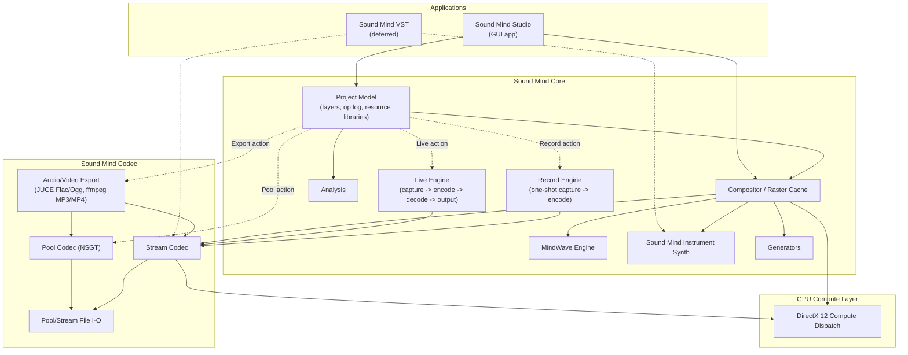
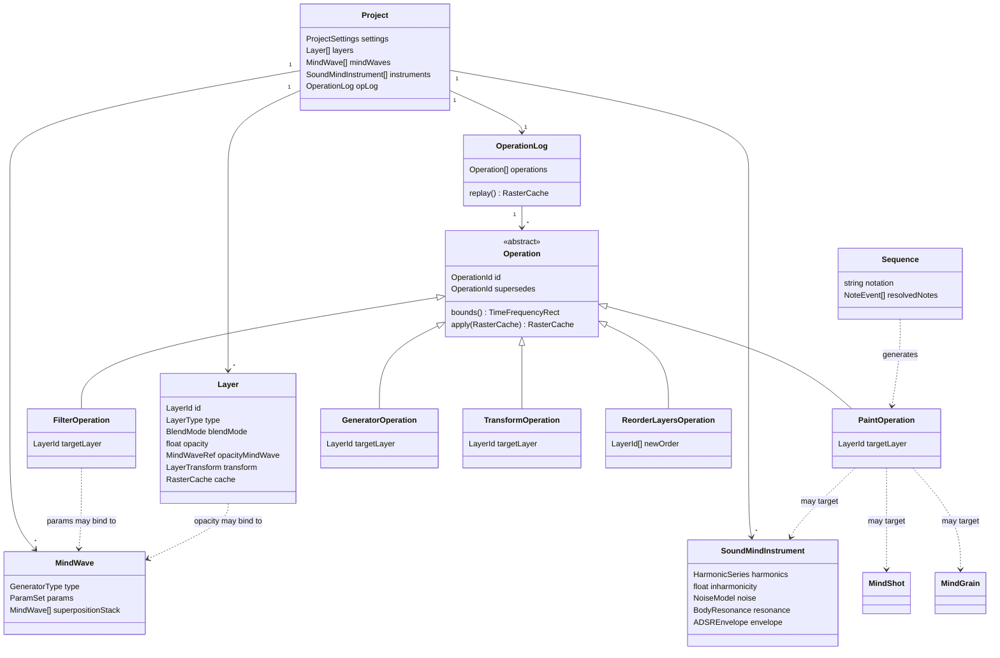
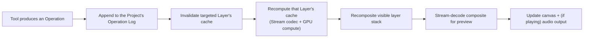

# Sound Mind - the Architecture Document

Status: **early draft — first pass.** This is the starting point for the software architecture activity that follows `sound-mind-design.md`: a sketch of the major modules, the core data model, and the threading model, plus the architectural decisions still open. It is not yet class diagrams — it's the layer beneath them, so those diagrams have a skeleton to hang on.

This document assumes familiarity with `sound-mind-design.md` (what the Studio does and why) and `tech-stack-decisions.md` (the technology choices). It does not repeat either; it only cites the decisions from both that constrain the architecture.

# Constraints Carried Over

From `CLAUDE.md` and `tech-stack-decisions.md`:

- C++20/23, built with JUCE for audio/DSP and DirectX 12 Compute for GPU work.
- Primary development on native Arm64 (Snapdragon X), with x64 validated via CI rather than assumed from cross-compilation alone.
- The real-time audio path must be allocation-free, lock-free where needed, and never touch anything GC'd or interpreted.

From `sound-mind-design.md`'s resolved decisions:

- A project is a project file plus a folder of media/sources/cached renders, single-user, with no versioned schema commitment yet.
- A project's real content is an operation log — closer to a scene graph referencing source data than a raster stack — with cached raster results persisted opportunistically, not authoritatively.
- Anything seeded (Generators, Chaos, noise MindWaves) must replay bit-for-bit on the same Studio version and architecture; only a perceptual match is required across architectures.
- Working latency targets: ~100 ms for graphical feedback, ~250 ms for audio feedback, from a Stream-mode edit.
- Sound Mind VST is deferred until the standalone Studio is operational — the architecture should not be shaped around it yet, only avoid closing the door on it (the Stream codec path already has to be real-time-safe on its own merits).

# System Overview

Two applications get built on top of two shared lower layers — the Studio now, Sound Mind VST later:



- **Sound Mind Codec** is the lowest layer and the one thing that must work standalone: Pool (NSGT, lossless, off-line) and Stream (fast, real-time-safe) transforms, plus the file formats each reads and writes. It has no knowledge of layers, MindWaves, or projects — it only converts between audio/image data and spectrogram data. **As of `v0.0.6.1`**, it also links JUCE (`juce_audio_formats`, for its real Flac/Ogg Vorbis writers) and ffmpeg (for MP3 and MP4 export - see *Decisions Made* below) - a real widening of Codec's dependency footprint beyond PocketFFT/libtiff, since JUCE was previously only a Core/Studio dependency (device I/O). Codec's *conceptual* role is unchanged (it still only converts between audio/image data and spectrogram/container data, with no knowledge of layers or projects); what changed is that "container data" now includes compressed audio and video containers, not just Pool/Stream's own formats.
- **Sound Mind Core** is everything about a *project* that isn't UI: the layer stack and operation log, the compositor that turns them into pixels, and the engines each operation type can call into (MindWaves, Sound Mind Instruments, Generators, Analysis). Core depends on Codec; Codec knows nothing about Core. **As of `v0.0.7.1`**, it also owns `LiveEngine` - Live Mode's continuous capture/encode/decode/output pipeline (see *Threading & Real-Time Model* and *Decisions Made* below) - built on Codec's Stream transforms, same as `PlaybackEngine`. **As of `v0.0.8.1`**, `RecordEngine` joins them: one-shot capture, deliberately simpler than `LiveEngine` (no incremental encoder, no output side, no background worker thread - see *Decisions Made*) since Record's result just needs to reach `sound_mind::codec::encode()` once, the same whole-buffer call any import already uses.
- **Sound Mind Studio** is the GUI application: interaction (tools, panels, canvas), consuming Core and, through it, Codec. It is a Qt application — JUCE is not used for its GUI. JUCE's role narrows to what `sound-mind-core` (and the real-time audio path specifically) needs from it: audio device I/O and DSP building blocks, driven programmatically rather than through any JUCE GUI component. Qt owns the application's event loop and windowing; JUCE's audio engine runs underneath it as a library, not a competing framework. This boundary needs to stay clean in practice — no JUCE GUI classes should appear above `sound-mind-core`, and no Qt classes should appear inside the real-time audio path.
- **GPU Compute** is a thin dispatch layer under Codec's Stream transforms and Core's compositor, isolating the DirectX 12 specifics so nothing above it has to know or care whether an operation actually ran on the GPU or fell back to the CPU.

# Core Data Model

This is conceptual — the entities the design doc implies, not a committed class design. It exists to give the eventual class diagrams a shared vocabulary.



A few things worth calling out about this sketch before it becomes real classes:

- **`Operation` belongs to the Project, not to a Layer.** The first version of this sketch had each `Layer` own its own slice of history, which cannot represent an operation like reordering the layer stack — that operation doesn't belong to any one layer, it changes the project's structure. The `OperationLog` is a single, project-wide, ordered sequence; layer-content operations (`PaintOperation`, `FilterOperation`, `GeneratorOperation`, `TransformOperation`) carry a `targetLayer` reference saying which layer's cache they affect, while structural operations like `ReorderLayersOperation` — and, by the same reasoning, adding/removing a layer or changing a layer's blend mode, opacity, or MindWave link — target the project's layer list itself rather than any one layer's raster content. Rebuilding a given layer's cache means replaying the project's log filtered to operations that target it, in log order, not replaying "that layer's log" as a separate thing.
- **`Operation` is the unit of history**, and every one of the design doc's tools (Paint, Filter, Generator, Transform, and by extension Import, Pool, Chord/Sequence stamping) is some kind of `Operation`. `Layer.cache` is a derived value, not state that operations mutate directly — an operation's `apply` conceptually produces the next cache from the previous one (or from scratch on replay), rather than editing pixels in place. Whether that's *literally* how it's implemented (versus an equivalent optimization) is an implementation choice, not an architectural one — the log stays the source of truth either way.
- **`MindWave` is self-referential** by design (superposition stack, and per the design doc's revamp, a generator's own parameters can themselves be `MindWave`-bound) — the data structure needs to support that recursion without becoming a special case.
- **`SoundMindInstrument`, `MindShot`, and `MindGrain` are peers**: anything a `PaintOperation` can target. A `Sequence` doesn't produce audio directly — it resolves to a list of `PaintOperation`s against one of these, which is what keeps a stamped chord or sequence non-destructively editable.
- **`Layer.cache` (sketched above as `RasterCache`) is concretely a `std::optional<codec::StreamImage>`, as of `v0.0.3.1`.** No new type was needed - per *Decisions Made*'s "raster cache persistence format" entry, a layer's cache already *is* a Stream file's in-memory representation, so `Layer::content()` just holds one directly rather than wrapping it in a separate `RasterCache` type. It's `std::optional` (absent until the layer is first imported into or painted on) and deliberately not part of `Layer`'s JSON serialization - `Project::save()`/`load()` read and write it as its own file under the project's `media/` folder instead, exactly as *File Formats & Portable Resources* describes. A first, single-layer, no-blending-yet `Compositor` (`sound_mind::core::renderLayer()`) now exists too, turning that cache into displayable pixels via `sound_mind::codec::toRgbImage()` - real multi-layer compositing (blend modes, opacity, MindWave-bound parameters) is still future work.
- **Pooling, as of `v0.0.5.1`, is a plain in-place mutation, not yet an `Operation`.** `Layer` gained a second, parallel cache - `poolContent()`, an `std::optional<codec::PoolImage>`, persisted the same way as `content()` but under the project's `pool/` folder - and `sound_mind::core::poolLayer()` replaces both a layer's Pool and Stream content directly (re-deriving the Stream copy from the pooled result, per the design doc's "resulting Pool file converted to a light-weight Stream copy"). This is deliberately simpler than the design doc's "hide-not-delete, recorded as an undoable operation" description: that needs the first concrete `Operation` subtype, which - per `OperationLog`'s own docs - doesn't exist until Basic Painting. Once it does, Pooling should be revisited to become a real, undoable `Operation` instead of a direct mutation.

# Composer Mode Fit

`sound-mind-design.md`'s Composer Mode — a DAW-style track view where each layer is a track and every paint operation renders as a labelled box — is a *view* over the model above, not a second data model. Checking it against that model surfaces two real gaps and confirms a third assumption:

- **Operations need a queryable extent, not just an `apply()`.** Composer Mode draws every operation on its layer's track as a box positioned and sized by that operation's time (and, implicitly, frequency) range. `apply()` doesn't expose that range, so `Operation` above now also carries a `bounds()` method every subtype implements, independent of what the operation actually does. This serves a second view too, not just Composer Mode: it's the same information the legacy Studio's "show op geometry" canvas overlay (dashed outlines per operation) needed, so it's one capability the model owes both views, not something invented just for the timeline.
- **Editing an existing operation (retime it, move it to another layer) needs to be a logged action, not a mutation.** Composer Mode explicitly wants to "re-order or retime" operations and "move them between layers." Given the append-only, replayable log this architecture already commits to, an in-place edit can't just change a past log entry — that would break replay determinism for anything computed after it. The resolution added above, consistent with how Pooling already works (hides the original, inserts the result "in its stead"): `Operation` now carries an optional `supersedes` reference to the operation it replaces. Editing appends a *new* operation pointing back at the old one; the old one becomes inactive (hidden, not deleted) rather than mutated. Replay honours only the non-superseded operation at each point in a layer's history.
- **Track backgrounds (Clean / Amplitude / Thumbnail) are derived views, not stored state.** All three are computable from a layer's existing `RasterCache` — a plain re-render, a per-column amplitude summary, or a squashed thumbnail — so none of them need a new persisted field. Which background a track is currently showing is Studio view-state, not project data.

Composer Mode needing the first two isn't a flaw specific to it — both would eventually surface from the plain canvas view too (any overlay or picking interaction needs *some* operation bounding box; re-editing a placed operation is implied by the legacy "Pick tool" idea even though the current design doc doesn't yet describe an equivalent). Both are folded into the Core Data Model above rather than treated as Composer-Mode-only additions.

# File Formats & Portable Resources

Four things need concrete on-disk shape: the project file itself, the two codec file formats it builds on (Pool, Stream), and the standalone resource files that let a MindWave, a Sound Mind Instrument, or a Mind Shot travel between projects. All of this is a first-cut sketch, consistent with the design doc's stance that a formal, versioned project schema is a near-beta concern — nothing here is meant to be locked in yet.

### Project File & Folder

A project is one JSON project file (`.smproj`, tentatively) plus a same-named folder holding everything binary:

```
MyPiece.smproj
MyPiece/
  sources/     — raw imported media, kept for re-encoding/provenance
  media/       — cached Stream-format layer renders, one per Layer
  pool/        — cached Pool-format renders, produced by Pooling
  mindshots/   — captured MindShot Stream-format files
```

The project file itself holds:

- **Project settings** — the codec defaults new layers inherit (sample rate, frequency scale and its parameters, timestep, canvas duration/dimensions), plus project-wide preferences (tuning reference, default tempo).
- **The layer list**, in composite order — each entry's id, name, type, blend mode, opacity, MindWave link, transform, and a reference to its cached render in `media/` (absent until the layer has been rendered at least once).
- **The operation log** — the single, project-wide, ordered sequence described above, each entry serialized with its own parameters, its `targetLayer` (or structural target), its seed where applicable, and its `supersedes` reference where it replaces an earlier one.
- **Resource libraries** — MindWave and Sound Mind Instrument definitions stored inline (they're small and purely parametric); Mind Shot entries stored as metadata plus a path into `mindshots/` (the spectrogram data itself is binary and doesn't belong in a JSON file); Mind Grain definitions stored inline too, since a Mind Grain is only ever a reference to a layer in the *same* project (see below) — there's no external asset for it to point to.
- **Sequences** — the notation string, inline, plus whatever resolved note events are cached from it.

A project is meant to be self-contained: once a resource is imported, it's copied in and becomes ordinary project data — nothing inside a project ever points at a file outside its own folder.

### Pool File Format

Carries forward the legacy Sound Mind TIFF's proven shape — `CODEC_DETAILS.md` and `SOUND_MIND_TIFF_SPEC.md` are the exact legacy bit-level spec this is informed by, not bound to:

- A TIFF container with four same-sized 16-bit grayscale pages — left amplitude, right amplitude, left phase, right phase — so any generic TIFF reader can still open it, even though only Sound Mind understands the pixel meaning.
- Height = the actual bin count of whichever frequency scale is configured (log by default; mel, octave-aligned, and variable-Q are the same kind of alternative the design doc's Frequency Scale concept already allows for); width = time columns at the project's timestep.
- Amplitude stored as dB mapped linearly onto the pixel range, with a perceptual (loudness-weighted) pre-emphasis applied before storage and removed on decode — cosmetic only, it makes visual brightness track perceived loudness without touching the reconstructed audio.
- Phase stored as its angle mapped linearly onto the pixel range.
- Fully self-describing: format version, sample rate, hop length, bin count, and frequency-scale parameters are embedded in the file itself, so nothing needed to decode it ever lives outside the file.
- Two storage layouts: a simple sequential one for short clips and instrument-sized assets, and a tiled one enabling random-access seeking for long compositions — both worth keeping, since they solve different, real problems.
- Long files split into sequential, independently-decodable snippets, normalized once against the whole file's peak (not per snippet) and given real neighbouring audio at each boundary rather than a synthetic reflection — both details exist specifically to avoid audible seams, and are worth keeping exactly.

What's explicitly *not* carried forward as-is: the legacy metadata key set and its backend-name strings (CUDA/OpenCL/PyTorch-specific) — the new codec's metadata schema and backend identifiers should be designed fresh for the new implementation and GPU stack (DirectX 12, not CUDA/OpenCL), even though the *principle* of "fall back to CPU gracefully when no compatible GPU is present" carries over directly. The exact bin-count formula and any variable-Q zone parameters also depend on whichever NSGT implementation is ultimately selected — final metadata fields wait on that.

**Implemented, as of `v0.0.5.1`:** the TIFF container (libtiff, LZW-compressed, one strip per page, standard 6.0 tags including `PageNumber`/`SubfileType`), a fresh `SoundMindPool:key=value` metadata block (not the legacy key set), and log-scale amplitude/phase quantization to 16-bit. **Deferred**, tracked in *Decisions Needed*: A-weighting (the legacy format's cosmetic pre-emphasis - amplitude is stored as plain dB for now) and the tiled storage layout / multi-snippet splitting (both about efficient partial decode for long compositions, which nothing yet needs - Playback pre-decodes a whole layer at once, and there's no scrubbing UI). See `sound-mind-codec/include/sound_mind/codec/pool_file.h` for the concrete metadata schema.

### Stream File Format

Built for speed, not archival fidelity — the opposite trade-off from Pool:

- Per the design doc's Pool vs Stream distinction, a Stream file carries left and right amplitude, but *not* independent left/right phase — it's the same three-channel model the design doc's Color Mapping concept already describes (two amplitude channels plus a third channel). **Settled in `v0.0.2.1`:** that third channel is an *approximate shared phase*, taken from the left/right mono downmix and reused for both channels on decode - not left empty or blended. This is what makes the current implementation's reconstruction effectively exact for mono-in-stereo content and only approximate for genuinely different left/right content, a deliberate trade for fitting the format's three-channel budget. See `sound-mind-codec/include/sound_mind/codec/stream_codec.h`'s `StreamImage` for the concrete shape.
- Self-describing the same way Pool files are, just a lighter payload — format version, sample rate, hop length, bin count, frequency range, frame count, and sample count, plus (not yet implemented) free-form provenance metadata (a display name, a creation timestamp) that a Mind Shot, in particular, will need.
- Used in three places: a persisted layer cache (see the raster-cache decision above), a captured Mind Shot, and general fast interchange — the same format serving all three rather than inventing a separate one per use. Only the third (general encode/decode) exists as of `v0.0.2.1`; the other two need the Project/Layer model and Mind Shot resource to exist first.
- **Settled in `v0.0.2.1`:** the container is a lightweight custom binary format, not TIFF-like (see *Decisions Made* above) - a fixed header followed by three raw `float[bin][frame]` planes, no compression, no generic-viewer compatibility, since Stream's entire reason to exist is encode/decode speed.

A Mind Shot, specifically, is *just* a Stream file with its provenance metadata filled in — no separate kernel/swatch/sidecar bundle the way the legacy version needed; the format's own metadata block is enough.

### Portable Resource Files

Three of the design doc's "shareable resources" get their own standalone file type; a fourth deliberately doesn't:

| Resource | Portable file | Contents |
|---|---|---|
| MindWave | `.smwave` (proposed) | Generator type, parameters (including any nested MindWave-bound sub-parameters), superposition stack, field-operator chain — the same JSON shape used inline in a project's resource library, just saved standalone. |
| Sound Mind Instrument | `.sminst` (proposed) | Harmonics, inharmonicity, noise model, body resonance, ADSR envelope — likewise, an extracted copy of the same inline shape. |
| Mind Shot | *(none needed)* | A Stream file, as above — already portable on its own. |
| Mind Grain | *(none — see below)* | — |

Importing any of the above means copying it into the target project and adding an entry to the relevant resource list (with a name-collision suffix, as the legacy version did) — never a live link back to the original file or project.

**Mind Grain is left off this list on purpose.** The design doc's own list of shareable resources — layers, Mind Shots, MindWaves, and Sound Mind Instruments — doesn't include Mind Grains, and that's consistent with what a Mind Grain actually is: a live reference to a selection on a layer *in the same project*, not a captured asset. Outside its own project, there's nothing for it to refer to. Since this round's task named Mind Grain definitions alongside the genuinely portable resources, this is flagged rather than quietly resolved either way: if Mind Grains are meant to be portable too, sharing one means deciding between converting it to a captured Mind Shot at export time (losing its live-reference behaviour) or bundling a copy of its source layer material alongside it — a real design choice, tracked in *Decisions Needed* rather than picked here.

# Threading & Real-Time Model

Four execution contexts, in increasing order of what they're allowed to do:

1. **Audio callback thread.** Stream codec decode and mixing only. No allocation, no unbounded locks, no operation-log traversal, no Pool codec. This is the one context CLAUDE.md's constraints are non-negotiable for. **Concrete instance, as of `v0.0.7.1`, redesigned in `v0.0.14.1`:** `sound_mind::core::LoopEngine::processBlock()` (Loop Mode's audio callback, renamed/reimplemented from `LiveEngine`) - copies captured input into a `juce::AbstractFifo`-backed ring buffer on the capture side; reads output sequentially from one of two pre-allocated, fixed-length playback buffers (no ring buffer on this side any more - see Decision #20), re-checking which one is active only once per loop it itself plays through. No allocation, no locking, no encode/decode logic on this thread at all, either way.
2. **GPU compute submission.** Dispatches Stream transforms and GPU-accelerated filters to DirectX 12 from a worker thread, not the audio thread; results cross back via a lock-free or double-buffered handoff, never a blocking wait on the audio thread. Still entirely unbuilt (`sound-mind-gpu` doesn't exist yet) - Loop Mode's encode/decode work (below) is CPU-only, same as Stream/Pool's own transforms.
3. **Background workers.** Pool encode/decode, Generators, Import encoding, Analysis passes, and anything else that can legitimately take the tens-to-hundreds of milliseconds (or, for Pool, much longer) these operations need. **Concrete instance, as of `v0.0.7.1`, redesigned in `v0.0.14.1`:** `LoopEngine`'s own worker thread (`juce::Thread`, polling every 5 ms) - drains the capture ring, and for every whole loop's worth now accumulated, whole-buffer `sound_mind::codec::encode()`/`decode()`'s it (not `StreamIncrementalEncoder::pushSamples()`/an incremental re-decode any more - there's no continuously-growing history to maintain once each loop is its own bounded buffer) and publishes the result into the playback side's currently-inactive buffer. See *Decisions Made* below for why this validates (for a CPU-computed source, not yet a GPU one) the *GPU / Audio-Thread Handoff* section's "lock-free ring buffer" option for the audio-thread-facing (capture) side.
4. **UI/main thread.** Owns operation-log mutation and triggers cache invalidation/recompute on the affected layer(s); never blocks waiting on the audio thread, only ever hands it fresh Stream-decoded audio to consume. **Concrete instance, as of `v0.0.7.1`, redesigned in `v0.0.14.1`:** `sound-mind-studio`'s `MainWindow` polls `LoopEngine::currentImage()` on a 33 ms (~30 fps) `QTimer` while Loop Mode is running, refreshing the captured layer's content, repainting the canvas, and showing `LoopEngine::loopsBehind()` in the status bar - the UI thread never touches the ring/playback buffers directly, only the already-synchronized snapshot.

The ~100 ms / ~250 ms targets in the design doc are budgets across UI thread → background/GPU work → audio thread, not a single context's budget — which is also why they're marked aspirational rather than committed: the actual split between CPU and GPU work, and between the Arm64 and x64 targets, isn't known yet.

# Compositing Pipeline (sketch)

A paint or filter action flows roughly:



Only the affected layer (and any Filter layer or MindWave-linked layer above it in the composite order) needs recomputing — this is the main lever for hitting the latency targets on a project with many layers, and probably the first thing worth profiling once a real pipeline exists.

# Determinism & Replay

The operation log is what makes Pooling, Generators, and Remaster-style rebuilds possible at all: replaying the operations that target a given layer, in log order, must reproduce its cache. Concretely:

- Every `Operation` that consumes randomness owns its own seed, stored in the log entry itself — not drawn from a shared/global RNG stream, which would make replay order-dependent.
- Bit-for-bit reproducibility is scoped to *(Studio version, target architecture)* — an op log is not a portable, version-independent artifact, and cross-architecture replay is only held to sounding the same, not being byte-identical. This means the log format should record enough version/architecture context to know when a strict bit-for-bit check even applies.
- The raster cache is purely an optimization: correctness only ever depends on log replay, never on trusting a stale cache. This has a concrete implication for testing — a cache-invalidation bug should be *detectable* by forcing a full replay and diffing against the cached result, which is a natural strategy for regression tests once there's code to test.

# Build & Module Layout (proposal)

A first cut at the top-level module split:

- `sound-mind-codec` — Pool/Stream transforms, file I/O, and (`v0.0.6.1`) audio/video export. No GUI, no project model. Usable standalone. Links JUCE (`juce_audio_formats` only, not JUCE's audio-device or GUI modules) and ffmpeg (`avcodec`/`avformat`/`swresample`/`swscale`, plus `libmp3lame` for MP3 encoding - see *Decisions Made*), the latter dynamically (SHARED) as a deliberate exception to every other dependency here being statically linked.
- `sound-mind-core` — project model, operation log, compositor, MindWave/Instrument/Generator/Analysis engines, and (`v0.0.4.1`/`v0.0.7.1`/`v0.0.8.1`) the real-time `PlaybackEngine`/`LiveEngine`/`RecordEngine` trio. Depends on `sound-mind-codec`.
- `sound-mind-gpu` — DirectX 12 compute wrapper, isolating the platform-specific API from both `sound-mind-codec` and `sound-mind-core`.
- `sound-mind-studio` — the Qt GUI application. Depends on `sound-mind-core`, and through it, indirectly on JUCE's audio engine — but never on JUCE's GUI module.
- `sound-mind-vst` — deferred; not started until the Studio is operational.
- A test target per module, following CLAUDE.md's test-first workflow once implementation begins.

CMake (per `tech-stack-decisions.md`'s "Professional CMake" reference) with vcpkg for dependencies, targeting native Arm64 locally and validating x64 via CI, matches this module split without needing anything unusual.

# Decisions Made

1. **GUI framework: Qt.** Settled in `tech-stack-decisions.md`. See the Studio's description in *System Overview* and *Build & Module Layout* above for how Qt (GUI) and JUCE (audio engine only) coexist.
2. **Operation log serialization: JSON**, for development ergonomics — human-readable, diffable, and trivial to hand-edit or inspect while the schema is still moving. If it turns out too big or too slow to parse once real projects exist, this is meant to be revisited, not defended; nothing else in the architecture depends on it being JSON specifically, only on the operation log being *some* serializable, replayable sequence.
3. **Raster cache persistence format: a Stream-format file.** Rather than invent a new on-disk format for a persisted layer cache, it's just an ordinary Stream-format file — after all, a layer's cache *is* exactly what a Stream file already represents. This also opens doors beyond simplicity: a cached layer becomes trivially exportable, importable into another project, or usable anywhere else a Stream file is accepted, without a special case.
4. **Testing strategy for real-time/GPU code: behavioral tests plus performance tests.** Behavioral tests check the GPU path and the CPU fallback path produce equivalent (or tolerantly-close) results; a separate set of performance tests specifically checks that the GPU path is actually *faster* than the CPU fallback on real hardware — a GPU path that's merely correct but not faster has failed the reason it exists, and that failure mode needs its own test, not just a correctness one.
5. **FFT backend: PocketFFT.** Settled during the Stream codec milestone (`v0.0.2.1`) — header-only C++, BSD-3-Clause, vcpkg-packaged, no build/link step. Sidesteps the FFTW3 GPL question entirely (see *NSGT Library Candidates* below), and is the backend both the Stream transform and, later, Pool's NSGT work build on. `KissFFT` (also vcpkg-packaged, also BSD-3-Clause) was the other real candidate — passed over only because it needs actual linking and has a narrower feature set, not for any license or portability reason.
6. **Stream file container: a lightweight custom binary format, not TIFF-like.** Settled alongside the FFT backend, for the same milestone. A small fixed header (format version, sample rate, hop length, bin count, frequency range, frame count, sample count) followed by three raw `float[bin][frame]` planes — no compression, no generic-viewer compatibility, because Stream's entire reason to exist is encode/decode speed, and TIFF's structure (and Pool's reason for choosing it) works against exactly that. See *Stream File Format* above and `sound-mind-codec/include/sound_mind/codec/stream_file.h` for the concrete layout.
7. **JUCE tier, for now: the free Starter license.** Settled during the Playback milestone (`v0.0.4.1`), when JUCE first needed linking in for real (device I/O). JUCE 8's Starter tier is free for up to $20,000 gross annual revenue across all uses of JUCE code ([juce.com/legal/juce-8-licence](https://juce.com/legal/juce-8-licence/), confirmed via [forum.juce.com](https://forum.juce.com/t/revenue-limits-for-juce-tiers/61058)) and doesn't require open-sourcing Sound Mind Studio — public releases (`release.yml`) continue as normal under it. This doesn't fully resolve *Sound Mind Studio's own distribution license* below, since Starter is explicitly a starting point, not a permanent commitment: the plan is to reassess once/if revenue exceeds that threshold, choosing then between upgrading to a paid Indie/Pro JUCE tier (staying closed-source) or going open-source under an AGPLv3-compatible license (matching JUCE's own free-tier terms). Tracked here rather than only in *Decisions Needed*, since the immediate, actionable choice - which tier to build against today - is settled; what happens after the revenue threshold is what's still open.
8. **NSGT: implemented from scratch, not ported from `libnsgt`.** Settled during the Pool codec milestone (`v0.0.5.1`). Checked `libnsgt`'s actual source directly first (per this doc's own instruction to validate before committing): ~710 lines, moderately tight FFTW coupling across a handful of call sites - realistic to port *in principle*, but only a summarized view of it was obtainable through available tooling, not the literal source needed for a faithful line-by-line port; re-deriving its logic from summaries would have been a worse correctness bet than implementing the well-documented technique directly. The implementation uses the standard frequency-domain-windowing approach (one global FFT per channel; each log-spaced bin's own native-rate coefficient sequence comes from a Hann-windowed spectral slice, inverse-FFT'd directly - the standard DFT filter-bank identity, needing no separate demodulation step) referenced against `grrrr/nsgt`'s documented behavior and `docs/legacy/CODEC_DETAILS.md`'s operational description of it, validated empirically via round-trip fidelity tests rather than a bit-exact comparison against either reference. Result: 0.999984 correlation on the first working implementation, for both mono and genuinely-stereo content (the latter being exactly where Stream's shared-phase approximation can't compete - see `sound-mind-codec/include/sound_mind/codec/pool_codec.h`). Confirms the "from-scratch, referenced against `grrrr/nsgt`" path this doc always named as the alternative was the right call, not just the fallback.
9. **Pool file TIFF library: libtiff.** Also settled in `v0.0.5.1` - the standard, complete reference TIFF library (permissive "libtiff" license, native LZW compression, full multi-page support), over `tinytiff` (LGPL-3.0, a real copyleft consideration for static linking, and unconfirmed multi-page/LZW completeness).
10. **Compressed audio export: JUCE for Flac/Ogg, ffmpeg for MP3.** Settled during the Export milestone (`v0.0.6.1`). Confirmed by reading JUCE's actual `juce_audio_formats` source directly (not assumed): `FlacAudioFormat` and `OggVorbisAudioFormat` ship real, working encoders, but `MP3AudioFormat::createWriterFor()` is an explicit unimplemented stub (`jassertfalse; // not yet implemented!`, returns `nullptr`) - JUCE can only *read* MP3 (via Windows Media Foundation), never write it. ffmpeg (already a dependency for video export, below) covers the gap via its `libmp3lame`-backed MP3 encoder rather than pulling in a second, MP3-only library.
11. **Video export: ffmpeg (MP4 muxing, MPEG-4 Part 2 video, AAC audio), linked dynamically.** Also settled in `v0.0.6.1`. ffmpeg is the only practical MP4-muxing option available via vcpkg (checked; no lighter alternative exists in the vcpkg registry) and is used for MP3 encoding too once it's a required dependency regardless. Video codec: MPEG-4 Part 2 ("mpeg4" in ffmpeg), not H.264 - H.264 needs the GPL-licensed `libx264`, which would obligate the whole distributed Sound Mind binary under GPL terms (the same reasoning as FFTW3's license note above), conflicting with the closed-source posture already committed to via the JUCE Starter tier; MJPEG was the other LGPL-safe option, passed over for producing much larger files on detailed spectrogram content than a real inter-frame codec. Audio codec: AAC, ffmpeg's own native encoder. Linking: ffmpeg's default build is LGPL, and LGPL compliance for a closed-source distribution requires dynamic linking (or a relink mechanism) - the one deliberate exception to every other dependency here being statically linked. `libmp3lame` (LGPL-2.0-only, same compatible license family) rides along as an ffmpeg feature for the MP3 path above, rather than being linked separately.
12. **Live Mode's real-time handoff: `juce::AbstractFifo`-backed lock-free ring buffers, one each way.** Settled in `v0.0.7.1` - the first real (if CPU-, not GPU-, computed) instance of the *GPU / Audio-Thread Handoff* section's "lock-free SPSC ring buffer" option, confirmed to work as expected: the audio callback (`LiveEngine::processBlock()`) only ever copies fixed-size blocks into/out of two rings (capture and playback), while a background `juce::Thread` does all the allocating work (`StreamIncrementalEncoder::pushSamples()`, then a full `decode()` of the accumulated image each pass). Two things scoped deliberately narrow for this first pass, both explicitly confirmed before implementing: **(a)** the output is the live input alone, round-tripped through the Stream codec - not composited with any other layer or project content, since real multi-layer audio mixing doesn't exist anywhere yet (not even for Playback); **(b)** decoding is *not* incremental - the worker re-decodes the entire accumulated history every pass and publishes only the newly-*stable* prefix (samples no longer subject to change as more frames arrive - see `LiveEngine`'s own docs for the exact boundary), a real, accepted cost-grows-with-session-length limitation, not a correctness issue for the durations this milestone's demo needs. `StreamIncrementalEncoder` (the growing/live counterpart to `encode()`) is a genuinely new Stream codec capability, sharing its per-frame STFT primitives with `encode()` via a private `stream_frame_codec.h` header rather than duplicating them.
13. **Record's capture drain: a UI-thread timer, no background thread.** Settled in `v0.0.8.1`. Unlike `LiveEngine`, `RecordEngine` has no per-block encoding or output-decoding work to do while capturing - draining its ring buffer just moves raw samples into a growing buffer, cheap enough to do straight from a UI-thread `QTimer` tick (100 ms, a comfortable margin under the ring's ~370 ms capacity at default settings) rather than needing `LiveEngine`'s dedicated `juce::Thread`. The captured audio is only ever encoded once, at `stop()`, via the same whole-buffer `sound_mind::codec::encode()` any import already uses - per `docs/sound-mind-design.md`'s Record section, "encoded into the layer exactly as any other imported audio would be" - not `StreamIncrementalEncoder`'s slightly different (never-zero-padded) framing.
14. **Playback, Live Mode, and Recording are mutually exclusive.** Also settled in `v0.0.8.1`, extending `v0.0.7.1`'s Playback/Live exclusivity to all three: each owns an independent `juce::AudioDeviceManager`, so any two running at once risk device contention with no guaranteed cross-platform behavior. Starting Live Mode or Recording stops Playback outright (a stale, no-longer-current playback position is harmless to lose); Live Mode and Recording instead *refuse* to start against each other (surprise-stopping an in-progress capture felt like the more harmful failure mode of the two). Real DAWs commonly allow simultaneous playback-while-recording (monitoring a backing track while capturing a new take) - deliberately out of scope for this first pass, tracked as follow-up work once it's worth the added device-sharing complexity.
15. **Recent-projects storage: an ini-format `QSettings`, under a fresh "SoundMind"/"SoundMindStudio" identity.** Settled in `v0.0.9.1` (Landing Page). Ini format (`QSettings::IniFormat`), not the platform-native registry format, specifically so `QStandardPaths::setTestModeEnabled(true)` (a builtin Qt test-isolation mechanism) can sandbox it during the automated test suite - the native Windows registry backend isn't affected by that call, so `RecentProjects`/`MainWindow`'s tests would otherwise read and write the same registry key a real installed Studio uses. A fresh organization/application identity, rather than reusing the legacy Python Studio's own `QSettings` scope, since the two have incompatible project file formats - nothing in the legacy list would resolve to anything openable here anyway.
16. **Visual identity: one fixed app-wide QSS string, plus a matching Doxygen `HTML_EXTRA_STYLESHEET` - not yet a light/dark toggle.** Settled in `v0.0.10.1` (Visual Identity). `sound_mind::studio::theme.h`'s `studioStyleSheet()`/`studioWindowIcon()` carry the legacy documentation's brand palette (`#DD4B00` to `#FEC100`, dark ground) into the Studio itself and, via `docs/doxygen/sound-mind-theme.css`, into the generated code documentation too - both deliberately dark-first and fixed, per this milestone's own scope, not the light/dark mode `docs/sound-mind-design.md`'s Export section already names as a future Studio-wide setting; building that toggle is separate, not-yet-scheduled work this fixed theme will need revisiting for once it exists. **A real, non-obvious gotcha hit and fixed here:** the embedded logo PNG (`assets/app.qrc`, read by both `theme.cpp` and `landing_page.cpp`) silently resolved to a null `QPixmap`/`QIcon` at runtime despite building and linking without error - `rcc`'s generated resource-registration object file, compiled into `sound-mind-studio-lib` (a static library), was being dropped by the linker because nothing in either final executable (`sound-mind-studio`/`sound-mind-studio-tests`) directly referenced it, a well-documented but easy-to-miss Qt static-library behavior. Fixed with an explicit `Q_INIT_RESOURCE(app)` call in both `main()` entry points, per Qt's own recommended pattern for this exact situation.
17. **Unsaved-changes tracking: a plain flag, not an operation-log diff - and a separate, non-modal refusal for Live Mode/Recording, not folded into the same prompt.** Settled in `v0.0.11.1` (Project Lifecycle). `MainWindow::hasUnsavedChanges_` is set directly at each of today's content-mutating call sites (import, Pool, Live Mode starting, Recording adding a layer) and cleared by a successful save or by `setProject()` - the operation log doesn't log any of these as real `Operation`s yet (that's Phase 3's job), so there's nothing to diff against yet; revisit once it does; a flag that could go stale relative to the log's own replay would be a worse bug than the flag itself. Kept deliberately separate from Live Mode/Recording's own guard: an active hardware capture isn't "unsaved changes" in the same sense a modified layer is (there's no meaningful "Discard" for a capture in progress the way there is for an edited layer) and this codebase already treats an in-progress capture as needing to *refuse*, not prompt-then-possibly-discard (`docs/sound-mind-architecture.md`'s own Decisions Made #14, Live Mode/Recording's mutual exclusion) - `newProject()`/`openProject()`/`openProjectAt()`/`closeEvent()` all check it first, before ever reaching the unsaved-changes prompt, consistently with that existing precedent rather than inventing a new interaction pattern for the same underlying concern.
18. **`ProjectSettings` now actually drives `StreamCodecConfig` - at the direct encode call sites, deliberately not yet through `LiveEngine`'s own construction-time config.** Settled in `v0.0.12.1` (Create Project Wizard), confirmed before starting - see that milestone's own roadmap entry for the two scope options weighed. A real, pre-existing gap surfaced while scoping the wizard: `ProjectSettings` and `sound_mind::codec::StreamCodecConfig` were completely disconnected structs - `importAudioFile()`, `importImageFile()`, and Recording's post-capture `encode()` all silently used `StreamCodecConfig{}` (a hardcoded default), regardless of what the open project's settings said. `sound_mind::core::streamCodecConfigFor(const ProjectSettings&)` (`project_settings.h`) is the bridge - deliberately living in Core, not Codec, since `StreamCodecConfig`'s own docs are explicit that Codec must stay independent of Core's project model. `hopLength` is derived from `timestepMs` at `sampleRateHz` (rounded to the nearest sample); `sampleRateHz`/`binCount`/`minFrequencyHz`/`maxFrequencyHz` carry over unchanged - though `encode()` itself always overrides `config.sampleRateHz` with the actual `AudioBuffer`'s own tagged rate (an existing, unrelated behavior, not something this milestone changed), so a project's chosen sample rate's real effect is on the `hopLength` computation, not a hard constraint on encoded content. **`LiveEngine`'s own capture/encode config is deliberately excluded from this wiring**: it's constructed once, as a `MainWindow` member, before any project exists, and has no way to be reconfigured after construction without a real lifecycle change (`config_` is set only in its constructor) - not worth building given Loop Mode's own reimplementation (`v0.Y.14.1` in the roadmap's `.5`-phase numbering, immediately next) is already expected to rework `LiveEngine`'s construction/lifecycle anyway. `poolLayer()` and `decode()` needed no changes - both already derive everything from a layer's existing, self-describing Stream content.
19. **Layer reordering/removal: dedicated `Project` methods, not direct mutation of the vector `layers()` already exposes.** Settled in `v0.0.13.1` (Layers Panel). `Project::layers()`'s own docs already drew this line ("mutable access, for in-place changes... that don't change the stack's membership or order") before this milestone needed to actually respect it - `removeLayer(LayerId)` and `reorderLayers(const std::vector<LayerId>&)` are the two new methods, `sound-mind-studio`'s `LayersPanel`/`MainWindow` never touch `layers()`'s ordering/membership directly. `reorderLayers()` validates its input is a genuine permutation of the current layers' ids (right size, no unknown id, no duplicate) before applying anything, rejecting (no-op, `false`) otherwise - a real bug caught while writing its own tests: an earlier version detected a missing id but not a *duplicated* one, which would have silently dropped a real layer (the duplicate standing in for whatever id it crowded out) instead of being rejected.
20. **Loop Mode: a fixed-length double-buffer swap, whole-buffer encode/decode per loop, and `MainWindow::loopEngine_` becomes a `std::unique_ptr` reconstructed per project.** Settled in `v0.0.14.1` (Loop Mode, renamed from Live Mode), resolving Decision #18's deferred construction-time-config gap. `LiveEngine` is renamed/reimplemented as `sound_mind::core::LoopEngine`: the capture side is unchanged (still a `juce::AbstractFifo`-backed ring, per Decision #12), but there's no continuously-growing history to re-decode any more - each `loopLengthSamples` worth of raw capture is sliced off, whole-buffer `encode()`/`decode()`'d (the same codec entry points Recording's own capture already uses, per Decision #13 - not `StreamIncrementalEncoder`), and published into one of two pre-allocated, fixed-length playback buffers; the audio thread only re-checks which buffer is "active" once per loop *it itself* plays through, never mid-loop, to avoid an audible splice. **A real, structural latency this design implies, confirmed acceptable rather than engineered away**: a loop's audio can't begin encoding until its own capture finishes, and the once-per-cycle re-check means the earliest a captured loop is actually heard is playback loop `N + 2`, not `N + 1`, even with the worker keeping up perfectly - see `LoopEngine`'s own docs for the full derivation. `loopsCaptured()`/`loopsBehind()` track something additive on top of that fixed baseline (whether the worker has *also* fallen further behind), surfaced in `MainWindow`'s status bar as the confirmed scope's "visible loop-delay indicator." `loopEngine_` itself is now a `std::unique_ptr<LoopEngine>`, `nullptr` until `setProject()` first runs, then (re)constructed there from the current project's `streamCodecConfigFor()` config and its duration in samples (`canvasWidth * hopLength`) - resolving Decision #18's note that reconfiguring the old fixed member "isn't worth building... given Loop Mode's own reimplementation is already expected to rework `LiveEngine`'s construction/lifecycle anyway." The new "Keep Looping" checkbox (`LoopEngine::setKeepLooping()`) works by simply not pushing newly-captured input into the ring at all while enabled, so the already-active playback buffer just keeps replaying, untouched, rather than needing any special-cased worker logic.
21. **Transport controls move fully into their own dock panels; device selection is `AudioDeviceSetup`-based and session-only.** Settled in `v0.0.15.1` (Transport Panels), two scope questions confirmed before implementing - see that milestone's own roadmap entry for the options weighed. `PlaybackPanel`/`RecordPanel`/`LoopPanel` (three new `QDockWidget`s) now own Play/Pause/Stop/Record/Loop's actual transport buttons, not just the newly-added device pickers/volume/Keep Looping - the transport toolbar's three actions for these are pure `QDockWidget::toggleViewAction()` show/hide toggles. Device selection uses JUCE's `AudioDeviceManager::AudioDeviceSetup` (`inputDeviceName`/`outputDeviceName`, empty string meaning system default) passed to `initialise()`'s `preferredSetupOptions` parameter - chosen over the single-string `preferredDefaultDeviceName` parameter specifically because `LoopEngine` needs independent input *and* output device choices, which only the `AudioDeviceSetup` struct actually supports. `PlaybackEngine`'s device switches immediately (`setAudioDeviceSetup()`, since its device is opened once, at construction, and stays open for its whole lifetime - see Decision-adjacent note in `playback_engine.h`); `LoopEngine`/`RecordEngine`'s device preferences only take effect on their own *next* `start()`, since both only ever open a device inside `start()` to begin with. Not persisted across app restarts - confirmed as this pass's scope, deferred to a later milestone if it turns out to matter; `QSettings` (the same store `RecentProjects` already uses) is the obvious mechanism whenever it does.

# NSGT Library Candidates

The Pool codec's Non-Static Gabor Transform doesn't need to be written from scratch — two existing implementations are worth evaluating before deciding to adapt one, bind to one, or reimplement against one as a reference:

| | [grrrr/nsgt](https://github.com/grrrr/nsgt) | [mrgreywater/libnsgt](https://github.com/mrgreywater/libnsgt) |
|---|---|---|
| Language | Python | C |
| License | Artistic License 2.0 | MIT (but its FFT dependency, FFTW3, is GPLv2/commercial dual-licensed) |
| Transform | Forward + inverse NSGT; variable-Q is inherent to the algorithm | Forward + backward "Inversible Constant Q Transform"; supports both whole-signal and streamed ("sliCQ") operation |
| Dependencies | NumPy (required); PyFFTW3, pysndfile (optional) | FFTW3, libsndfile (examples only) |
| Build | Python package | CMake, plus a VS2015 solution |
| Maintenance | Commits span 2011–2022; mature but not actively maintained | Very few commits; minimal activity |
| Relationship | The library the **legacy Python product actually uses** for its Pool codec | An independent C port of the same algorithm, referencing the same University of Vienna (NUHAG) academic source |
| Performance notes | Accelerated by PyFFTW3 when available; no real-time claims | ~393 ms one-time init for a full transform, ~132 ms for streaming init; ~5–6 ms per chunk once running; reconstruction error ≈ −152 dB (very high fidelity) |

Neither is a drop-in answer yet:

- **`libnsgt` is the more direct structural fit** (C, CMake, already has a streaming mode, and its per-chunk timing is compatible with the Stream-mode latency targets) but its **FFTW3 dependency is GPLv2-or-later, commercially licensed otherwise**. Linking against the free GPL build would obligate the *entire* distributed Sound Mind binary — not just the codec — to ship under a GPL-compatible license (see the licensing discussion below); a commercial FFTW3 license avoids that but costs money. **The recommended path is neither**: swap `libnsgt`'s FFT backend for a permissively-licensed FFT (PocketFFT, KissFFT, or muFFT are all BSD/MIT-style), reusing its NSGT logic and streaming-mode structure without inheriting its dependency's license. This sidesteps the GPL question entirely, regardless of what Sound Mind's own license ends up being.
- **`grrrr/nsgt` is the algorithmic reference** the legacy product's Pool format was actually built against — useful as a correctness oracle (compare a new C++ implementation's output against it) even if no code from it is reused directly, given it's Python and not something to embed in a real-time-adjacent C++ codec.
- Neither has been checked yet for building cleanly on Arm64 (the primary dev platform) — that's a prerequisite for either becoming more than a reference.

**Update, `v0.0.2.1`:** the FFT backend half of this decision is settled - PocketFFT (see *Decisions Made* above). What's still open is the `libnsgt`-specific half: whether its NSGT/streaming logic actually ports cleanly onto PocketFFT and builds on Arm64, which the Stream codec milestone deliberately didn't need to answer (Stream mode uses a plain STFT, not NSGT - see `docs/sound-mind-roadmap.md`'s sequencing principle #2). That validation is Pool's job, in `v0.Y.6.1`.

#### A note on FFTW3's license

FFTW3 is dual-licensed: free under GPLv2-or-later, or available as a paid commercial license. GPL's copyleft isn't scoped to just the library you link — under its terms, *the whole distributed work* that includes GPL-licensed code must itself be distributed under a GPL-compatible license, source included. Concretely, using the free FFTW3 build would mean the entire shipped Sound Mind Studio (and any Sound Mind VST plugin later) would need to be GPL-compatible too, not just `sound-mind-codec` in isolation — and since FFTW3 is "GPLv2-or-later," it can be used under GPLv3 terms specifically, which is compatible with JUCE's free AGPLv3 tier, but not with GPLv2 alone.

This only becomes an actual constraint once Sound Mind's own distribution license is decided — a question that isn't settled anywhere in the docs yet and matters beyond just this one dependency (every other third-party library's license, and the JUCE tier, hinge on it too). It's tracked in *Decisions Needed* below, but isn't blocking: using a permissively-licensed FFT library instead of FFTW3 keeps every option open regardless of how that question is eventually answered.

# GPU / Audio-Thread Handoff: Options

The compositor and Stream codec dispatch work to DirectX 12 compute from a worker thread (see *Threading & Real-Time Model*); the result then has to reach two different consumers with two different tolerances — the **audio callback thread** (must not glitch; a stale-by-one-frame result is fine, a torn or half-written one is not) and the **UI thread** (wants the freshest available frame for the canvas, but dropping an intermediate one is harmless). That difference matters more than any single mechanism below — the two consumers likely don't need the same answer.

| Mechanism | How it works | Benefits | Drawbacks |
|---|---|---|---|
| **DX12 fence** | The GPU signals a fence value on completion; a (non-audio) thread waits on it before touching the result. | The standard, correct way to know GPU work is actually done; avoids reading a partially-written result. | Solves *when data is ready*, not *how it reaches another thread* — needed underneath one of the other mechanisms, not a replacement for one. |
| **Double/triple buffering** | A fixed small number of result buffers; the writer fills the next one and an atomic index/pointer swap publishes it; readers always read the current published buffer. | Simple; wait-free for readers; bounded memory; matches the "latest frame wins" tolerance of the UI thread well. | Introduces roughly one buffer's worth of latency by construction; needs the swap itself to be atomic to avoid a reader seeing a half-updated buffer. |
| **Lock-free SPSC ring buffer** | A fixed-capacity ring buffer with one writer and one reader, synchronized with atomics only — the standard real-time-audio pattern (JUCE itself ships a ready-made version of this). | Battle-tested for exactly this kind of real-time handoff; bounded latency; no allocation or locking on the audio thread. | Single-producer/single-consumer only — the UI thread and audio thread both wanting the data means either two separate rings or a different structure; still needs overrun/underrun handling. |
| **Immutable snapshot + lock-free handle queue** | Each completed result becomes an immutable, reference-counted object; a lock-free queue carries handles to it rather than raw samples/pixels. | Works cleanly for multiple, differently-paced consumers (UI and audio) off one producer; avoids coupling producer and consumer buffer sizes. | Needs a real-time-safe reclamation scheme (an audio thread can't just `delete`/free) — more moving parts than a plain ring or double buffer. |

A plausible direction, not yet a decision: a DX12 fence to know a result is ready, feeding a **lock-free ring buffer** on the audio-thread-facing path specifically (where dropouts are unacceptable and bounded latency is well understood), and a much simpler **double-buffered "latest result" pointer** on the UI-thread-facing path (where a stale-by-one-frame canvas is imperceptible and a full ring is unnecessary machinery). This isn't committed — it needs a real Stream pipeline to prototype against before it's more than a reasonable guess.

**Partial validation, `v0.0.7.1`:** Live Mode needed exactly this audio-thread-facing handoff for a real (if CPU-, not GPU-, computed) continuous source, and confirmed the **lock-free ring buffer** choice works as expected in practice - see `LiveEngine`'s docs and *Decisions Made* below. This validates the audio-thread-facing half of the plausible direction above for a CPU producer; the GPU-specific half (a DX12 fence feeding the same kind of ring) is still unbuilt and unprototyped, since `sound-mind-gpu` doesn't exist yet.

# Decisions Needed

What's left unresolved after the above:

1. **GPU/audio-thread handoff mechanism.** Prototype against the options above now that real (CPU-only) Stream *and* Pool pipelines exist to measure against — the two-consumer split (ring buffer for audio, double buffer for UI) is a reasonable starting hypothesis, not a final answer.
2. **Sound Mind Studio's own long-term distribution license.** Per *Decisions Made* above, JUCE's free Starter tier settles this in practice up to $20,000 gross annual revenue - what happens after that threshold (upgrade to a paid JUCE tier and stay closed-source, or go open-source under an AGPLv3-compatible license) is the part still genuinely open, and gates every other third-party dependency's license once it's decided.
3. **Mind Grain portability.** Confirm whether Mind Grains are meant to be a portable/shareable resource like Mind Shots, MindWaves, and Sound Mind Instruments, or are correctly scoped to their own project only, as the design doc's current wording implies. If portable, decide whether sharing one converts it to a captured Mind Shot (losing its live-reference behaviour) or bundles a copy of its source layer material alongside it.
4. **A-weighting for Pool file amplitude storage.** The legacy TIFF format applies a cosmetic (decode-reversible) A-weighting curve before quantizing amplitude to 16-bit, for perceptually-truer visual brightness; the current Pool file implementation stores plain (non-A-weighted) dB instead, deferred as out of scope for `v0.0.5.1`'s "confirm a lossless round trip" demo. Worth adding once the Pool file is actually being *viewed* by something (Import & Display's Color Mapping work extended to Pool, or a dedicated Pool viewer).
