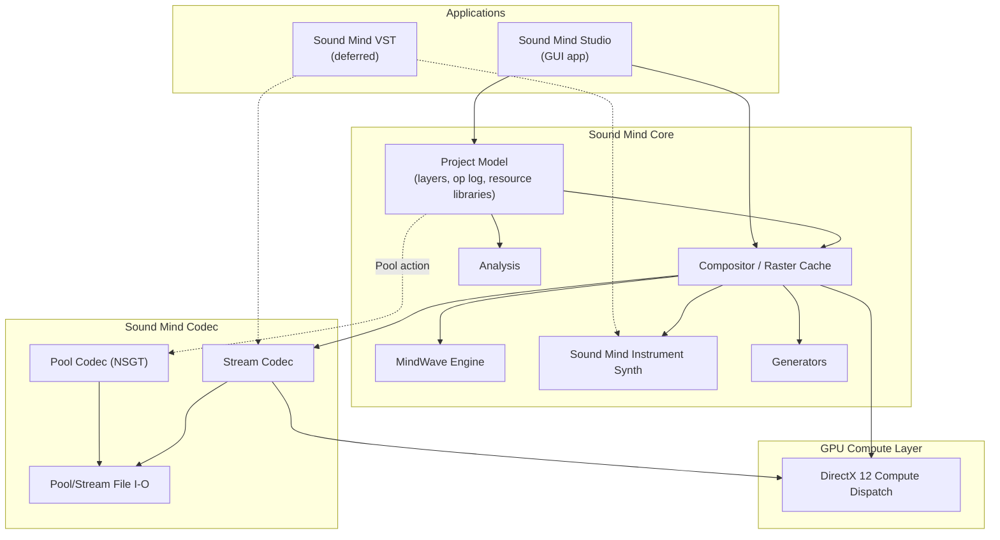
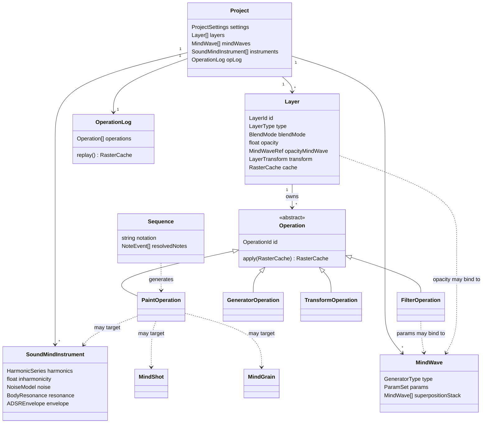
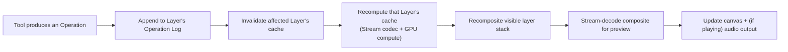

# Sound Mind - the Architecture Document

Status: **early draft — first pass.** This is the starting point for the software architecture activity that follows `sound-mind-design.md`: a sketch of the major modules, the core data model, and the threading model, plus the architectural decisions still open. It is not yet class diagrams — it's the layer beneath them, so those diagrams have a skeleton to hang on.

This document assumes familiarity with `sound-mind-design.md` (what the Studio does and why) and `tech-stack-decisions.md` (the technology choices). It does not repeat either; it only cites the decisions from both that constrain the architecture.

# Constraints Carried Over

From `CLAUDE.md` and `tech-stack-decisions.md`:

- C++20/23, built with JUCE for audio/DSP and DirectX 12 Compute for GPU work.
- Primary development on native Arm64 (Snapdragon X), with x64 validated via CI rather than assumed from cross-compilation alone.
- The real-time audio path must be allocation-free, lock-free where needed, and never touch anything GC'd or interpreted.

From `sound-mind-design.md`'s resolved decisions:

- A project is a project file plus a folder of media/sources/cached renders, single-user, with no versioned schema commitment yet.
- A project's real content is an operation log — closer to a scene graph referencing source data than a raster stack — with cached raster results persisted opportunistically, not authoritatively.
- Anything seeded (Generators, Chaos, noise MindWaves) must replay bit-for-bit on the same Studio version and architecture; only a perceptual match is required across architectures.
- Working latency targets: ~100 ms for graphical feedback, ~250 ms for audio feedback, from a Stream-mode edit.
- Sound Mind VST is deferred until the standalone Studio is operational — the architecture should not be shaped around it yet, only avoid closing the door on it (the Stream codec path already has to be real-time-safe on its own merits).

# System Overview

Two applications get built on top of two shared lower layers — the Studio now, Sound Mind VST later:

- **Sound Mind Codec** is the lowest layer and the one thing that must work standalone: Pool (NSGT, lossless, off-line) and Stream (fast, real-time-safe) transforms, plus the file formats each reads and writes. It has no knowledge of layers, MindWaves, or projects — it only converts between audio/image data and spectrogram data.
- **Sound Mind Core** is everything about a *project* that isn't UI: the layer stack and operation log, the compositor that turns them into pixels, and the engines each operation type can call into (MindWaves, Sound Mind Instruments, Generators, Analysis). Core depends on Codec; Codec knows nothing about Core.
- **Sound Mind Studio** is the GUI application: interaction (tools, panels, canvas), consuming Core and, through it, Codec. It is a Qt application — JUCE is not used for its GUI. JUCE's role narrows to what `sound-mind-core` (and the real-time audio path specifically) needs from it: audio device I/O and DSP building blocks, driven programmatically rather than through any JUCE GUI component. Qt owns the application's event loop and windowing; JUCE's audio engine runs underneath it as a library, not a competing framework. This boundary needs to stay clean in practice — no JUCE GUI classes should appear above `sound-mind-core`, and no Qt classes should appear inside the real-time audio path.
- **GPU Compute** is a thin dispatch layer under Codec's Stream transforms and Core's compositor, isolating the DirectX 12 specifics so nothing above it has to know or care whether an operation actually ran on the GPU or fell back to the CPU.

# Core Data Model

This is conceptual — the entities the design doc implies, not a committed class design. It exists to give the eventual class diagrams a shared vocabulary.

A few things worth calling out about this sketch before it becomes real classes:

- **`Operation` is the unit of history**, and every one of the design doc's tools (Paint, Filter, Generator, Transform, and by extension Import, Pool, Chord/Sequence stamping) is some kind of `Operation`. `Layer.cache` is a derived value, not state that operations mutate directly — an operation's `apply` conceptually produces the next cache from the previous one (or from scratch on replay), rather than editing pixels in place. Whether that's *literally* how it's implemented (versus an equivalent optimization) is an implementation choice, not an architectural one — the log stays the source of truth either way.
- **`MindWave` is self-referential** by design (superposition stack, and per the design doc's revamp, a generator's own parameters can themselves be `MindWave`-bound) — the data structure needs to support that recursion without becoming a special case.
- **`SoundMindInstrument`, `MindShot`, and `MindGrain` are peers**: anything a `PaintOperation` can target. A `Sequence` doesn't produce audio directly — it resolves to a list of `PaintOperation`s against one of these, which is what keeps a stamped chord or sequence non-destructively editable.

# Threading & Real-Time Model

Four execution contexts, in increasing order of what they're allowed to do:

1. **Audio callback thread.** Stream codec decode and mixing only. No allocation, no unbounded locks, no operation-log traversal, no Pool codec. This is the one context CLAUDE.md's constraints are non-negotiable for.
2. **GPU compute submission.** Dispatches Stream transforms and GPU-accelerated filters to DirectX 12 from a worker thread, not the audio thread; results cross back via a lock-free or double-buffered handoff, never a blocking wait on the audio thread.
3. **Background workers.** Pool encode/decode, Generators, Import encoding, Analysis passes, and anything else that can legitimately take the tens-to-hundreds of milliseconds (or, for Pool, much longer) these operations need.
4. **UI/main thread.** Owns operation-log mutation and triggers cache invalidation/recompute on the affected layer(s); never blocks waiting on the audio thread, only ever hands it fresh Stream-decoded audio to consume.

The ~100 ms / ~250 ms targets in the design doc are budgets across UI thread → background/GPU work → audio thread, not a single context's budget — which is also why they're marked aspirational rather than committed: the actual split between CPU and GPU work, and between the Arm64 and x64 targets, isn't known yet.

# Compositing Pipeline (sketch)

A paint or filter action flows roughly:

Only the affected layer (and any Filter layer or MindWave-linked layer above it in the composite order) needs recomputing — this is the main lever for hitting the latency targets on a project with many layers, and probably the first thing worth profiling once a real pipeline exists.

# Determinism & Replay

The operation log is what makes Pooling, Generators, and Remaster-style rebuilds possible at all: replaying the log against a Layer's inputs must reproduce its cache. Concretely:

- Every `Operation` that consumes randomness owns its own seed, stored in the log entry itself — not drawn from a shared/global RNG stream, which would make replay order-dependent.
- Bit-for-bit reproducibility is scoped to *(Studio version, target architecture)* — an op log is not a portable, version-independent artifact, and cross-architecture replay is only held to sounding the same, not being byte-identical. This means the log format should record enough version/architecture context to know when a strict bit-for-bit check even applies.
- The raster cache is purely an optimization: correctness only ever depends on log replay, never on trusting a stale cache. This has a concrete implication for testing — a cache-invalidation bug should be *detectable* by forcing a full replay and diffing against the cached result, which is a natural strategy for regression tests once there's code to test.

# Build & Module Layout (proposal)

A first cut at the top-level module split:

- `sound-mind-codec` — Pool/Stream transforms, file I/O. No GUI, no project model. Usable standalone.
- `sound-mind-core` — project model, operation log, compositor, MindWave/Instrument/Generator/Analysis engines. Depends on `sound-mind-codec`.
- `sound-mind-gpu` — DirectX 12 compute wrapper, isolating the platform-specific API from both `sound-mind-codec` and `sound-mind-core`.
- `sound-mind-studio` — the Qt GUI application. Depends on `sound-mind-core`, and through it, indirectly on JUCE's audio engine — but never on JUCE's GUI module.
- `sound-mind-vst` — deferred; not started until the Studio is operational.
- A test target per module, following CLAUDE.md's test-first workflow once implementation begins.

CMake (per `tech-stack-decisions.md`'s "Professional CMake" reference) with vcpkg for dependencies, targeting native Arm64 locally and validating x64 via CI, matches this module split without needing anything unusual.

# Decisions Made

1. **GUI framework: Qt.** Settled in `tech-stack-decisions.md`. See the Studio's description in *System Overview* and *Build & Module Layout* above for how Qt (GUI) and JUCE (audio engine only) coexist.
2. **Operation log serialization: JSON**, for development ergonomics — human-readable, diffable, and trivial to hand-edit or inspect while the schema is still moving. If it turns out too big or too slow to parse once real projects exist, this is meant to be revisited, not defended; nothing else in the architecture depends on it being JSON specifically, only on the operation log being *some* serializable, replayable sequence.
3. **Raster cache persistence format: a Stream-format file.** Rather than invent a new on-disk format for a persisted layer cache, it's just an ordinary Stream-format file — after all, a layer's cache *is* exactly what a Stream file already represents. This also opens doors beyond simplicity: a cached layer becomes trivially exportable, importable into another project, or usable anywhere else a Stream file is accepted, without a special case.
4. **Testing strategy for real-time/GPU code: behavioral tests plus performance tests.** Behavioral tests check the GPU path and the CPU fallback path produce equivalent (or tolerantly-close) results; a separate set of performance tests specifically checks that the GPU path is actually *faster* than the CPU fallback on real hardware — a GPU path that's merely correct but not faster has failed the reason it exists, and that failure mode needs its own test, not just a correctness one.

# NSGT Library Candidates

The Pool codec's Non-Static Gabor Transform doesn't need to be written from scratch — two existing implementations are worth evaluating before deciding to adapt one, bind to one, or reimplement against one as a reference:

| | [grrrr/nsgt](https://github.com/grrrr/nsgt) | [mrgreywater/libnsgt](https://github.com/mrgreywater/libnsgt) |
|---|---|---|
| Language | Python | C |
| License | Artistic License 2.0 | MIT (but its FFT dependency, FFTW3, is GPLv2/commercial dual-licensed) |
| Transform | Forward + inverse NSGT; variable-Q is inherent to the algorithm | Forward + backward "Inversible Constant Q Transform"; supports both whole-signal and streamed ("sliCQ") operation |
| Dependencies | NumPy (required); PyFFTW3, pysndfile (optional) | FFTW3, libsndfile (examples only) |
| Build | Python package | CMake, plus a VS2015 solution |
| Maintenance | Commits span 2011–2022; mature but not actively maintained | Very few commits; minimal activity |
| Relationship | The library the **legacy Python product actually uses** for its Pool codec | An independent C port of the same algorithm, referencing the same University of Vienna (NUHAG) academic source |
| Performance notes | Accelerated by PyFFTW3 when available; no real-time claims | ~393 ms one-time init for a full transform, ~132 ms for streaming init; ~5–6 ms per chunk once running; reconstruction error ≈ −152 dB (very high fidelity) |

Neither is a drop-in answer yet:

- **`libnsgt` is the more direct structural fit** (C, CMake, already has a streaming mode, and its per-chunk timing is compatible with the Stream-mode latency targets) but its **FFTW3 dependency is GPLv2-or-later, commercially licensed otherwise**. Linking against the free GPL build would obligate the *entire* distributed Sound Mind binary — not just the codec — to ship under a GPL-compatible license (see the licensing discussion below); a commercial FFTW3 license avoids that but costs money. **The recommended path is neither**: swap `libnsgt`'s FFT backend for a permissively-licensed FFT (PocketFFT, KissFFT, or muFFT are all BSD/MIT-style), reusing its NSGT logic and streaming-mode structure without inheriting its dependency's license. This sidesteps the GPL question entirely, regardless of what Sound Mind's own license ends up being.
- **`grrrr/nsgt` is the algorithmic reference** the legacy product's Pool format was actually built against — useful as a correctness oracle (compare a new C++ implementation's output against it) even if no code from it is reused directly, given it's Python and not something to embed in a real-time-adjacent C++ codec.
- Neither has been checked yet for building cleanly on Arm64 (the primary dev platform) — that's a prerequisite for either becoming more than a reference.

#### A note on FFTW3's license

FFTW3 is dual-licensed: free under GPLv2-or-later, or available as a paid commercial license. GPL's copyleft isn't scoped to just the library you link — under its terms, *the whole distributed work* that includes GPL-licensed code must itself be distributed under a GPL-compatible license, source included. Concretely, using the free FFTW3 build would mean the entire shipped Sound Mind Studio (and any Sound Mind VST plugin later) would need to be GPL-compatible too, not just `sound-mind-codec` in isolation — and since FFTW3 is "GPLv2-or-later," it can be used under GPLv3 terms specifically, which is compatible with JUCE's free AGPLv3 tier, but not with GPLv2 alone.

This only becomes an actual constraint once Sound Mind's own distribution license is decided — a question that isn't settled anywhere in the docs yet and matters beyond just this one dependency (every other third-party library's license, and the JUCE tier, hinge on it too). It's tracked in *Decisions Needed* below, but isn't blocking: using a permissively-licensed FFT library instead of FFTW3 keeps every option open regardless of how that question is eventually answered.

# GPU / Audio-Thread Handoff: Options

The compositor and Stream codec dispatch work to DirectX 12 compute from a worker thread (see *Threading & Real-Time Model*); the result then has to reach two different consumers with two different tolerances — the **audio callback thread** (must not glitch; a stale-by-one-frame result is fine, a torn or half-written one is not) and the **UI thread** (wants the freshest available frame for the canvas, but dropping an intermediate one is harmless). That difference matters more than any single mechanism below — the two consumers likely don't need the same answer.

| Mechanism | How it works | Benefits | Drawbacks |
|---|---|---|---|
| **DX12 fence** | The GPU signals a fence value on completion; a (non-audio) thread waits on it before touching the result. | The standard, correct way to know GPU work is actually done; avoids reading a partially-written result. | Solves *when data is ready*, not *how it reaches another thread* — needed underneath one of the other mechanisms, not a replacement for one. |
| **Double/triple buffering** | A fixed small number of result buffers; the writer fills the next one and an atomic index/pointer swap publishes it; readers always read the current published buffer. | Simple; wait-free for readers; bounded memory; matches the "latest frame wins" tolerance of the UI thread well. | Introduces roughly one buffer's worth of latency by construction; needs the swap itself to be atomic to avoid a reader seeing a half-updated buffer. |
| **Lock-free SPSC ring buffer** | A fixed-capacity ring buffer with one writer and one reader, synchronized with atomics only — the standard real-time-audio pattern (JUCE itself ships a ready-made version of this). | Battle-tested for exactly this kind of real-time handoff; bounded latency; no allocation or locking on the audio thread. | Single-producer/single-consumer only — the UI thread and audio thread both wanting the data means either two separate rings or a different structure; still needs overrun/underrun handling. |
| **Immutable snapshot + lock-free handle queue** | Each completed result becomes an immutable, reference-counted object; a lock-free queue carries handles to it rather than raw samples/pixels. | Works cleanly for multiple, differently-paced consumers (UI and audio) off one producer; avoids coupling producer and consumer buffer sizes. | Needs a real-time-safe reclamation scheme (an audio thread can't just `delete`/free) — more moving parts than a plain ring or double buffer. |

A plausible direction, not yet a decision: a DX12 fence to know a result is ready, feeding a **lock-free ring buffer** on the audio-thread-facing path specifically (where dropouts are unacceptable and bounded latency is well understood), and a much simpler **double-buffered "latest result" pointer** on the UI-thread-facing path (where a stale-by-one-frame canvas is imperceptible and a full ring is unnecessary machinery). This isn't committed — it needs a real Stream pipeline to prototype against before it's more than a reasonable guess.

# Decisions Needed

What's left unresolved after the above:

1. **NSGT library selection.** Validate that `libnsgt`'s NSGT/streaming logic can be rebuilt against a permissive FFT backend (PocketFFT/KissFFT/muFFT) in place of FFTW3, and that the result builds cleanly on Arm64, before committing to it over a from-scratch implementation referenced against `grrrr/nsgt`.
2. **GPU/audio-thread handoff mechanism.** Prototype against the options above once a real Stream-mode pipeline exists to measure against — the two-consumer split (ring buffer for audio, double buffer for UI) is a reasonable starting hypothesis, not a final answer.
3. **Sound Mind Studio's own distribution license.** Open source (and under what license), closed-source/commercial, or dual-licensed — not urgent for the NSGT question specifically (the permissive-FFT path above keeps that one open regardless), but it does gate the JUCE tier (free AGPLv3 vs. paid Indie/Pro) and every other third-party dependency's license, so it's worth deciding before dependencies pile up.
