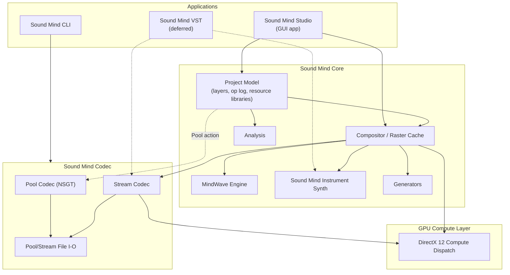
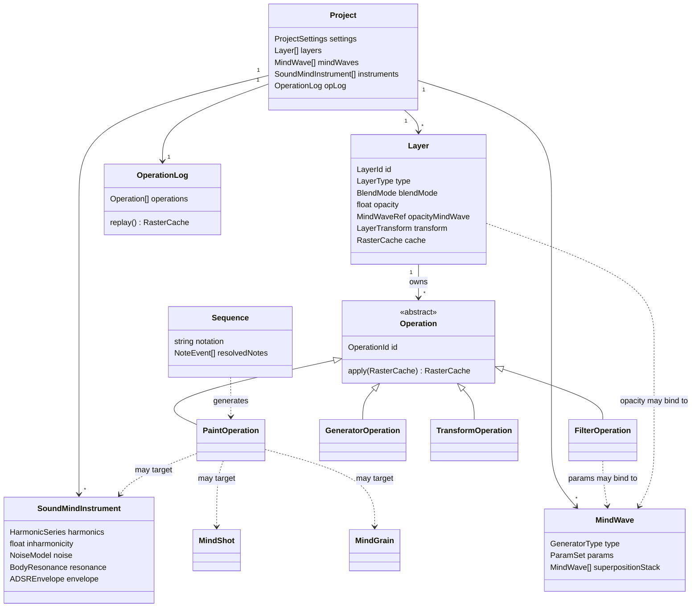
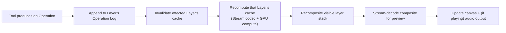

# Sound Mind - the Architecture Document

Status: **early draft — first pass.** This is the starting point for the software architecture activity that follows `sound-mind-design.md`: a sketch of the major modules, the core data model, and the threading model, plus the architectural decisions still open. It is not yet class diagrams — it's the layer beneath them, so those diagrams have a skeleton to hang on.

This document assumes familiarity with `sound-mind-design.md` (what the Studio does and why) and `tech-stack-decisions.md` (the technology choices). It does not repeat either; it only cites the decisions from both that constrain the architecture.

# Constraints Carried Over

From `CLAUDE.md` and `tech-stack-decisions.md`:

- C++20/23, built with JUCE for audio/DSP and DirectX 12 Compute for GPU work.
- Primary development on native Arm64 (Snapdragon X), with x64 validated via CI rather than assumed from cross-compilation alone.
- The real-time audio path must be allocation-free, lock-free where needed, and never touch anything GC'd or interpreted.

From `sound-mind-design.md`'s resolved decisions:

- A project is a project file plus a folder of media/sources/cached renders, single-user, with no versioned schema commitment yet.
- A project's real content is an operation log — closer to a scene graph referencing source data than a raster stack — with cached raster results persisted opportunistically, not authoritatively.
- Anything seeded (Generators, Chaos, noise MindWaves) must replay bit-for-bit on the same Studio version and architecture; only a perceptual match is required across architectures.
- Working latency targets: ~100 ms for graphical feedback, ~250 ms for audio feedback, from a Stream-mode edit.
- Sound Mind VST is deferred until the standalone Studio is operational — the architecture should not be shaped around it yet, only avoid closing the door on it (the Stream codec path already has to be real-time-safe on its own merits).

# System Overview

Four things get built, sharing two lower layers:

- **Sound Mind Codec** is the lowest layer and the one thing that must work standalone: Pool (NSGT, lossless, off-line) and Stream (fast, real-time-safe) transforms, plus the file formats each reads and writes. It has no knowledge of layers, MindWaves, or projects — it only converts between audio/image data and spectrogram data.
- **Sound Mind Core** is everything about a *project* that isn't UI: the layer stack and operation log, the compositor that turns them into pixels, and the engines each operation type can call into (MindWaves, Sound Mind Instruments, Generators, Analysis). Core depends on Codec; Codec knows nothing about Core.
- **Sound Mind Studio** is the GUI application: interaction (tools, panels, canvas), consuming Core and, through it, Codec.
- **Sound Mind CLI** is a thin consumer of Codec alone (encode/decode from the command line), matching the design doc's "codec library, command-line tool, full graphical studio" framing — it does not need Core at all unless a CLI operation ends up wanting the project model (e.g. batch-rendering a project non-interactively), which is a later question, not a day-one one.
- **GPU Compute** is a thin dispatch layer under Codec's Stream transforms and Core's compositor, isolating the DirectX 12 specifics so nothing above it has to know or care whether an operation actually ran on the GPU or fell back to the CPU.

# Core Data Model

This is conceptual — the entities the design doc implies, not a committed class design. It exists to give the eventual class diagrams a shared vocabulary.

A few things worth calling out about this sketch before it becomes real classes:

- **`Operation` is the unit of history**, and every one of the design doc's tools (Paint, Filter, Generator, Transform, and by extension Import, Pool, Chord/Sequence stamping) is some kind of `Operation`. `Layer.cache` is a derived value, not state that operations mutate directly — an operation's `apply` conceptually produces the next cache from the previous one (or from scratch on replay), rather than editing pixels in place. Whether that's *literally* how it's implemented (versus an equivalent optimization) is an implementation choice, not an architectural one — the log stays the source of truth either way.
- **`MindWave` is self-referential** by design (superposition stack, and per the design doc's revamp, a generator's own parameters can themselves be `MindWave`-bound) — the data structure needs to support that recursion without becoming a special case.
- **`SoundMindInstrument`, `MindShot`, and `MindGrain` are peers**: anything a `PaintOperation` can target. A `Sequence` doesn't produce audio directly — it resolves to a list of `PaintOperation`s against one of these, which is what keeps a stamped chord or sequence non-destructively editable.

# Threading & Real-Time Model

Four execution contexts, in increasing order of what they're allowed to do:

1. **Audio callback thread.** Stream codec decode and mixing only. No allocation, no unbounded locks, no operation-log traversal, no Pool codec. This is the one context CLAUDE.md's constraints are non-negotiable for.
2. **GPU compute submission.** Dispatches Stream transforms and GPU-accelerated filters to DirectX 12 from a worker thread, not the audio thread; results cross back via a lock-free or double-buffered handoff, never a blocking wait on the audio thread.
3. **Background workers.** Pool encode/decode, Generators, Import encoding, Analysis passes, and anything else that can legitimately take the tens-to-hundreds of milliseconds (or, for Pool, much longer) these operations need.
4. **UI/main thread.** Owns operation-log mutation and triggers cache invalidation/recompute on the affected layer(s); never blocks waiting on the audio thread, only ever hands it fresh Stream-decoded audio to consume.

The ~100 ms / ~250 ms targets in the design doc are budgets across UI thread → background/GPU work → audio thread, not a single context's budget — which is also why they're marked aspirational rather than committed: the actual split between CPU and GPU work, and between the Arm64 and x64 targets, isn't known yet.

# Compositing Pipeline (sketch)

A paint or filter action flows roughly:

Only the affected layer (and any Filter layer or MindWave-linked layer above it in the composite order) needs recomputing — this is the main lever for hitting the latency targets on a project with many layers, and probably the first thing worth profiling once a real pipeline exists.

# Determinism & Replay

The operation log is what makes Pooling, Generators, and Remaster-style rebuilds possible at all: replaying the log against a Layer's inputs must reproduce its cache. Concretely:

- Every `Operation` that consumes randomness owns its own seed, stored in the log entry itself — not drawn from a shared/global RNG stream, which would make replay order-dependent.
- Bit-for-bit reproducibility is scoped to *(Studio version, target architecture)* — an op log is not a portable, version-independent artifact, and cross-architecture replay is only held to sounding the same, not being byte-identical. This means the log format should record enough version/architecture context to know when a strict bit-for-bit check even applies.
- The raster cache is purely an optimization: correctness only ever depends on log replay, never on trusting a stale cache. This has a concrete implication for testing — a cache-invalidation bug should be *detectable* by forcing a full replay and diffing against the cached result, which is a natural strategy for regression tests once there's code to test.

# Build & Module Layout (proposal)

A first cut at the top-level module split, to be revised once the GUI framework decision (below) lands:

- `sound-mind-codec` — Pool/Stream transforms, file I/O. No GUI, no project model. Usable standalone.
- `sound-mind-core` — project model, operation log, compositor, MindWave/Instrument/Generator/Analysis engines. Depends on `sound-mind-codec`.
- `sound-mind-gpu` — DirectX 12 compute wrapper, isolating the platform-specific API from both `sound-mind-codec` and `sound-mind-core`.
- `sound-mind-studio` — the GUI application. Depends on `sound-mind-core`.
- `sound-mind-cli` — the command-line tool. Depends on `sound-mind-codec` (and, if batch project rendering is needed, `sound-mind-core`).
- `sound-mind-vst` — deferred; not started until the Studio is operational.
- A test target per module, following CLAUDE.md's test-first workflow once implementation begins.

CMake (per `tech-stack-decisions.md`'s "Professional CMake" reference) with vcpkg for dependencies, targeting native Arm64 locally and validating x64 via CI, matches this module split without needing anything unusual.

# Decisions Needed

Architectural questions this first pass surfaces, to settle before (or as part of) drawing the actual class diagrams:

1. **GUI framework.** `tech-stack-decisions.md` leaves JUCE's own GUI module versus Qt open. This affects the `sound-mind-studio` module's internal structure significantly and is worth settling before the canvas/tools/panels get designed in detail.
2. **NSGT/DSP library.** What C++ library (or hand-rolled implementation) the Pool codec's Non-Static Gabor Transform is built on — also flagged as open in `tech-stack-decisions.md`.
3. **Operation log serialization.** What format the operation log and project metadata are actually stored in (JSON, a binary format, something else) — informed by, but not identical to, the "project file schema" question deferred in the design doc.
4. **Raster cache persistence format.** Whether a persisted layer cache is just a Stream-format file, or something new purpose-built for fast reload.
5. **GPU/audio-thread handoff mechanism.** The concrete mechanism (fences, double-buffering, a lock-free ring) for getting DirectX 12 compute results to the audio callback and UI thread without violating the real-time constraints.
6. **Testing strategy for real-time and GPU code.** How allocation-free, hardware-dependent code gets meaningfully unit-tested — likely a mix of behavioral tests against the CPU fallback path and separate, non-unit performance/regression checks for the GPU path.
